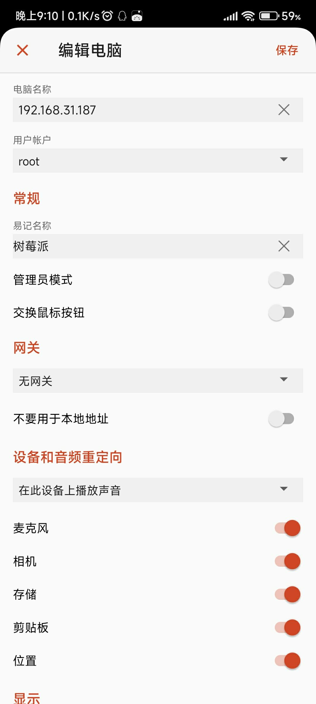
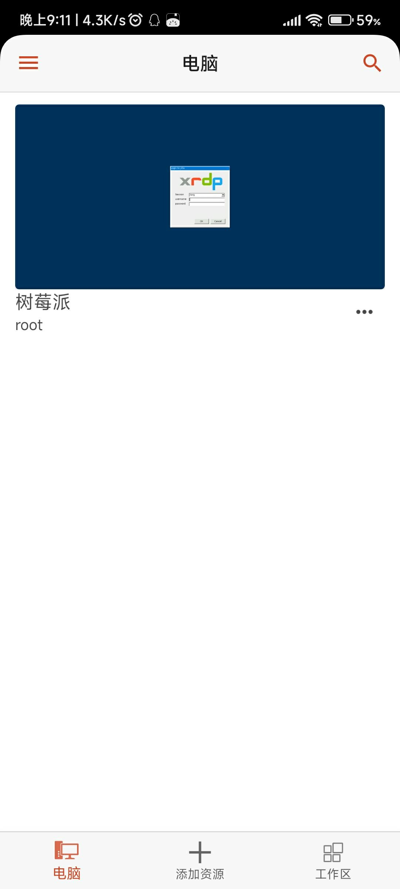

# 第 4.23 节 远程桌面管理

## VNC 与 RPD（XRDP）对比

XRDP 是 Microsoft RDP 的开源实现。XRDP 不支持屏幕镜像外。

### 参考文献

- [xrdp: an open source RDP server](https://github.com/neutrinolabs/xrdp)
- [VNC 还是 RDP? 云上的远程桌面究竟该如何选](https://aws.amazon.com/cn/blogs/china/vnc-or-rdp-how-to-choose-a-remote-desktop-on-the-cloud/)
- [UOS_远程桌面_xrdp_Xorg_x11vnc](https://www.cnblogs.com/osnosn/p/16690589.html)

## VNC

### x11vnc（镜像屏幕）

x11vnc 会和远程软件 todesk 一样直接镜像屏幕，简言之，你的所有操作都会被同步到显示器上面，反过来在显示器上的操作，你在 VNC 上也可以看到。

---

如果没有显示器则不能使用 x11vnc。

安装 x11vnc：

```
# pkg install x11vnc
```

或者：

```sh
# cd /usr/ports/net/x11vnc/
# make install clean
```

创建密码：

```sh
$ x11vnc -storepasswd
Enter VNC password: 
Verify password:    
Write password to /root/.vnc/passwd?  [y]/n y #此处键入 y 回车
Password written to: /root/.vnc/passwd
```

启动服务器（KDE 6 SDDM 为例）：

```sh
$ x11vnc -display :0 -rfbauth ~/.vnc/passwd -auth $(find /var/run/sddm/ -type f)
```

- LightDM

```sh
$ x11vnc -display :0 -rfbauth ~/.vnc/passwd -auth /var/run/lightdm/root/\:0
```

- GDM

```sh
$ x11vnc -display :0 -rfbauth ~/.vnc/passwd -auth /var/lib/gdm/:0.Xauth #或 /run/user/120/gdm/Xauthority，取决于你的 gdm 版本，自己 ls 看一下
```


#### 参考文献

- [x11vnc -allow VNC connections to real X11 displays](https://man.freebsd.org/cgi/man.cgi?query=x11vnc&sektion=&manpath=freebsd-release-ports)
- [X11vnc](https://wiki.archlinux.org/title/X11vnc)
  
### TigerVNC

启用 VNC 服务（目前 Ports 就只剩下这个 [TigerVNC](https://www.freshports.org/net/tigervnc-server/) 了）

安装 TigerVNC Server：

```sh
# pkg install tigervnc-server
```

或者：

```sh
# cd /usr/ports/net/tigervnc-server/ 
# make install clean
```

安装之后，还要做一些设置：

在终端执行命令 `vncpasswd`，设置访问密码。

创建 `~/.vnc/xstartup` 文件：


```sh
root@ykla:~ # mkdir -p ~/.vnc/
root@ykla:~ # ee ~/.vnc/xstartup
```

内容如下：

```sh
#!/bin/sh
unset SESSION_MANAGER
unset DBUS_SESSION_BUS_ADDRESS
[ -x /etc/X11/xinit/xinitrc ] && exec /etc/X11/xinit/xinitrc
[ -f /etc/X11/xinit/xinitrc ] && exec sh /etc/X11/xinit/xinitrc
xsetroot -solid grey
exec command &  #此处不能照抄！
```

注意：上述 `command` 须进行替换，**请注意保留 `&`**，在不同桌面下需要替换，Gnome 用 `gnome-session`，KDE 用 `startplasma-x11`，MATE 用 `mate-session`，Xfce 用 `xfce4-session`。

保存后执行命令

```sh
# chmod 755 ~/.vnc/xstartup
```

- 接下来在终端执行命令 `vncserver` 或 `vncserver :1`。

其中“`:1`”意味着 `DISPLAY=:1`，即指定桌面显示的通信端口为 `1`，对应 VNC 服务的端口为 `5901`。桌面显示通信端口从 0 开始，但该端口已被当前桌面占用（除非是镜像 VNC），因此 VNC 服务默认端口虽为 5900，但实际执行须却是从 5901 端口开始的。
>
>测试：
>
>```sh
>root@ykla:~ # vncserver :0
>
>
>Warning: ykla:0 is taken because of /tmp/.X11-unix/X0
>Remove this file if there is no X server ykla:0
>A VNC server is already running as :0
>```

如果启动服务时未通信端口，则系统根据使用情况自动指定。


关闭服务请用命令 `# vncserver -kill :1`，这里必须指定通信端口。

- 如果启用了防火墙，以 ipfw 为例，在终端输入命令：

```sh
# ipfw add allow tcp from any to me 5900-5910 in keep-state
```

上行命令表示放通端口 5900-5910，即 DISPLAY 0-10。

#### 参考文献

- [Xfce4 is not displayed correctly when I connect vncviewer (in Linux) to tightvnc-server (on FreeBSD)](https://forums.freebsd.org/threads/xfce4-is-not-displayed-correctly-when-i-connect-vncviewer-in-linux-to-tightvnc-server-on-freebsd.85709/)

## XRDP

### 安装软件包（基于 kde6）

```sh
# pkg install xorg kde xrdp wqy-fonts xdg-user-dirs pulseaudio-module-xrdp
```

或者：

```sh
# cd /usr/ports/x11/xorg/ && make install clean
# cd /usr/ports/x11/kde/ && make install clean
# cd /usr/ports/net/xrdp/ && make install clean
# cd /usr/ports/x11-fonts/wqy/ && make install clean
# cd /usr/ports/devel/xdg-user-dirs/ && make install clean
# cd /usr/ports/audio/pulseaudio-module-xrdp && make install clean
```

查看配置文件：

```sh
root@ykla:/usr/ports/net/xrdp # pkg info -D xrdp
xrdp-0.10.2_2,1:
On install:
xrdp has been installed.

There is an rc.d script, so the service can be enabled by adding this line
in /etc/rc.conf:

xrdp_enable="YES"
xrdp_sesman_enable="YES"

Do not forget to edit the configuration files in "/usr/local/etc/xrdp"
and the "/usr/local/etc/xrdp/startwm.sh" script.

To enable audio redirection, install the following ports/packages to meet
your environment.

- audio/pipewire-module-xrdp
- audio/pulseaudio-module-xrdp
```

### 配置

```sh
# service xrdp enable 
# service xrdp-sesman enable 
# service dbus enable
```

编辑 `/usr/local/etc/xrdp/startwm.sh`：

找到 `#### start desktop environment`，修改如下：

```sh
#### start desktop environment
# exec gnome-session # Gnome 须删除此处开头的 #
# exec mate-session # mate 须删除此处开头的 #
# exec start-lumina-desktop # lumina 须删除此处开头的 #
# exec ck-launch-session startplasma-x11 # KDE6 须删除此处开头的 #
# exec startxfce4                        # xfce 须删除此处开头的 #
# exec xterm                             # xterm 须删除此处开头的 #
```

然后重启系统，即可。

### 中文化 (用户使用默认的 sh）


```sh
# ee /usr/local/etc/xrdp/startwm.sh
```

```sh
#### set environment variables here if you want
export LANG=zh_CN.UTF-8
```

## Windows 远程访问 FreeBSD

### TigerVNC

下载 TigerVNC 查看器：

下载地址：<https://sourceforge.net/projects/tigervnc/files/stable/>

查看 FreeBSD 的 VNC 端口：

```sh
root@ykla:/usr/ports/deskutils/anydesk # sockstat -4l
USER     COMMAND    PID   FD  PROTO  LOCAL ADDRESS         FOREIGN ADDRESS      
root     Xvnc        2585 4   tcp4   127.0.0.1:5910        *:*  #VNC 占用
root     xrdp        2580 13  tcp46  *:3389                *:*  #XRDP 占用
root     Xvnc        2016 5   tcp4   *:5901                *:*  #VNC 占用
root     sshd        1164 4   tcp4   *:22                  *:*  #SSH 占用
ntpd     ntpd        1127 21  udp4   *:123                 *:* 
ntpd     ntpd        1127 24  udp4   127.0.0.1:123         *:*
ntpd     ntpd        1127 26  udp4   192.168.31.187:123    *:*
root     syslogd     1021 7   udp4   *:514                 *:*
```

>**故障排除：由于目标服务器积极拒绝，无法连接**
>
>非镜像 vnc 在连接时必须指定端口，否则按默认端口 5900 进行连接，但是你不是镜像的屏幕（你用的不是 x11vnc），所以必定连不上。
>
>
>
>示例：
>
>```sh
>192.168.31.187:5901
>```


### Windows 自带的桌面远程连接（RDP）


首次登录设备会有安全提示，输入 `yes`，回车后就会弹出远程桌面窗口。


## 使用 Android 通过 XRDP 远程访问 FreeBSD

首先需要下载所需软件：

由微软官方开发的手机 RDP 软件：Remote Desktop

- [Remote Desktop](https://play.google.com/store/apps/details?id=com.microsoft.rdc.androidx&hl=zh_CN)

该软件操作便捷。

以下为几个配置要点：





请注意，须将左上 🖱️ 改为 👆。默认的鼠标操作很不方便：或者你也可以选择手机 OTG 一个鼠标和键盘。


连接示意图（后台正在编译 Chromium，故占用会很高）：


## 使用 FreeBSD 远程其他机器

### freerdp（支持 NLA）

使用 pkg 安装：

```sh
# pkg ins freerdp
```

或者用 Ports：

```sh
# cd /usr/ports/net/freerdp/ 
# make install clean
```

使用 FreeBSD 远程链接到 Windows 11 24H2：

```sh
ykla@ykla:~ $ xfreerdp 192.168.31.213 # 注意是 xfreerdp。若使用 wayland 可能是 wfreerdp（未测试）
[20:35:20:041] [1105:7c412000] [WARN][com.freerdp.client.common.cmdline] - ----------------------------------------
[20:35:20:043] [1105:7c412000] [WARN][com.freerdp.client.common.cmdline] - Using deprecated command-line interface!
[20:35:20:043] [1105:7c412000] [WARN][com.freerdp.client.common.cmdline] - This will be removed with FreeRDP 3!
[20:35:20:043] [1105:7c412000] [WARN][com.freerdp.client.common.cmdline] - ----------------------------------------
[20:35:20:043] [1105:7c412000] [WARN][com.freerdp.client.common.compatibility] - 192.168.31.213 -> /v:192.168.31.213
[20:35:20:043] [1105:7c412000] [WARN][com.freerdp.client.common.compatibility] - 
[20:35:20:045] [1105:7c412700] [INFO][com.freerdp.client.x11] - No user name set. - Using login name: ykla
[20:35:21:445] [1105:7c412700] [INFO][com.freerdp.crypto] - creating directory /home/ykla/.config/freerdp
[20:35:21:445] [1105:7c412700] [INFO][com.freerdp.crypto] - creating directory [/home/ykla/.config/freerdp/certs]
[20:35:21:445] [1105:7c412700] [INFO][com.freerdp.crypto] - created directory [/home/ykla/.config/freerdp/server]
[20:35:21:485] [1105:7c412700] [WARN][com.freerdp.crypto] - Certificate verification failure 'self-signed certificate (18)' at stack position 0
[20:35:21:485] [1105:7c412700] [WARN][com.freerdp.crypto] - CN = DESKTOP-U72I6SS
[20:35:21:485] [1105:7c412700] [ERROR][com.freerdp.crypto] - @@@@@@@@@@@@@@@@@@@@@@@@@@@@@@@@@@@@@@@@@@@@@@@@@@@@@@@@@@@
[20:35:21:485] [1105:7c412700] [ERROR][com.freerdp.crypto] - @           WARNING: CERTIFICATE NAME MISMATCH!           @
[20:35:21:485] [1105:7c412700] [ERROR][com.freerdp.crypto] - @@@@@@@@@@@@@@@@@@@@@@@@@@@@@@@@@@@@@@@@@@@@@@@@@@@@@@@@@@@
[20:35:21:485] [1105:7c412700] [ERROR][com.freerdp.crypto] - The hostname used for this connection (192.168.31.213:3389) 
[20:35:21:485] [1105:7c412700] [ERROR][com.freerdp.crypto] - does not match the name given in the certificate:
[20:35:21:485] [1105:7c412700] [ERROR][com.freerdp.crypto] - Common Name (CN):
[20:35:21:485] [1105:7c412700] [ERROR][com.freerdp.crypto] -    DESKTOP-U72I6SS
[20:35:21:485] [1105:7c412700] [ERROR][com.freerdp.crypto] - A valid certificate for the wrong name should NOT be trusted!
Certificate details for 192.168.31.213:3389 (RDP-Server):
        Common Name: DESKTOP-U72I6SS
        Subject:     CN = DESKTOP-U72I6SS
        Issuer:      CN = DESKTOP-U72I6SS
        Thumbprint:  36:b9:be:66:ab:2b:54:32:28:46:b6:98:68:8d:6f:20:a5:d1:58:8c:09:de:cc:3d:30:e1:06:6f:4f:62:54:de
The above X.509 certificate could not be verified, possibly because you do not have
the CA certificate in your certificate store, or the certificate has expired.
Please look at the OpenSSL documentation on how to add a private CA to the store.
Do you trust the above certificate? (Y/T/N) y # 输入 y 回车
Domain:   # 留空
Password: # 输入密码，密码不会显示出来 ***。
……省略一部分……
```


#### 故障排除

- 但是我没有输入用户名就连上了？

不知道。难道是因为我的 FreeBSD 用户名和 Windows 是一样的？

### rdesktop（不支持 NLA）

`net/xrdesktop2` 是 rdesktop 的图形化前端，但我打开里面的键盘设置就卡死了。

---

使用 pkg 安装 rdesktop：

```sh
# pkg install rdesktop
```

或者用 Ports：

```sh
# cd /usr/ports/net/rdesktop/
# make install clean
```

rdesktop 无前端 GUI，故要在终端输入命令：

```sh
# rdesktop ip:端口 # 比如 192.168.31.155:3389
```

如果没有特意更改 Windows 配置，无须加 `:端口`。

对于我测试的 Windows 11 24H2 会报错：

```sh
ykla@ykla:~ $ rdesktop 192.168.31.213
Failed to connect, CredSSP required by server (check if server has disabled old TLS versions, if yes use -V option).
```

根据 [CredSSP does not work](https://github.com/rdesktop/rdesktop/issues/71)，是个老问题了。

影响安全的解决方案是禁用网络级身份验证（NLA），在要远程连接的 Windows 上操作：

```batch
PS C:\Users\ykla> reg add "HKEY_LOCAL_MACHINE\SYSTEM\CurrentControlSet\Control\Terminal Server\WinStations\RDP-Tcp" /v UserAuthentication /t REG_DWORD /d 0 /f
操作成功完成。
PS C:\Users\ykla> gpupdate /force
正在更新策略...

计算机策略更新成功完成。
用户策略更新成功完成。
```

再测试链接：

```sh
ykla@ykla:~ $ rdesktop 192.168.31.213

ATTENTION! The server uses and invalid security certificate which can not be trusted for
the following identified reasons(s);

 1. Certificate issuer is not trusted by this system.

     Issuer: CN=DESKTOP-U72I6SS


Review the following certificate info before you trust it to be added as an exception.
If you do not trust the certificate the connection atempt will be aborted:

    Subject: CN=DESKTOP-U72I6SS
     Issuer: CN=DESKTOP-U72I6SS
 Valid From: Tue Mar  4 20:39:28 2025
         To: Wed Sep  3 20:39:28 2025

  Certificate fingerprints:

       sha1: 599c0e8bbc57c5ee8de8993d5241fb0f0d70e98d
     sha256: 36b9be66ab2b54322846b698688d6f20a5d1588c09decc3d30e1066f4f6254de


Do you trust this certificate (yes/no)? # 输入 yes，按回车键
```


#### 故障排除

- 看视频没声音

待解决

#### 参考文献

- [使用 RDP 连接到 Azure VM 时排查身份验证错误](https://learn.microsoft.com/zh-cn/troubleshoot/azure/virtual-machines/windows/cannot-connect-rdp-azure-vm)，打开和关闭 NLA 的方法在此。经过测试关闭后 rdesktop 果然又连不上了。


### anydesk

使用 anydesk 可进行远程访问，FreeBSD 上仅支持 x86 架构：

由于版权问题（私有软件未经许可默认禁止分发），必须用户使用 Ports 自行编译：

```sh
# cd /usr/ports/deskutils/anydesk/
# make install clean
```

## RustDesk 中继服务器

**这个是中继的 ID 服务器，本身不能被远程控制。**

换言之，你没法用 RustDesk 控制 FreeBSD。

安装：

```sh
# pkg install rustdesk-server
```

或者：

```sh
# cd /usr/ports/net/rustdesk-server/ 
# make install clean
```

配置：

- 启动 hbbr：

```sh
root@ykla:~ # /usr/local/bin/hbbs
[2024-08-10 23:02:13.782550 +08:00] INFO [src/common.rs:122] Private key comes from id_ed25519
[2024-08-10 23:02:13.782587 +08:00] INFO [src/rendezvous_server.rs:1191] Key: mgRwOWJy9Vnz3LqQYjtNHwZQYg73uhdj9iCTMmIyoP4=  #此处是 Key
[2024-08-10 23:02:13.782655 +08:00] INFO [src/peer.rs:84] DB_URL=./db_v2.sqlite3
[2024-08-10 23:02:13.786349 +08:00] INFO [src/rendezvous_server.rs:99] serial=0
[2024-08-10 23:02:13.786381 +08:00] INFO [src/common.rs:46] rendezvous-servers=[]
[2024-08-10 23:02:13.786388 +08:00] INFO [src/rendezvous_server.rs:101] Listening on tcp/udp :21116
[2024-08-10 23:02:13.786391 +08:00] INFO [src/rendezvous_server.rs:102] Listening on tcp :21115, extra port for NAT test
[2024-08-10 23:02:13.786395 +08:00] INFO [src/rendezvous_server.rs:103] Listening on websocket :21118
[2024-08-10 23:02:13.786430 +08:00] INFO [libs/hbb_common/src/udp.rs:35] Receive buf size of udp [::]:21116: Ok(42080)
[2024-08-10 23:02:13.786581 +08:00] INFO [src/rendezvous_server.rs:138] mask: None
[2024-08-10 23:02:13.786594 +08:00] INFO [src/rendezvous_server.rs:139] local-ip: ""
[2024-08-10 23:02:13.786603 +08:00] INFO [src/common.rs:46] relay-servers=[]
[2024-08-10 23:02:13.786703 +08:00] INFO [src/rendezvous_server.rs:153] ALWAYS_USE_RELAY=N
[2024-08-10 23:02:13.786734 +08:00] INFO [src/rendezvous_server.rs:185] Start
[2024-08-10 23:02:13.786793 +08:00] INFO [libs/hbb_common/src/udp.rs:35] Receive buf size of udp [::]:0: Ok(42080)
[2024-08-10 23:09:11.043094 +08:00] INFO [src/peer.rs:102] update_pk 1101115918 [::ffff:192.168.31.90]:37057 b"\x06\xef\x81\xb4\xe2\x9e\xff(\xcb\xd7\x985S\x95)~1O\xe2\xfcu\xeeE\x91\xf1\xf2\xa1\xbe\rk\xcd\xc1" b"\x06\xef\x81\xb4\xe2\x9e\xff(\xcb\xd7\x985S\x95)~1O\xe2\xfcu\xeeE\x91\xf1\xf2\xa1\xbe\rk\xcd\xc1" #代表设备接入
^C[2024-08-10 23:10:06.746255 +08:00] INFO [src/common.rs:176] signal interrupt
```

- 再启动 hbbs：

```sh
root@ykla:~ # /usr/local/bin/hbbr
[2024-08-10 22:58:26.593397 +08:00] INFO [src/relay_server.rs:61] #blacklist(blacklist.txt): 0
[2024-08-10 22:58:26.593439 +08:00] INFO [src/relay_server.rs:76] #blocklist(blocklist.txt): 0
[2024-08-10 22:58:26.593445 +08:00] INFO [src/relay_server.rs:82] Listening on tcp :21117
[2024-08-10 22:58:26.593449 +08:00] INFO [src/relay_server.rs:84] Listening on websocket :21119
[2024-08-10 22:58:26.593452 +08:00] INFO [src/relay_server.rs:87] Start
[2024-08-10 22:58:26.593546 +08:00] INFO [src/relay_server.rs:105] DOWNGRADE_THRESHOLD: 0.66
[2024-08-10 22:58:26.593556 +08:00] INFO [src/relay_server.rs:115] DOWNGRADE_START_CHECK: 1800s
[2024-08-10 22:58:26.593559 +08:00] INFO [src/relay_server.rs:125] LIMIT_SPEED: 4Mb/s
[2024-08-10 22:58:26.593564 +08:00] INFO [src/relay_server.rs:136] TOTAL_BANDWIDTH: 1024Mb/s
[2024-08-10 22:58:26.593567 +08:00] INFO [src/relay_server.rs:146] SINGLE_BANDWIDTH: 16Mb/s
^C[2024-08-10 23:10:04.393365 +08:00] INFO [src/common.rs:176] signal interrupt
```

在其他设备上打开 rustdesk 客户端，两边都要填入相同的“ID 服务器（FreeBSD 的 IP 地址或域名）”和“Key”，其他空着不填，在控制端输入被控端显示的 ID 即可连接。

### 参考文献

- [rustdesk-server Self hosted RustDesk server](https://www.freshports.org/net/rustdesk-server/)
- [远程控制软件 RustDesk 自建服务器全平台部署及使用教程](https://www.cnblogs.com/safe-rabbit/p/18020812)
