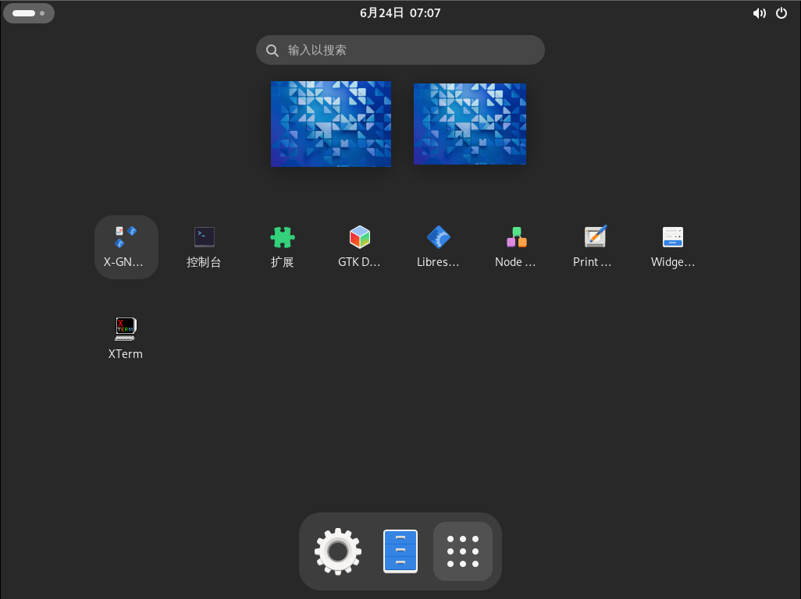
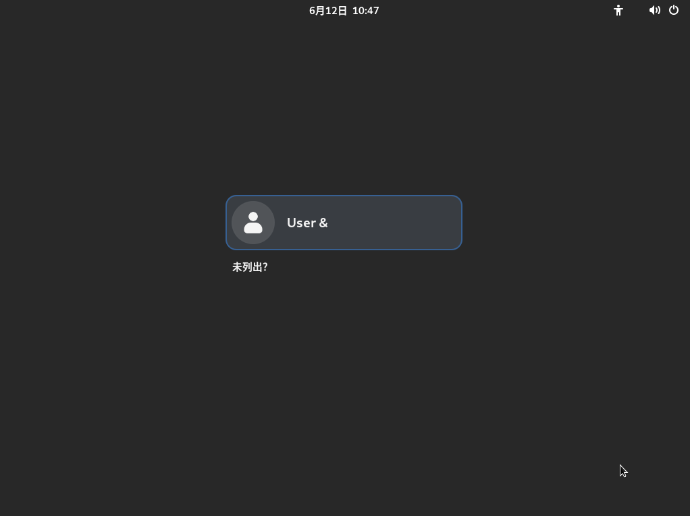
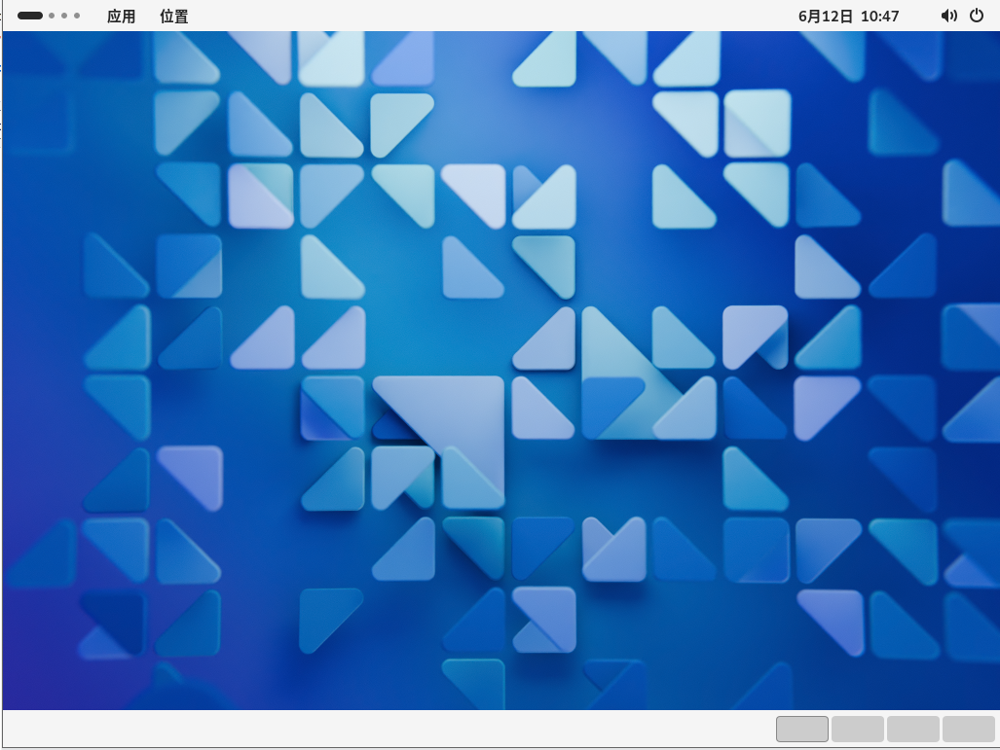
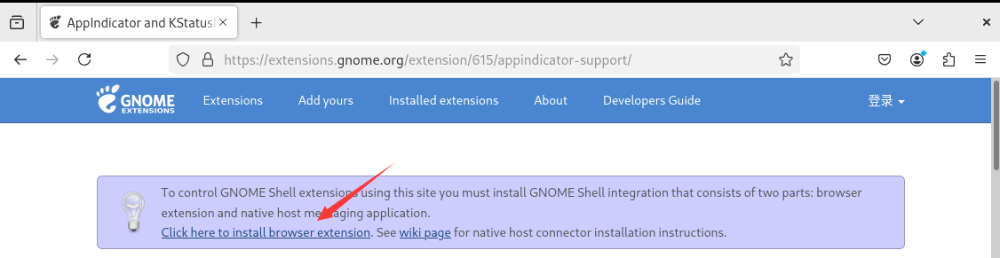
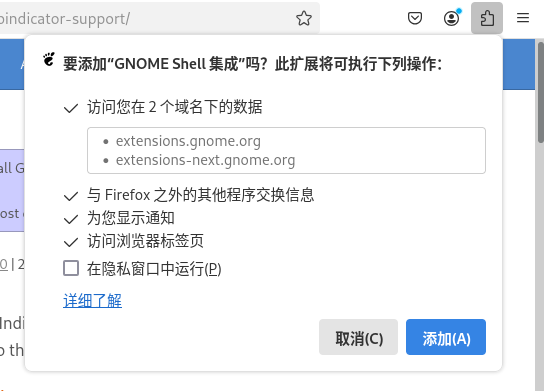
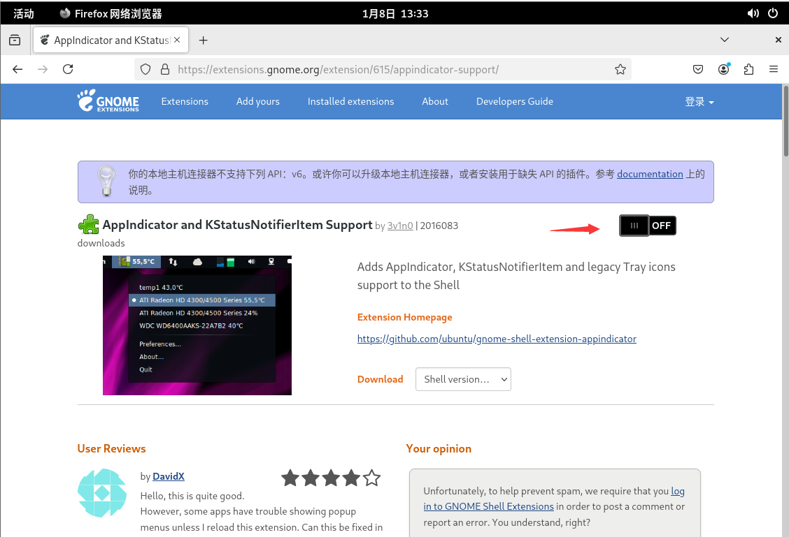
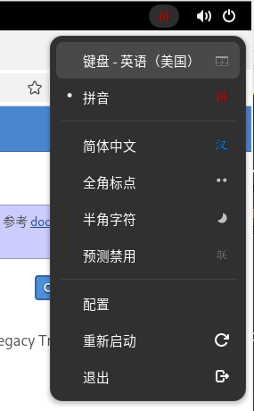
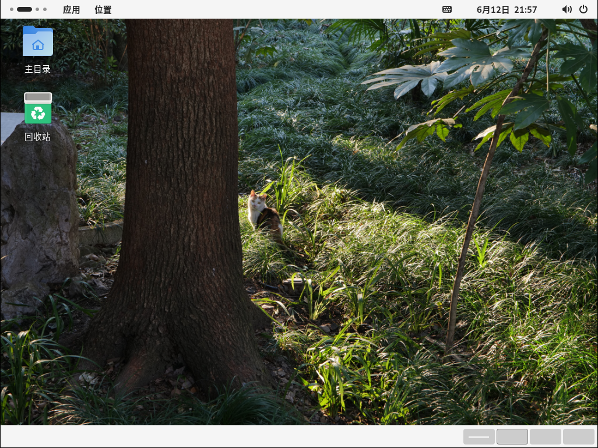

# 第 4.3 节 安装 Gnome


## 安装

```sh
# pkg install xorg gnome noto-sc xdg-user-dirs
```

或者

```
# cd /usr/ports/x11/xorg/ && make install clean
# cd /usr/ports/x11/gnome/ && make install clean
# cd /usr/ports/x11-fonts/noto-serif-sc/ && make install clean
# cd /usr/ports/devel/xdg-user-dirs/ && make install clean
```

解释:

|     软件      |            用途            |
| :-----------: | :------------------------: |
|     xorg      |            X11             |
|     gnome     |        Gnome 主程序        |
|    noto-sc    |     思源黑体——简体中文     |
| xdg-user-dirs | 用于创建用户家目录的子目录 |

> **精简安装**
>
> ```sh
> # pkg install xorg-minimal gnome-lite wqy-fonts xdg-user-dirs
> ```
>或者
>
>```sh
># cd /usr/ports/x11/xorg-minimal/ && make install clean
># cd /usr/ports/x11/gnome/ && make install clean
># cd /usr/ports/x11-fonts/wqy/ && make install clean
># cd /usr/ports/devel/xdg-user-dirs/ && make install clean
>```
> 如果安装了完整版本也可以使用 pkg 包管理器卸载自带的游戏软件：
>
> ```sh
> # pkg delete gnome-2048 gnome-klotski gnome-tetravex gnome-mines gnome-taquin gnome-sudoku gnome-robots gnome-nibbles lightsoff tali quadrapassel swell-foop gnome-mahjongg five-or-more iagno aisleriot four-in-a-row
> ```
>
>

## 配置

```sh
# ee /etc/fstab
```

添加内容如下:

```sh
proc /proc procfs rw 0 0
```

配置启动项：

```sh
# sysrc dbus_enable="YES"
# sysrc gdm_enable="YES"
```

输入以下命令：

```sh
$ echo "/usr/local/bin/gnome-session" > ~/.xinitrc
```



默认是禁止 root 登录的。



默认壁纸就是这样。


## 中文化

### GNOME 界面

> 本小节配置参数与用户 shell 无关，即使是 csh 也该如此配置。

```sh
# ee /usr/local/etc/gdm/locale.conf
```

添加以下内容：

```sh
LANG="zh_CN.UTF-8"
LC_CTYPE="zh_CN.UTF-8"
LC_MESSAGES="zh_CN.UTF-8"
LC_ALL="zh_CN.UTF-8"
```

### 中文输入法

以下 `ibus`、`fcitx5` 二选一即可。

#### ibus

gnome 捆绑的输入法面板是 `ibus`。

```sh
# pkg install zh-ibus-libpinyin
```

或者

```sh
# cd /usr/ports/chinese/ibus-libpinyin/
# make install clean
```

安装后运行初始化命令 `ibus-setup`.

#### fcitx 5

首先看看现在自己的 shell 是不是 `sh`,`bash`,`zsh`：

```sh
# echo $0
```

如果是 `sh`,`bash`,`zsh` 其中之一，请继续；如果不是，请参考输入法相关章节。

安装 `fcitx5`:

```sh
# pkg install fcitx5 fcitx5-qt5 fcitx5-qt6 fcitx5-gtk2 fcitx5-gtk3 fcitx5-gtk4 fcitx5-configtool zh-fcitx5-chinese-addons
```

或者：

```sh
# cd /usr/ports/textproc/fcitx5/ && make install clean
# cd /usr/ports/textproc/fcitx5-qt/ && make install clean #同时包含 QT 5 和 QT 6
# cd /usr/ports/textproc/fcitx5-gtk/ && make install clean #同时包含 gtk 2、3、4
# cd /usr/ports/textproc/fcitx5-configtool/ && make install clean
# cd /usr/ports/chinese/fcitx5-chinese-addons/ && make install clean
```

打开或新建文件 `~/.xprofile`，写入:

```sh
export GTK_IM_MODULE=fcitx
export QT_IM_MODULE=fcitx
export XMODIFIERS=@im=fcitx
```

参考：以下是该文件的一个示例：

```sh
# $FreeBSD$
#
# .profile - Bourne Shell startup script for login shells
#
# see also sh(1), environ(7).
#

# These are normally set through /etc/login.conf.  You may override them here
# if wanted.
# PATH=/sbin:/bin:/usr/sbin:/usr/bin:/usr/local/sbin:/usr/local/bin:$HOME/bin; export PATH

# Setting TERM is normally done through /etc/ttys.  Do only override
# if you're sure that you'll never log in via telnet or xterm or a
# serial line.
# TERM=xterm; 	export TERM

EDITOR=vi;   	export EDITOR
PAGER=less;  	export PAGER

# set ENV to a file invoked each time sh is started for interactive use.
ENV=$HOME/.shrc; export ENV

# Let sh(1) know it's at home, despite /home being a symlink.
if [ "$PWD" != "$HOME" ] && [ "$PWD" -ef "$HOME" ] ; then cd ; fi

# Query terminal size; useful for serial lines.
if [ -x /usr/bin/resizewin ] ; then /usr/bin/resizewin -z ; fi

# Display a random cookie on each login.
if [ -x /usr/bin/fortune ] ; then /usr/bin/fortune freebsd-tips ; fi

export GTK_IM_MODULE=fcitx
export QT_IM_MODULE=fcitx
export XMODIFIERS=@im=fcitx
```


### 终端显示中文（文件用户根目录）

>**注意**
>
>此处内容对 FreeBSD 14 以下有效。

```sh
# ee ~/.cshrc
```

添加以下内容

```sh
setenv LANG zh_CN.UTF-8
setenv LC_CTYPE zh_CN.UTF-8
setenv LC_ALL zh_CN.UTF-8
```

## 优化系统

```sh
# pkg install gnome-tweaks
```
或者：

```sh
# cd /usr/ports/deskutils/gnome-tweaks/ 
# make install clean
```

## 一些反人类设置的调整

GNOME 一直以反人类著称：桌面不让放图标、右上角没托盘等等。~~是不是和垃圾桶不能有垃圾、人不能在床上、门不能关、桌子上不能放东西有异曲同工之妙~~

### 恢复 GNOME 顶栏的托盘图标

由于 [TopIcons Plus](https://extensions.gnome.org/extension/1031/topicons/) 已经长期不更新了，所以只能用 [AppIndicator and KStatusNotifierItem Support](https://extensions.gnome.org/extension/615/appindicator-support/) 了。











#### 参考文献

- [恢复 GNOME 顶栏的托盘图标](https://linux.cn/article-13785-1.html)

### 在桌面放图标

扩展 [gnome-shell-extension-desktop-icons](https://extensions.gnome.org/extension/1465/desktop-icons/)已经长期未更新，项目地址：[Desktop Icons](https://gitlab.gnome.org/World/ShellExtensions/desktop-icons)。

可以用 [Desktop Icons NG (DING) ](https://extensions.gnome.org/extension/2087/desktop-icons-ng-ding/)解决。安装方式同上。



壁纸是我自己设置的。火狐也是我自己放的。其他是默认的。
