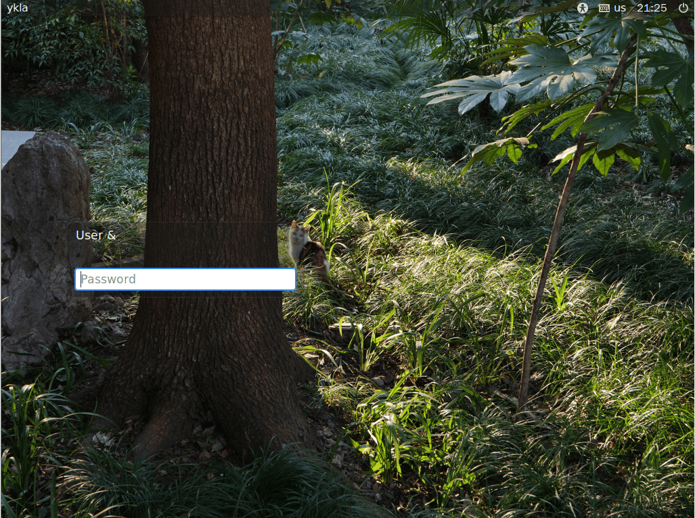
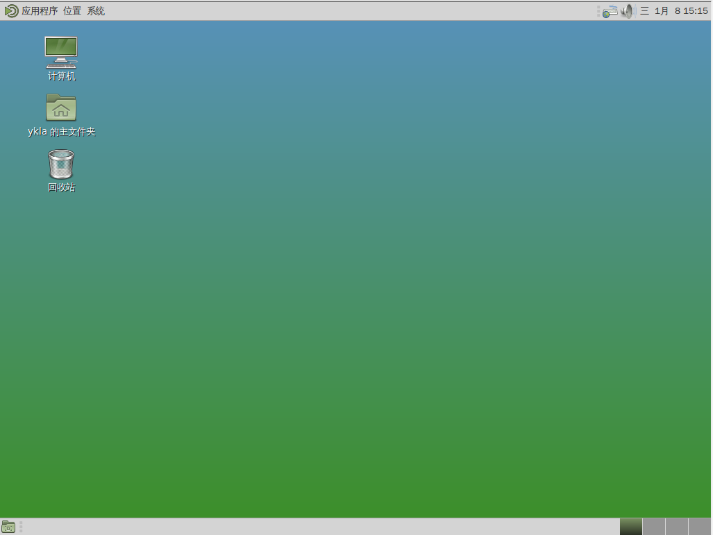
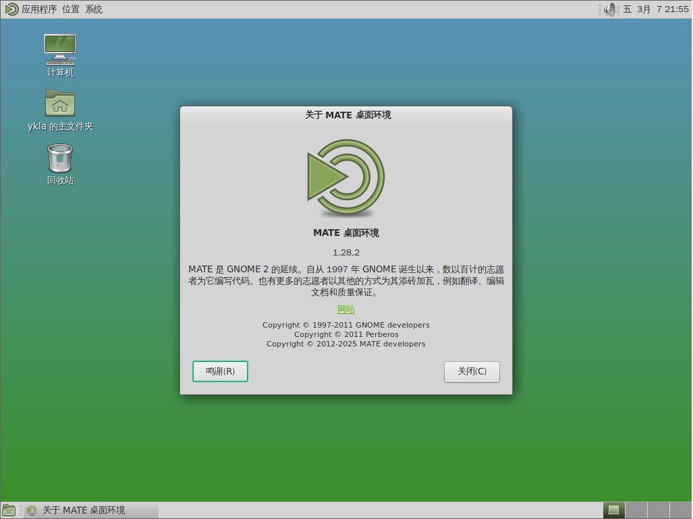

# 第 4.4 节 安装 Mate

> 以下教程适用于 shell 为 bash/sh/zsh 的用户。
>
> 首先看看现在自己的 shell 是不是 `sh`、`bash` 或 `zsh`：
>
>```sh
># echo $0
>```
>
> 如果是 `sh`、`bash`、`zsh` 其中之一，请继续；

## 安装与配置

```sh
# pkg install mate xorg wqy-fonts lightdm lightdm-gtk-greeter xdg-user-dirs
```

或者：

```sh
# cd /usr/ports/x11/mate/ && make install clean
# cd /usr/ports/x11/xorg/ && make install clean
# cd /usr/ports/x11-fonts/wqy/ && make install clean
# cd /usr/ports/x11/lightdm-gtk-greeter/ && make install clean
# cd /usr/ports/devel/xdg-user-dirs/ && make install clean
```

安装后启动服务：

```sh
# sysrc moused_enable="YES"
# sysrc dbus_enable="YES"
# sysrc lightdm_enable="YES"
```

在 `~/.xinitrc` 文件内加入下面一行:

```sh
exec mate-session
```

## 显示中文桌面环境


编辑 `/etc/login.conf`：

找到 `default:\` 这一段，把 `:lang=C.UTF-8` 修改为 `:lang=zh_CN.UTF-8`。

刷新数据库：

```sh
# cap_mkdb /etc/login.conf
```







## 输入法


ibus 测试成功。请参见输入法相关章节。

