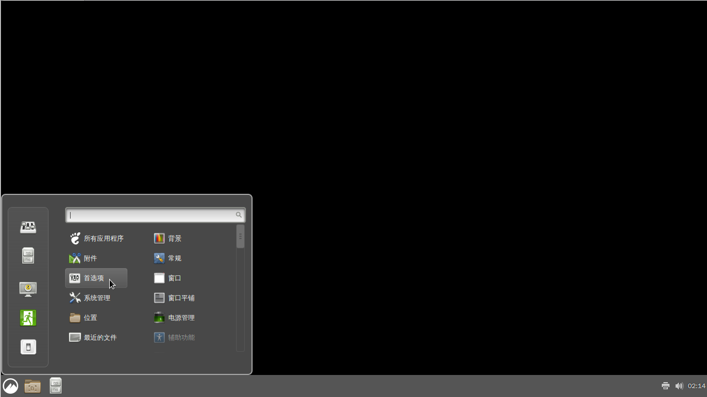

# 第 4.6 节 安装 Cinnamon

> 以下教程适用于 shell 为 bash/sh/zsh 的用户。
>
> 首先看看现在自己的 shell 是不是 `sh`,`bash`,`zsh`：
>
> `# echo $0`
>
> 如果是 `sh`,`bash`,`zsh` 其中之一，请继续；


 

**壁纸就是黑色的，不是显示出了问题。**

## 安装

```shell-session
# pkg install xorg lightdm lightdm-gtk-greeter cinnamon wqy-fonts xdg-user-dirs
```


## 配置

```shell-session
# ee ~/.xinitrc
```

添加：

```shell-session
exec cinnamon-session
```

```shell-session
# ee /etc/fstab
```

添加：

```shell-session
proc /proc procfs rw 0 0
```

### 添加启动项：

```shell-session
# sysrc dbus_enable=YES
# sysrc lightdm_enable=YES
```

### 中文化

编辑 `/etc/login.conf`：

找到 `default:\` 这一段，把 `:lang=C.UTF-8` 修改为 `:lang=zh_CN.UTF-8`。

刷新数据库：`# cap_mkdb /etc/login.conf`

