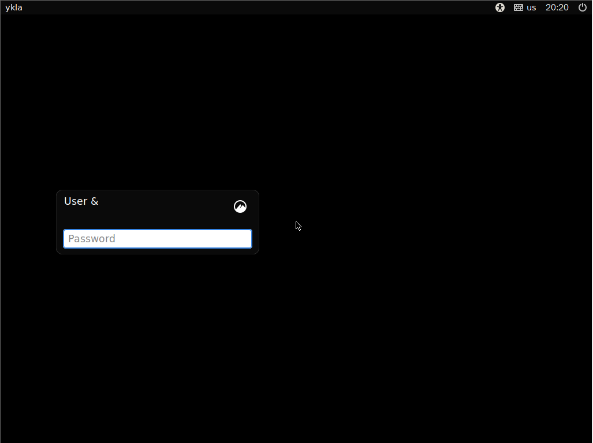
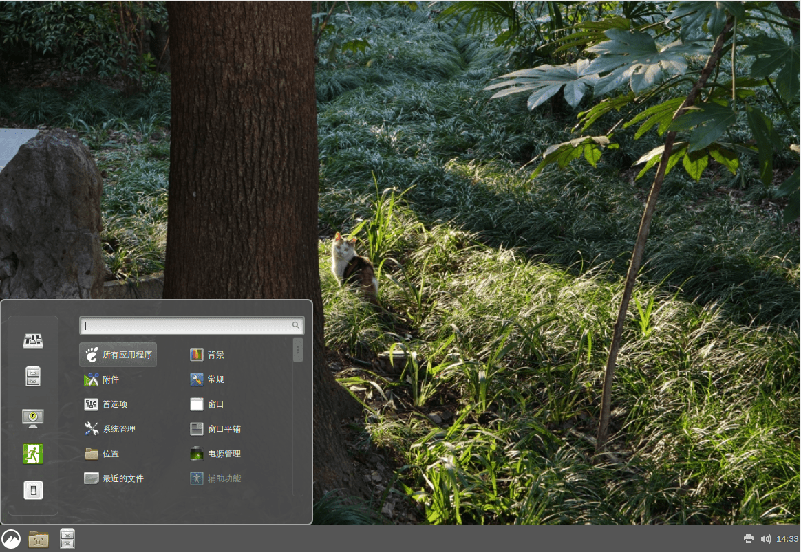

# 第 4.6 节 安装 Cinnamon

> 以下教程适用于 shell 为 bash/sh/zsh 的用户。
>
> 首先看看现在自己的 shell 是不是 `sh`、`bash`、`zsh`：
>
>```sh
># echo $0
>```
>
> 如果是 `sh`、`bash`、`zsh` 其中之一，请继续；


## 安装

```sh
# pkg install xorg lightdm lightdm-gtk-greeter cinnamon wqy-fonts xdg-user-dirs
```

或者

```sh
# cd /usr/ports/x11/xorg/ && make install clean
# cd /usr/ports/x11/cinnamon/ && make install clean
# cd /usr/ports/x11-fonts/wqy/ && make install clean
# cd /usr/ports/x11/lightdm/ && make install clean
# cd /usr/ports/x11/lightdm-gtk-greeter/ && make install clean
# cd /usr/ports/devel/xdg-user-dirs/ && make install clean
```


## 配置

```sh
# ee ~/.xinitrc
```

添加：

```sh
exec cinnamon-session
```

然后

```sh
# ee /etc/fstab
```

添加：

```sh
proc /proc procfs rw 0 0
```

### 添加启动项：

```sh
# sysrc dbus_enable=YES
# sysrc lightdm_enable=YES
```

### 中文化

编辑 `/etc/login.conf`：

找到 `default:\` 这一段（写作时为第 24 行），把 `:lang=C.UTF-8` 修改为 `:lang=zh_CN.UTF-8`。

刷新数据库：

```sh
# cap_mkdb /etc/login.conf
```


 

 

壁纸就是黑色的，不是哪儿出了问题。

 

自定义壁纸。