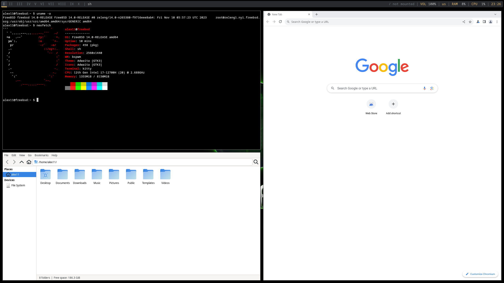

# 第 4.9 节 安装 bspwm

**注意：bspwm 是平铺式窗口管理器，与常规桌面不同**

bspwm，据说更符合 UNIX 哲学。

## 安装 bspwm

通过 pkg 安装

```shell-session
# pkg install xorg bspwm sxhkd rofi kitty feh picom polybar dunst lightdm lightdm-gtk-greeter wqy-fonts xdg-user-dirs
```

解释：

bspwm, sxhkd: bspwm 组件

rofi: 程序启动器

kitty: 终端模拟器

feh: 桌面背景修改

picom: 窗口合成器，添加窗口透明，阴影，动效等

polybar: 面板

dunst: 通知管理器

## 配置工作

### 启用 dbus 服务

```shell-session
# sysrc dbus_enable="YES"
# service dbus start
```

### 创建配置文件

```shell-session
$ mkdir ~/.config  #注意这里用普通用户！！！
$ mkdir ~/.config/bspwm
$ mkdir ~/.config/sxhkd
$ cp /usr/local/share/examples/bspwm/bspwmrc ~/.config/bspwm
$ cp /usr/local/share/examples/bspwm/sxhkdrc ~/.config/sxhkd
$ chmod +x ~/.config/bspwm/bspwmrc
```

修改 `~/.config/sxhkd/sxhkdrc`

```
super + Return
    kitty

super + @space
    rofi -show drun
```

### 设置 polybar 启动脚本和配置文件

```shell-session
$ mkdir ~/.config/polybar  # 一样的普通用户！！！
$ cp /usr/local/etc/polybar/config.ini ~/.config/polybar
```

创建 `~/.config/polybar/launch.sh`

```shell
#!/bin/sh
killall -q polybar
polybar example 2>&1 | tee -a /tmp/polybar.log
```

并执行

```shell-session
$ chmod +x ~/.config/polybar/launch.sh
```

### 设置 picom, polybar, dunst 启动

```shell-session
$ echo "picom &" >> ~/.config/bspwm/bspwmrc
$ echo "\$HOME/.config/polybar/launch.sh" >> ~/.config/bspwm/bspwmrc
$ echo "dunst &" >> ~/.config/bspwm/bspwmrc
```

## 启动 bspwm

### 通过 startx

```shell-session
$ echo "exec bspwm" >> ~/.xinitrc
$ startx
```

### 通过 lightdm

创建 `/usr/local/share/xsessions/bspwm.desktop`

```shell-session
# mkdir /usr/local/share/xsessions
# ee /usr/local/share/xsessions/bspwm.desktop
```

写入以下内容

```
[Desktop Entry]
Name=bspwm
Comment=Log in with bspwm
Exec=/usr/local/bin/bspwm
Type=Application
```

启动 lightdm 服务

```shell-session
# sysrc lightdm_enable="YES"
# service lightdm start
```

## 一些操作和设置

Windows + 空格：用 rofi 启动应用

Windows + 回车：启动终端（即 kitty）

更多快捷键可以参考 `~/.config/sxhkd/sxhkdrc`

生成桌面文件夹（Downloads，Documents 等）

```shell-session
$ xdg-user-dirs-update
```

设置桌面背景：

```shell-session
$ feh --bg-center "$HOME/.local/share/wallpapers/wallpaper.jpg"
```

执行一次后自动设置：

在 `~/.config/bspwm/bspwmrc` 中的 polybar 启动脚本**之前**添加

```
$HOME/.fehbg &
```

## 故障排除什么的以后再写 ~~（其实是懒了）~~

## 展示图片



注：图片中的 Chrome 浏览器，Thunar 文件管理器均需要自己安装

## 参考文献

* [知乎 - 从零开始的 Bspwm 安装与配置教程 - 列奥那多是勇者](https://zhuanlan.zhihu.com/p/568211941)
