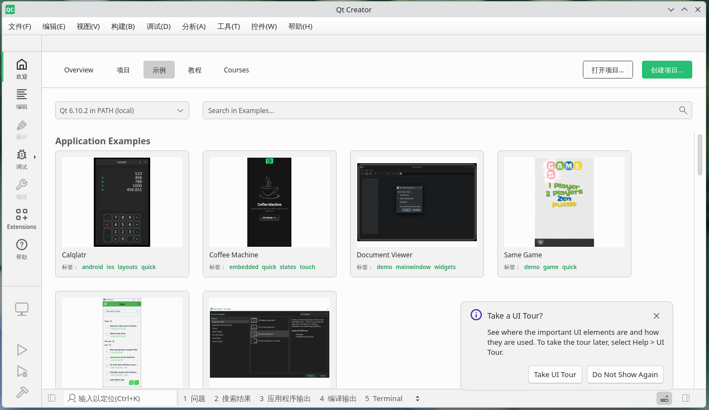
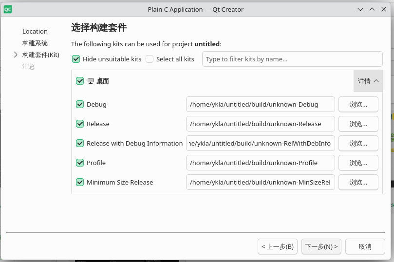
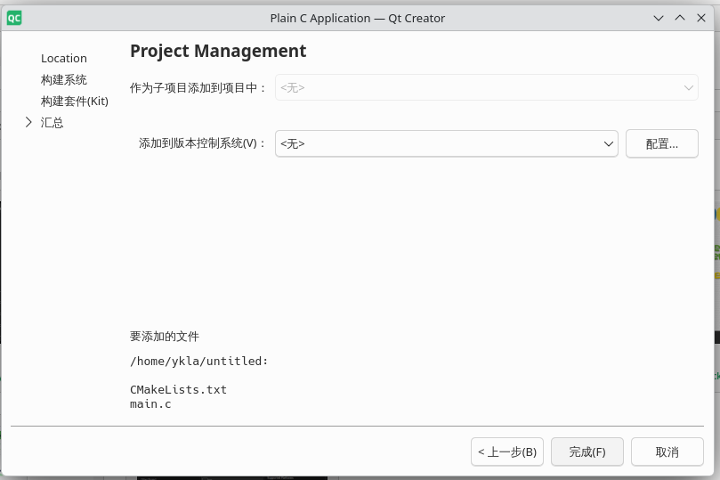
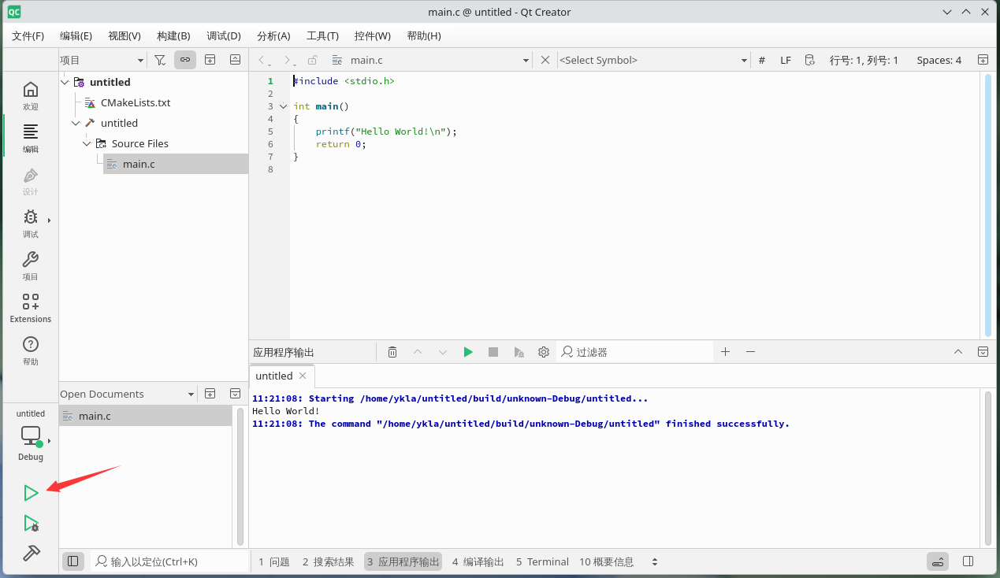
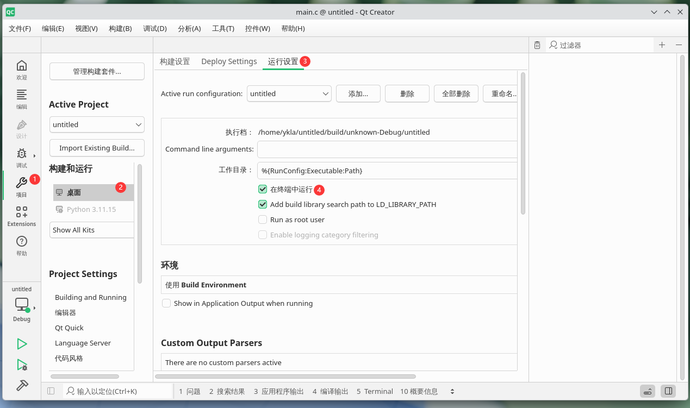
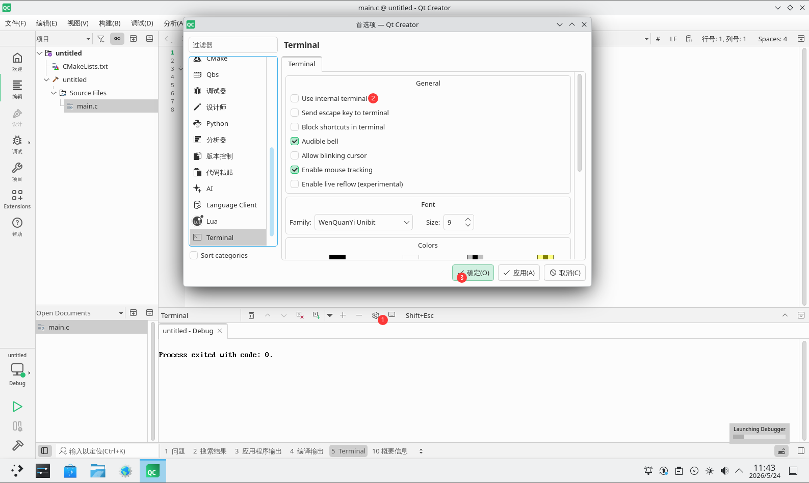
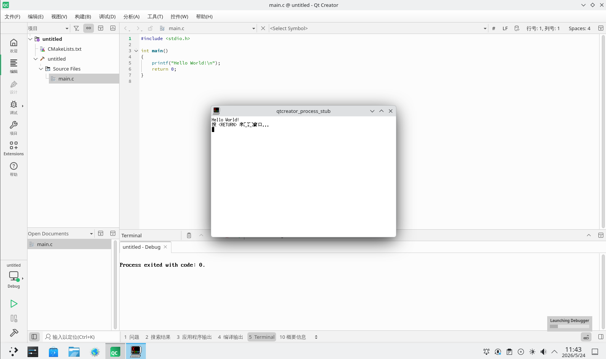

# 40.3 Qt 开发环境

本节通过 Ports 安装 Qt Creator（devel/qtcreator）及 CMake 依赖，完成 Qt 开发环境的基础配置。

Qt Creator 是一款跨平台的集成开发环境（IDE），专为 Qt 开发需求设计。其主要功能包括：

- 支持 C++、QML 和 ECMAScript 的代码编辑器；
- 快速的代码导航工具；
- 输入时进行静态代码检查和样式提示；
- 上下文相关帮助；
- 可视化调试器；
- 集成的 GUI 布局和表单设计器。

## 安装 Qt Creator

使用 Ports 安装（不建议使用 Qt Creator 的二进制包，因其可能存在兼容性和本地化支持问题）：

```sh
# cd /usr/ports/devel/qtcreator/
# make install clean # 安装 Qt Creator 本体
```

## Qt Creator 中文支持

### 中文界面

Qt Creator 界面语言默认跟随系统。如果界面语言未随系统设置更改，请在菜单中依次选择 `Edit` -> `Preferences` -> `Environment` -> `Interface` -> `Language` 手动设置。

编译程序和调试器通常无需手动配置。

### 中文程序

在 Qt Creator 中开发的程序可能无法输入中文，原因在于 Qt 对输入法的支持依赖插件机制。Qt 通过平台输入上下文（Platform Input Context）插件与系统输入法框架集成，常见的插件包括 IBus 和 Fcitx 5 等。

列出 Qt6 平台输入上下文（Platform Input Context）插件目录下的文件：

```sh
# ls /usr/local/lib/qt6/plugins/platforminputcontexts/

```

可以看到以下输出：

```sh
libfcitx5platforminputcontextplugin.so   # fcitx 5 输入法平台插件
libibusplatforminputcontextplugin.so     # IBus 输入法平台插件
```

相关文件结构：

```sh
/usr/local/
└──lib/
     └──qt6/
         └──plugins/
             └──platforminputcontexts/
                  ├── libfcitx5platforminputcontextplugin.so # fcitx 5 输入法平台插件
                  └── libibusplatforminputcontextplugin.so # IBus 输入法平台插件
```

这些插件分别对应 IBus 和 Fcitx 5（Port textproc/fcitx5-qt）。无法输入中文，可能由于这两个插件依赖的库版本存在不兼容问题。

为解决上述问题，推荐通过 Ports 编译安装 Qt Creator，而非直接使用 pkg 安装的二进制包。

### 中文界面翻译不完整

有意参与 Qt 翻译的读者可关注以下资源：

- FreeBSD Bugzilla. Bug 236518 - devel/qtcreator unsupported other languages[EB/OL]. [2026-03-26]. <https://bugs.freebsd.org/bugzilla/show_bug.cgi?id=236518>. 记录 Qt Creator 在 FreeBSD 上的多语言支持问题。
- Qt Project. Qt Localization[EB/OL]. [2026-03-26]. <https://wiki.qt.io/Qt_Localization>. Qt 官方本地化工作指南与资源汇总。
- Qt Project. qttranslations[EB/OL]. [2026-03-26]. <https://invent.kde.org/qt/qt/qttranslations>. Qt 框架多语言翻译文件仓库。

## 为美好世界献上祝福（示例程序）

> **注意**
>
> 请自行安装 CMake 工具：Port **devel/cmake** 以及 Python PIP Port **devel/py-pip**。

以下是在 Qt Creator 中创建并运行 Qt 应用程序的操作步骤，仅作演示。

点击“创建项目”：



选择“Non-Qt Project”（非 Qt 项目），再选中“Plain C Application”（纯 C 语言应用程序）。


设置项目路径，“名称”项可自行填写。根据需要调整“创建路径”项。随后点击“下一步”。


构建系统选择“CMake”，随后点击“下一步”。


选择构建套件，如为空，请按照提示检查开发环境所需安装的软件包。随后点击“下一步”。



设置项目管理，随后点击“完成”。



初始界面如下：


点击左侧边栏的绿色三角运行代码，观察“应用程序输出”：



## 在终端输出

除了图形界面程序外，Qt Creator 也可用于开发命令行程序。对于不需要图形界面的应用，可以直接在终端中运行和查看输出。

点击左侧边栏的“项目”，在“构建和运行”部分选中“桌面”，在“运行设置”中选中“在终端中运行”。



点击设置，在“Terminal”中取消选中“Use Internal terminal”，完成后点击“确定”。



以下是在终端输出结果的示例：



终端汉字显示异常，有待解决。
