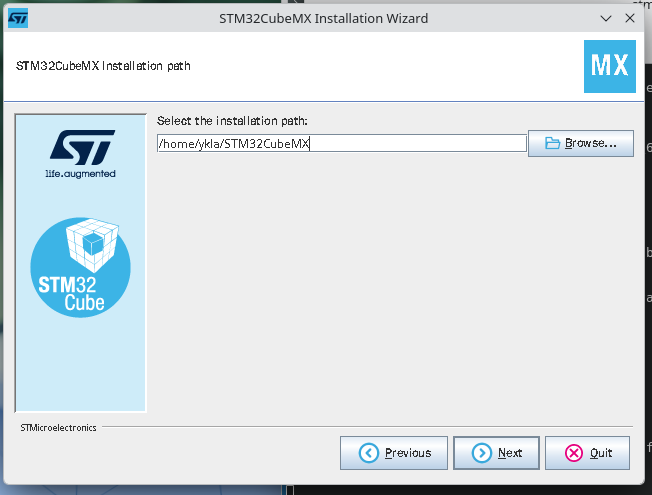
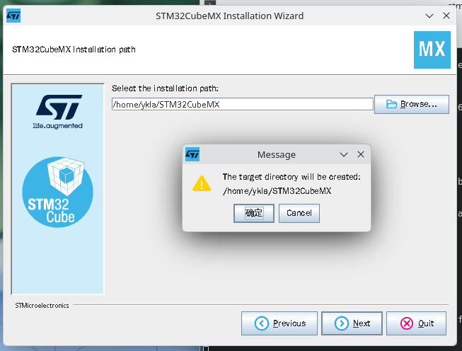
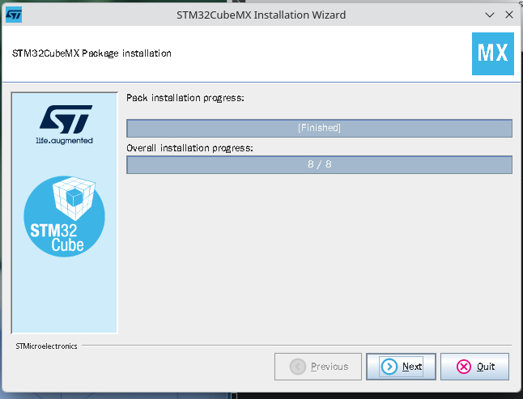
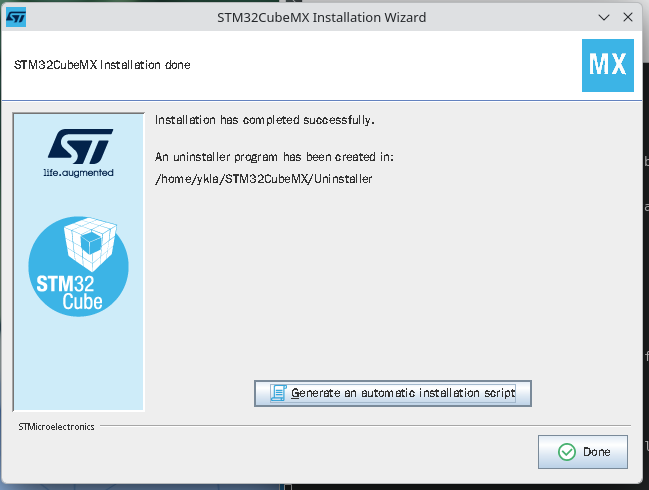

# 42.5 STM32 开发环境

STM32 是意法半导体（STMicroelectronics，ST）自 2007 年起推出的 32 位微控制器（Microcontroller Unit，MCU）产品系列，该系列产品基于 ARM Cortex-M 处理器内核架构，是嵌入式开发领域的主流 MCU 平台之一。

## 安装 STM32CubeMX

STM32CubeMX 是意法半导体官方提供的图形化硬件配置与代码生成工具，可用于快速完成 STM32 项目的硬件初始化。

在 FreeBSD 平台开发 STM32 嵌入式系统，推荐采用 STM32CubeMX 进行初始化配置。STM32CubeMX 官方仅支持 Windows、Linux、macOS 三大平台，在 FreeBSD 上运行该软件需借助 Linux 兼容层。

关于在 FreeBSD 上安装 Linux 兼容层的详细教程，可参考本书其他章节，推荐使用 FreeBSD 官方维护的 linux-rl9 兼容层。

自 STM32CubeMX V6.2.0 起，安装包已内置 Java 运行时环境（JRE，Adoptium Temurin 21.0.3+9），无需用户自行安装 Java。若在 FreeBSD Linux 兼容层下运行安装程序时遇到问题，可尝试安装系统级 OpenJDK 作为备选方案，本节示例采用 Port **java/openjdk25**。

配置好兼容层后，从 [STM32CubeMX 官网](https://www.st.com/en/development-tools/stm32cubemx.html) 下载压缩包并解压。本节撰写时，下载无须注册登录，以访客身份下载。下载链接将通过邮件发送，须确保邮箱地址可正常收信。下载的文件为 **stm32cubemx-lin-v6-17-0.zip**。

将安装包 **stm32cubemx-lin-v6-17-0.zip** 解压到目录 **/home/ykla/stm**：

```sh
$ unzip stm32cubemx-lin-v6-17-0.zip -d /home/ykla/stm
```

> **技巧**
>
> 本节示例中出现的 **/home/ykla** 为示例路径，应根据自身环境替换为实际用户主目录。

定位到解压缩文件夹并运行其中的可执行程序，本例中为 `SetupSTM32CubeMX-6.17.0`。启动安装程序：

```sh
$ ./SetupSTM32CubeMX-6.17.0
```

开始安装：


接受许可协议，随后点击下一步。


接受用户条款，随后点击下一步。


填写安装路径，应记录该路径，本例路径为 **/home/ykla/STM32CubeMX**。



确认使用该路径：



确认后程序开始执行安装：


完成安装：



退出安装程序：



创建桌面快捷方式：

在 **~/Desktop**（或 **~/桌面**）目录下创建 `STM32CubeMX.desktop` 文件，随后写入：

```ini
[Desktop Entry]
Name=STM32CubeMX
Exec=/home/ykla/STM32CubeMX/STM32CubeMX %U
Terminal=false
Type=Application
Icon=/home/ykla/STM32CubeMX/help/STM32CubeMX.png
StartupWMClass=STM32CubeMX
Categories=Development;
Comment=STM32CubeMX
MimeType=application/x-STM32CubeMX-ioc;
```

将上述路径 `Exec`、`Icon` 替换为实际路径。随后授予可执行权限。


## 安装其他工具

除了 STM32CubeMX 外，还需安装开发工具链和调试工具。使用 pkg 安装：

```sh
# pkg install gcc-arm-embedded cmake ninja openocd stlink
```

或者使用 ports 构建：

```sh
# cd /usr/ports/devel/gcc-arm-embedded && make install clean      # 嵌入式 ARM 工具链
# cd /usr/ports/devel/cmake && make install clean      # 项目构建系统核心
# cd /usr/ports/devel/ninja && make install clean      # 高效的构建工具
# cd /usr/ports/devel/openocd && make install clean      # 通用 JTAG/SWD 调试和烧录工具
# cd /usr/ports/devel/stlink && make install clean      # ST 官方 ST‑LINK 调试器的用户空间工具集
```

## 编译与烧录

STM32 嵌入式开发的标准流程如下：首先使用 STM32CubeMX 进行硬件初始化和引脚配置，生成代码框架；然后通过 CMake 和 Ninja 交叉编译生成固件二进制文件；最后使用 OpenOCD 配合 ST-Link 调试器将固件烧录到目标芯片。

```sh
STM32 开发流程：

  STM32CubeMX
     引脚配置 / 时钟树配置 / 外设初始化 / 代码生成
     │
     ▼
  CMake + Ninja
     交叉编译（arm-none-eabi-gcc）
     │
     ▼
  OpenOCD + ST-Link
     烧录固件（JTAG / SWD 调试接口）
     │
     ▼
  STM32 目标开发板
     （STM32F1 / F4 / H7 / L4 等系列）
```

使用 STM32CubeMX 创建项目，在 `Project Manager` 的 `Project` 里的 `Toolchain/IDE` 栏选择 CMake，在 `Code Generator` 里选择 `copy all used libraries into project folder` 和 `Generate peripheral initialization as a pair of '.c/.h' files per peripheral`。

生成项目后修改 `CMakeLists.txt` 文件：

```cmake
# 最低 CMake 版本要求
cmake_minimum_required(VERSION 3.22)

# 交叉编译配置
set(CMAKE_SYSTEM_NAME Generic)
set(CMAKE_SYSTEM_PROCESSOR arm)
set(CMAKE_TRY_COMPILE_TARGET_TYPE STATIC_LIBRARY)

# FreeBSD 下 arm-none-eabi-gcc 默认安装路径
set(TOOLCHAIN_PREFIX "/usr/local/gcc-arm-embedded-14.2.rel1/bin")
set(CMAKE_C_COMPILER   ${TOOLCHAIN_PREFIX}/arm-none-eabi-gcc)
set(CMAKE_ASM_COMPILER ${TOOLCHAIN_PREFIX}/arm-none-eabi-gcc)
set(CMAKE_OBJCOPY      ${TOOLCHAIN_PREFIX}/arm-none-eabi-objcopy)

# 避免查找主机库/头文件
set(CMAKE_FIND_ROOT_PATH_MODE_PROGRAM NEVER)
set(CMAKE_FIND_ROOT_PATH_MODE_LIBRARY ONLY)
set(CMAKE_FIND_ROOT_PATH_MODE_INCLUDE ONLY)
set(CMAKE_FIND_ROOT_PATH_MODE_PACKAGE ONLY)

# 项目定义
project(test LANGUAGES C ASM)      # 改为实际的项目名称

# 收集源文件
file(GLOB_RECURSE HAL_SOURCES "Drivers/STM32F1xx_HAL_Driver/Src/*.c")
# 剔除所有模板文件，这些文件不应参与编译
list(FILTER HAL_SOURCES EXCLUDE REGEX ".*_template\\.c$")

file(GLOB CORE_SOURCES "Core/Src/*.c")
set(ASM_SOURCES "startup_stm32f103xb.s")  # 占位符——启动文件，必须改为实际型号对应的启动文件

# 定义编译标志
set(MCU_FLAGS "-mcpu=cortex-m3" "-mthumb" "-mfloat-abi=soft")

# 创建可执行目标
add_executable(${PROJECT_NAME}
    ${CORE_SOURCES}
    ${HAL_SOURCES}
    ${ASM_SOURCES}
)

# 配置目标属性 (Include, Options, Definitions)
target_include_directories(${PROJECT_NAME} PRIVATE
    Core/Inc
    Drivers/CMSIS/Include
    Drivers/CMSIS/Device/ST/STM32F1xx/Include
    Drivers/STM32F1xx_HAL_Driver/Inc
    Drivers/STM32F1xx_HAL_Driver/Inc/Legacy
)

target_compile_options(${PROJECT_NAME} PRIVATE
    ${MCU_FLAGS}
    -O2
    -ffunction-sections
    -fdata-sections
    -Wall
)

target_compile_definitions(${PROJECT_NAME} PRIVATE
    STM32F103xB          # 占位符——芯片型号宏，必须改为实际型号
    USE_HAL_DRIVER       # 启用 HAL 驱动
)

target_link_options(${PROJECT_NAME} PRIVATE
    ${MCU_FLAGS}
    -Wl,--gc-sections
    -T${CMAKE_CURRENT_SOURCE_DIR}/STM32F103XX_FLASH.ld  # 占位符——链接脚本，必须改为实际型号对应的 .ld 文件
    -specs=nosys.specs
    -Wl,-Map=${PROJECT_NAME}.map
)

# 生成二进制文件
add_custom_command(TARGET ${PROJECT_NAME} POST_BUILD
    COMMAND ${CMAKE_OBJCOPY} -O binary $<TARGET_FILE:${PROJECT_NAME}> ${PROJECT_NAME}.bin
    COMMENT "Building ${PROJECT_NAME}.bin"
)

# 烧录目标
add_custom_target(flash
    COMMAND openocd -f interface/stlink.cfg -f target/stm32f1x.cfg -c "program ${PROJECT_NAME}.bin 0x08000000 verify reset exit"
    DEPENDS ${PROJECT_NAME}
    WORKING_DIRECTORY ${CMAKE_BINARY_DIR}
    COMMENT "Flashing ${CMAKE_BINARY_DIR}/${PROJECT_NAME}.bin via OpenOCD"
)
```

> **技巧**
>
> 更换 STM32 型号时，CMakeLists.txt 中有多处与具体 MCU 型号绑定的占位符，必须逐一调整。建议在 STM32CubeMX 中切换目标芯片后重新生成项目，再对照修改 CMakeLists.txt 中对应位置。
>
> 链接脚本（`.ld` 文件）定义了 Flash 和 RAM 的起始地址与大小，不同型号的存储器布局不同，混用会导致程序无法正常运行或烧录后跑飞。STM32CubeMX 会根据所选芯片自动生成正确的链接脚本，切勿直接从其他项目复制 `.ld` 文件使用。

为了在终端使用 gcc-arm-embedded 系列工具，应将其二进制文件加入 PATH 中。

各 shell 的配置方法如下：

| Shell | 配置文件 | 写入内容 |
| ----- | -------- | -------- |
| sh / Bash / Zsh | `~/.profile` | `export PATH=/usr/local/gcc-arm-embedded-14.2.rel1/bin:$PATH` |
| fish | `~/.config/fish/config.fish` | `set -gx PATH /usr/local/gcc-arm-embedded-14.2.rel1/bin $PATH` |
| csh / tcsh | `~/.cshrc` | `setenv PATH /usr/local/gcc-arm-embedded-14.2.rel1/bin:$PATH` |

开始编译：

```sh
# 在项目根目录执行

# 创建 build 目录并进入
$ mkdir build && cd build

# 配置
$ cmake .. -G Ninja

# 开始编译
$ ninja
```

最后烧录到开发板：

```sh
# 在 build 目录下执行
ninja flash
```
