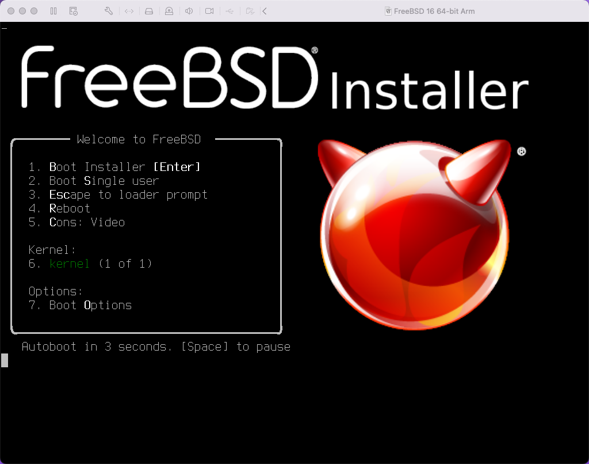
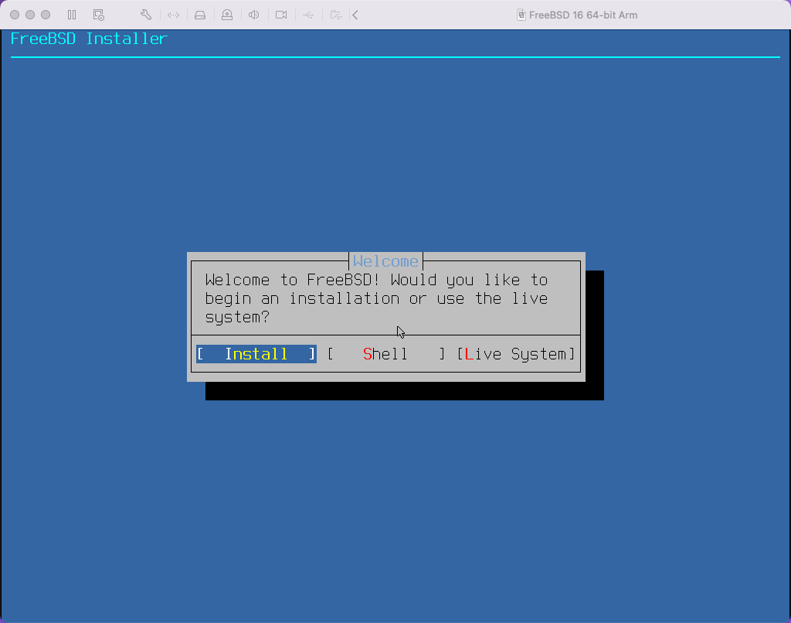
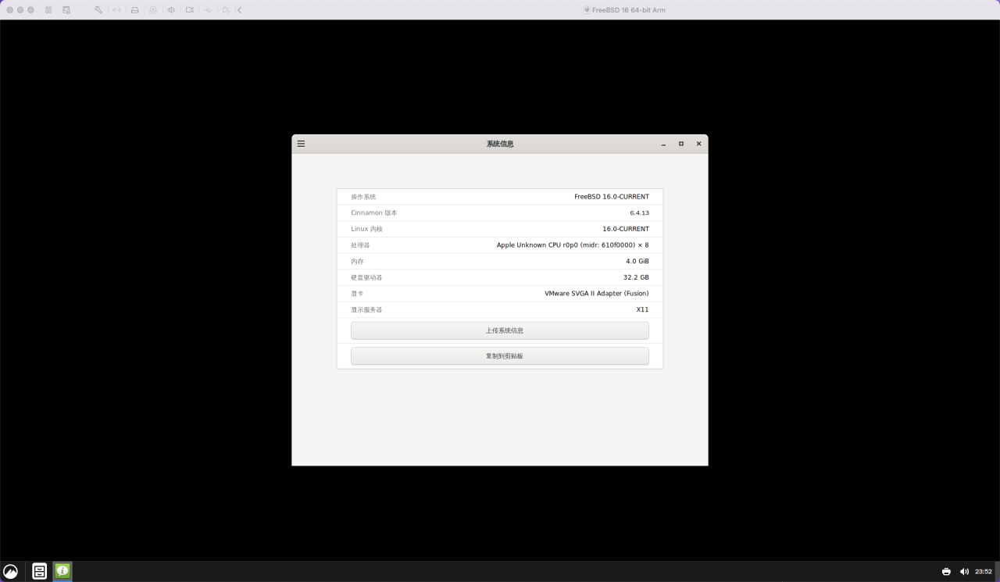
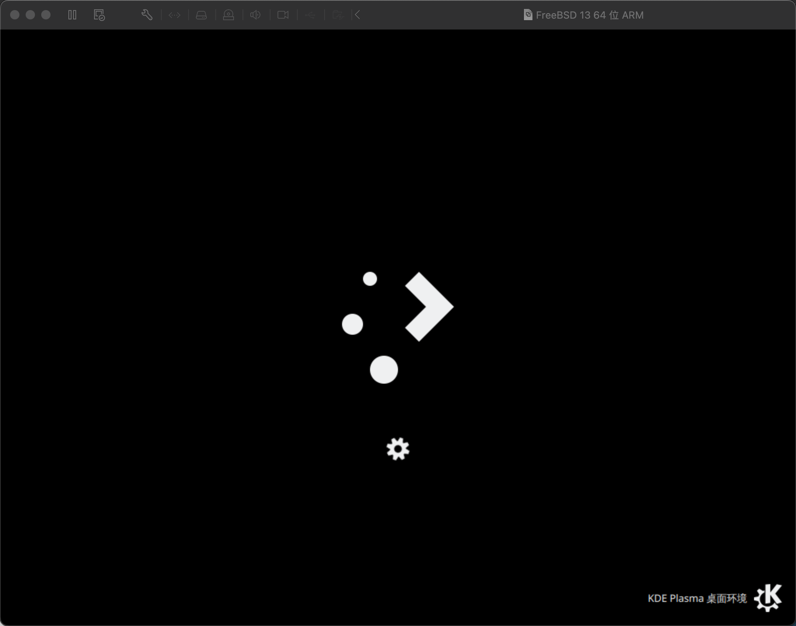
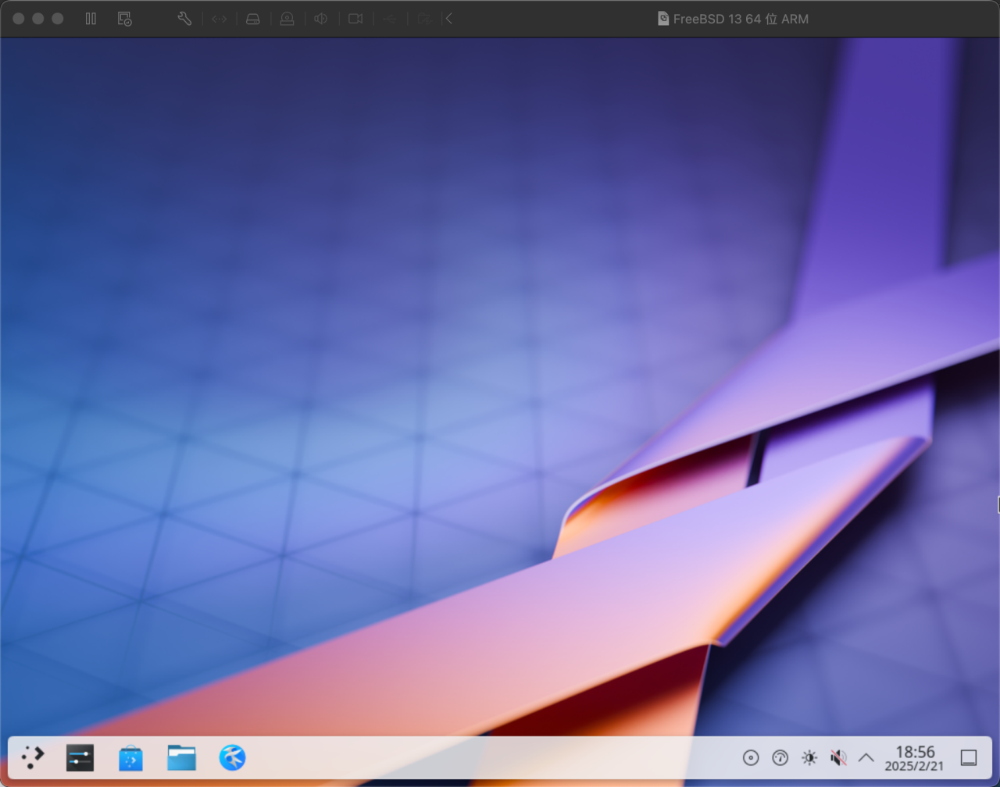

# 5.4 基于 Apple M1 和 VMware Fusion Pro 安装 FreeBSD

基于 macOS 15.3.1 与 VMware Fusion Pro 13.6.2，FreeBSD 15.0 与 14.2-RELEASE 均可正常安装运行。

> **注意**
>
> 如果使用 macOS 14，可能存在键盘无法输入的问题，需特别注意此兼容性问题。

## 下载 FreeBSD

首先需要下载适合 Apple M1 架构的 FreeBSD 镜像。Apple M1 采用 ARM 架构，请下载带有 `aarch64` 字样的镜像。**切勿** 下载 `amd64` 架构的镜像，否则无法正常运行。

## 配置虚拟机

镜像下载完成后，开始配置虚拟机。

选择下载的 FreeBSD 镜像。

默认内存配置可能不足，请选择“自定设置”进行调整。

点击“处理器和内存”。

调整处理器数量和内存大小。`4096 MB` 表示 4 GB。

## 开始安装

## 配置桌面

无需安装虚拟机增强工具即可正常运行。

窗口大小无法自由调整。
