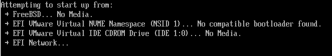

# 5.7 命令行基础

命令行界面（Command Line Interface, CLI）是类 UNIX 系统的主要交互方式，提供了直接操作系统的方法。

## 我是谁？

- 查看当前登录系统的用户名：

```sh
$ whoami
ykla
```

> **技巧**
>
> `whoami` 已由 id(1) 替代，等价于 `id -un`。

- 查看当前登录用户所属用户组的信息。

```sh
$ id
uid=1001(ykla) gid=1001(ykla) groups=1001(ykla),0(wheel)
```

- 查看当前用户登录的终端及本次登录时间。

```sh
$ who
root             pts/0        Mar 19 15:00 (3413e8b6b43f)
```

BSD who 与 GNU/Linux 的 `who` 差异较大；FreeBSD 的 `who` 不支持 Linux 的 `-d`（死进程）、`-p`（init 活动进程）、`--lookup`、`--ips` 等选项。

## 我从哪里来？

展示当前有哪些用户已登录，以及他们正在做什么：

```sh
$ w
 3:02PM  up 21:52, 1 user, load averages: 0.01, 0.01, 0.00
USER       TTY      FROM           LOGIN@  IDLE WHAT
root       pts/0    3413e8b6b43f   3:00PM     - w
```

BSD `w` 与 GNU/Linux 的 `w` 差异较大；FreeBSD 的 `w` 不支持 Linux `w` 的 `-f`（省略 FROM 列）、`-s`（短格式）、`-u`（省略 USER 列）等选项。

## 我在哪？

- 查看当前所在路径。

`pwd` 即 `print working directory`，用于打印当前工作目录。

```sh
$ pwd
/usr/ports/editors/vscode
```

BSD `pwd` 与 POSIX 标准兼容；与 GNU/Linux 的 `pwd` 基本兼容。

## 我究竟是谁？

账户切换与退出登录：

```sh
root@ykla:/ # su ykla ①
ykla@ykla:/ $ ②
ykla@ykla:/ $ su ③
Password: ④
root@ykla:/ #
root@ykla:/ # exit ⑤
ykla@ykla:/ $ exit ⑥
root@ykla:/ # exit ⑦

FreeBSD/amd64 (ykla) (ttyv0)

login:
```

- ① 使用 `su空格用户名` 可以切换到用户 ykla。如果从 root 切换到 ykla，则不需要输入 ykla 的密码：
  - `root@ykla:/`：
  - `root`：当前用户是 root
  - `@`：“谁”在“xx”主机上
  - `ykla`：此处是主机名，与用户 ykla 无关。主机名可自行设定
  - `:/`：代表当前位于 `/` 路径下
- ② 注意提示符号的变化：root 是 `#`，普通用户是 `$`（csh 是 `%`）
- ③ 如果仅输入 `su` 并回车，命令的含义是从当前用户切换到 root 账户（如果已经是 root，则不会有任何变化）。非 wheel 组成员不能直接 `su` 到 root，否则系统将返回 `sorry` 错误提示，但可以 `su` 到其他用户。
- ④ 从普通用户切换到 root，需要 root 账户的登录密码。
- ⑤ 输入 `exit` 可退出当前用户，如果是唯一登录的用户，将退出登录到 TTY。

> **思考题**
>
> ⑥、⑦ 分别切换到了哪些用户或执行了哪些操作？

`su` 命令只能切换到 **/etc/shells** 中列出的 shell。`su -` 或 `su -l` 不仅切换用户，还会将工作目录切换到目标用户的主目录，并重置环境变量。

BSD 与 GNU `su` 行为比较：

| 项目 | FreeBSD `su` 行为 | Linux `su` 行为 |
| ---- | ----------------- | --------------- |
| `-c` | 指定 login class（登录类） | 执行指定命令（command） |
| `-s` | 设置 MAC label（强制访问控制标签） | 指定登录 shell |
| 执行命令方式 | 将命令作为参数传递给目标用户 shell 执行 | 使用 `-c` 直接执行命令 |

## 我要去哪里？

`cd` 命令，即“change the working directory”，切换当前工作目录。

```sh
ykla@ykla:~ $ pwd
/home/ykla
ykla@ykla:~ $ cd .
ykla@ykla:~ $ pwd
/home/ykla
ykla@ykla:~ $ cd ..
ykla@ykla:/home $ pwd
/home
ykla@ykla:/home $ cd ..
ykla@ykla:/ $ pwd
/
ykla@ykla:/ $ cd /home/ykla
ykla@ykla:~ $ cd ../..
ykla@ykla:/ $ pwd
/
```

根据上面的输出，请读者思考：上面的 `.` 和 `..` 分别代表什么？

> **技巧**
>
> 在 FreeBSD 的 sh(1) 中，`cd` 的行为由 POSIX 标准规定。

## 命令行格式

大多数命令行命令的名称都具有明确含义，例如 `ls` 即 `list`（列出）、`wget` 即通过 web（网络）来 `get`（下载）；也存在少量难以从名称推断功能的命令，例如 `thefuck` 命令（用于自动纠正拼写错误）。

命令行的基本语法结构遵循 POSIX Shell Command Language 规范（[IEEE Std 1003.1](https://pubs.opengroup.org/onlinepubs/9799919799/)）。其一般格式如下：

```sh
# 命令 选项  参数 1       参数 2
# ls   -l   /home/ykla /tmp
/home/ykla:
total 317
  ……有所省略……
drwxr-xr-x  2 ykla ykla        2 Mar  9 20:45 下载
drwxr-xr-x  2 ykla ykla        2 Mar  9 20:45 桌面

/tmp:
total 6
drwxrwxrwt  2 root    wheel  3 Mar 18 17:23 .ICE-unix
-r--r--r--  1 root    wheel 11 Mar 18 17:10 .X0-lock
```

其中，`ls`（L 小写）意味着列出当前目录或指定目录下的文件；选项 `-l`（L 小写）意味着打印详细信息，输出长（*long*）格式。多个短选项可合并书写，如 `-a -l` 等价于 `-al`。

选项用于修改命令的行为；参数（argument）是命令操作的对象。

> **技巧**
>
> 命令执行后返回退出状态码（exit status）：0 表示成功，非 0 表示失败。

需要注意中英文书写习惯的差异：中文行文不使用空格分隔，而英文单词必须使用空格加以区分。正因如此，命令行中各个组成部分之间应使用空格分隔 ` `。空格的数量一般不受限制，但最少应该为一个，即 ` `。

> **思考题**
>
> 如果不使用空格或某种方式（例如其他符号）分隔命令行，那么软件该如何理解整个句子？
>
> 如果不加空格，从自然语言角度，从人类视角看这句话 `Whatwelovedeclarespubliclywhoexactlyweare.` 会是怎样的体验？
>
> 再看：`ls-l/home/ykla/tmp`、`ls/` 呢？
>
> ```sh
> # ls-l/home/ykla/tmp
> -sh: ls-l/home/ykla/tmp: not found
> # ls/
> -sh: ls/: not found
> ```
>
> 可以看到，shell 会将整个字符串当作一个可执行命令来解析和执行。

还需要注意，命令行本身不具备自动纠错功能，即使仅拼错一个字母或少输入一个字符，命令也无法正确执行。

```sh
# LS # 试试全大写
-sh: LS: not found
# Ls # 一大一小呢
-sh: Ls: not found
# ls /hom1 # 实为 /home
ls: /hom1: No such file or directory
# ls -z /home # 不存在选项 -z
ls: invalid option -- z
usage: ls [-ABCFGHILPRSTUWZabcdfghiklmnopqrstuvwxy1,] [--color=when] [-D format] [--group-directories=] [file ...]
```

> **技巧**
>
> Windows 不仅对文件名大小写不敏感，对命令名称的大小写也不敏感。
>
> ```powershell
> PS C:\Users\ykla> cd C:\ # 这里 cd 是小写
> PS C:\> CD D:\ # 这里 CD 是大写
> PS D:\> CD c:\ # 这里 C 盘是小写
> PS C:\> dir # 小写 dir，列出目录，等于 ls
>
>    目录：C:\
>
> ……省略一部分……
>
> PS C:\Users\ykla> TREE # 大写 tree，显示路径关系
> 文件夹 PATH 列表
> 卷序列号为 2A90-E989
> C:.
> ├─.android
> ├─.cache
> │ ├─selenium
> ……省略一部分……
> ```

> **技巧**
>
> 命令前面的 `#` 表示什么意思？`#` 在 shell 当中通常是起注释作用（由 [POSIX.1-2024](https://pubs.opengroup.org/onlinepubs/9799919799/utilities/V3_chap02.html) 规定），相当于 C 语言中的 `//`。意味着后边的文字只起到说明作用，不起实际作用。

## 命令的执行与中断

与 Windows 及图形化界面软件不同，绝大多数命令行程序在执行过程中不会显示进度提示。通常只有以下两种结果：

- 成功执行：

```sh
# cp test /root/mydir/


```

- 执行中断：

```sh
# cp test9 /root/mydir/
cp: test9: No such file or directory
```

执行中断有很多可能的情形，以上只是其中一种（指定的文件或目录不存在）。

可以看到，只有在执行中断时，命令行才会有提示；如果执行完毕，则不会产生任何提示。这种 UNIX 设计哲学旨在保证终端输出的简洁性。

## shell 命令的来源

### Linux

在 Linux 中，大多数常用命令来自 GNU 等用户空间软件包，Linux 内核本身并不提供用户级命令。以下为验证过程：

```bash
$ dpkg -S /bin/mv
coreutils: /bin/mv
$ dpkg -S /bin/cp
coreutils: /bin/cp
$ dpkg -S /bin/ls
coreutils: /bin/ls
$ dpkg -S /bin/pwd
coreutils: /bin/pwd
$ dpkg -S /bin/cat
coreutils: /bin/cat
$ dpkg -S /usr/sbin/chroot
coreutils: /usr/sbin/chroot
$ dpkg -S /bin/kill
procps: /bin/kill
$ dpkg -S /usr/bin/free
procps: /usr/bin/free
$ dpkg -S /bin/su
util-linux: /bin/su
```

可见在 Linux 中，这些常见命令一般出自 GNU 软件 coreutils、util-linux 或 procps。这些软件在历史上是 GNU 计划对 UNIX 软件的再实现。

同时，shell 本身也内置了一些命令：

```bash
$ type cd
cd 是 shell 内建
```

列出所有 shell 内置命令：

```bash
$ compgen -b
.
:
[
alias
bg
bind
break
builtin
caller
cd
command
compgen
……省略一部分……
ulimit
umask
unalias
unset
wait
```

### FreeBSD

```sh
$ type cd
cd is a shell builtin
```

在 FreeBSD 中，除了上述 shell 内置命令外（参见：sh(1)[EB/OL]. [2026-03-26]. <https://man.freebsd.org/cgi/man.cgi?query=sh&sektion=1>），常用命令都是基本系统自带的，不属于任何包。例如 `ls` 命令，其源代码位于 `freebsd-src/bin/ls/`[EB/OL]. [2026-03-26]. <https://github.com/freebsd/freebsd-src/tree/main/bin/ls>。可见 FreeBSD 系统是有机整体，而非由不同人员或团队维护的软件包简单拼接而成。

如果配置了 pkgbase，则输出类似：

```sh
# pkg which /bin/ls # 查询 /bin/ls 所属的软件包
/bin/ls was installed by package FreeBSD-runtime-15.snap20250313173555
```

如果缺少某个命令，一般可以通过安装相应的软件包来获取，例如 `lspci` 命令，来自软件包 `sysutils/pciutils`。然而也有许多命令存在 Linux 专有性问题，不兼容其他操作系统，例如 `ip` 命令，来自软件包 iproute2。

## 常用命令

### `cd` 命令

`cd`（change working directory，更改工作目录）

切换到 **/home**：

```sh
$ cd /home # 切换到 /home
$ pwd # 查看当前路径
/home
```

### `ls` 命令

`ls`（list，列出）命令的基本用法前文已经介绍，下面演示如何让 `ls` 以人类易读的方式显示文件大小：

选项 `-h`，即 `human`（人类），需要与 `-l`（`long` 长输出）结合使用。

```sh
# ls -hl /home/ykla
total 326 KB
-rw-------  1 ykla ykla   50B Mar 18 17:23 .Xauthority
drwx------  6 ykla ykla    6B Mar 10 16:21 .cache
drwx------  9 ykla ykla   12B Mar 19 15:01 .config
-rw-r--r--  1 ykla ykla  1.0K Feb 24 12:18 .shrc
drwxr-xr-x  2 ykla ykla    2B Mar  9 23:48 .themes
-rw-r--r--  1 root ykla    0B Mar 19 15:13 abc.TXT
drwxr-xr-x  3 root ykla    7B Mar 19 15:17 vscode
-rw-------  1 ykla ykla   17M Mar 18 17:09 xrdp-chansrv.core
drwxr-xr-x  2 ykla ykla    2B Mar  9 20:45 下载
……省略一部分……
```

在 UNIX 系统中，以 `.` 开头的文件或目录（如上面的 `.Xauthority`）都是隐藏的。Android 手机同样如此——可以通过 [MT 文件管理器](https://mt2.cn/) 自行查看。

选项 `-a` 可用于显示隐藏的目录和文件：

```sh
$ ls -a
.		.cshrc		.login		.profile	公共		视频
..		.dbus		.login_conf	.sh_history	图片		音乐
.Xauthority	.face		.mail_aliases	.shrc		文档
.cache		.icons		.mailrc		.themes		桌面
.config		.local		.mozilla	下载		模板
```

如果不加选项 `-a`：

```sh
ykla@ykla:~ $ ls
下载	公共	图片	文档	桌面	模板	视频	音乐
```

则不会显示隐藏文件。

### `touch` 创建文件命令

`touch` 的字面含义为“触碰”，表示轻微变动文件时间戳。

FreeBSD 的 `touch` 与 POSIX 标准兼容，最早出现于 Version 7 AT&T UNIX。

创建一个文件，命名为 `test`：

```sh
$ touch test
```

> **技巧**
>
> 可以看到上述命令创建的是 `test`，而非 `test.txt`、`test.word`、`test.pdf` 之类的。事实上，`.txt` 这一部分称为文件后缀名，主要用于提示用户文件类型，而非供系统识别。许多我们以为清楚明白的事物，真的如我们所认为的那般吗？
>
> 即使去掉相应的后缀名，在类 UNIX 系统中也可以识别文件的类型，这是根据文件幻数（magic numbers）确定的：
>
> ```sh
> $ file book
> book: PDF document, version 1.7
> ```

`file` 命令通过三组测试依次判定文件类型：文件系统测试（基于 stat(2)）、幻数测试（基于 **/usr/share/misc/magic.mgc** 中的固定格式标识）和语言测试（基于文本模式匹配）。其中“幻数”（magic number）概念源于 UNIX 可执行文件格式，文件头部特定偏移量处存储的固定标识用于指示文件类型。

可以一次性使用多个参数创建多个文件（类似用法几乎是通用的，不再赘述）：

```sh
$ touch test test1 test2 test3
```

### `mkdir` 创建目录

`mkdir` 即 `make directories`，创建目录

创建一个目录，命名为 ykla。

```sh
$ mkdir -v ykla # -v 选项用于显示文件变动详情，是 verbose 的缩写，意为输出详细信息
ykla
```

如果文件已存在：

```sh
$ mkdir ykla
mkdir: ykla: File exists # 提示该目录已存在。
```

---

如果要创建目录 `ykla/ykla1/ykla2/ykla3`，该如何操作？

```sh
$ mkdir ykla/ykla1/ykla2/ykla3
mkdir: ykla/ykla1/ykla2: No such file or directory
```

系统返回上述错误，此时需要参数 `-p`，`p` 是英文 `parents`（父）的意思，即如果上级目录不存在，就一并创建。

```sh
$ mkdir -vp  ykla/ykla1/ykla2/ykla3
ykla/ykla1
ykla/ykla1/ykla2
ykla/ykla1/ykla2/ykla3
```

FreeBSD 的 `mkdir` 与 GNU/Linux 的 `mkdir` 基本兼容。

### `rm` 删除命令

> **警告**
>
> FreeBSD 命令行界面是没有回收站的，所有命令一经执行不可撤销。命令行操作 `rm` 具有较高风险。

`rm` 即英文 `remove` 的缩写，意为删除。

---

删除文件 `test`

```sh
$ rm test
```

如果不存在文件 `test`：

```sh
$ rm test
rm: test: No such file or directory # 报错指定的文件或目录不存在
```

---

删除路径 **/home/ykla/test**

- 如果目录为空（不含任何文件，只是空目录）

```sh
$ rm /home/ykla/test
$
```

还可使用命令 `rmdir`（remove directory，即删除目录，且只能删除空目录）：

```sh
$ rmdir /home/ykla/test
$
```

- 如果目录不为空

```sh
$ rm /home/ykla/test/
rm: /home/ykla/test/: is a directory # 提示 /home/ykla/test/ 为目录
```

使用参数 `-r`（recursively）递归，参数 `-f`（force）强制删除：

> **技巧**
>
> 什么是递归？
>
> “从前有座山，山上有座庙，庙里有个老和尚在给小和尚讲故事。老和尚说：‘从前有座山，山上有座庙……’”这就是递归的实例。
>
> 在该操作中，其含义是先进入 **/home/ykla/test/** 下最深层的子目录（如存在），删除其中的文件和子目录本身，随后向上逐层重复该过程。直至删除 **/home/ykla/test/**。即使用深度优先搜索算法（Depth-First Search，DFS）。

```sh
$ rm -rf /home/ykla/test/
```

> **警告**
>
> 使用 `rm -rf` 是相当危险的操作，是不可撤销的。如果命令中误输入空格，如将 **/home/ykla/test/** 误输为 **/home/ykla /test/**，会导致删除路径错误：
>
> ```sh
> # rm -rf /home/ykla /test
> # ls /home/ykla
> ls: /home/ykla: No such file or directory # 表明 ykla 目录已不存在
> ```

> **警告**
>
> 互联网上常有说法称使用 `sudo rm -rf /*` 是某种可以执行特定操作的命令，误导他人对系统造成不可挽回的灾难性破坏。该命令实质上是以 root 权限（~~还好 FreeBSD 默认没有 sudo~~），删除 **/** 及其子目录下的一切存在。现在展示一下结果：
>
> ```sh
> # rm -rf /*
> rm: /boot/efi: Device busy
> rm: /boot: Directory not empty
> rm: /dev/reroot: Operation not supported
> rm: /dev/input: Operation not supported
> rm: /dev/fd: Operation not supported
> ……省略一部分……
> #
> ```
>
> 
>
> 重启后即可发现引导项丢失。
>
>> **思考题**
>>
>> 你是否对上面“root 是 UNIX 中的最高权限”这句话有了更深刻的体会？这是否说明了权力和责任的一致性？如果滥用权力，不仅会伤害他人，最后也会导致自己失去存在的现实性。

### `mv` 移动/重命名命令

`mv` 即英文 `move` 的缩写，意为移动。

---

将文件 `test` 移动到 **/home/ykla**：

```sh
$ mv -v test /home/ykla # -v 选项用于显示文件变动详情，是 verbose 的缩写，意为输出详细信息
test -> /home/ykla/test
```

将目录及子目录移动到 **/home/ykla**

---

- 重命名

将 `test5.pdf` 重命名为 `test5.txt`

```sh
$ mv -v  test5.pdf test5.txt
test5.pdf -> test5.txt
```

将 `test2` 重命名为 `test2.pdf`

```sh
$ mv -v test2 test2.pdf
test2 -> test2.pdf
```

### `cp` 复制命令

`cp` 即英文 `copy` 的缩写，意为复制。

---

将文件 `test` 复制到 **/home/ykla**

```sh
$ cp test /home/ykla/
```

如果缺少末尾的 **/**，且子目录 ykla 不存在，`test` 将被重命名为 `ykla`（ykla 本应为一个目录），因此末尾的 **/** 不可省略：

```sh
$ cp test /home/ykla/
cp: directory /home/ykla does not exist # 如果加上 /，会提示目录不存在
```

如果缺少末尾的 **/**：

```sh
$ cp -v test /home/ykla # -v 选项用于显示文件变动详情，是 verbose 的缩写，意为输出详细信息
test -> /home/ykla
```

> **思考题**
>
> 其他命令有没有类似的问题？请试一试。

---

在复制文件的同时修改其文件名及后缀：

```sh
$ cp -v test /home/ykla/abc.TXT
test -> /home/ykla/abc.TXT
```

该命令通常用于备份配置文件。

---

复制目录及子目录：

```sh
$ cp -v /usr/ports/editors/vscode /home/ykla
cp: /usr/ports/editors/vscode is a directory (not copied).
```

直接复制不可行，系统提示目标为目录而非文件。

因此还需要选项 `-r`。`r` 是英文 `recursively`（递归）的意思：

```sh
$ cp -vr /usr/ports/editors/vscode /home/ykla
/usr/ports/editors/vscode -> /home/ykla/vscode
/usr/ports/editors/vscode/distinfo -> /home/ykla/vscode/distinfo
……省略一部分……
```

### 通配符 `*`

有时操作需要全选，可以使用通配符 `*`。

- 删除所有文件名以 `test` 开头的文件：

```sh
$ rm test*
rm: test: is a directory
rm: test4: is a directory
```

可见：目录不会被处理。

- 删除所有文件名以 `test` 开头的文件和 **目录**：

```sh
$ ls test*  # 确认匹配的文件
$ rm -rf test*
```

- 删除所有文件和 **目录**：

```sh
$ ls *  # 确认匹配的文件
$ rm -rf *
```

### 逻辑运算符 `&&`

`&&`（逻辑与，AND）：只有 `&&` 之前的命令执行成功，才会执行后续的命令；如果 `&&` 之前的命令执行失败，后续命令就不会执行。

其语义为：仅当前一条命令执行成功（返回退出状态码 0）时，才执行后一条命令；否则跳过后续命令。

使用场景：执行一连串有依赖关系的命令。例如必须先刷新软件源才能更新系统，随后才能重启。以 Ubuntu 为例：`sudo apt update -y && sudo apt upgrade -y && sudo reboot`。只有前面的命令执行成功，才会执行后面的命令。

### 逻辑运算符 `||`

`||`（逻辑或，OR）：只有 `||` 之前的命令执行失败时，后续命令才会执行；如果 `||` 之前的命令执行成功，后续命令就不会执行。

其语义为：仅当前一条命令执行失败（返回非零退出状态码）时，才执行后一条命令；否则跳过后续命令。

使用场景：如果一条命令一直执行失败，但需要反复执行，则可连续使用多个 `||`，防止一次失败后反复手动再次执行该命令，例如：

```sh
make BATCH=yes install || make BATCH=yes install || make BATCH=yes install || make BATCH=yes install
```

当一次 `make BATCH=yes install` 失败后，仍然会执行下一个 `make BATCH=yes install`。即之前的命令执行失败，转而执行后面的命令。

> **技巧**
>
> `&&` 和 `||` 的优先级相同，且按从左到右的顺序进行求值。

> **思考题**
>
> `touch a.txt && touch b.txt || touch c.txt || reboot` 是什么意思？
>
> 如果 `touch a.txt` 失败会执行后面的哪个操作？

### dc（Desk Calculator）桌面计算器

FreeBSD 自 13 版起采用 Gavin D. Howard 开发的 bc/dc 实现，该实现将 `bc` 和 `dc` 集成在同一二进制文件中，`dc` 通过符号链接访问，不再沿用传统的预处理器架构。

#### 后缀表示法（逆波兰表示法，Reverse Polish Notation，RPN）

理解后缀表示法是使用 dc 计算器的基础。

从接触数学伊始，常用的计算表达方式就是中缀表示法。例如，要计算 3 和 4 的和，写作 `3 + 4`，操作符处于操作数的中间，这是人类最习惯的数学表达式书写方式。

后缀表示法中，操作符置于操作数之后。如上式如果改用后缀表示法，则写作 `3 4 +`。如果有多个操作符，操作符置于第二个操作数的后面，常规中缀表示法的 `3 - 4 + 5` 在后缀表示法里写作 `3 4 - 5 +`。

后缀表示法更易为计算机处理，并可利用栈结构减少内存访问，在编译程序设计与计算器实现中广泛采用。

例如，中缀表达式 `5 + ((1 + 2) * 4) - 3` 改用后缀表示法为 `5 1 2 + 4 * + 3 -`。

上述示例可使用 `dc` 计算，在终端输入以下命令：

```sh
$ dc -e '5 1 2 + 4 * + 3 - p'
```

使用 dc 计算表达式 `5 + ((1 + 2) * 4) - 3`，并输出计算结果。

计算结果为 `14`。

## 重定向输入输出

UNIX shell 还能使用户执行命令、重定向其输出、重定向其输入，并将多个命令组合在一起以优化最终输出。

shell 重定向是将命令的输出或输入发送到另一条命令或文件中的操作。例如，将 ls(1) 命令的输出捕获到一份文件中，可以这样重定向输出：

```sh
$ ls -l > test.txt
```

查看 `test.txt` 文件内容：

```sh
total 1
drw-------  2 ykla ykla 2 Apr 28 00:24 test
-rw-r--r--  1 ykla ykla 0 Apr 28 00:43 test.txt

```

此时会先清空 `test.txt` 文件原有内容（如文件存在），随后执行命令 `ls` 将列出的目录内容直接保存到 `test.txt` 文件中。

> **技巧**
>
> 有些命令可以读取输入，例如 sort(1)。要排序该列表，可以这样重定向输入：

```sh
$ sort < test.txt
-rw-r--r--  1 ykla ykla 0 Apr 28 00:43 test.txt
drw-------  2 ykla ykla 2 Apr 28 00:24 test
total 1
```

排序后的输入将显示在屏幕上。要将该输入重定向到另一份文件，可以将 sort(1) 的输出重定向出去，操作如下：

```sh
$ sort < test.txt > sorted.txt
$ cat sorted.txt
-rw-r--r--  1 ykla ykla 0 Apr 28 00:43 test.txt
drw-------  2 ykla ykla 2 Apr 28 00:24 test
total 1
```

在上述所有示例中，命令通过文件描述符进行重定向。每个 UNIX® 系统都有文件描述符，包括标准输入（stdin）、标准输出（stdout）和标准错误（stderr）。每种描述符都有其用途，例如输入可以是键盘或鼠标，用于提供输入；输出可以是屏幕或打印机中的纸张；标准错误则用于输出诊断或错误信息。这三者均视为基于 I/O 的文件描述符，有时也称流（streams）。

通过使用这些描述符，shell 允许将输出和输入在多个命令之间传递，并重定向到文件或从文件中读取。另一种重定向方法是管道操作符。

UNIX® 的管道操作符 `|` 允许将一条命令的输出直接传递或重定向到另一款程序。简单来说，管道允许一条命令的标准输出作为标准输入传递给另一条命令，例如：

```sh
$ cat test.txt | sort | less
-rw-r--r--  1 ykla ykla 0 Apr 28 00:43 test.txt
drw-------  2 ykla ykla 2 Apr 28 00:24 test
total 1
```

在此示例中，`test.txt` 的内容将被排序，随后输出传递给 less(1)。这使用户可以按自己的节奏浏览输出内容，防止其在屏幕上滚动消失。

## 关机与重启

关机：

- 使用 `shutdown now` 将不会关机，而是切换到“单用户模式”，将提示：`Enter full pathname of shell or RETURN for /bin/sh :` 回车后进入单用户模式。
- 使用 `shutdown -h now` 将不会彻底断电，只会停止系统的运行，提示：`The operating system has halted. Please press any key to reboot.` 此处按任意键可重启系统；
- 正确的关机并断电命令是 `poweroff`，等同于命令 `shutdown -p now`。

重启：

- 重启命令和 Linux 一致，都是 `reboot`，但参数不通用。
- 在 FreeBSD 下 `reboot` 等同于 `shutdown -r now`

> **注意**
>
> 在 FreeBSD 下，`shutdown` 可由 root 用户和 operator 组成员执行，但 `reboot` 和 `halt` 仅限 root 用户。执行 shutdown 时会向所有已登录用户广播警告信息，并在指定时间前 5 分钟创建 **/var/run/nologin** 以阻止新登录（若关机时间不足 5 分钟则立即创建）。

> **技巧**
>
> 关于 `reboot`、`halt`、`poweroff` 在 FreeBSD 与 Linux 中的行为差异，以及关机时 **/etc/rc.shutdown** 脚本的执行流程，详见第 14.3 节。

## 参考文献

- FreeBSD Project. make -- maintain program dependencies[EB/OL]. [2026-04-17]. <https://man.freebsd.org/cgi/man.cgi?query=make&sektion=1>. BSD make 手册页，描述构建工具语法与用法。
- FreeBSD Project. grep -- file pattern searcher[EB/OL]. [2026-04-17]. <https://man.freebsd.org/cgi/man.cgi?query=grep&sektion=1>. 文本搜索工具手册页。
- FreeBSD Project. sed -- stream editor[EB/OL]. [2026-04-17]. <https://man.freebsd.org/cgi/man.cgi?query=sed&sektion=1>. 流编辑器手册页。

## 课后习题

1. 对比 BSD 风格的 sed/awk/grep 与 GNU 版本在常用选项上的差异，编写兼容性对照表，并给出在 FreeBSD 上实现跨平台脚本的策略。
2. 查阅 FreeBSD 中 `ls` 命令的源代码实现（`bin/ls/`），与 GNU coreutils 中的 `ls` 在选项解析和输出格式方面的实现进行比较。
3. 编写一个 shell 脚本，使用管道将多个 FreeBSD 基本命令（如 `ls`、`grep`、`sort`、`awk`）组合，实现一个实用的系统信息汇总功能。
