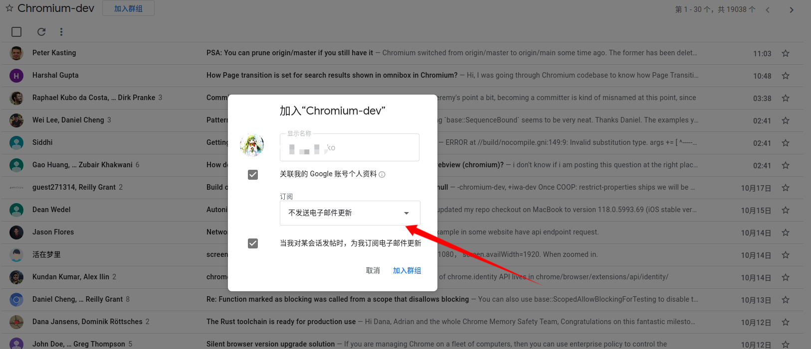
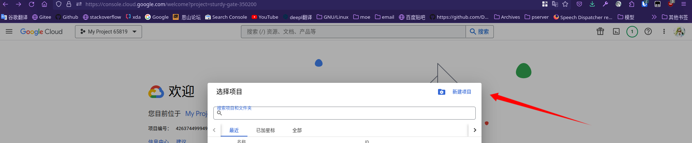

# 第 5.4 节 安装 Firefox 与 Chromium 

## 火狐浏览器

### 安装普通版本（更新频繁）

```sh
# pkg install firefox
```

或者

```sh
# cd /usr/ports/www/firefox
# make install clean
```

### 安装长期支持版本

```sh
pkg install firefox-esr
```

或者

```sh
#cd /usr/ports/www/firefox-esr/
# make install clean
```

## Chromium

Chromium 不是 chrome，但在 FreeBSD 中启动命令是 `chrome`。

```sh
# pkg install chromium 
```

或者

```sh
# cd /usr/ports/www/chromium
# make install clean
```

>**警告**
>
>要编译 Chromium，你必须拥有至少 12G 内存，或等量的交换分区 + 内存。

### 故障排除

##  Chromium 登录 Google 账号使用联机同步功能

- 首先，`Chromium` 并非 `Google Chrome`，前者是 The Chromium Project 在 [BSD 3-Clause "New" or "Revised" License](https://github.com/chromium/chromium/blob/main/LICENSE)下发布的开源与自由软件，后者是 Google LLC 的专有软件。
  
- 由于是开源产物，Chromium 与 Google Chrome 的关系约等于 AOSP 之于 Pixel UI。Chromium没有直接从Google Chrome的在线插件商店开箱即用的下载安装插件的功能，只能手动从本地安装crx。亦没有自带的Google翻译插件等等，更多两者的不同之处可以[查看这个网页](https://chromium.googlesource.com/chromium/src/+/master/docs/chromium_browser_vs_google_chrome.md)

- Chromium在 [Chromium 89](https://archlinux.org/news/chromium-losing-sync-support-in-early-march/) 发布后删除了之前自带的与Chrome同款的登录Google账号的默认api。

注: 由于 Google 并没有为 FreeBSD 分发 Chrome 的二进制，如果您需要使用Chrome除非按照本书的第三十章有关 [Linux兼容层](https://book.bsdcn.org/di-30-zhang-linux-jian-rong-ceng/di-30.4-jie-linux-jian-rong-ceng-ji-yu-archlinux-bootstrap.html) 的指南使用Linux发行版的兼容层运行 Google Chrome

进入正题，在开始获取token之前，你需要加入下列两个 Google 网上论坛（邮件列表）

- https://groups.google.com/u/0/a/chromium.org/g/google-browser-signin-testaccounts
- https://groups.google.com/a/chromium.org/forum/?fromgroups#!forum/chromium-dev\

因为我们只是需要Chrome Google API的访问权限，所以你可以关闭这两个邮件列表的消息通知。



加入 google-browser-signin-testaccounts 群组后，你可能会看到：“您无权访问此内容”之类的提示，这很正常，忽略即可。


之后，用浏览器打开 [谷歌云控制台网站](https://console.cloud.google.com/) 

注: 登录控制台时需要和上一步加入邮件列表的谷歌账户是同一个。




如果之前没有使用过这个网站创建过项目，那点击创建项目即可。


- 解决 chromium 出现未知错误时占用大量性能（加到图标的启动参数中，图标是文本文件）
```sh
chrome --disk-cache-size=0 --disable-gpu
```