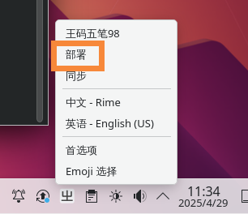
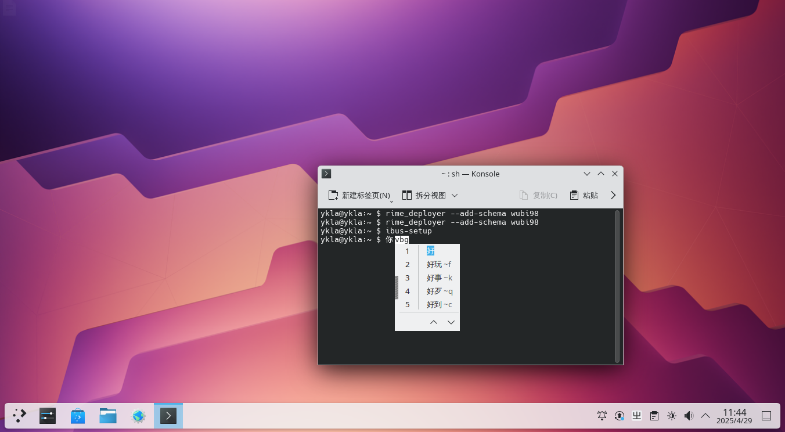
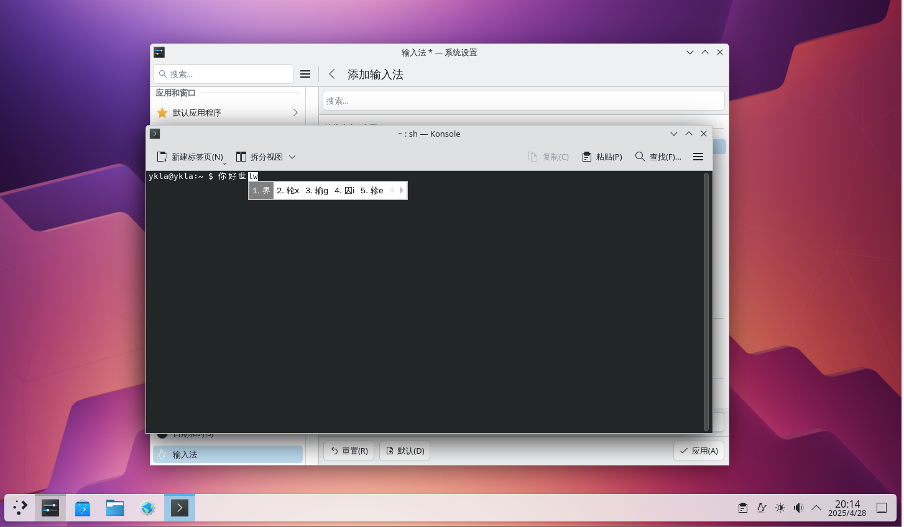
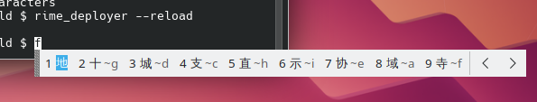

# 第 5.4 节 五笔输入法

## IBus

需要先安装配置 IBus，从略。


### 安装 Rime 输入法


```sh
# pkg install zh-ibus-rime
```

或者：

```sh
# cd /usr/ports/chinese/ibus-rime/ 
# make install clean
```

然后在终端运行初始化命令 `ibus-setup` 添加 `rime` 输入法：


### 配置 Rime 输入法

再将 98 五笔码表（`free-bsd-98wubi-tables-master/wubi86.dict.yaml`、`free-bsd-98wubi-tables-master/wubi86.schema.yaml`）复制到 `/usr/local/share/rime-date` 目录下。下载地址：[FreeBSD-98wubi-tables](https://github.com/FreeBSD-Ask/98-input/)

修改 `/usr/local/share/rime-date` 目录下 `default.yaml` 文件：打开 `default.yaml` 找到 `schema_lis`，下面第一行添加 `- schema: wubi98`（注意保持缩进），并删除其他方案，如下所示：

```sh
# Rime default settings
# encoding: utf-8

config_version: '0.40'

schema_list:
  - schema: wubi98

……其余省略……
```

保存退出重新部署 Rime 输入法即可。





## Fcitx 5


### 安装 Fcitx 5

```sh
# pkg install fcitx5 fcitx5-qt5 fcitx5-qt6 fcitx5-gtk2 fcitx5-gtk3 fcitx5-gtk4 fcitx5-configtool-qt5 fcitx5-configtool-qt6 zh-fcitx5-chinese-addons 
```

Fcitx 5 配置从略。

### Fcitx 5 配置 98 五笔

首先下载所需文件：<https://github.com/FreeBSD-Ask/98-input>。

- 把 `98五笔/98wbx.conf` 文件复制到 `/usr/local/share/fcitx5/inputmethod/` 下面；
- 把 `98五笔/fcitx-98wubi.png` 和 `org.fcitx.Fcitx5.fcitx-98wubi.png` 图标复制到 `/usr/local/share/icons/hicolor/48x48/apps/` 下面；
- 把 `98五笔/98/wbx.main.dict` 词库放到 `/usr/local/share/libime/` 下面。
- 重启 `fcitx5`，在设置中起用 98 五笔即可。




---

附录：王码 98 五笔生成 `.dict` 库方法，可用下面命令生成：

```sh
$ libime_tabledict 98wbx.txt 98wbx.main.dict
```

## 配置 Rime 使用 86 五笔

首先安装并配置好 Fcitx 5。配置从略。

```sh
# pkg ins zh-fcitx5-rime zh-rime-essay zh-rime-wubi 
```

或者：

```sh
# cd /usr/ports/chinese/rime-wubi/
# cd /usr/ports/chinese/fcitx5-rime/ && make install clean
# cd /usr/ports/chinese/rime-essay/ && make install clean
```

加入 Rime 的方法同上（Rime 输入法叫 `中州韵`），从略。

修改 `/usr/local/share/rime-data/default.yaml`，如下：

```
# Rime default settings
# encoding: utf-8

config_version: '0.40'

schema_list:
  - schema: wubi86

……其他省略……
```

## 配置文件

五笔输入法已经安装好，rime 的配置文件位置如下：

- IBus

```sh
$ cd ~/.config/ibus/rime
```

- Fcitx5

```sh
$ cd ~/.local/share/fcitx5/rime
```

### 修改候选字为 9 行

必须先 `cd` 到上述配置文件目录再进行下列操作。

#### 方法 ①

```sh
$ rime_patch default menu
page_size: 9 # 输入后回车
^D # 按 ctrl+D
patch applied.
```

其中：

- `default` 对应 `default.custom.yaml` 文件
- `menu` 对应一级选项，`page_size` 对应二级选项

重启即可。

#### 方法 ②

```sh
$ rime_patch default menu/page_size
9 # 输入后回车
^D # 按 ctrl+D
patch applied.
```

重启即可。

这里推荐使用形式二进行设置，形式一在复杂一点的设置中要求对配置文件格式有一定了解。

### 默认英文输出

```sh
$ rime_patch wubi86 'switches/@1/reset'
1
^D
patch applied.
```

这里把 patch 应用到 wubi86 输入法上（写入 `wubi86.custom.yaml`)，大部分的选项都是和输入法相关的，只有少部分选项是全局的（写入 `default.custom.yaml`）

重启即可。

### IBus 横排输出

编辑 `~/.config/ibus/rime/build/ibus_rime.yaml`，把里面的 `horizontal: flase` 改成 `horizontal: true` 重新部署输入法或重启即可。



## 故障排除

- 这个已经动到公用文件了一般只改用户配置，不然会影响全局，碰上更新容易复原。

待解决。

## 参考文献

- [请问 ibus-rime 如何设置输入框横排显示](https://github.com/rime/ibus-rime/issues/52)
- [LEOYoon-Tsaw/Rime_collections/](https://github.com/LEOYoon-Tsaw/Rime_collections/blob/master/Rime_description.md)
- [rime/CustomizationGuide](https://github.com/rime/home/wiki/CustomizationGuide)
