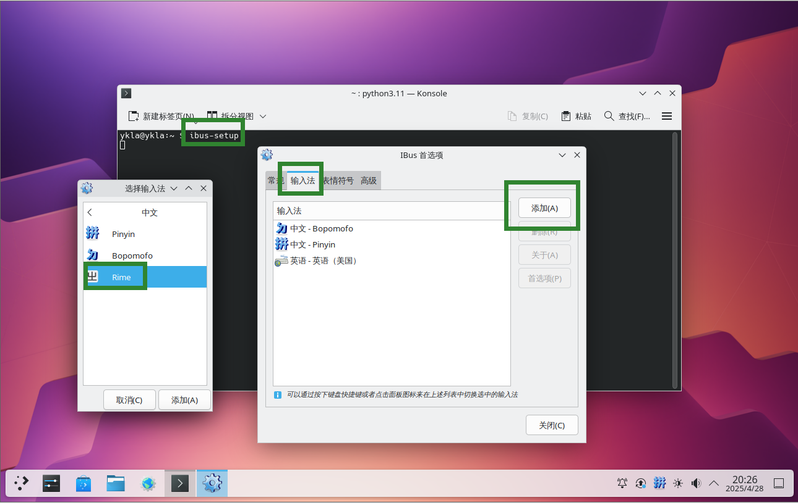
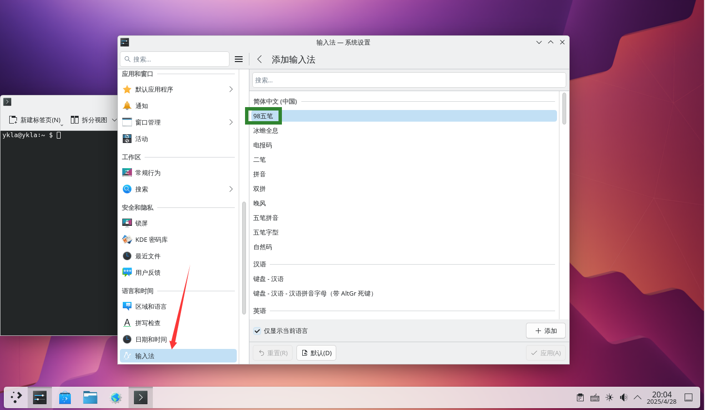

# 第 5.4 节 五笔输入法

## IBus

IBus 安装配置从略。


### 安装 Rime 输入法


```sh
# pkg install zh-ibus-rime
```

或者：

```sh
# cd /usr/ports/chinese/ibus-rime/ 
# make install clean
```

然后在终端运行初始化命令 `ibus-setup` 添加 `rime` 输入法：



### 配置 Rime 输入法

再将 98 五笔码表（`free-bsd-98wubi-tables-master/wubi86.dict.yaml`、`free-bsd-98wubi-tables-master/wubi86.schema.yaml`）复制到 `/usr/local/share/rime-date` 目录下。下载地址：[FreeBSD-98wubi-tables](https://github.com/FreeBSD-Ask/98-input/)

修改 `/usr/local/share/rime-date` 目录下 `default.yaml` 文件：打开 `default.yaml` 找到 `schema_lis`，下面第一行添加 `- schema: wubi98`（注意保持缩进），并删除其他方案，如下所示：

```ini
# Rime default settings
# encoding: utf-8

config_version: '0.40'

schema_list:
  - schema: wubi98

……其余省略……
```

保存退出重新部署 Rime 输入法即可。


## Fcitx 5

首先安装并配置好 Fcitx 5。

### 安装 Fcitx 5 及 Rime 输入法

```sh
# pkg install fcitx5 fcitx5-qt5 fcitx5-qt6 fcitx5-gtk2 fcitx5-gtk3 fcitx5-gtk4 fcitx5-configtool-qt5 fcitx5-configtool-qt6 zh-fcitx5-chinese-addons zh-rime-wubi
```

或者：

```
# cd /usr/ports/chinese/rime-wubi/
# make install clean
```

Fcitx 5 配置从略。

### 下载配置所需文件

首先下载所需文件：<https://github.com/FreeBSD-Ask/98-input>。

- 把 `98五笔/98wbx.conf` 文件复制到 `/usr/local/share/fcitx5/inputmethod/` 下面；
- 把 `98五笔/fcitx-98wubi.png` 和 `org.fcitx.Fcitx5.fcitx-98wubi.png` 图标复制到 `/usr/local/share/icons/hicolor/48x48/apps/` 下面；
- 把 `98五笔/98/wbx.main.dict` 词库放到 `/usr/local/share/libime/` 下面。
- 重启 `fcitx5`，在设置中起用 98 五笔即可。




---

附录：王码 98 五笔生成 `.dict` 库方法，可用下面命令生成：

```sh
$ libime_tabledict 98wbx.txt 98wbx.main.dict
```

## 配置文件目录

五笔输入法已经安装好，rime 的配置文件位置如下：

```sh
$ cd ~/.config/ibus/rime # 对应 ibus
$ cd ~/.local/share/fcitx5/rime # 对应 fcitx5
```
