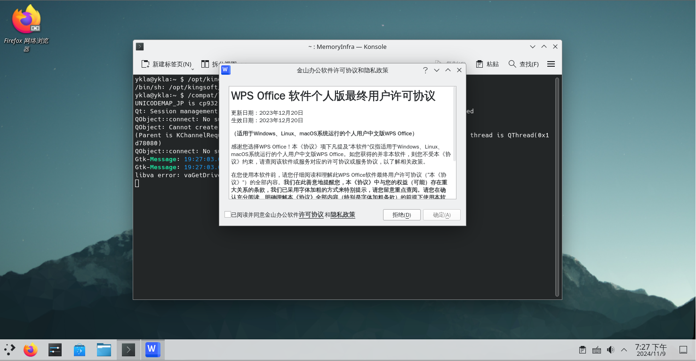

# 第 5.5 节 FreeBSD 安装金山 WPS（Linux 版）

>**警告**
>
>请勿使用 ports 中的金山 WPS，因为无人更新。推荐自行构建兼容层安装使用。

## 基于 RockyLinux 兼容层（FreeBSD Port）

>**注意**
>
>请先参照本书其他章节先行安装 RockyLinux 兼容层（FreeBSD Port）

### 安装 rpm 工具

```sh
# pkg install rpm4
```

或者：

```
# cd /usr/ports/archivers/rpm4/ 
# make install clean
```

### 下载安装金山 WPS


#### 下载金山 WPS

官方地址：[WPS Office for Linux](https://linux.wps.cn/)


<https://wps-linux-personal.wpscdn.cn/wps/download/ep/Linux2023/17900/wps-office-12.1.0.17900-1.x86_64.rpm?t=1731150867&k=8e9446b92a6e5b727047ec256307be78> 

请自行获取有效链接，我使用浏览器下载。

>**备注**
>
>这个链接有问题，我不知道怎么使用 fetch 下载，wget 也不行。如果你知道怎么解决，请提交 PR 或 issue。

#### 安装金山 WPS

```sh
root@ykla:/ # cd /compat/linux/
root@ykla:/compat/linux #  rpm2cpio < /home/ykla/Downloads/wps-office-12.1.0.17900-1.x86_64.rpm  | cpio -id  # 注意路径要换成你自己的
```


### 解决依赖问题

查看依赖：

```bash
root@ykla:/compat/linux # /compat/linux/usr/bin/bash # 切换到兼容层的 shell
bash-5.1# ldd /opt/kingsoft/wps-office/office6/wps
	linux-vdso.so.1 (0x00007fffffffe000)
	libdl.so.2 => /lib64/libdl.so.2 (0x000000080105c000)
	libpthread.so.0 => /lib64/libpthread.so.0 (0x0000000801061000)
	libtcmalloc_minimal.so.4 => /opt/kingsoft/wps-office/office6/libtcmalloc_minimal.so.4 (0x0000000801600000)
	liblibsafec.so => /opt/kingsoft/wps-office/office6/liblibsafec.so (0x0000000801066000)
	libstdc++.so.6 => /opt/kingsoft/wps-office/office6/libstdc++.so.6 (0x0000000801a00000)
	libm.so.6 => /lib64/libm.so.6 (0x0000000801083000)
	libgcc_s.so.1 => /lib64/libgcc_s.so.1 (0x000000080115e000)
	libc.so.6 => /lib64/libc.so.6 (0x0000000801e00000)
	/lib64/ld-linux-x86-64.so.2 (0x0000000001021000)
	librt.so.1 => /lib64/librt.so.1 (0x0000000801179000)
```

可以看到，依赖齐全。

### 运行金山 WPS


```bash
ykla@ykla:~ $ /compat/linux//opt/kingsoft/wps-office/office6/wps
```




输入法正常。


## 基于 ArchLinux 兼容层

```sh
# fetch http://book.bsdcn.org/arch.sh #下载脚本构建兼容层
# sh arch.sh #运行脚本
# chroot /compat/arch/ /bin/bash #进入 Arch 兼容层
# passwd #为 Arch 的 root 设置一个密码
# passwd test #为 Arch 的 test 设置一个密码，脚本已经创建过该用户了！
```

新开一个终端，输入 `reboot` 重启 FreeBSD，否则设置的密码可能会不识别。

```sh
# chroot /compat/arch/ /bin/bash #进入 Arch 兼容层
# su test # 此时位于 Arch 兼容层！切换到普通用户才能使用 aur
```

开始安装：

```sh
$ yay -S wps-office-cn ttf-wps-fonts wps-office-mui-zh-cn # 此时位于 Arch 兼容层！此时用户为 test
AUR Explicit (2): wps-office-cn-11.1.0.11698-1, ttf-wps-fonts-1.0-5
:: (1/1) Downloaded PKGBUILD: ttf-wps-fonts
  2 wps-office-cn                            (Build Files Exist)
  1 ttf-wps-fonts                            (Build Files Exist)
==> Packages to cleanBuild?
==> [N]one [A]ll [Ab]ort [I]nstalled [No]tInstalled or (1 2 3, 1-3, ^4)
==> 1  #这里输入 1 回车
:: Deleting (1/1): /home/test/.cache/yay/ttf-wps-fonts
HEAD is now at ba3222c Add upstream URL
  2 wps-office-cn                            (Build Files Exist)
  1 ttf-wps-fonts                            (Build Files Exist)
==> Diffs to show?
==> [N]one [A]ll [Ab]ort [I]nstalled [No]tInstalled or (1 2 3, 1-3, ^4)
==> 1 #这里输入 1 回车
diff --git /home/test/.cache/yay/ttf-wps-fonts/.gitignore /home/test/.cache/yay/ttf-wps-fonts/.gitignore
new file mode 100644
index 0000000..12be320
--- /dev/null
+++ /home/test/.cache/yay/ttf-wps-fonts/.gitignore
@@ -0,0 +1,5 @@
+*.pkg.tar.xz
+*.src.tar.gz
+src/
+pkg/
+
diff --git /home/test/.cache/yay/ttf-wps-fonts/PKGBUILD /home/test/.cache/yay/ttf-wps-fonts/PKGBUILD
new file mode 100644
index 0000000..21a51bb
--- /dev/null
…………
+url="https://github.com/IamDH4/ttf-wps-fonts"
+source=("$pkgname.zip::https://github.com/IamDH4/$pkgname/archive/master.zip"
+        "license.txt")
+sha1sums=('cbc7d2c733b5d3461f3c2200756d4efce9e951d5'
+          '6134a63d775540588ce48884e8cdc47d4a9a62f3')
+
#这里输入 q
:: Proceed with install? [Y/n] y #这里输入 y 回车
==> Making package: ttf-wps-fonts 1.0-5 (Thu Jul  6 06:23:35 2023)
…………
==> Leaving fakeroot environment.
==> Finished making: wps-office-cn 11.1.0.11698-1 (Thu Jul  6 06:37:32 2023)
==> Cleaning up...

We trust you have received the usual lecture from the local System
Administrator. It usually boils down to these three things:

    #1) Respect the privacy of others.
    #2) Think before you type.
    #3) With great power comes great responsibility.

For security reasons, the password you type will not be visible.

[sudo] password for test: # 这里输入 test 的密码。注意：如果密码正确但是反复提示密码错误，请你 reboot 重启 FreeBSD 系统重新执行以上操作。

Packages (2) ttf-wps-fonts-1.0-5  wps-office-cn-11.1.0.11698-1

Total Installed Size:  1370.17 MiB

:: Proceed with installation? [Y/n] y # 这里输入 y 确认安装
(2/2) checking keys in keyring                                      [######################################] 100%
(2/2) checking package integrity                                    [######################################] 100%
…………
(2/2) installing ttf-wps-fonts                                      [######################################] 100%
:: Running post-transaction hooks...
(1/4) Arming ConditionNeedsUpdate...
(2/4) Updating fontconfig cache...
(3/4) Updating the desktop file MIME type cache...
(4/4) Updating X fontdir indices...
[test@ykla ~]$ exit
# pacman -S libxcomposite #安装缺少的依赖
```

安装完毕。

Fcitx5 输入法没反应。待测试。如你知道怎么做，请告诉我们。

## 基于 Ubuntu 兼容层

```sh
# fetch http://book.bsdcn.org/ubuntu.sh #下载脚本构建兼容层
# sh ubuntu.sh #运行脚本
# chroot /compat/ubuntu/ /bin/bash #进入 Ubuntu 兼容层
```

```sh
# apt install  bsdmainutils xdg-utils libxslt1.1 libqt5gui5 xcb # 安装依赖包
# wget https://wps-linux-personal.wpscdn.cn/wps/download/ep/Linux2019/11698/wps-office_11.1.0.11698_amd64.deb
# apt install ./wps-office_11.1.0.11698_amd64.deb
```

安装完毕。

>**注意**
>
>写作本文时，Fcitx5 输入法没反应。待测试。如你知道怎么做，请告诉我们。

### 故障排除

- 启动没反应

```sh
# ldd /usr/lib/office6/wps
```

缺啥补啥。

需要 root 才能启动。

- KDE5 下 WPS 可能会无法启动。

因为 WPS 启动文件调用的是 bash shell。所以安装 bash 后就可以正常启动了：

```sh
# pkg install bash
```

或者

```
# cd /usr/ports/shells/bash/
# make install clean
```
