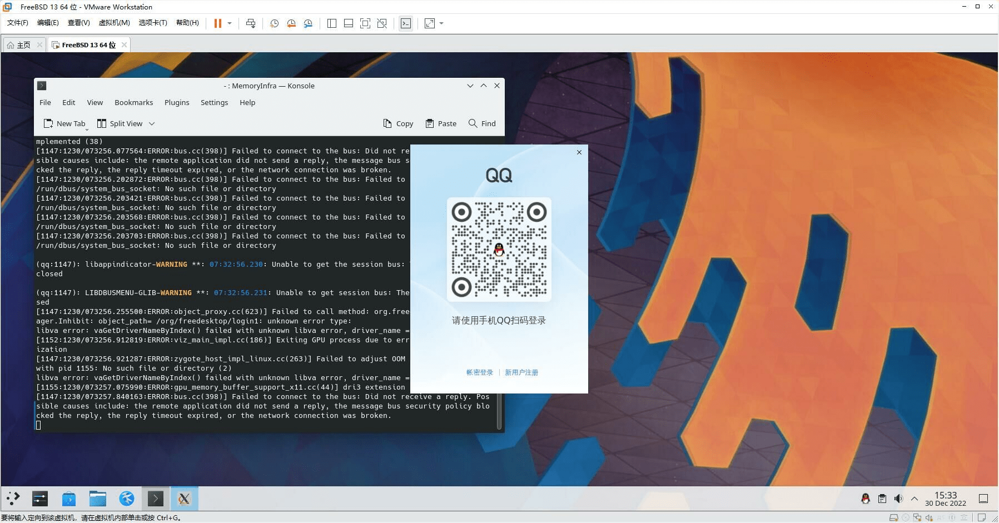

# 第 5.7 节 安装 QQ

## Linux QQ 3.x（electron）【可选：基于 ArchLinux 兼容层】

请看第 30 章 Linux 兼容层的 ArchLinux 兼容层部分。

```shell-session
# fetch http://book.bsdcn.org/arch.sh #下载脚本构建兼容层
# sh arch.sh #运行脚本
# chroot /compat/arch/ /bin/bash #进入 Arch 兼容层
# passwd #为 Arch 的 root 设置一个密码
# passwd test #为 Arch 的 test 设置一个密码，上述脚本已经创建过该用户了！不设置密码无法正常使用 aur。

```

新开一个终端，输入 `reboot` 重启 FreeBSD，否则设置的密码可能会不识别。

```shell-session
# chroot /compat/arch/ /bin/bash #进入 Arch 兼容层
# su test # 此时位于 Arch 兼容层！切换到普通用户才能使用 aur
$ yay -S linuxqq # 此时位于 Arch 兼容层！此时用户为 test
# exit # 此时位于 Arch 兼容层！此时用户恢复为 root
```

```shell-session
# export LANG=zh_CN.UTF-8 # 此时位于 Arch 兼容层！
# export LC_ALL=zh_CN.UTF-8 # 此时位于 Arch 兼容层！如果不添加环境变量，则中文输入法无法使用。如果设置失败请重启一次 FreeBSD 主机。此时位于 Arch 兼容层！
# /opt/QQ/qq --no-sandbox --in-process-gpu  # 此时位于 Arch 兼容层！
```

## Linux QQ 3.x（Electron）【可选：基于 Ubuntu 兼容层】

> 请先安装 Ubuntu 兼容层，具体请看第 30 章。

```shell-session
# chroot /compat/ubuntu/ /bin/bash #进入 Ubuntu 兼容层
# wget https://dldir1.qq.com/qqfile/qq/QQNT/ad5b5393/linuxqq_3.1.2-13107_amd64.deb #此时位于 Ubuntu 兼容层
```

```shell-session
# apt install ./linuxqq_3.1.0-9572_amd64.deb  #此时位于 Ubuntu 兼容层
```

安装依赖文件和字体：

```shell-session
# apt install libgbm-dev libasound2-dev #此时位于 Ubuntu 兼容层
# ldconfig #此时位于 Ubuntu 兼容层
```

启动 QQ：

```shell-session
# export LANG=zh_CN.UTF-8 # 此时位于 Ubuntu 兼容层
# export LC_ALL=zh_CN.UTF-8 # 如果不添加则中文输入法无法使用。此时位于 Ubuntu 兼容层
# /bin/qq --no-sandbox --in-process-gpu #此时位于 Ubuntu 兼容层
```



> **注意**
>
> **如果退出后进不去，请加参数 `--in-process-gpu` 执行之即可，即 `/bin/qq  --no-sandbox --in-process-gpu`**。

