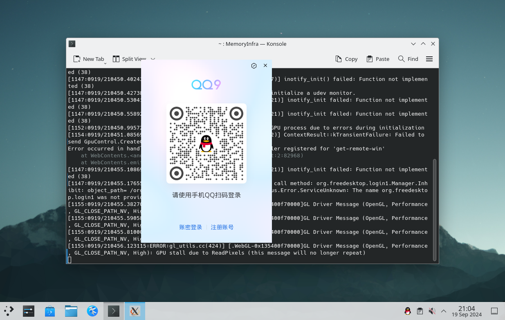

# 第 5.7 节 安装 QQ


## Linux QQ 3.x（electron）【可选：基于 RockyLinux 兼容层（FreeBSD Port）】

```sh
root@ykla:/ # fetch https://dldir1.qq.com/qqfile/qq/QQNT/Linux/QQ_3.2.12_240919_x86_64_01.rpm
```

```sh
root@ykla:/compat/linux # pkg install archivers/rpm4
root@ykla:/compat/linux # rpm2cpio < /QQ_3.2.12_240919_x86_64_01.rpm  | cpio -id
./usr/share/icons/hicolor/512x512/apps/qq.png: Cannot extract through symlink usr/share/icons/hicolor/512x512/apps/qq.png
1040641 blocks
```

```sh
root@ykla:/compat/linux #  /compat/linux/usr/bin/bash
bash-5.1# ldd /opt/QQ/qq 
	linux-vdso.so.1 (0x00007fffffffe000)
	libffmpeg.so => /opt/QQ/libffmpeg.so (0x000000080c000000)
	libdl.so.2 => /lib64/libdl.so.2 (0x000000080105c000)
	libpthread.so.0 => /lib64/libpthread.so.0 (0x0000000801061000)
	libglib-2.0.so.0 => /lib64/libglib-2.0.so.0 (0x0000000801066000)
	libgobject-2.0.so.0 => /lib64/libgobject-2.0.so.0 (0x00000008011a1000)
	libgio-2.0.so.0 => /lib64/libgio-2.0.so.0 (0x000000080c35f000)
	libnss3.so => /lib64/libnss3.so (0x000000080bebd000)
	libnssutil3.so => /lib64/libnssutil3.so (0x000000080c535000)
	libsmime3.so => /lib64/libsmime3.so (0x000000080c569000)
	libnspr4.so => /lib64/libnspr4.so (0x000000080c594000)
	libdbus-1.so.3 => /lib64/libdbus-1.so.3 (0x000000080c5d7000)
	libatk-1.0.so.0 => /lib64/libatk-1.0.so.0 (0x000000080c62a000)
	libatk-bridge-2.0.so.0 => /lib64/libatk-bridge-2.0.so.0 (0x000000080c653000)
	libcups.so.2 => /lib64/libcups.so.2 (0x000000080c68c000)
	libgtk-3.so.0 => /lib64/libgtk-3.so.0 (0x000000080c800000)
	libpango-1.0.so.0 => /lib64/libpango-1.0.so.0 (0x000000080c72b000)
	libcairo.so.2 => /lib64/libcairo.so.2 (0x000000080d013000)
	libX11.so.6 => /lib64/libX11.so.6 (0x000000080d12d000)
	libXcomposite.so.1 => /lib64/libXcomposite.so.1 (0x000000080bff4000)
	libXdamage.so.1 => /lib64/libXdamage.so.1 (0x000000080bff9000)
	libXext.so.6 => /lib64/libXext.so.6 (0x000000080c77f000)
	libXfixes.so.3 => /lib64/libXfixes.so.3 (0x000000080c794000)
	libXrandr.so.2 => /lib64/libXrandr.so.2 (0x000000080c79d000)
	libgbm.so.1 => /lib64/libgbm.so.1 (0x000000080c7aa000)
	libdrm.so.2 => /lib64/libdrm.so.2 (0x000000080c7bc000)
	libexpat.so.1 => /lib64/libexpat.so.1 (0x000000080d275000)
	libxcb.so.1 => /lib64/libxcb.so.1 (0x000000080c7d3000)
	libxkbcommon.so.0 => /lib64/libxkbcommon.so.0 (0x000000080d2a6000)
	libasound.so.2 => /lib64/libasound.so.2 (0x000000080d2eb000)
	libatspi.so.0 => /lib64/libatspi.so.0 (0x000000080d3fe000)
	libm.so.6 => /lib64/libm.so.6 (0x000000080d43b000)
	libgcc_s.so.1 => /lib64/libgcc_s.so.1 (0x000000080d516000)
	libc.so.6 => /lib64/libc.so.6 (0x000000080d600000)
	/lib64/ld-linux-x86-64.so.2 (0x0000000001021000)
	libpcre.so.1 => /lib64/libpcre.so.1 (0x000000080d531000)
	libffi.so.8 => /lib64/libffi.so.8 (0x000000080d5a9000)
	libgmodule-2.0.so.0 => /lib64/libgmodule-2.0.so.0 (0x000000080d5b5000)
	libz.so.1 => /lib64/libz.so.1 (0x000000080d5bd000)
	libmount.so.1 => /lib64/libmount.so.1 (0x000000080d809000)
	libselinux.so.1 => /lib64/libselinux.so.1 (0x000000080d850000)
	libplc4.so => /lib64/libplc4.so (0x000000080d5d7000)
	libplds4.so => /lib64/libplds4.so (0x000000080d5de000)
	libsystemd.so.0 => /lib64/libsystemd.so.0 (0x000000080d87d000)
	libgssapi_krb5.so.2 => /lib64/libgssapi_krb5.so.2 (0x000000080d95a000)
	libavahi-common.so.3 => /lib64/libavahi-common.so.3 (0x000000080d5e5000)
	libavahi-client.so.3 => /lib64/libavahi-client.so.3 (0x000000080d9b1000)
	libgnutls.so.30 => /lib64/libgnutls.so.30 (0x000000080da00000)
	libgdk-3.so.0 => /lib64/libgdk-3.so.0 (0x000000080dc36000)
	libpangocairo-1.0.so.0 => /lib64/libpangocairo-1.0.so.0 (0x000000080d9c6000)
	libharfbuzz.so.0 => /lib64/libharfbuzz.so.0 (0x000000080dd2e000)
	libpangoft2-1.0.so.0 => /lib64/libpangoft2-1.0.so.0 (0x000000080d9d8000)
	libfontconfig.so.1 => /lib64/libfontconfig.so.1 (0x000000080ddfd000)
	libfribidi.so.0 => /lib64/libfribidi.so.0 (0x000000080de4c000)
	libcairo-gobject.so.2 => /lib64/libcairo-gobject.so.2 (0x000000080d9f2000)
	libgdk_pixbuf-2.0.so.0 => /lib64/libgdk_pixbuf-2.0.so.0 (0x000000080de6a000)
	libepoxy.so.0 => /lib64/libepoxy.so.0 (0x000000080de9a000)
	libXi.so.6 => /lib64/libXi.so.6 (0x000000080dfcf000)
	libtracker-sparql-3.0.so.0 => /lib64/libtracker-sparql-3.0.so.0 (0x000000080dfe1000)
	libwayland-client.so.0 => /lib64/libwayland-client.so.0 (0x000000080e0a8000)
	libthai.so.0 => /lib64/libthai.so.0 (0x000000080e0ba000)
	libpixman-1.so.0 => /lib64/libpixman-1.so.0 (0x000000080e0c5000)
	libfreetype.so.6 => /lib64/libfreetype.so.6 (0x000000080e171000)
	libpng16.so.16 => /lib64/libpng16.so.16 (0x000000080e235000)
	libxcb-shm.so.0 => /lib64/libxcb-shm.so.0 (0x000000080d5f9000)
	libxcb-render.so.0 => /lib64/libxcb-render.so.0 (0x000000080e26c000)
	libXrender.so.1 => /lib64/libXrender.so.1 (0x000000080e27c000)
	libwayland-server.so.0 => /lib64/libwayland-server.so.0 (0x000000080e289000)
	libxcb-randr.so.0 => /lib64/libxcb-randr.so.0 (0x000000080e29f000)
	libXau.so.6 => /lib64/libXau.so.6 (0x000000080e2b2000)
	libblkid.so.1 => /lib64/libblkid.so.1 (0x000000080e2b8000)
	libpcre2-8.so.0 => /lib64/libpcre2-8.so.0 (0x000000080e2f0000)
	libcap.so.2 => /lib64/libcap.so.2 (0x000000080e38c000)
	libgcrypt.so.20 => /lib64/libgcrypt.so.20 (0x000000080e396000)
	liblzma.so.5 => /lib64/liblzma.so.5 (0x000000080e4cf000)
	libzstd.so.1 => /lib64/libzstd.so.1 (0x000000080e4fb000)
	liblz4.so.1 => /lib64/liblz4.so.1 (0x000000080e5d2000)
	libkrb5.so.3 => /lib64/libkrb5.so.3 (0x000000080e5f6000)
	libk5crypto.so.3 => /lib64/libk5crypto.so.3 (0x000000080e6d1000)
	libcom_err.so.2 => /lib64/libcom_err.so.2 (0x000000080e6ec000)
	libkrb5support.so.0 => /lib64/libkrb5support.so.0 (0x000000080e6f3000)
	libkeyutils.so.1 => /lib64/libkeyutils.so.1 (0x000000080e704000)
	libcrypto.so.3 => /lib64/libcrypto.so.3 (0x000000080e800000)
	libresolv.so.2 => /lib64/libresolv.so.2 (0x000000080e70b000)
	libp11-kit.so.0 => /lib64/libp11-kit.so.0 (0x000000080ec33000)
	libidn2.so.0 => /lib64/libidn2.so.0 (0x000000080e721000)
	libunistring.so.2 => /lib64/libunistring.so.2 (0x000000080edca000)
	libtasn1.so.6 => /lib64/libtasn1.so.6 (0x000000080e742000)
	libnettle.so.8 => /lib64/libnettle.so.8 (0x000000080e75a000)
	libhogweed.so.6 => /lib64/libhogweed.so.6 (0x000000080ef4f000)
	libwayland-cursor.so.0 => /lib64/libwayland-cursor.so.0 (0x000000080e7b1000)
	libwayland-egl.so.1 => /lib64/libwayland-egl.so.1 (0x000000080e7bd000)
	libXcursor.so.1 => /lib64/libXcursor.so.1 (0x000000080e7c2000)
	libXinerama.so.1 => /lib64/libXinerama.so.1 (0x000000080e7cf000)
	libgraphite2.so.3 => /lib64/libgraphite2.so.3 (0x000000080e7d4000)
	libxml2.so.2 => /lib64/libxml2.so.2 (0x000000080efe7000)
	libjpeg.so.62 => /lib64/libjpeg.so.62 (0x000000080f170000)
	libstemmer.so.0 => /lib64/libstemmer.so.0 (0x000000080f1f1000)
	libjson-glib-1.0.so.0 => /lib64/libjson-glib-1.0.so.0 (0x000000080f246000)
	libicuuc.so.67 => /lib64/libicuuc.so.67 (0x000000080f273000)
	libicui18n.so.67 => /lib64/libicui18n.so.67 (0x000000080f600000)
	libsqlite3.so.0 => /lib64/libsqlite3.so.0 (0x000000080f45e000)
	libdatrie.so.1 => /lib64/libdatrie.so.1 (0x000000080f596000)
	libbz2.so.1 => /lib64/libbz2.so.1 (0x000000080f59f000)
	libbrotlidec.so.1 => /lib64/libbrotlidec.so.1 (0x000000080f5b2000)
	libgpg-error.so.0 => /lib64/libgpg-error.so.0 (0x000000080f5c0000)
	libicudata.so.67 => /lib64/libicudata.so.67 (0x000000080fa00000)
	libstdc++.so.6 => /lib64/libstdc++.so.6 (0x0000000811600000)
	libbrotlicommon.so.1 => /lib64/libbrotlicommon.so.1 (0x000000080f906000)
```

可以看到 `ldd` 正常。




## Linux QQ 3.x（electron）【可选：基于 ArchLinux 兼容层】

请看第 30 章 Linux 兼容层的 ArchLinux 兼容层部分。  

```sh
# 自行将脚本创建为 arch.sh，请参看兼容层相关章节。
# sh arch.sh #运行脚本
# chroot /compat/arch/ /bin/bash #进入 Arch 兼容层
# passwd #为 Arch 的 root 设置一个密码
# passwd test #为 Arch 的 test 设置一个密码，上述脚本已经创建过该用户了！不设置密码无法正常使用 aur。

```

新开一个终端，输入 `reboot` 重启 FreeBSD，否则设置的密码可能会不识别。

```sh
# chroot /compat/arch/ /bin/bash #进入 Arch 兼容层
# su test # 此时位于 Arch 兼容层！切换到普通用户才能使用 aur
$ yay -S linuxqq # 此时位于 Arch 兼容层！此时用户为 test
# exit # 此时位于 Arch 兼容层！此时用户恢复为 root
```

```sh
# export LANG=zh_CN.UTF-8 # 此时位于 Arch 兼容层！
# export LC_ALL=zh_CN.UTF-8 # 此时位于 Arch 兼容层！如果不添加环境变量，则中文输入法无法使用。如果设置失败请重启一次 FreeBSD 主机。此时位于 Arch 兼容层！
# /opt/QQ/qq --no-sandbox --in-process-gpu  # 此时位于 Arch 兼容层！
```

## Linux QQ 3.x（Electron）【可选：基于 Ubuntu 兼容层】

> 请先安装 Ubuntu 兼容层，具体请看第 30 章。

```sh
# chroot /compat/ubuntu/ /bin/bash #进入 Ubuntu 兼容层
# wget https://dldir1.qq.com/qqfile/qq/QQNT/ad5b5393/linuxqq_3.1.2-13107_amd64.deb #此时位于 Ubuntu 兼容层
```

```sh
# apt install ./linuxqq_3.1.0-9572_amd64.deb  #此时位于 Ubuntu 兼容层
```

安装依赖文件和字体：

```sh
# apt install libgbm-dev libasound2-dev #此时位于 Ubuntu 兼容层
# ldconfig #此时位于 Ubuntu 兼容层
```
安装中文字体：用包管理器查找中文字体，例如 wqy

启动 QQ：

```sh
# export LANG=zh_CN.UTF-8 # 此时位于 Ubuntu 兼容层
# export LC_ALL=zh_CN.UTF-8 # 如果不添加则中文输入法无法使用。此时位于 Ubuntu 兼容层
# /bin/qq --no-sandbox --in-process-gpu #此时位于 Ubuntu 兼容层
```

> **注意**
>
> 如果你双网卡，例如一个有线一个无线，打开QQ以后可能会遇到网络错误的提示，需要给你的空闲网卡随便指派一个IP.
> 参见<a href="https://book.bsdcn.org/di-21-zhang-linux-jian-rong-ceng/di-21.13-jie-linux-jian-rong-ceng-gu-zhang-pai-chu-yu-pei-zhi">Linux兼容层故障排除</a><br>
> **如果退出后进不去，请加参数 `--in-process-gpu` 执行之即可，即 `/bin/qq  --no-sandbox --in-process-gpu`**。


