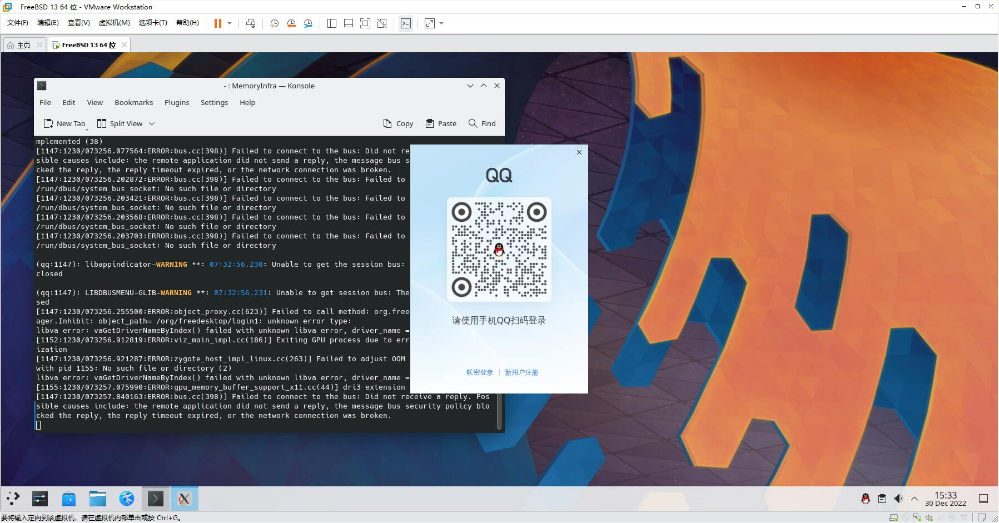

# 第5.7节 安装 QQ

## Linux QQ 3.x（electron）

> 请先安装 CentOS 兼容层及 Ubuntu 兼容层，具体请看 第五章 第五节。

```
# chroot /compat/ubuntu/ /bin/bash #进入 Ubuntu 兼容层
# wget https://dldir1.qq.com/qqfile/qq/QQNT/64bd2578/linuxqq_3.0.0-565_amd64.deb #此时位于 Ubuntu 兼容层
```

```
# apt install ./linuxqq_3.0.0-565_amd64.deb  #此时位于 Ubuntu 兼容层
```

安装依赖文件和字体：

```
# apt install libgbm-dev libasound2-dev webcamoid-plugins fonts-wqy-microhei  fonts-wqy-zenhei #此时位于 Ubuntu 兼容层
# cp  /usr/lib/x86_64-linux-gnu/avkys/submodules/MultiSink/libffmpeg.so /usr/lib  #此时位于 Ubuntu 兼容层
# ldconfig
```

启动 QQ：

```
# /usr/bin/qq
```




> **注意**
>
> 一旦彻底退出 QQ，那么在本次开机中就再也进不去了。除非重启系统，原因未知，若有人知道请提交报告。
>
> 只能输入英文，中文输入法暂不可用，原因未知，若有人知道请提交报告。（我的环境是 X11 KDE5 FBSD-13.1-RELEASE Fcitx5 ）

## Linux QQ 2.x （GTK2.0）

### **安装 Linux 兼容层：**

> 请先安装 Linux 兼容层，具体请看 第五章 第五节。

```
# pkg install linux-c7-gtk2 linux-c7-libxkbcommon
```

### 下载 Linux QQ

```
# mkdir /home/work
# fetch https://down.qq.com/qqweb/LinuxQQ/linuxqq_2.0.0-b2-1089_x86_64.rpm
```

安装 Linux QQ：

```
# pkg install archivers/rpm4
# cd /compat/linux
# rpm2cpio < /home/work/linuxqq_2.0.0-b2-1089_x86_64.rpm | cpio -id
```

### 下载并安装 Linux QQ 所需依赖

由于未知原因，安装的 Linux QQ 无法输入，需要安装以下依赖才可以输入文字，但是只摸索了 Fcitx 输入法框架下的依赖。

```
# cd /home/work
# fetch http://mirror.centos.org/centos/7/os/x86_64/Packages/gtk2-immodule-xim-2.24.31-1.el7.x86_64.rpm
# fetch https://download-ib01.fedoraproject.org/pub/epel/7/x86_64/Packages/f/fcitx-gtk2-4.2.9.6-1.el7.x86_64.rpm
# fetch https://download-ib01.fedoraproject.org/pub/epel/7/x86_64/Packages/f/fcitx-4.2.9.6-1.el7.x86_64.rpm
# fetch https://download-ib01.fedoraproject.org/pub/epel/7/x86_64/Packages/f/fcitx-libs-4.2.9.6-1.el7.x86_64.rpm
```

然后分别安装以上 4 个包：

```
# cd /compat/linux
# rpm2cpio < /home/work/gtk2-immodule-xim-2.24.31-1.el7.x86_64.rpm | cpio -id
# rpm2cpio < /home/work/fcitx-gtk2-4.2.9.6-1.el7.x86_64.rpm | cpio -id
# rpm2cpio < /home/work/fcitx-4.2.9.6-1.el7.x86_64.rpm | cpio -id
# rpm2cpio < /home/work/fcitx-libs-4.2.9.6-1.el7.x86_64.rpm | cpio -id
```

~~注意：为了方便境内 FreeBSD 用户，可以使用境内的 gitee 同步下载以上 4 个文件；~~

> 经验与教训：
>
> **请远离境内诸如 gitee 等无良企业。**

Github：

[https://github.com/ykla/FreeBSD-Linux-QQ](https://github.com/ykla/FreeBSD-Linux-QQ)

### 刷新 gtk 缓存

`# /compat/linux/usr/bin/gtk-query-immodules-2.0-64 --update-cache`

### 运行 Linux QQ

`$ /compat/linux/usr/local/bin/qq`
