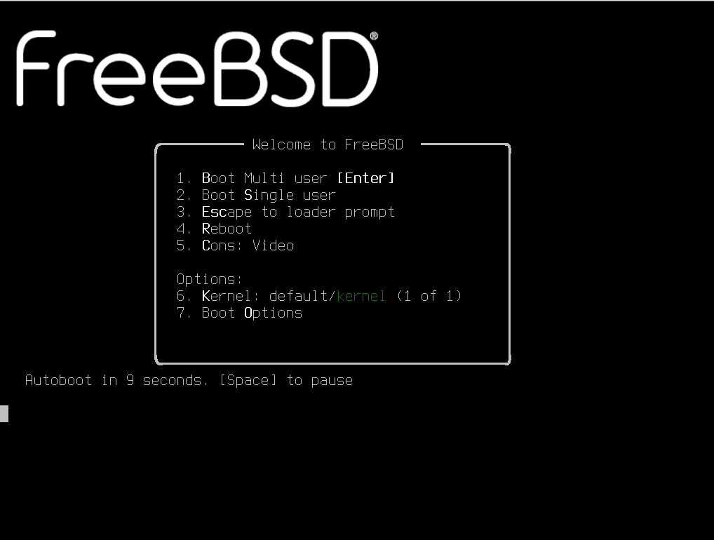

# 5.1 启动引导器及配置文件（loader.conf）

FreeBSD 的启动过程分为三个核心阶段：固件初始化（BIOS 或 UEFI）→ boot0/boot1 链式引导 → loader 引导，其中 loader 阶段通过 loader.conf 实现参数化配置。本节解析启动流程并逐一说明 loader.conf 的关键配置项。

## FreeBSD 启动过程概述

FreeBSD 的启动过程是一个多阶段的有序流程，从硬件加电自检（POST）开始，经过固件初始化、引导加载程序执行、内核加载，最终到达用户空间初始化。loader 是启动过程的最终阶段。

FreeBSD 的启动过程可分为以下阶段：

1. **POST（加电自检）**：计算机加电后，CPU 首先执行固件（BIOS 或 UEFI）中的初始化代码，完成硬件自检和基本设备配置。

2. **固件引导阶段**：POST 完成后，固件根据启动顺序定位启动设备。

- 在 BIOS 模式下，固件读取磁盘主引导记录（MBR）或卷引导记录（VBR）中的引导代码；
- 在 UEFI 模式下，固件从 EFI 系统分区（ESP）加载 EFI 应用程序。FreeBSD 的 UEFI 引导程序位于 **/EFI/freebsd/loader.efi**。

3. **引导加载程序阶段（Boot Loader）**：FreeBSD 的引导加载程序分为三个阶段（在 BIOS 模式下为 `boot0`/`boot1`/`loader`，在 UEFI 模式下为 `loader.efi`）。最终阶段的 `loader(8)` 是一个交互式引导加载程序，它读取 **/boot/loader.conf** 配置文件，加载内核和模块，然后将控制权转移给内核。

4. **内核初始化阶段**：内核被加载后，首先进行硬件探测和设备初始化，然后挂载根文件系统，启动 `init(8)` 进程。`init(8)` 始终是内核启动的第一个用户空间进程，其进程 ID（PID）始终为 1。

`init(8)` 运行级别参数：

| 参数 | 信号 | 动作 |
| ---- | ---- | ---- |
| `0` | SIGUSR1 | 停机 |
| `0` | SIGUSR2 | 停机并关闭电源（需硬件支持） |
| `0` | SIGWINCH | 停机、关闭电源再重新通电（电源循环，需硬件支持） |
| `1` | SIGTERM | 进入单用户模式 |
| `6` | SIGINT | 重新启动系统 |
| `c` | SIGTSTP | 阻止进一步登录 |
| `q` | SIGHUP | 重新扫描 `ttys(5)` 文件 |

> **注意**：
>
> 若安全级别启用过早（大于 1），可能妨碍 `fsck(8)` 修复不一致的文件系统。建议在 **/etc/rc** 末尾设置安全级别。在 Jail 中运行 `init(8)` 时，安全级别为每 Jail 独立设置，不影响宿主系统。

5. **用户空间初始化阶段**：`init(8)` 读取 **/etc/rc** 脚本，该脚本根据 **/etc/rc.conf** 的配置启动系统服务，最终将系统带入多用户模式。

## FreeBSD 在传统引导（BIOS + MBR）下的启动过程

### 引导管理器（Boot Manager，阶段 0）

`boot0cfg` 仅适用于 BIOS/MBR 启动模式，不适用于 UEFI 系统（UEFI 使用 `efibootmgr(8)`）。

MBR 中的引导管理器代码有时被称为启动过程的阶段 0。在默认情况下，FreeBSD 使用 boot0 引导管理器。

FreeBSD 安装程序安装的 MBR 基于 **/boot/boot0**。由于 MBR 末尾的分区表和 0x55AA 标识符的限制，boot0 的大小和功能被限制在 446 字节。

> **技巧**
>
> 在 MBR 的末端还有一个值为 0x55AA、大小为两个字节的扇区标记（Sector Marker）的签名字段。该字段通常还标注了扩展启动记录（EBR, Extended Boot Record）和启动扇区（boot sector）的结束。

如果安装了 boot0 和多个操作系统，启动时将显示类似以下的消息：

```sh
F1 Win
F2 FreeBSD

Default: F2
```

如果在 FreeBSD 之后安装了其他操作系统，它们将覆盖现有的 MBR。如果发生这种情况，或者要用 FreeBSD MBR 替换现有的 MBR，使用以下命令：

```sh
# fdisk -B -b /boot/boot0 设备
```

其中 `设备` 是启动磁盘，例如 `ada0` 表示第一块 SATA 磁盘，`ada2` 表示第三块 SATA 磁盘，`nvd0` 表示第一块 NVMe 磁盘。要创建 MBR 的自定义配置，请参阅 boot0cfg(8)。

#### 参考文献

- 联想知识库文章：硬盘扇区标记相关说明. 联想集团知识库. <https://iknow.lenovo.com.cn/detail/111710>.

### 阶段 1 和阶段 2

从概念上讲，阶段 1 和阶段 2 是同一程序在同一磁盘区域上的组成部分。受空间限制，它们被分为两个部分，但始终一起安装。

它们由 FreeBSD 安装程序或 bsdlabel 从组合的 **/boot/boot** 复制而来。

这两个阶段位于文件系统之外，在启动分区的第一个磁道中，从第一个扇区开始。这是 boot0 或任何其他引导管理器期望找到继续启动过程的程序的位置。

阶段 1 的 boot1 非常简单，因为它只能有 512 字节大小。它对 FreeBSD bsdlabel（存储分区信息）的了解仅足以找到并执行 boot2。

阶段 2 的 boot2 稍微复杂一些，它对 FreeBSD 文件系统有足够的理解，能够找到文件系统中的文件。它可以提供一个简单的界面来选择要运行的内核或加载器。它运行 loader，后者更加复杂，能够读取引导配置文件。如果在阶段 2 中断启动过程，将显示以下交互式屏幕：

```sh
>> FreeBSD/i386 BOOT
Default: 0:ada(0,a)/boot/loader
boot:
```

要替换已安装的 boot1 和 boot2，使用 bsdlabel，其中 `diskslice` 是要启动的磁盘和分区，例如 `ada0s1` 表示第一个 SATA 磁盘上的第一个分区：

```sh
# bsdlabel -B diskslice
```

如果只使用磁盘名称（如 `ada0`），bsdlabel 将以“危险专用模式”创建磁盘，不使用分区。这可能并非预期行为，因此在按回车键之前仔细检查 diskslice。

### 阶段 3（loader）

loader 是阶段 3 引导过程的最后阶段。它位于文件系统上，通常为 **/boot/loader**。

loader 提供一种交互式配置方式，使用内置命令集，并由具有更复杂命令集的更强大解释程序支持。

在初始化期间，loader 将探测控制台和磁盘，并确定从哪块磁盘启动。它将相应地设置变量，并启动一个解释程序，用户可以通过脚本或交互式方式传递命令。

随后 loader 读取 **/boot/loader.rc**，该文件默认读取 **/boot/defaults/loader.conf**（为变量设置合理的默认值）和 **/boot/loader.conf**（用于对这些变量进行本地更改）。loader.rc 接下来根据这些变量操作，加载选定的模块和内核。

最后，在默认情况下，loader 等待 10 秒钟的用户按键，如果没有被中断则启动内核。如果被中断，用户将看到一个提示符，该提示符支持命令集操作，用户可以在其中调整变量、卸载所有模块、加载模块，然后最终启动或重启。

loader 常用内置命令如下：

| 命令 | 说明 |
| ---- | ---- |
| `autoboot seconds` | 在给定的时间跨度（秒）内如果没有被中断，则继续启动内核。它显示倒计时，默认时间跨度为 10 秒。 |
| `boot [-options] [kernelname]` | 立即启动内核，可以使用任何指定的选项或内核名称。 |
| `boot-conf` | 根据指定变量（最常用的是 kernel）重新进行自动模块配置。仅在先使用 `unload` 更改变量后此命令才有意义。 |
| `help [topic]` | 显示从 **/boot/loader.help** 读取的帮助消息。 |
| `include filename` | 读取指定文件并逐行解释。错误会立即停止包含。 |
| `load [-t type] filename` | 加载内核、内核模块或给定类型的文件。 |
| `ls [-l] [path]` | 显示给定路径中的文件列表。 |
| `lsdev [-v]` | 列出所有可能加载模块的设备。 |
| `lsmod [-v]` | 显示已加载的模块。 |
| `more filename` | 显示指定文件，在每页暂停。 |
| `reboot` | 立即重启系统。 |
| `set variable`、`set variable=value` | 设置指定的环境变量。 |
| `unload` | 移除所有已加载的模块。 |

以下是一些 loader 使用的实际示例。

以单用户模式启动常用内核：

```sh
boot -s
```

卸载常用内核和模块，然后加载之前的内核或指定的其他内核：

```sh
unload
load /路径1/路径2/内核文件
```

使用 **/boot/GENERIC/kernel** 引用安装时附带的默认内核，或使用 **/boot/kernel.old/kernel** 引用系统升级或配置自定义内核之前安装的先前内核。

使用以下命令加载常用模块与另一个内核。注意此时无需指定模块的完整路径：

```sh
unload
set kernel="内核名称"
boot-conf
```

加载自动化内核配置脚本：

```sh
load -t 脚本 /boot/kernel.conf
```

### 最后阶段

在内核加载 loader 或 boot2（绕过 loader）后，内核会检查启动标志并根据需要调整其行为。常用的启动标志如下：

| 选项 | 说明 |
| ---- | ---- |
| `-a` | 在内核初始化期间，询问要挂载为根文件系统的设备。 |
| `-C` | 从 CDROM 启动根文件系统。 |
| `-s` | 启动进入单用户模式。 |
| `-v` | 在内核启动期间更加详细。 |

有关其他启动标志的更多信息，请参阅 boot(8)。

在内核完成启动之后，内核将控制权传递给用户进程 init(8)，该进程位于 **/sbin/init**，或 loader 中 `init_path` 变量指定的程序路径。这是启动过程的最后阶段。

启动序列确保系统上可用的文件系统是一致的。如果 UFS 文件系统不一致，并且 fsck 无法修复不一致之处，init 会将系统降级到单用户模式，以便系统管理员直接解决问题。若文件系统正常，系统将启动进入多用户模式。

## 单用户模式

用户可以通过使用 `-s` 启动或在 loader 中设置 `boot_single` 变量来指定单用户模式。也可以通过在多用户模式下运行 `shutdown now` 进入单用户模式。单用户模式以此内容开始：

```sh
Enter full pathname of shell or RETURN for /bin/sh:
```

如果用户按回车键，系统将进入默认的 POSIX Shell。要指定不同的 Shell，请输入 Shell 的完整路径。

单用户模式通常用于修复因文件系统不一致或启动配置文件错误而无法启动的系统。它也可用于在不知道 root 密码时重置 root 密码。这些操作是可能的，因为单用户模式提示符提供了对系统及其配置文件的完全本地访问权限。此模式下没有网络。

虽然单用户模式对于修复系统很有用，但除非系统位于物理安全的位置，否则它会带来安全风险。在默认情况下，任何能够获得系统物理访问权限的用户在启动进入单用户模式后都将拥有系统的完全控制权。

## 多用户模式

如果 init 发现文件系统正常，或者待用户在单用户模式下完成操作并输入 `exit` 离开单用户模式，系统进入多用户模式，在此模式下启动系统的资源配置。

资源配置系统从 **/etc/defaults/rc.conf** 文件读取配置默认值，从文件 **/etc/rc.conf** 读取系统特定的详细信息。随后挂载 **/etc/fstab** 中列出的系统文件系统，并启动网络服务、多项系统守护进程，随后启动本地安装软件包的启动脚本。

有关资源配置系统的更多信息，请参阅 rc(8) 并检查位于 **/etc/rc.d** 文件中的脚本。

## 关机过程

在使用 shutdown(8) 进行受控关机时，init(8) 将尝试运行脚本 **/etc/rc.shutdown**，然后向所有进程发送 TERM 信号，随后向任何未及时终止的进程发送 KILL 信号。

## loader.conf 的功能定位与文件结构

loader.conf 是 FreeBSD 系统引导过程中的核心配置文件，参见 loader.conf(5)。该文件在引导加载程序 loader(8) 阶段被读取，用于指定要启动的内核、传递给内核的参数以及需要加载的附加模块，同时可设置 loader(8) 支持的所有变量。

loader.conf(5) 相关的文件结构如下：

```sh
/
└── boot/ 操作系统引导过程中使用的程序和配置文件
     ├── loader.conf 用户定义设置
     ├── loader.conf.lua 使用 Lua 编写的用户定义设置（默认不存在）
     ├── loader.conf.d/ 用户定义设置的子目录（默认为空）
     │    ├── *.conf 拆分成多个文件的用户定义设置（默认不存在）
     │    └── *.lua 使用 Lua 编写并拆分成多个文件的用户定义设置（默认不存在）
     ├── loader.conf.local 机器特定设置，可覆盖其他配置文件中的设置（默认不存在）
     └── defaults/ 存放默认引导配置文件
          └── loader.conf 默认设置文件（请勿直接修改），参见 loader.conf(5)
```

loader.conf 是系统启动配置的核心文件，位于 **/boot/loader.conf**。写入此处的配置比 `rc.conf` 文件更早生效，但不当配置可能会妨碍系统正常启动。

> **技巧**
>
> 不建议直接修改 **/boot/defaults/loader.conf** 文件。如需自定义配置，应使用 **/boot/loader.conf** 文件或 **/boot/loader.conf.local** 文件进行本地配置扩展。其中 **/boot/loader.conf.local** 文件优先级最高，专门用于机器特定设置。

## ZFS 标准安装场景下的 loader.conf 配置内容

在 ZFS 标准安装方案中，**/boot/loader.conf** 文件通常包含以下配置内容（以 15.0-RELEASE 为例）：

```ini
kern.geom.label.disk_ident.enable="0"     # 禁用 disk_ident 标签，形如 /dev/diskid/DISK-S3Z4NB0K123456（硬件序列号）
kern.geom.label.gptid.enable="0"     # 禁用基于 GPT UUID 生成的设备名，形如 /dev/gptid/3f6c3a3e-4bcb-11ee-8e6d-001b217e6c8a
zfs_enable="YES"     # 默认加载 zfs 模块
```

该文件由 bsdinstall(8) 安装程序在系统安装过程中自动写入。具体而言，[usr.sbin/bsdinstall/scripts/zfsboot](https://github.com/freebsd/freebsd-src/blob/e6d579be42550f366cc85188b15c6eb0cad27367/usr.sbin/bsdinstall/scripts/zfsboot#L1385) 脚本会分别写入 `kern.geom.label.disk_ident.enable="0"`、`kern.geom.label.gptid.enable="0"` 和 `zfs_enable="YES"` 这三行配置。因此在使用 ZFS 标准安装方案的系统中，这三行即是 **/boot/loader.conf** 文件的全部初始内容。

## 默认配置文件的内容结构与说明

默认配置文件位于源代码中的 [stand/defaults/loader.conf](https://github.com/freebsd/freebsd-src/blob/main/stand/defaults/loader.conf)。以下内容基于版本 [loader.conf.5: "console" setting does not document multi-value possiblity](https://github.com/freebsd/freebsd-src/commit/240c614d48cb0484bfe7876decdf6bbdcc99ba73)：

```ini
# 这是 loader.conf —— 一个包含许多实用变量的文件
# 可通过设置这些变量来改变系统的默认加载行为。
# 不应直接编辑此文件！
# 请把任何要覆盖的设置放入 loader_conf_files 中的某个文件里
# 这样以后在更新这些默认值时，就不会影响原生配置信息。

#
# 所有参数都必须使用双引号。
#

###  基础配置选项  ############################
# 执行命令，在屏幕上打印“Loading /boot/defaults/loader.conf”这句话
exec="echo Loading /boot/defaults/loader.conf"     # （正在加载 /boot/defaults/loader.conf）

# 内核设置
kernel="kernel"		# /boot 子目录，包含内核和模块。
bootfile="kernel"	# 内核名称（可以是绝对路径）
kernel_options=""	# 传递给内核的标志

# 引导启动器配置文件配置
loader_conf_files="/boot/device.hints /boot/loader.conf"   # loader 默认读取的配置文件列表
loader_conf_dirs="/boot/loader.conf.d"                     # loader 读取的配置目录，将加载该目录中的 *.conf 和 *.lua 文件
local_loader_conf_files="/boot/loader.conf.local"          # 本机专用配置文件，可覆盖其他配置文件中的设置
nextboot_conf="/boot/nextboot.conf"                        # 下一次启动使用的临时配置文件
verbose_loading="NO"		# 设置为 YES 将启用详细的引导输出

###  启动画面配置  ############################
# 启动 Logo 设置
splash_bmp_load="NO"		# 设置为 YES 将启用 bmp 启动画面
splash_pcx_load="NO"		# 设置为 YES 将启用 pcx 启动画面
splash_txt_load="NO"		# 设置为 YES 将启用 TheDraw 启动画面
vesa_load="NO"			# 设置为 YES 将加载 vesa 模块
bitmap_load="NO"		# 如需使用启动画面，请设置为 YES
bitmap_name="splash.bmp"	# 设置为文件名
bitmap_type="splash_image_data" # 并将其放在 module_path 中
splash="/boot/images/freebsd-logo-rev.png"  # 再设置 boot_mute=YES 将加载它

###  屏幕保护模块  ###################################
# 建议在 rc.conf 中设置这些屏保
screensave_load="NO"		# 设置为 YES 将加载屏幕保护程序模块
screensave_name="green_saver"	# 设置要使用的屏幕保护程序模块名称

###  早期 hostid 配置 ############################
# 这台机器的唯一标识
hostuuid_load="YES"        # 设置为 YES 以加载 hostuuid 模块
hostuuid_name="/etc/hostid" # 指定 hostid 文件路径
hostuuid_type="hostuuid"   # 指定模块类型为 hostuuid

###  随机数生成配置  ##################
# 适用于密码模块，随机数生成
# 参见 rc.conf(5)。rc.conf 中 entropy_boot_file 配置变量必需要与下面的设置相同
# rc.conf 中的 entropy_boot_file 和 loader.conf 中的 entropy_cache_name 必须指定同一个文件
entropy_cache_load="YES"		# 设置为 NO 将禁用在启动时加载缓存的熵
entropy_cache_name="/boot/entropy"	# 设置为该文件的名称
entropy_cache_type="boot_entropy_cache"	# 内核查找启动时熵缓存所必需的类型。即使上面的 _name 发生变化，这个值也绝不能改变！
entropy_efi_seed="YES"			# 设置为 NO 将禁用从 UEFI 硬件随机数生成器 API 加载熵
entropy_efi_seed_size="2048"		# 设置为其他值以改变从 EFI 请求的熵数量


###  内存黑名单配置  ############################
# 屏蔽坏内存地址用，适用于服务器
ram_blacklist_load="NO"			# 设置为 YES 可加载一个文件，该文件包含需要从运行系统中排除的地址列表
ram_blacklist_name="/boot/blacklist.txt" # 设置为该文件的名称
ram_blacklist_type="ram_blacklist"	# 内核查找黑名单模块所必需的类型

###  微码加载配置  ########################
# 处理器微码配置
cpu_microcode_load="NO"			# 设置为 YES 以在启动时加载并应用微码更新文件
cpu_microcode_name="/boot/firmware/ucode.bin" # 设置为微码更新文件路径
cpu_microcode_type="cpu_microcode"	# 内核查找微码更新文件所必需的类型

###  ACPI 设置  ##########################################
acpi_dsdt_load="NO"		# DSDT 覆盖
acpi_dsdt_type="acpi_dsdt"	# 请勿修改此项
acpi_dsdt_name="/boot/acpi_dsdt.aml"     # 使用此文件覆盖 BIOS 中的 DSDT
acpi_video_load="NO"		# ACPI 视频扩展驱动

###  审计设置  #########################################
# 安全审计系统的事件定义预加载配置
audit_event_load="NO"		# 设置为 YES 将在启动早期预加载 audit_event 配置文件
audit_event_name="/etc/security/audit_event" # 指定 audit_event 配置文件路径
audit_event_type="etc_security_audit_event"  # 内核查找并识别该配置文件所需的类型

### 初始内存磁盘设置 ###########################
# 内存盘设置
#mdroot_load="YES"		# “mdroot” 前缀可任意修改
#mdroot_type="md_image"		# 在启动时创建 md(4) 内存磁盘
#mdroot_name="/boot/root.img"	# 指向包含磁盘镜像的文件路径
#rootdev="ufs:/dev/md0"		# 将根文件系统设置为 md(4) 设备

###  引导设置  ########################################
#loader_delay="3"		# 在加载任何内容前延迟的秒数。默认未设置且禁用（无延迟）
#autoboot_delay="10"		# 自动启动前延迟的秒数，-1 表示禁止用户中断，NO 表示禁用
#print_delay="1000000"		# loader 消息的慢速打印，便于调试。单位为微秒（1000000 微秒 = 1 秒）
#password=""			# 修改启动选项的密码，避免修改启动选项
#bootlock_password=""		# 设置启动锁定密码，避免未授权启动（参见 check-password.4th(8)）
#geom_eli_passphrase_prompt="NO" # 是否提示：输入 geli(8) 密码来挂载根文件系统
bootenv_autolist="YES"		# 自动填充 ZFS 启动环境列表
#beastie_disable="NO"		# 是否启用 Beastie（小恶魔）启动菜单
efi_max_resolution="1x1"	# 设置 EFI 引导下使用的最大分辨率：可选 480p、720p、1080p、1440p、2160p/4k、5k；自定义宽 x 高（例如 1920x1080）
#kernels="kernel kernel.old"	        # 在启动菜单中显示的内核列表
kernels_autodetect="YES"	        # 自动检测 /boot 中的内核目录
#loader_gfx="YES"		        # 当图形可用时使用图形界面
#loader_logo="orbbw"		        # 可选启动 Logo 有：orbbw、orb、fbsdbw、beastiebw、beastie、none
#comconsole_speed="115200"	        # 设置当前串口控制台速率
#console="vidconsole"		        # 以逗号（,）或空格（ ）分隔的控制台列表
#currdev="disk1s1a"		        # 设置当前设备
module_path="/boot/modules;/boot/firmware;/boot/dtb;/boot/dtb/overlays"  # 设置模块搜索路径
module_blacklist="drm drm2 radeonkms i915kms amdgpu if_iwlwifi if_rtw88 if_rtw89"  # 引导器模块黑名单
module_blacklist="${module_blacklist} nvidia nvidia-drm nvidia-modeset"        # 追加黑名单模块
#prompt="\\${interpret}"		        # 设置 loader 命令提示符
#root_disk_unit="0"		        # 强制设置根磁盘单元号
#rootdev="disk1s1a"		        # 设置根文件系统
#dumpdev="disk1s1b"		        # 在启动早期设置 dump 设备
#tftp.blksize="1428"		        # 设置 RFC 2348 TFTP 块大小。若 TFTP 服务器不支持 RFC 2348，则块大小为 512 有效值范围：(8,9007)
#twiddle_divisor="16"		        # 减慢进度指示器 < 16 < 加快进度指示器

###  内核设置  ########################################
# 以下 boot_ 变量通过赋值来启用
# 它们在内核环境中存在（参见 kenv(1)）时，效果与设置对应的启动标志相同（参见 boot(8)）。
#boot_askname=""	# -a：提示用户输入根设备名称
#boot_cdrom=""		# -C：尝试从 CD-ROM 光学介质挂载根文件系统
#boot_ddb=""		# -d：指示内核通过 DDB 调试器模式启动
#boot_dfltroot=""	# -r：使用静态配置的根文件系统
#boot_gdb=""		# -g：为内核调试器选择 gdb-remote 模式
#boot_multicons=""	# -D：使用多个控制台
#boot_mute=""		# -m：静默控制台
#boot_pause=""		# -p：在设备探测时每行暂停
#boot_serial=""		# -h：使用串口控制台
#boot_single=""		# -s：以单用户模式启动系统
#boot_verbose=""	# -v：打印额外调试信息
#init_path="/sbin/init:/sbin/oinit:/sbin/init.bak:/rescue/init"     # 设置 init 的候选路径列表
#init_shell="/bin/sh"	# init(8) 使用的 shell 二进制文件
#init_script=""		# init(8) 在 chroot 前运行的初始脚本
#init_chroot=""		# init(8) 要 chroot 的目录

###  内核可调参数  ########################################
#hw.physmem="1G"		# 限制物理内存大小（loader(8)）
#kern.dfldsiz=""		# 设置初始数据段大小限制
#kern.dflssiz=""		# 设置初始堆栈大小限制
#kern.hz="100"			# 设置内核时间间隔定时器频率
#kern.maxbcache=""		# 设置最大缓冲区缓存 KVA 存储
#kern.maxdsiz=""		# 设置最大数据段大小
#kern.maxfiles=""		# 设置系统全局最大打开文件数
#kern.maxproc=""		# 设置最大进程数
#kern.maxssiz=""		# 设置最大堆栈大小
#kern.maxswzone=""		# 设置最大交换元 KVA 存储
#kern.maxtsiz=""		# 设置最大文本段大小
#kern.maxusers="32"		# 设置各种静态表的大小
#kern.msgbufsize="65536"	# 设置内核消息缓冲区大小
#kern.nbuf=""			# 设置缓冲区头数量
#kern.ncallout=""		# 设置最大定时器事件数量
#kern.ngroups="1023"		# 设置最大附加组数
#kern.sgrowsiz=""		# 设置堆栈增长量
#kern.cam.boot_delay="10000"	# 根挂载时 CAM 总线注册延迟（毫秒），当 USB 设备作为根分区时有用
#kern.cam.scsi_delay="2000"	# 扫描 SCSI 前的延迟（毫秒）
#kern.ipc.maxsockets=""		# 设置最大可用套接字数量
#kern.ipc.nmbclusters=""	# 设置 mbuf 集群数量
#kern.ipc.nsfbufs=""		# 设置 sendfile(2) 缓冲区数量
#net.inet.tcp.tcbhashsize=""	# 设置 TCBHASHSIZE 值（TCP 控制块哈希表的大小）
#vfs.root.mountfrom=""		# 指定根分区
#vm.kmem_size=""		# 设置内核内存大小（字节）
#debug.kdb.break_to_debugger="0" # 允许控制台进入调试器
#debug.ktr.cpumask="0xf"	# 启用 KTR 的 CPU 位掩码
#debug.ktr.mask="0x1200"	# 启用的 KTR 事件位掩码
#debug.ktr.verbose="1"		# 启用 KTR 事件的控制台输出

### 模块加载语法示例  ##########################
#module_load="YES"		# 加载模块 "module"
#module_name="realname"		# 使用 "realname" 替代 "module"
#module_type="type"		# 加载时传递 "-t type"
#module_flags="flags"		# 传递 "flags" 给模块
#module_before="cmd"		# 在加载模块前执行 "cmd" 命令
#module_after="cmd"		# 在加载模块后执行 "cmd"
#module_error="cmd"		# 模块加载失败时执行 "cmd"

### 固件名称映射列表
# 在加载网卡驱动时内核会寻找对应的固件文件
iwm3160fw_type="firmware"   # iwm3160 固件类型
iwm7260fw_type="firmware"   # iwm7260 固件类型
iwm7265fw_type="firmware"   # iwm7265 固件类型
iwm8265fw_type="firmware"   # iwm8265 固件类型
iwm9260fw_type="firmware"   # iwm9260 固件类型
iwm3168fw_type="firmware"   # iwm3168 固件类型
iwm7265Dfw_type="firmware"  # iwm7265D 固件类型
iwm8000Cfw_type="firmware"  # iwm8000C 固件类型
iwm9000fw_type="firmware"   # iwm9000 固件类型
```

## 配置引导选择界面的等待时间

引导选择界面的等待时间由 `autoboot_delay` 参数控制，该参数定义了系统在自动启动默认内核前等待用户干预的时长。

要调整等待时间，编辑 **/boot/loader.conf** 文件并新增以下条目：

```ini
autoboot_delay="2"
```

参数说明：`2` 表示设置系统启动自动引导延迟为 2 秒。

## 精简启动输出信息

精简系统启动输出信息可以通过多维度配置实现：在引导器层面减少内核加载信息，在服务启动阶段关闭状态提示，在网络配置中优化等待逻辑。

```sh
# echo boot_mute="YES"  >> /boot/loader.conf # 静默启动并显示 Logo
# echo debug.acpi.disabled="thermal" >> /boot/loader.conf # 屏蔽可能存在的 ACPI 报错
# sysrc rc_startmsgs="NO" # 关闭进程启动信息
# sysrc dhclient_flags="-q" # 安静输出
# sysrc background_dhclient="YES" # 后台 DHCP
# sysrc synchronous_dhclient="YES" # 启动时同步 DHCP
# sysrc defaultroute_delay="0" # 立即添加默认路由
# sysrc defaultroute_carrier_delay="1" # 接收租约时间为 1 秒
```

如下图所示，设置后可看到 FreeBSD 启动 Logo。


参考文献：

- vermaden. FreeBSD Desktop – Part 1 – Simplified Boot[EB/OL]. (2018-03-29)[2026-03-26]. <https://vermaden.wordpress.com/2018/03/29/freebsd-desktop-part-1-simplified-boot/>. 介绍 FreeBSD 引导加载程序的精简配置方法与启动优化实践。
- FreeBSD Project. rc.conf(5)[EB/OL]. [2026-03-26]. <https://man.freebsd.org/cgi/man.cgi?rc.conf(5)>.
- FreeBSD Project. acpi(4)[EB/OL]. [2026-03-26]. <https://man.freebsd.org/cgi/man.cgi?acpi(4)>.
- FreeBSD Project. loader(8)[EB/OL]. [2026-04-17]. <https://man.freebsd.org/cgi/man.cgi?query=loader&sektion=8>. 系统引导加载程序手册页。
- FreeBSD Project. bsdinstall(8)[EB/OL]. [2026-04-17]. <https://man.freebsd.org/cgi/man.cgi?query=bsdinstall&sektion=8>. FreeBSD 安装程序手册页。

## 控制台屏幕保护程序的配置与应用

在默认情况下，控制台驱动程序在屏幕空闲时不会执行任何特殊处理。如果预计长时间让显示器保持开启并处于空闲状态，应启用屏幕保护程序以防止烧屏。

## 使用 bsdconfig 配置屏幕保护程序

可以通过 `bsdconfig` 工具配置屏幕保护程序：

```sh
# bsdconfig
```

执行命令后，将显示如下界面：

```sh
┌---------------------┤System Console Screen Saver├---------------------┐
│ By default, the console driver will not attempt to do anything        │
│ special with your screen when it's idle.  If you expect to leave your │
│ monitor switched on and idle for long periods of time then you should │
│ probably enable one of these screen savers to prevent burn-in.        │
│ ┌-------------------------------------------------------------------┐ │
│ │   1 None    Disable the screensaver                               │ │
│ │   2 Blank   Blank screen                                          │ │
│ │   3 Beastie "BSD Daemon" animated screen saver (graphics)         │ │
│ │   4 Daemon  "BSD Daemon" animated screen saver (text)             │ │
│ │   5 Dragon  Dragon screensaver (graphics)                         │ │
│ │   6 Fade    Fade out effect screen saver                          │ │
│ │   7 Fire    Flames effect screen saver                            │ │
│ │   8 Green   "Green" power saving mode (if supported by monitor)   │ │
│ │   9 Logo    FreeBSD "logo" animated screen saver (graphics)       │ │
│ │   a Rain    Rain drops screen saver                               │ │
│ │   b Snake   Draw a FreeBSD "snake" on your screen                 │ │
│ │   c Star    A "twinkling stars" effect                            │ │
│ │   d Warp    A "stars warping" effect                              │ │
│ │   Timeout   Set the screen saver timeout interval                 │ │
│ ┌-------------------------------------------------------------------┐ │
├-----------------------------------------------------------------------┤
│                         [  OK  ]     [Cancel]                         │
└----------------- Choose a nifty-looking screen saver -----------------┘
```

| 菜单 | 说明 |
| ---- | ---- |
| 1 None Disable the screensaver | 1 无 禁用屏幕保护程序 |
| 2 Blank Blank screen | 2 空白 显示空白屏幕 |
| 3 Beastie "BSD Daemon" animated screen saver (graphics) | 3 Beastie “BSD Daemon” 动画屏幕保护程序（图形） |
| 4 Daemon "BSD Daemon" animated screen saver (text) | 4 Daemon “BSD Daemon” 动画屏幕保护程序（文字） |
| 5 Dragon Dragon screensaver (graphics) | 5 龙 动画屏幕保护程序（图形） |
| 6 Fade Fade out effect screen saver | 6 淡出 屏幕保护程序淡出效果 |
| 7 Fire Flames effect screen saver | 7 火焰 火焰效果屏幕保护程序 |
| 8 Green "Green" power saving mode (if supported by monitor) | 8 绿色“绿色”省电模式（如果显示器支持） |
| 9 Logo FreeBSD "logo" animated screen saver (graphics) | 9 标志 FreeBSD“logo”动画屏幕保护程序（图形） |
| a Rain Rain drops screen saver | a 雨滴 雨滴屏幕保护程序 |
| b Snake Draw a FreeBSD "snake" on your screen | b 蛇 在屏幕上绘制 FreeBSD“蛇” |
| c Star A "twinkling stars" effect | c 星星 闪烁星星效果 |
| d Warp A "stars warping" effect | d 扭曲 星星扭曲效果 |
| Timeout Set the screen saver timeout interval | 超时 设置屏幕保护程序超时时间 |

选择屏保样式：在主菜单中选择 `7 Console`，然后选择 `5 Saver     Configure the screen saver`，此处选择 `3 Beastie "BSD Daemon" animated screen saver (graphics)`。

设定屏幕超时时间：在主菜单中选择 `7 Console`，然后选择 `5 Saver     Configure the screen saver`，再选择 `Timeout   Set the screen saver timeout interval`，单位是秒。

### 手动写入配置

也可以通过手动编辑配置文件来设置屏幕保护程序。编辑 **/etc/rc.conf** 文件，添加以下配置：

```ini
saver="beastie" # 选择屏保样式
blanktime="300" # 屏幕超时时间
```

可选的屏幕保护程序模块如下：

```sh
# ls /boot/kernel/*saver*
/boot/kernel/beastie_saver.ko	/boot/kernel/fire_saver.ko	/boot/kernel/snake_saver.ko
/boot/kernel/blank_saver.ko	/boot/kernel/green_saver.ko	/boot/kernel/star_saver.ko
/boot/kernel/daemon_saver.ko	/boot/kernel/logo_saver.ko	/boot/kernel/warp_saver.ko
/boot/kernel/dragon_saver.ko	/boot/kernel/plasma_saver.ko
/boot/kernel/fade_saver.ko	/boot/kernel/rain_saver.ko
```

## 自定义引导加载程序 Logo

可以自定义引导加载程序的 Logo 以个性化系统启动界面。默认有几种 Logo 可选：

- `fbsdbw`
- `beastie`
- `beastiebw`
- `orb`（UEFI 下彩色版）
- `orbbw`（默认）
- `none`（无 Logo）

以 `fbsdbw` 为例，在 **/boot/loader.conf** 文件中写入：

```ini
# 设置引导加载程序使用的 logo 名称为 fbsdbw
loader_logo="fbsdbw"
```

重启后效果如下：




### 参考文献

- FreeBSD Forums. customize boot loader logo[EB/OL]. [2026-03-26]. <https://forums.freebsd.org/threads/customize-boot-loader-logo.72903/>. 讨论如何更换引导加载程序默认 Logo 的方法。
- FreeBSD Forums. How to change the FreeBSD logo which appears as soon it boots with that of the little devil[EB/OL]. [2026-03-26]. <https://forums.freebsd.org/threads/how-to-change-the-freebsd-logo-which-appears-as-soon-it-boots-with-that-of-the-little-devil.85934/>. 询问将启动 Logo 替换为小恶魔图标的具体操作。
- FreeBSD Project. loader: Load a splash screen if "splash" variable is defined[EB/OL]. [2026-03-26]. <https://reviews.freebsd.org/D45932>. 为引导加载程序添加 splash 画面加载功能的代码审查。

## 课后习题

1. 修改 `autoboot_delay` 为 0 并启用 `boot_mute`，对比两次系统启动的输出差异，分析引导器在用户体验与调试需求之间的设计权衡。
2. 查阅 **/boot/loader.conf.d/** 目录的加载机制源代码，创建一个自定义配置文件并验证其与主配置文件的优先级关系，分析分散配置设计对系统管理的影响。
3. 自定义一张 BMP 格式的启动 Logo，替代默认 Logo 并记录加载过程与格式要求。
