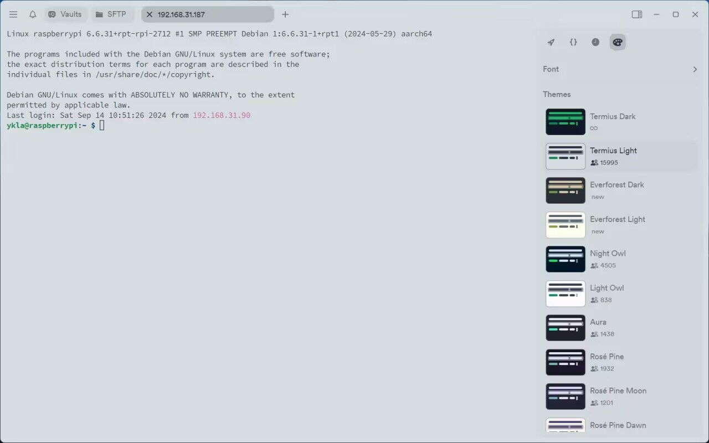

# 5.6 OpenSSH

## SSH 与 OpenSSH 概述

OpenSSH 是一套网络连接工具集，专为安全访问远程机器而设计，TCP/IP 连接也可经 SSH 隧道安全地转发或封装。OpenSSH 会对全部流量加密，因而能杜绝窃听、连接劫持及其他网络层攻击。

如果数据以明文形式在网络上传输，处于客户端与服务器之间任一位置的网络嗅探器都能窃取用户名/密码或在会话中传输的数据。OpenSSH 则提供多种认证与加密机制来规避此类风险。

SSH 即 Secure Shell（安全 shell），是一种通过加密方式安全使用 shell 的方法，通常用于远程登录和管理系统。OpenSSH（Open Secure Shell）是 SSH 协议的一种实现。OpenSSH 用于通过加密连接远程访问系统。

OpenSSH 由 OpenBSD 项目维护，并默认随 FreeBSD 安装。OpenSSH 位于 [/crypto/openssh](https://github.com/freebsd/freebsd-src/tree/main/crypto/openssh)，通过 `ChangeLog` 可获取当前内置的版本号。

本节涉及的是基本系统自带的 OpenSSH。Ports 中另有 security/openssh-portable，提供了额外配置选项，且更新更为频繁。

## SSH 服务端配置文件

SSH 相关配置文件和目录结构如下：

```sh
/
├── etc/
│   └── ssh/
│       ├── sshd_config          # SSH 服务端配置文件
│       ├── ssh_config           # SSH 客户端配置文件
│       ├── ssh_host_rsa_key     # RSA 主机密钥文件（私钥）
│       ├── ssh_host_ecdsa_key   # ECDSA 主机密钥文件（私钥）
│       └── ssh_host_ed25519_key # Ed25519 主机密钥文件（私钥）
└── 用户主目录 (~)/
    └── .ssh/
        ├── id_rsa                # RSA 私钥
        ├── id_rsa.pub            # RSA 公钥
        └── authorized_keys       # 授权登录的公钥列表
```

sshd 是 OpenSSH 的服务端守护进程，负责监听来自客户端的连接请求、执行认证并建立安全会话。sshd 的运行时配置由 `sshd_config` 文件控制，该文件定义了服务端的所有行为参数，包括监听端口、认证方式、加密算法、日志级别等。

客户端配置则由 `ssh_config` 文件控制。

## 启用 SSH 服务器

除内置的 SSH 客户端工具外，亦可将 FreeBSD 系统配置为 SSH 服务器，接受来自其他 SSH 客户端的连接。

要让 SSH 服务器在系统重启后自动运行，执行以下命令启用 sshd 服务：

```sh
# service sshd enable
```

然后重启 sshd 服务：

```sh
# service sshd restart
```

sshd 首次在 FreeBSD 系统上启动时，会自动生成主机密钥并将指纹显示在控制台上。应将这些指纹告知用户，方便他们在首次连接时进行校验。

关于启动 sshd 时可用的选项，以及认证流程、登录过程和各类配置文件的完整说明，详见 sshd(8)。

至此，sshd 已对系统上所有拥有用户名与密码的账户开放。

## 基于密钥的认证

除密码方式外，客户端也可配置为通过密钥连接远程机器。从安全角度出发，推荐使用密钥认证。

将 OpenSSH 配置为使用公钥认证，可借助非对称加密技术增强安全性。这种方式能消除密码带来的诸多风险——如弱密码、传输中被拦截等，同时也能挫败各类基于密码的攻击。不过，务必妥善保护私钥，以防未授权访问。

### 生成密钥

`ssh-keygen` 可用于生成认证密钥。指定密钥类型并按提示操作，即可产生公钥和私钥对。宜设置易记且难以猜解的密码短语来保护私钥。

```sh
# ssh-keygen
```

FreeBSD 13.1 及后续版本内置的 OpenSSH 版本均不低于 8.8。查看当前 OpenSSH 版本：

```sh
# ssh -V
OpenSSH_10.0p2, OpenSSL 3.5.6 7 Apr 2026
```

可直接使用默认值生成密钥：

```sh
# ssh-keygen
Generating public/private ed25519 key pair.
Enter file in which to save the key (/root/.ssh/id_ed25519): # 此处按回车键，使用默认存储位置
Created directory '/root/.ssh'.
Enter passphrase for "/root/.ssh/id_ed25519" (empty for no passphrase):	# 此处输入密码，按回车键将不设置密码（为了安全建议设置密码）
Enter same passphrase again: # 此处重复输入密码
Your identification has been saved in /root/.ssh/id_ed25519
Your public key has been saved in /root/.ssh/id_ed25519.pub
The key fingerprint is:
SHA256:7qHl6mBUpoGFhWowFkACTPjL08FVOmR4I5ZppEWKThI root@ykla
The key's randomart image is:
+--[ED25519 256]--+
|E+.**+o..        |
|==o*Bo+.         |
|==++.+=.         |
|=.. o= .         |
|.o oo.  S        |
|  +..  .         |
|   .o   +        |
|   . . = .       |
|     .+.o        |
+----[SHA256]-----+
```

### 配置密钥

检查权限（默认创建的权限如下）：

```sh
drwx------  2 root  wheel   512 Mar 22 18:27 /root/.ssh # 权限为 700
-rw-------  1 root  wheel  1856 Mar 22 18:27 /root/.ssh/id_rsa  # 私钥，权限为 600
-rw-r--r--  1 root  wheel  391 Mar 22 18:27 /root/.ssh/id_rsa.pub # 公钥，权限为 644
```

生成验证公钥：

```sh
# cat /root/.ssh/id_rsa.pub >> /root/.ssh/authorized_keys # 将公钥存储到 /root/.ssh/authorized_keys
-rw-r--r--  1 root  wheel  391 Mar 22 18:39 /root/.ssh/authorized_keys # 检查权限是否为 644，若不是需要手动修改权限
```

使用 WinSCP 将私钥和公钥保存到本地后，可删除服务器上的密钥文件：

```sh
# rm /root/.ssh/id_rsa*
```

### 配置 sshd 采用预期的认证方式

编辑 **/etc/ssh/sshd_config** 文件。在 `sshd_config` 文件中找到对应配置项并按需修改，去掉行首 `#`，并将参数设置为 `yes` 或 `no`，如下所示：

```ini
PermitRootLogin yes                          # 允许 root 用户直接登录系统
AuthorizedKeysFile     .ssh/authorized_keys  # 修改使用用户目录下密钥文件，默认已经正确配置，可再检查
PasswordAuthentication no                    # 不允许用户使用密码方式登录，仅通过公钥认证
ChallengeResponseAuthentication no           # 禁止密码登录验证
PermitEmptyPasswords no                      # 禁止空密码的用户进行登录
```

### 重启 sshd 服务

重启 SSH 服务以应用配置更改：

```sh
# service sshd restart
```

使用 Xshell 登录，输入密钥密码，导入私钥 `id_rsa`，即可登录。

如使用其他 SSH 软件无法登录，应转换密钥格式。

## 允许 root 用户登录 SSH

> **安全提示**
>
> 从系统安全角度考虑，通常不建议允许 root 用户直接通过 SSH 登录，应使用普通用户登录后通过 `su` 或 `sudo` 切换到 root 权限。如必须启用，应确保系统采用强密码或密钥认证。

> **技巧**
>
> 视频教程见 FreeBSD 中文社区. 004-FreeBSD14.2 允许 root 登录 ssh[EB/OL]. (2024-12-04)[2026-04-04]. <https://www.bilibili.com/video/BV1gji2YLE2o>.

编辑 **/etc/ssh/sshd_config** 文件，去掉相应行首的 `#` 并根据需要将参数设置为 `yes` 或 `no`：

```ini
PermitRootLogin yes          # 允许 root 登录
PasswordAuthentication yes   #（可选）设置是否使用普通密码验证，如果不设置此参数则使用 PAM 认证登录，安全性更高
```

> **技巧**
>
> 如找不到 `#PasswordAuthentication no` 这一行，应确认修改的是 **/etc/ssh/sshd_config** 文件，而不是 **/etc/ssh/ssh_config** 文件。只有 `sshd_config` 是 SSH 服务的配置文件。

## 远程登录客户端

`ssh` 是 OpenSSH 远程登录客户端，用于通过加密连接登录远程主机并执行命令。

登录 SSH 服务器时，使用 `ssh` 并指定该服务器上的有效用户名、IP 地址或主机名，以及端口。

```sh
$ ssh -p 端口 用户名@IP
```

如使用 SSH 连接到远程主机 192.168.179.128 的 1022 端口，用户名为 ykla：

```sh
$ ssh -p 1022 ykla@192.168.179.128
```

若是首次连接该服务器，会先要求用户验证服务器指纹：

```sh
The authenticity of host '192.168.179.128 (192.168.179.128)' can't be established.
ED25519 key fingerprint is SHA256:9RDBe66fTckKniNjdfAk1maQwKcrJRZgGx7BEYQs6hM.
This key is not known by any other names.
Are you sure you want to continue connecting (yes/no/[fingerprint])? yes
Warning: Permanently added '192.168.179.128' (ED25519) to the list of known hosts.
```

SSH 通过密钥指纹机制在客户端连接时验证服务器的真实性。首次连接输入 `yes` 接受指纹后，其指纹将存入文件 **~/.ssh/known_hosts**。此后的每次登录都会与已保存的密钥进行比对。若服务器密钥与记录不符，ssh 将发出警告。遇到这种情况，应先查清密钥变更的原因，再决定是否继续连接。

密钥变更的排查方法不在本章讨论范围之内。

## 安全地复制文件

`scp` 可用来在本地与远程机器之间安全地复制文件。

下面的示例将远程系统上的 `COPYRIGHT` 复制到本地当前目录中，文件名不变：

```sh
# scp 用户@主机:/COPYRIGHT COPYRIGHT
```

> **注意**
>
> SSH 客户端不支持 `用户名@IP:端口` 这种冒号语法指定端口（SCP 中冒号用于分隔主机名和远程路径，指定端口需使用 `-P` 参数）。如需在连接字符串中嵌入端口号，可使用 URI 格式 `ssh://用户名@IP:端口`。

`scp` 的参数与 cp 类似：源文件为第一个参数，目标路径为第二个参数。由于文件需经网络传输，参数采用 `用户@主机:<远程文件路径>` 格式。

>**注意**
>
>在递归复制目录时 SCP 使用选项 `-r`，而非 `R`。

示例：

```sh
$ scp ykla@192.168.179.128:/COPYRIGHT COPYRIGHT
(ykla@192.168.179.128) Password for ykla@ykla:
COPYRIGHT                                                                             100% 6070   846.8KB/s   00:00
```

由于此前已校验过该主机的指纹，系统会在提示输入密码前自动检查服务器密钥。

如需交互式地复制文件，可使用 `sftp`，操作方式与 FTP 客户端类似。以下示例将 D 盘的 `FreeBSD-16.0-CURRENT-amd64-20260413-e9fc0c538264-285005-disc1.iso` 文件上传至 **/home/ykla**。

```powershell
PS C:\WINDOWS\system32> sftp ykla@192.168.179.128
(ykla@192.168.179.128) Password for ykla@ykla:
Connected to 192.168.179.128.
sftp> lcd D:\ # l, local，本地。lcd 列出本地的文件
sftp> lpwd # lpwd 列出当前路径
Local working directory: d:\
sftp> pwd # 列出远程路径
Remote working directory: /home/ykla
sftp> lls # 列出当前路径的所有文件
 Volume in drive D has no label.
 Volume Serial Number is 6071-07CB

 Directory of D:\

……省略其他文件……

2026/05/02  12:23     4,405,243,904 FreeBSD-15.0-RELEASE-amd64-dvd1.iso

              34 File(s)  7,825,364,753 bytes
               5 Dir(s)  249,192,701,952 bytes free
sftp> put  FreeBSD-16.0-CURRENT-amd64-20260413-e9fc0c538264-285005-disc1.iso
Uploading FreeBSD-16.0-CURRENT-amd64-20260413-e9fc0c538264-285005-disc1.iso to /home/ykla/FreeBSD-16.0-CURRENT-amd64-20260413-e9fc0c538264-285005-disc1.iso
FreeBSD-16.0-CURRENT-amd64-20260413-e9fc0c538264-285005-disc1.iso                     100% 1313MB  13.9MB/s   01:34
sftp> ls # 列出远程路径的所有文件
FreeBSD-16.0-CURRENT-amd64-20260413-e9fc0c538264-285005-disc1.iso  
sftp> exit # 退出                                                     
```

## SSH 隧道

OpenSSH 能够创建隧道，将其他协议封装在加密会话中。

以下命令可要求 SSH 创建隧道：

```sh
$ ssh -D 8080 用户@主机
```

此示例使用了以下选项：

选项 `-D` 指定一个本地“动态”应用层端口转发。

`用户@主机` 将在指定的远程 SSH 服务器上使用的登录名。

SSH 隧道的工作原理是在 `localhost` 的 `localport` 端口上创建一个侦听套接字。

这种方法可以封装任意数量的不安全 TCP 协议，如 SMTP、POP3 和 FTP。

## 保持 SSH 连接不断线

### screen

`screen` 是英文“屏幕”的意思，它提供了一个虚拟终端环境用于操作。

使用 pkg 安装：

```sh
# pkg install screen
```

或者使用 Ports 安装：

```sh
# cd /usr/ports/sysutils/screen/
# make install clean
```

screen 使用方法：

```sh
# screen -S xxx
```

使用 `-S` 可指定 `xxx` 为名称，便于查找。

然后可通过 SSH 连接远程主机，之后即使关闭终端窗口，会话也不会中断。

查看当前有哪些正在运行的 screen 会话：

使用以下命令可列出当前用户下所有 screen 会话，包括已附着和分离的会话：

```sh
# screen -ls
There are screens on:
	18380.pts-0.ykla	(Attached)
	70812.xxx	(Detached)
	67169.pts-0.ykla	(Detached)
3 Sockets in /tmp/screens/S-root.
```

`Detached` 可直接使用 `-r` 恢复。

```sh
screen -r xxx	# 重新附着（恢复）名为或 ID 为 xxx 的 screen 会话
```

`Attached` 必须先分离再重新附着：

```sh
# screen -d 18380 # 将 ID 为 18380 的 screen 会话从当前终端分离（detach），保持会话在后台运行
[18380.pts-0.ykla detached.]

# screen -r 18380 # 恢复
```

### mosh

`mosh` 即 `Mobile Shell`，移动的 shell。Mosh 适合在移动设备（如手机、平板）通过移动网络远程控制服务器时使用。

Mosh 不支持多窗口、分屏模式，也不支持多个客户端连接同一服务器。客户端重启或切换设备时无法自动重新连接。若需实现这些功能，可在 Mosh 会话中使用 GNU Screen、OpenBSD tmux 等终端多路复用器，参见 [Mosh: A State-of-the-Art Good Old-Fashioned Mobile Shell](https://www.usenix.org/system/files/login/articles/winstein.pdf)

要使用 mosh：① 服务端和客户端都需要配置相同的 UTF-8 编码，② 双方都需要安装 mosh。

使用 pkg 安装：

```sh
# pkg install mosh
```

或者使用 Ports 安装：

```sh
# cd /usr/ports/net/mosh/
# make install clean
```

编辑 **~/.login_conf** 文件，加入：

- 默认的系统：

```ini
me:\
        :charset=UTF-8:\
        :lang=en_US.UTF-8:\
        :setenv=LC_COLLATE=C:
```

- 支持中文的系统（配置 locale 设置）：

```ini
me:\
        :charset=UTF-8:\
        :lang=zh_CN.UTF-8:\
        :setenv=LC_COLLATE=zh_CN.UTF-8:
```

客户端也需进行相同的配置。由于 Mosh 是为移动终端设计的，本节使用 Android 设备上的 [JuiceSSH](https://play.google.com/store/apps/details?id=com.sonelli.juicessh) 软件进行测试。


选择“服务端命令”，设置如下：

```sh
mosh-server new -s -l LANG=zh_CN.UTF-8
```

将 mosh 服务器新会话的语言环境设置为 zh_CN.UTF-8。

其余配置（用户名、密码）与 SSH 相同，仍通过端口 22 验证。

列出系统中所有监听的 IPv4 套接字：

```sh
# sockstat -4l
USER     COMMAND    PID   FD  PROTO  LOCAL ADDRESS         FOREIGN ADDRESS
root     mosh-serve 19493 4   udp4   192.168.31.187:60001  *:*
root     sshd        1140 4   tcp4   *:22                  *:*
ntpd     ntpd        1068 21  udp4   *:123                 *:*
ntpd     ntpd        1068 24  udp4   127.0.0.1:123         *:*
ntpd     ntpd        1068 26  udp4   192.168.31.187:123    *:*
root     syslogd     1017 7   udp4   *:514                 *:*
```

根据上述输出，主机端口为 60001，故需放通 60000-61000 端口。

测试连接：


断开测试：


断开后会有提示，重连网络后会自动恢复，与未断开时无异（已结合 `screen` 使用）。

## SSH 和 SCP 客户端

### WinSCP

SCP 即 Secure Copy（安全复制），是一种用于在不同设备间安全传输文件的工具，其功能类似于安全版的 `cp` 命令。

WinSCP 是对 `scp` 命令的图形化封装软件，同时支持 FTP 等多种协议，可在 Windows 系统与 Linux 或 BSD 系统之间传输文件。

WinSCP 官方下载地址：[https://winscp.net/eng/download.php](https://winscp.net/eng/download.php)

自 OpenSSH 9.0 起，`scp` 命令默认使用 `SFTP` 协议进行文件传输。WinSCP 默认使用 `SFTP`。

OpenSSH 的版本号可能因远程目标操作系统而异。

显示当前系统中 SSH 客户端的版本信息：

```sh
# ssh -V
OpenSSH_9.7p1, OpenSSL 3.0.14 4 Jun 2024
```

上面的输出显示，OpenSSH 的主要版本号为 9.7，用户无需任何修改即可使用 WinSCP。

### Xshell

Xshell 是 Windows 平台上的终端工具，支持串口、SSH 和 Telnet 协议。

Xshell 下载地址（输入用户名和邮件即可）：

[https://www.netsarang.com/zh/free-for-home-school](https://www.netsarang.com/zh/free-for-home-school)

如提示需要重新验证，可访问上述网站重新获取安装程序。

### MobaXterm

MobaXterm 是集成了 `scp` 功能和多种网络工具的终端软件。

MobaXterm 目前不支持中文，下载地址 <https://mobaxterm.mobatek.net/download-home-edition.html>，任选其一。


鼠标操作方式与 Xshell 类似。

### PuTTY

下载地址：<https://www.chiark.greenend.org.uk/~sgtatham/putty/latest.html>

PuTTY 界面操作相对不便，不支持国际化（i18n），存在已知安全漏洞（[CVE-2024-31497](https://nvd.nist.gov/vuln/detail/CVE-2024-31497)），通常作为其他软件的组件间接使用。历史上有中文修改版被发现注入恶意代码（[参考](https://safe.it168.com/a2012/0201/1305/000001305829.shtml)），建议用户仅从官方渠道获取。

### Termius



Termius 下载地址：<https://termius.com/download/>

目前不支持中文，使用前需登录和注册。Termius 的鼠标操作方式与 PuTTY 类似，但右键操作与 Xshell 不同。

## SSH 服务器安全选项

虽然 sshd 是 FreeBSD 中使用最广泛的远程管理工具，但暴露在公网上的系统通常面临暴力破解与路过式攻击。本节将介绍几项附加参数，用以阻断此类攻击。所有配置均写入 **/etc/ssh/sshd_config**。

>**注意**
>
>不应将 **/etc/ssh/sshd_config** 与 **/etc/ssh/ssh_config** 混淆（注意第一个文件名中多了一个 `d`）。前者配置的是服务器端，后者配置的是客户端。

可使用 OpenSSH 服务器配置文件中的 `AllowUsers` 关键字限制哪些用户可以从何处登录 SSH 服务器。例如，要仅允许 `user` 从 `192.168.1.32` 登录，在 **/etc/ssh/sshd_config** 中添加以下行：

```ini
AllowUsers user@192.168.1.32
```

若要允许 `user` 从任意位置登录，则单独列出用户名，无需附带 IP 地址：

```ini
AllowUsers user
```

多个用户可写在同一行上，如：

```ini
AllowUsers root@192.168.1.32 user
```

完成所有修改后，在重启服务之前，建议先执行以下命令验证配置是否正确：

```sh
# sshd -t
```

若配置无误，将不会有任何输出；若有误，则会显示类似：

```sh
/etc/ssh/sshd_config: line 3: Bad configuration option: sdadasdasdasads
/etc/ssh/sshd_config: terminating, 1 bad configuration options
```

在确认配置文件无误之后，执行以下命令让 sshd 重新加载即可：

```sh
# service sshd reload
```

## 附录：OpenSSH 服务端配置详解

[/crypto/openssh/sshd_config](https://github.com/freebsd/freebsd-src/blob/main/crypto/openssh/sshd_config) 是默认的 SSHD 配置文件。对 OpenSSH 服务端配置简单注解如下。

在 OpenSSH 默认分发的 `sshd_config` 中，选项采用以下策略：

- 尽可能写出选项及其默认值，但保持为注释状态。（把默认值写出来供参考，但故意注释掉，若不显式覆盖，实际生效的仍将是这些值）。
- 未被注释的选项将覆盖默认值（即通过显式覆盖来生效）。

FreeBSD 的某些默认值与 OpenBSD 不同，并且 FreeBSD 还有一些额外的选项。

```ini
#Port 22	# 指定 sshd 监听的 Port 号，默认是 22
#AddressFamily any	# 指定使用的地址族，any 表示同时使用 IPv4 和 IPv6
#ListenAddress 0.0.0.0	# 在 IPv4 的所有网络接口地址上监听连接请求
#ListenAddress ::	# 在 IPv6 的所有网络接口地址上监听连接请求

#HostKey /etc/ssh/ssh_host_rsa_key	# 指定 RSA 主机密钥文件路径
#HostKey /etc/ssh/ssh_host_ecdsa_key  # 指定 ECDSA 主机密钥文件路径
#HostKey /etc/ssh/ssh_host_ed25519_key  # 指定 Ed25519 主机密钥文件路径

# 指定加密算法和密钥协商设置
#RekeyLimit default none	# 指定重新密钥的限制，默认不限制

# 登录
#SyslogFacility AUTH  # 指定日志记录的系统设施为认证相关
#LogLevel INFO  # 指定日志详细级别为 INFO（信息）

# 认证

#LoginGraceTime 2m  # 指定登录许可超时时间为 2 分钟
#PermitRootLogin no  # 禁止 root 用户通过 SSH 登录
#StrictModes yes  # 启用严格模式，检查主机文件和目录权限
#MaxAuthTries 6  # 设置最大认证尝试次数为 6 次
#MaxSessions 10  # 设置每个连接允许的最大会话数为 10

#PubkeyAuthentication yes  # 启用公钥认证

# 默认会检查 .ssh/authorized_keys 和 .ssh/authorized_keys2
# 但此设置已被覆盖，因此系统只会检查 .ssh/authorized_keys

AuthorizedKeysFile	.ssh/authorized_keys  # 指定用户公钥文件路径

#AuthorizedPrincipalsFile none	# 指定授权主体文件路径，默认不使用任何文件

#AuthorizedKeysCommand none  # 指定用于获取公钥的命令，默认不使用任何命令
#AuthorizedKeysCommandUser nobody  # 指定运行 AuthorizedKeysCommand 的用户，默认是 nobody

# 要使此功能生效，还需要在 /etc/ssh/ssh_known_hosts 中配置主机密钥
#HostbasedAuthentication no  # 禁用基于主机的认证
# 如果不信任 ~/.ssh/known_hosts，用于 HostbasedAuthentication，可改为 yes
#IgnoreUserKnownHosts no  # 是否忽略用户的已知主机文件
# 不读取用户的 ~/.rhosts 和 ~/.shosts 文件
#IgnoreRhosts yes  # 启用以忽略 rhosts 文件

# 将此项改为 "yes" 可启用内置密码认证
# 注意，也可能通过 KbdInteractiveAuthentication 接受密码
#PasswordAuthentication no  # 禁用密码认证
#PermitEmptyPasswords no  # 不允许空密码登录

# 将此项改为 "no" 可禁用键盘交互式认证
# 根据系统配置，这可能涉及密码、质询-响应、一次性密码，或这些方法与其他方法的组合
# 键盘交互式认证也用于 PAM 认证
#KbdInteractiveAuthentication yes  # 启用键盘交互式认证

# Kerberos 选项
#KerberosAuthentication no  # 禁用 Kerberos 认证
#KerberosOrLocalPasswd yes  # 如果 Kerberos 认证失败，允许使用本地密码
#KerberosTicketCleanup yes  # 登录后清理 Kerberos 凭证票据
#KerberosGetAFSToken no  # 禁止获取 AFS 令牌

# GSSAPI 选项
#GSSAPIAuthentication no  # 禁用 GSSAPI 认证
#GSSAPICleanupCredentials yes  # 登录后清理 GSSAPI 凭证

# 将此项设置为 'no' 可禁用 PAM 认证、账户处理和会话处理
# 如果启用，通过 KbdInteractiveAuthentication 和 PasswordAuthentication 将允许 PAM 认证
# 根据 PAM 配置，通过 KbdInteractiveAuthentication 的 PAM 认证可能会绕过 "PermitRootLogin prohibit-password" 的设置
# 如果只想运行 PAM 的账户和会话检查而不启用 PAM 认证，可启用此项，
# 但将 PasswordAuthentication 和 KbdInteractiveAuthentication 设置为 'no'
#UsePAM yes  # 启用 PAM 认证

#AllowAgentForwarding yes  # 允许 SSH 代理转发
#AllowTcpForwarding yes  # 允许 TCP 转发
#GatewayPorts no  # 禁止网关端口转发
#X11Forwarding no  # 禁止 X11 转发
#X11DisplayOffset 10  # 设置 X11 显示偏移量为 10
#X11UseLocalhost yes  # X11 转发仅绑定到 localhost
#PermitTTY yes  # 允许分配伪终端
#PrintMotd yes  # 登录时显示 MOTD（信息）
#PrintLastLog yes  # 登录时显示最后登录信息
#TCPKeepAlive yes  # 启用 TCP KeepAlive
#PermitUserEnvironment no  # 禁止读取用户环境文件
#Compression delayed  # 启用延迟压缩
#ClientAliveInterval 0  # 客户端存活检查间隔，0 表示禁用
#ClientAliveCountMax 3  # 最大未响应客户端存活检查次数
#UseDNS yes  # 使用 DNS 反向解析客户端地址
#PidFile /var/run/sshd.pid  # 指定 sshd PID 文件路径
#MaxStartups 10:30:100  # 限制同时未认证连接数
#PermitTunnel no  # 禁止 VPN 隧道
#ChrootDirectory none  # 不启用 chroot 目录
#UseBlocklist no  # 不启用阻止列表
#VersionAddendum FreeBSD-20250801  # SSH 版本附加信息

# 默认没有登录横幅路径
#Banner none  # 禁用登录横幅

# 覆盖默认不启用任何子系统的设置
Subsystem	sftp	/usr/libexec/sftp-server  # 指定 SFTP 子系统及其执行路径

# 按用户覆盖设置的示例
#Match User anoncvs  # 仅对用户 anoncvs 生效的配置块
# X11Forwarding no  # 禁止 X11 转发
# AllowTcpForwarding no  # 禁止 TCP 转发
# PermitTTY no  # 禁止分配伪终端
# ForceCommand cvs server  # 强制执行 cvs server 命令
```

本配置文件版本：[blocklist: Rename blacklist to blocklist](https://github.com/freebsd/freebsd-src/commit/7238317403b95a8e35cf0bc7cd66fbd78ecbe521)。

## 参考文献

- OpenBSD. ssh(1)[EB/OL]. [2026-04-17]. <https://man.openbsd.org/ssh.1>.
- FreeBSD Project. FreeBSD 13.1-RELEASE Announcement[EB/OL]. [2026-04-17]. <https://www.freebsd.org/releases/13.1R/announce/>. 确认 13.1 起内置 OpenSSH 8.8p1。
- mosh. mosh FAQ[EB/OL]. [2026-03-26]. <https://mosh.org/#faq>. 解答 mosh 的常见问题，包括连接原理与平台支持情况。
- silbertmonaphia. ssh && mosh[EB/OL]. [2026-03-26]. <https://silbertmonaphia.github.io/ssh%E7%99%BB%E5%BD%95%E3%81%AE%E5%91%A8%E8%BE%BA-&&-Mosh.html>. 介绍 SSH 与 mosh 的配合使用及配置要点。
- OpenBSD. scp — OpenSSH secure file copy[EB/OL]. [2026-03-26]. <https://man.openbsd.org/scp.1>.
- OpenBSD. OpenSSH 8.0 Release Notes[EB/OL]. [2026-04-17]. <https://www.openssh.com/txt/release-8.0>. “ssh-keygen(1): Increase the default RSA key size to 3072 bits,following NIST Special Publication 800-57's guidance for a 128-bit equivalent symmetric security level.”自 8.0 版本起，ssh-keygen 默认 RSA 密钥长度从 2048 位提升至 3072 位。

## 课后习题

1. 配置 SSH 仅允许密钥登录并禁用密码认证，分析 `sshd_config` 中各认证选项的优先级关系与生效条件。
2. 创建一个 screen 会话运行长时间任务，模拟网络断开后重连恢复会话，对比有 screen 与无 screen 两种场景下进程的生命周期差异。
3. 修改 sshd 的 `ClientAliveInterval` 和 `ClientAliveCountMax` 参数，测试不同设置下的连接保持行为，分析 KeepAlive 机制对网络中断检测的影响。
