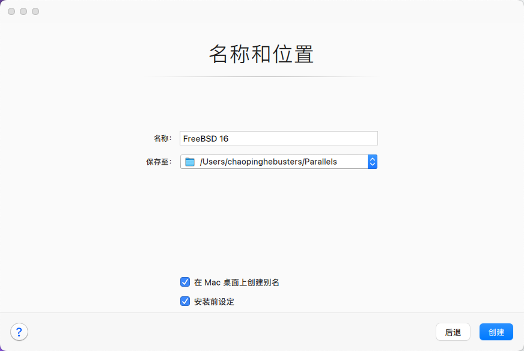

# 5.4 基于 Apple M1 和 Parallels Desktop 安装 FreeBSD

在 macOS 15.7.3 与 Parallels Desktop 26.3.3（57507）环境下，FreeBSD 16.0 的图形界面、键盘和鼠标均可正常使用。

> **警告**
>
> 本节基于 Apple M1，因此应选择 aarch64 架构的 FreeBSD。

## 配置虚拟机

环境准备就绪后，安装 FreeBSD。下图所示为新建页面，选中“通过映像文件安装 Windows、Linux 或 macOS”，确认并继续。

点击左下角“没有指定源也继续”，确认并继续。

在“请选中您的操作系统”界面中，选中“其他”。

预览操作系统类型，确认并继续。

在“名称和位置”页面中，可调整各项设置。勾选“安装前设定”，确认并继续。

进入配置页面后，可调整各项设置。

在顶部选择“硬件”选项卡，在左侧边栏选择“CD/DVD”，在右侧“源”中选择下载的 FreeBSD 镜像。

预览虚拟机配置后点击继续。

> **技巧**
>
> Parallels Desktop 的默认设置通常已足够，默认使用 UEFI 引导，无需调整硬件配置。

## 安装 FreeBSD

开始安装 FreeBSD 系统。

安装桌面环境后的效果预览：

安装桌面环境后，系统即可正常运行，但分辨率无法调整。

## CPU 使用率验证

手动安装 Port **sysutils/htop** 后观察，CPU 使用率正常，无需额外调整。

