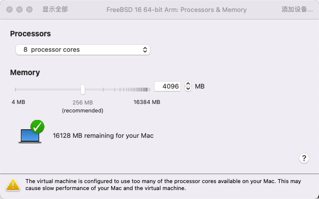
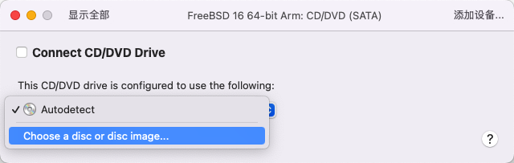
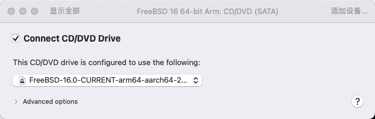

# 5.5 基于 Apple M1 和 VMware Fusion Pro 安装 FreeBSD

在 macOS 15.7.3 与 VMware Fusion Professional 26H1 (25388279) 环境下，FreeBSD 16.0 可正常安装运行。

> **注意**
>
> 不建议使用 macOS 14，可能因兼容性问题导致键盘无法输入，需特别注意。

## 下载 FreeBSD

首先需下载适用于 Apple M1 架构的 FreeBSD 镜像。Apple M1 采用 ARM 架构，请下载名称中包含 `aarch64` 的镜像。**切勿** 下载 `amd64` 架构的镜像，否则虚拟机将无法正常运行。

## 配置虚拟机

镜像下载完成后，开始配置虚拟机。点击创建自定义虚拟机（Create a custom virtual machine），然后点击继续（Continue）：


在操作系统选择界面，点击“Other”，右侧选择当前最新的 “FreeBSD 15 64-bit Arm”（Fusion 目前只有 15 的模板但对 16 同样适用），然后点击继续（Continue）：


选择虚拟磁盘：选中“新建虚拟磁盘”，容量稍后可调整。然后点击继续（Continue）：


在“完成”页面，预览配置后点击继续（Continue）：


在“命名虚拟机”页面，“存储为”可设置虚拟机名称，此处设为“FreeBSD 16 64-bit Arm”，标签和位置均可自定义。然后点击存储。


完成创建后，打开虚拟机设置。

调整处理器数量和内存容量。默认内存配置可能不足（`4096 MB` 即 4 GB），建议适当增加。



调整虚拟磁盘容量后，点击应用（Apply）。


连接 CD/DVD 设备，勾选“Connect CD/DVD Drive”。



点击“选择镜像”（Choose a disc or disc image），选择下载的 FreeBSD 镜像。



## 安装 FreeBSD 虚拟机


## 虚拟机增强工具

- 使用 pkg 安装：

```sh
# pkg ins open-vm-tools
```

- 使用 Ports 安装：

```sh
# cd /usr/ports/emulators/open-vm-tools/
# make install clean
```

无需额外配置。

## 调整分辨率

将 `efi_max_resolution="1080p"` 写入 **/boot/loader.conf** 文件即可将虚拟机分辨率设为 1920x1080。参见虚拟控制台和终端章节。

## 配置桌面


