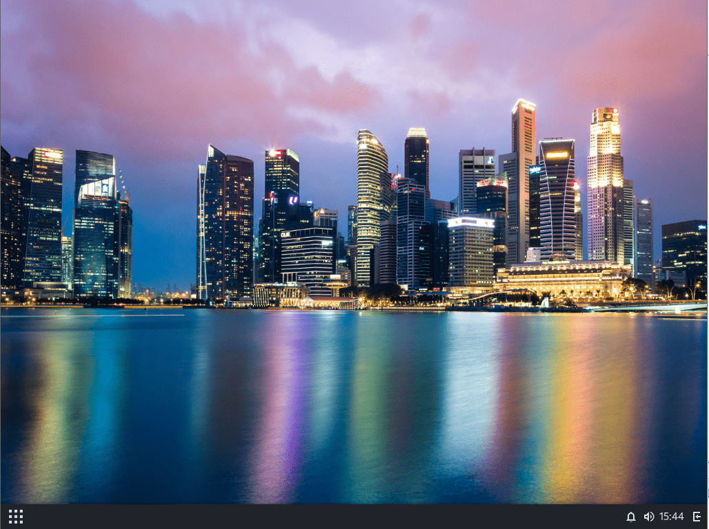

# 第 4.11 节 Budgie

Budgie 是 Solus Linux 的默认桌面。

## 安装

- 使用 pkg 安装：

```sh
# pkg install budgie wqy-fonts
```

- 或者使用 Ports 安装：

```sh
# cd /usr/ports/x11/budgie && make install clean
# cd /usr/ports/x11-fonts/wqy/ && make install clean
```

>**技巧**
>
>会自动安装 lightdm。

- 解释：

| 包名             | 作用说明                                                  |
|:------------------|:--------------------------|
| `budgie`         | 桌面环境 |
| `wqy-fonts`      | 文泉驿中文字体                                          |

## 查看安装提示

```sh
root@ykla:/home/ykla # pkg info -D budgie
budgie-10.8:
On install:
Copy 'xprofile' into your home directory:
  cp /usr/local/share/examples/budgie/xprofile ~/.xprofile
# 将示例配置文件 xprofile 复制到你的主目录，用于设置桌面环境启动时的用户环境变量。

More information, https://codeberg.org/olivierd/freebsd-ports-budgie/wiki
# 更多信息可参考官方维基页面。

If you want to launch new session from a console (without login manager)
  cp /usr/local/share/examples/budgie/xinitrc ~/.xinitrc
# 如果你想直接从控制台启动会话（不使用登录管理器），请复制示例 xinitrc 到主目录。
```

## 配置 `startx`

```sh
$ cp /usr/local/share/examples/budgie/xprofile ~/.xprofile
$ cp /usr/local/share/examples/budgie/xinitrc ~/.xinitrc
```

## 配置 `fstab`

编辑 `/etc/fstab`，加入：

```sh
proc           /proc       procfs  rw  0   0
```

## 服务管理

```sh
# service dbus enable
# service lightdm enable
```

## 中文环境

在 `/etc/rc.conf` 下加入：

```sh
lightdm_env="LC_MESSAGES=zh_CN.UTF-8" 
```

---

编辑 `/etc/login.conf`：找到 `default:\` 这一段，把 `:lang=C.UTF-8` 修改为 `:lang=zh_CN.UTF-8`。

刷新数据库：

```sh
# cap_mkdb /etc/login.conf
```

## 桌面欣赏




图中壁纸为默认。拍摄地为新加坡滨海湾区。


## 参考文献

- [Installation](https://codeberg.org/olivierd/freebsd-ports-budgie/wiki/Installation)，本文主要补充来自此处，但是经过测试无需配置 `05-suspend.rules` 也可以做到关机重启。
