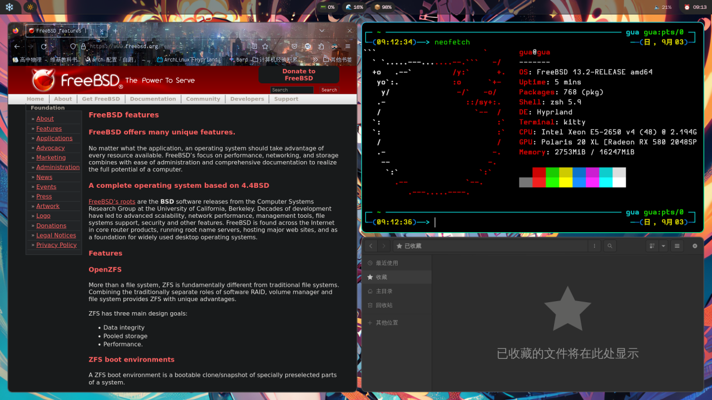

# 第 4.14 节 Hyprland

Hyprland 是 Wayland 的一个合成器，支持窗口透明、模糊、圆角等等，动画效果做的不错。



## 安装 Hyprland

- 使用 pkg 安装：

```sh
# pkg ins hyprland waybar wofi qt6-base qt5-wayland qt6-wayland xdg-desktop-portal-hyprland hyprpicker swaybg mako nerd-fonts slurp grim swaylock kitty dolphin
```

- 或者使用 Ports 安装：

```sh
# cd /usr/ports/x11-wm/hyprland/ && make install clean
# cd /usr/ports/x11/waybar/ && make install clean
# cd /usr/ports/x11/wofi/ && make install clean
# cd /usr/ports/devel/qt6-base/ && make install clean
# cd /usr/ports/graphics/qt5-wayland/ && make install clean
# cd /usr/ports/graphics/qt6-wayland/ && make install clean
# cd /usr/ports/x11/xdg-desktop-portal-hyprland/ && make install clean
# cd /usr/ports/x11/hyprpicker/ && make install clean
# cd /usr/ports/x11/swaybg/ && make install clean
# cd /usr/ports/x11/mako/ && make install clean
# cd /usr/ports/x11-fonts/nerd-fonts/ && make install clean
# cd /usr/ports/x11/slurp/ && make install clean
# cd /usr/ports/x11/grim/ && make install clean
# cd /usr/ports/x11/swaylock/ && make install clean
# cd /usr/ports/x11-fm/dolphin/ && make install clean
# cd /usr/ports/x11/kitty/ && make install clean
```


>**注意**
>
>作为依赖会自动安装 dbus 及  wayland。

- 解释：

| 包名                        | 作用说明                                                                 |
|:-----------------------------|:--------------------------------------------------------------------------|
| `hyprland`                  | 动态平铺式 Wayland 合成器 |
| `waybar`                    | 为 wlroots 合成器（如 Hyprland）设计的 GTK 状态栏 |
| `wofi`                      | 程序启动器（或者用 rofi 也可以，可以了解一下） |
| `qt6-base`                  | Qt 6 的基础模块 |
| `qt5-wayland`               | Qt 5 的 Wayland 支持模块，能让 Qt 5 应用程序在 Wayland 环境中运行。 |
| `qt6-wayland`               | Qt 6 的 Wayland 支持模块，能让 Qt 6 应用程序在 Wayland 环境中运行。 |
| `xdg-desktop-portal-hyprland` | Hyprland 的 XDG Desktop Portal 实现，提供与其他应用程序的通信接口|
| `hyprpicker`                | 颜色选择器 |
| `swaybg`                    | 壁纸工具 |
| `mako`                      | 显示通知 |
| `nerd-fonts`                | 图标字体，可以用来在配置文件中插入图案，显示在 waybar 等地方 |
| `slurp`                     | 屏幕选择工具，用来在屏幕上选区 |
| `grim`                      | 屏幕截图工具 |
| `swaylock`                  | 锁屏工具 |
| `kitty`                     | 终端|
|`dolphin`|文件管理器|


## 启动服务

```sh
# service seatd enable
# service dbus enable
```

## 首次启动 Hyprland

> **重要**：
>
> 如果启动报错提示未设置 XDG_RUNTIME_DIR ，可以使用下面方法进行设置。**这里以 zsh 为默认 shell 作为示例：**
>
> 在 `~/.zprofile` 里面写入：（如果默认shell是sh，写入~/.profile，echo $0可以显示默认shell）
>
> ```sh
> export XDG_RUNTIME_DIR=/var/run/user/`id -u`
> ```
>
> 随后重启： `reboot`
>
>
> Ctrl+Alt+F2 进入 tty，执行 `ck-launch-session Hyprland`，这会在 `~/.config/hypr` 生成一个默认配置文件。

## 配置


如果需要自动启动，请将下行写入 `~/.zprofile`：

```sh
ck-launch-session Hyprland
```

如果默认 shell 是 sh，应写入 `~/.profile` 也可以指定配置文件 `Hyprland -c 配置文件路径`  
Hyprland 窗口焦点切换和传统桌面有所区别，它是鼠标光标放在哪个窗口上（没错是“放在”，不需要点击一下），窗口焦点就在哪里，没有 Alt+Tab 这种快捷键去切换。

### 配置 hyprland.conf

文件位置：`~/.config/hypr/hyprland.conf`

- Hyprland 启动后默认顶部会有一个黄色的条带警告标识。配置文件中可以把它注释掉，找到这行并注释掉 `# autogenerated = 1`
- 默认以 Windows 徽标键（类 Unix 中为 Super 键，下同）为 mod 键（根据个人习惯设置，也可以设置为 Alt 键等等）`$mainMod = SUPER`
- 悬浮窗口和传统桌面环境中的行为类似，可以随意拖动到屏幕上的任何位置，可以用鼠标调节窗口大小。默认的配置文件中是按住 mod 键，然后鼠标左键按住悬浮窗口可以拖动窗口进行移动，而按住右键拖动窗口可以调节窗口的大小。设置默认悬浮的窗口：`windowrulev2 = float, title:QQ`
- 建议阅读一下下面的配置文件 hyprland.conf ，swaybg 用于设置壁纸，别忘了修改成你自己的图片文件的路径。

5.任务栏：`exec-once=waybar`

`hyprland.conf` 示例：

```sh
# 进入 Hyprland 后自动启动 fcitx5（已经注释掉，按照5.2章安装后自行取消注释即可）
#exec-once=fcitx5
# 设置壁纸，别忘了修改成自己壁纸文件的路径！！！
#exec-once=swaybg -i "$HOME/Pictures/Wallpapers/壁纸.jpg"
# 任务栏
exec-once=waybar
# swaylock 锁屏
exec-once=swayidle -w timeout 300 'swaylock'

# Please note not all available settings / options are set here.
# For a full list, see the wiki

# autogenerated = 1 # 移除或者注释这一行以消除屏幕顶部警告标识。

# See https://wiki.hyprland.org/Configuring/Monitors/
monitor=,preferred,auto,auto

# See https://wiki.hyprland.org/Configuring/Keywords/ for more

# Source a file (multi-file configs)
# source = ~/.config/hypr/myColors.conf

# Some default env vars.
env = XCURSOR_SIZE,24

# For all categories, see https://wiki.hyprland.org/Configuring/Variables/
input {
    kb_layout = us
    kb_variant =
    kb_model =
    kb_options =
    kb_rules =

    follow_mouse = 1

    touchpad {
        natural_scroll = no
    }

    sensitivity = 0 # -1.0 - 1.0, 0 means no modification.
}

general {
    # See https://wiki.hyprland.org/Configuring/Variables/ for more

    gaps_in = 5
    gaps_out = 20
    border_size = 2
    col.active_border = rgba(33ccffee) rgba(00ff99ee) 45deg
    col.inactive_border = rgba(595959aa)

    layout = dwindle
}

animations {
    enabled = yes

    # Some default animations, see https://wiki.hyprland.org/Configuring/Animations/ for more

    bezier = myBezier, 0.05, 0.9, 0.1, 1.05

    animation = windows, 1, 7, myBezier
    animation = windowsOut, 1, 7, default, popin 80%
    animation = border, 1, 10, default
    animation = borderangle, 1, 8, default
    animation = fade, 1, 7, default
    animation = workspaces, 1, 6, default
}

dwindle {
    # See https://wiki.hyprland.org/Configuring/Dwindle-Layout/ for more
    pseudotile = yes # master switch for pseudotiling. Enabling is bound to mainMod + P in the keybinds section below
    preserve_split = yes # you probably want this
}

gestures {
    # See https://wiki.hyprland.org/Configuring/Variables/ for more
    workspace_swipe = off
}

# 窗口规则
# See https://wiki.hyprland.org/Configuring/Window-Rules/ for more
windowrulev2 = float, title:rofi.*
windowrulev2 = float, title:QQ
windowrulev2 = float, title:图片查看器


# See https://wiki.hyprland.org/Configuring/Keywords/ for more
$mainMod = SUPER # 用 win 键作为 mainmod 键
$shiftMod=SUPER_SHIFT
$altMod=SUPER_ALT
$alt=ALT
$shift=SHIFT

# Example binds, see https://wiki.hyprland.org/Configuring/Binds/ for more
bind = $mainMod, Q, exec, kitty # 打开终端
bind = $mainMod, C, killactive,  # 关闭窗口
bind = $mainMod, M, exit, # 注销
bind = $mainMod, E, exec, dolphin # 文件管理器
bind = $mainMod, V, togglefloating,  # 切换为悬浮窗口，可拖动
bind = $mainMod, R, exec, wofi --show drun # 软件启动器，类似菜单
bind = $mainMod, P, pseudo, # 焦点窗口（光标对准的窗口）在平铺窗口原本占有的区域内自由调节大小和位置
bind = $mainMod, J, togglesplit, # 调节焦点窗口与相邻窗口的排布方向，上下排列或者左右排列。
### 截图
$screen_file=${HOME}/screen_shot_$(date + "%Y-%m-%d_%H-%M-%S").png
bind=$shiftMod, S, exec, grim -g "$(slurp)" - | wl-copy
bind=, Print,      exec, grim $screen_file
bind=$shift, Print,exec, grim -g "$(slurp)" $screen_file
bind=$alt, Print,  exec, grim - | wl-copy

# Move focus with mainMod + arrow keys
bind = $mainMod, left, movefocus, l
bind = $mainMod, right, movefocus, r
bind = $mainMod, up, movefocus, u
bind = $mainMod, down, movefocus, d

# Switch workspaces with mainMod + [0-9]
# 切换工作区 mainmod 键+数字键，1到0对应10个工作区。
bind = $mainMod, 1, workspace, 1
bind = $mainMod, 2, workspace, 2
bind = $mainMod, 3, workspace, 3
bind = $mainMod, 4, workspace, 4
bind = $mainMod, 5, workspace, 5
bind = $mainMod, 6, workspace, 6
bind = $mainMod, 7, workspace, 7
bind = $mainMod, 8, workspace, 8
bind = $mainMod, 9, workspace, 9
bind = $mainMod, 0, workspace, 10

# Move active window to a workspace with mainMod + SHIFT + [0-9]
# 把窗口移动到别的工作区，例如 mainmod+Shift+2（win 键 +2 是查看工作区 1）
bind = $mainMod SHIFT, 1, movetoworkspace, 1
bind = $mainMod SHIFT, 2, movetoworkspace, 2
bind = $mainMod SHIFT, 3, movetoworkspace, 3
bind = $mainMod SHIFT, 4, movetoworkspace, 4
bind = $mainMod SHIFT, 5, movetoworkspace, 5
bind = $mainMod SHIFT, 6, movetoworkspace, 6
bind = $mainMod SHIFT, 7, movetoworkspace, 7
bind = $mainMod SHIFT, 8, movetoworkspace, 8
bind = $mainMod SHIFT, 9, movetoworkspace, 9
bind = $mainMod SHIFT, 0, movetoworkspace, 10

# 使用 mainMod + 鼠标滚轮 滚动浏览现有工作区
bind = $mainMod, mouse_down, workspace, e+1
bind = $mainMod, mouse_up, workspace, e-1

# Move/resize windows with mainMod + LMB/RMB and dragging
bindm = $mainMod, mouse:272, movewindow
bindm = $mainMod, mouse:273, resizewindow

```

### 配置 kitty.conf

文件位置：`~/.config/kitty/kitty.conf` 示例：

```sh
# Look and feel

## Color
# include ./obsidian.color.conf

## 字体设置
font_family      Hasklug Nerd Font Mono
font_size 14.0
#font_features FiraCodeNerdFontCompleteM-Retina +ss02 +ss03 +ss04 +ss05 +ss07 +zero

## 文本光标设置
cursor_blink_interval      2.0
cursor_stop_blinking_after 5.0

## Scrollback
scrollback_lines -1

## 鼠标相关设置
copy_on_select yes    # 选中文本时复制
mouse_hide_wait 2.0   # 定时隐藏鼠标

## 提示🔔
enable_audio_bell no
visual_bell_duration 0.3
bell_on_tab yes

## Tabs
tab_bar_edge top
tab_bar_style powerline
tab_powerline_style angled
active_tab_foreground   #111
active_tab_background   #eee
active_tab_font_style   bold
inactive_tab_foreground #666
inactive_tab_background #888
tab_bar_background #444
inactive_tab_font_style normal
tab_title_template "{fmt.fg.gray}{index}{fmt.fg.default}:{title}"
active_tab_title_template "{title}"

# Mechanics
input_delay 2
editor nvim
allow_remote_control no
allow_hyperlinks no
term xterm-256color
macos_option_as_alt yes
macos_quit_when_last_window_closed yes
strip_trailing_spaces smart
update_check_interval 72
hide_window_decorations titlebar-only

# Shortcuts
clear_all_shortcuts yes

## The defaults
map ctrl+a                pipe @text tab pbcopy
map ctrl+shift+c          copy_to_clipboard
map ctrl+shift+v          paste_from_clipboard
map ctrl+alt+j            scroll_page_up
map ctrl+alt+k            scroll_page_down
map ctrl+k                clear_terminal reset active

## 标签页管理
map ctrl+t                new_tab_with_cwd !neighbor
map alt+s                next_tab
map alt+a                previous_tab
map alt+q                close_tab
map ctrl+s                set_tab_title
map ctrl+shift+left       move_tab_backward
map ctrl+shift+right      move_tab_forward
map alt+1                goto_tab 1
map alt+2                goto_tab 2
map alt+3                goto_tab 3
map alt+4                goto_tab 4
map alt+5                goto_tab 5
map alt+6                goto_tab 6
map alt+7                goto_tab 7
map alt+8                goto_tab 8
map alt+9                goto_tab 9

# 文字大小调节
map ctrl+equal            change_font_size current +1.0
map ctrl+minus            change_font_size current -1.0
map ctrl+0                change_font_size current 0

#include ${ARCH}.conf

```

### 配置 waybar（任务栏）

waybar 的配置文件目录在主目录的 `.config/waybar` 文件夹里面，包含一个 `config.jsonc` 文件，和一个 `style.css`. 可以参考使用示例配置文件的 waybar 文件夹。示例配置文件中需要安装 noto-enoji 字体才能正常显示，也可以改成自己想要的图标。

`config.jsonc` 示例：

```json
{
    "position": "top",
    "layer": "top",
    "height": 16,
    "margin-top": 0,
    "margin-bottom": 0,
    "margin-left": 0,
    "margin-right": 0,
    "modules-left": ["custom/launcher", "wlr/workspaces", "custom/playerctl", "custom/playerlabel"],
    "modules-center": ["cpu", "memory", "disk"],
    "modules-right": ["tray", "custom/randwall", "network", "pulseaudio", "clock"],
	"clock": {
		"format": "⏰  {:%H:%M}",
		"tooltip": "true",
        	"tooltip-format": "<big>{:%Y %B}</big>\n<tt><small>{calendar}</small></tt>",
        	"format-alt": "🗓️  {:%y/%m/%d}"
	},


	"wlr/workspaces": {
        "active-only": false,
        "all-outputs": true,
        "disable-scroll": false,
        "on-scroll-up": "hyprctl dispatch workspace -1",
        "on-scroll-down": "hyprctl dispatch workspace +1",
		"format": "{icon}",
		"on-click": "activate",
		"format-icons": {
			"urgent": "",
			"active": "🔴",
			"default": "🔵",
    "sort-by-number": true
    },
    },

    "custom/playerctl": {
      "format": "{icon}",
      "return-type": "json",
      "max-length": 64,
      "exec": "playerctl -a metadata --format '{\"text\": \"{{artist}} - {{markup_escape(title)}}\", \"tooltip\": \"{{playerName}} : {{markup_escape(title)}}\", \"alt\": \"{{status}}\", \"class\": \"{{status}}\"}' -F",
      "on-click-middle": "playerctl play-pause",
      "on-click": "playerctl previous",
      "on-click-right": "playerctl next",
      "format-icons": {
        "Playing": "<span foreground='#E5B9C6'>󰒮 󰐌 󰒭</span>",
        "Paused": "<span foreground='#928374'>󰒮 󰏥 󰒭</span>"
      },
    },

    "custom/playerlabel": {
      "format": "<span>{}</span>",
      "return-type": "json",
      "max-length": 48,
      "exec": "playerctl -a metadata --format '{\"text\": \"{{artist}} - {{markup_escape(title)}}\", \"tooltip\": \"{{playerName}} : {{markup_escape(title)}}\", \"alt\": \"{{status}}\", \"class\": \"{{status}}\"}' -F",
      "on-click-middle": "playerctl play-pause",
      "on-click": "playerctl previous",
      "on-click-right": "playerctl next",
      "format-icons": {
        "Playing": "<span foreground='#E5B9C6'>󰒮 󰐌 󰒭</span>",
        "Paused": "<span foreground='#928374'>󰒮 󰏥 󰒭</span>"
      },
    },

  "memory": {
    "format": "🌊 {}%",
    "format-alt": "🌊 {used}/{total} GiB",
    "interval": 5
  },

  "cpu": {
    "format": "📟 {usage}%",
    "format-alt": "📟 {avg_frequency} GHz",
    "interval": 5
  },

  "disk": {
    "format": "📦 {}%",
    "format-alt": "📦 {used}/{total} GiB",
    "interval": 5,
    "path": "/"
  },

	"network": {
        	//"format-ethernet": " {ifname}: {ipaddr}",
            "format-ethernet": " IP: {ipaddr}",
        	//"format-linked": " {ifname} (No IP)",
        	"format-disconnected": "󰤭",
        	//"format-alt": " {ifname}: {ipaddr}/{cidr}",
          "tooltip-format": "{essid}",
          "on-click-right": "nm-connection-editor"
	},

	"tray": {
		"icon-size": 16,
		"spacing": 5
	},

	"backlight": {
	"format": "{icon} {percent}%",
        "format-icons": ["", "", "", "", "", "", "", "", ""],
	},

	"pulseaudio": {
		"format": "{icon} {volume}%",
        	"format-muted": "🔇",
		"format-icons": {
			"default": ["🔈", "🔉", "🔊"]
		},
    "scroll-step": 5,
  },
  "custom/launcher": {
    "format": "🚀",
    "on-click": "wofi --show drun",
    "on-click-right": "wofi --show drun"
  },
}

```

`style.css` 示例：

```css
* {
    border: none;
    border-radius: 0px;
    /*font-family: VictorMono, Iosevka Nerd Font, Noto Sans CJK;*/
    font-family: Cascadia Code, FontAwesome, Noto Sans CJK, Microsoft YaHei UI, HarmonyOS Sans;
    font-size: 14px;
    font-style: normal;
    min-height: 0;
}

window#waybar {
    background: rgba(30, 30, 46, 0.5);
    border-bottom: 1px solid #282828;
    color: #f4d9e1
}

#workspaces {
	background: #282828;
	margin: 5px 5px 5px 5px;
  padding: 0px 5px 0px 5px;
	border-radius: 16px;
  border: solid 0px #f4d9e1;
  font-weight: normal;
  font-style: normal;
}
#workspaces button {
    padding: 0px 5px;
    border-radius: 16px;
    color: #928374;
}

#workspaces button.active {
    color: #f4d9e1;
    background-color: transparent;
    border-radius: 16px;
}

#workspaces button:hover {
	background-color: #E6B9C6;
	color: black;
	border-radius: 16px;
}

#custom-date, #clock, #battery, #pulseaudio, #network, #custom-randwall, #custom-launcher {
	background: transparent;
	padding: 5px 5px 5px 5px;
	margin: 5px 5px 5px 5px;
  border-radius: 8px;
  border: solid 0px #f4d9e1;
}

#custom-date {
	color: #D3869B;
}

#custom-power {
	color: #24283b;
	background-color: #db4b4b;
	border-radius: 5px;
	margin-right: 10px;
	margin-top: 5px;
	margin-bottom: 5px;
	margin-left: 0px;
	padding: 5px 10px;
}

#tray {
    background: #282828;
    margin: 5px 5px 5px 5px;
    border-radius: 16px;
    padding: 0px 5px;
    /*border-right: solid 1px #282738;*/
}

#clock {
    color: #E6B9C6;
    background-color: #282828;
    border-radius: 0px 0px 0px 24px;
    padding-left: 13px;
    padding-right: 15px;
    margin-right: 0px;
    margin-left: 10px;
    margin-top: 0px;
    margin-bottom: 0px;
    font-weight: bold;
    /*border-left: solid 1px #282738;*/
}


#battery {
    color: #9ece6a;
}

#battery.charging {
    color: #9ece6a;
}

#battery.warning:not(.charging) {
    background-color: #f7768e;
    color: #24283b;
    border-radius: 5px 5px 5px 5px;
}

#backlight {
    background-color: #24283b;
    color: #db4b4b;
    border-radius: 0px 0px 0px 0px;
    margin: 5px;
    margin-left: 0px;
    margin-right: 0px;
    padding: 0px 0px;
}

#network {
    color: #f4d9e1;
    border-radius: 8px;
    margin-right: 5px;
}

#pulseaudio {
    color: #f4d9e1;
    border-radius: 8px;
    margin-left: 0px;
}

#pulseaudio.muted {
    background: transparent;
    color: #928374;
    border-radius: 8px;
    margin-left: 0px;
}

#custom-randwall {
    color: #f4d9e1;
    border-radius: 8px;
    margin-right: 0px;
}

#custom-launcher {
    color: #e5809e;
    background-color: #282828;
    border-radius: 0px 24px 0px 0px;
    margin: 0px 0px 0px 0px;
    padding: 0 20px 0 13px;
    /*border-right: solid 1px #282738;*/
    font-size: 20px;
}

#custom-launcher button:hover {
    background-color: #FB4934;
    color: transparent;
    border-radius: 8px;
    margin-right: -5px;
    margin-left: 10px;
}

#custom-playerctl {
	background: #282828;
	padding-left: 15px;
  padding-right: 14px;
	border-radius: 16px;
  /*border-left: solid 1px #282738;*/
  /*border-right: solid 1px #282738;*/
  margin-top: 5px;
  margin-bottom: 5px;
  margin-left: 0px;
  font-weight: normal;
  font-style: normal;
  font-size: 16px;
}

#custom-playerlabel {
    background: transparent;
    padding-left: 10px;
    padding-right: 15px;
    border-radius: 16px;
    /*border-left: solid 1px #282738;*/
    /*border-right: solid 1px #282738;*/
    margin-top: 5px;
    margin-bottom: 5px;
    font-weight: normal;
    font-style: normal;
}

#window {
    background: #282828;
    padding-left: 15px;
    padding-right: 15px;
    border-radius: 16px;
    /*border-left: solid 1px #282738;*/
    /*border-right: solid 1px #282738;*/
    margin-top: 5px;
    margin-bottom: 5px;
    font-weight: normal;
    font-style: normal;
}

#custom-wf-recorder {
    padding: 0 20px;
    color: #e5809e;
    background-color: #1E1E2E;
}

#cpu {
    background-color: #282828;
    /*color: #FABD2D;*/
    border-radius: 16px;
    margin: 5px;
    margin-left: 5px;
    margin-right: 5px;
    padding: 0px 10px 0px 10px;
    font-weight: bold;
}

#memory {
    background-color: #282828;
    /*color: #83A598;*/
    border-radius: 16px;
    margin: 5px;
    margin-left: 5px;
    margin-right: 5px;
    padding: 0px 10px 0px 10px;
    font-weight: bold;
}

#disk {
    background-color: #282828;
    /*color: #8EC07C;*/
    border-radius: 16px;
    margin: 5px;
    margin-left: 5px;
    margin-right: 5px;
    padding: 0px 10px 0px 10px;
    font-weight: bold;
}

#custom-hyprpicker {
    background-color: #282828;
    /*color: #8EC07C;*/
    border-radius: 16px;
    margin: 5px;
    margin-left: 5px;
    margin-right: 5px;
    padding: 0px 11px 0px 9px;
    font-weight: bold;
}

```

### 配置 swaylock

swaylock 的配置文件在 `~/.config/swaylock/config` 中，以下是示例配置文件：

```sh
ignore-empty-password
font=Fira Sans Compressed

clock
timestr=%R
datestr=%a, %e of %B

screenshots

fade-in=0.2

effect-blur=20x2
#effect-greyscale
effect-scale=0.3

indicator
indicator-radius=360
indicator-thickness=60
indicator-caps-lock

key-hl-color=228833

separator-color=00000000

inside-color=00000099
inside-clear-color=ffd20400
inside-caps-lock-color=009ddc00
inside-ver-color=d9d8d800
inside-wrong-color=ee2e2400

ring-color=231f20D9
ring-clear-color=231f20D9
ring-caps-lock-color=231f20D9
ring-ver-color=231f20D9
ring-wrong-color=231f20D9

line-color=00000000
line-clear-color=ffd2000
line-caps-lock-color=009ddc00
line-ver-color=d9d8d800
line-wrong-color=ee2e2400

text-clear-color=ffd20400
text-ver-color=d9d8d800
text-wrong-color=ee2e2400

bs-hl-color=ee2e24FF
#caps-lock-key-hl-color=ffd204FF
#caps-lcok-key-hl-color=ee2e24FF
#caps-lock-bs-hl-color=ee2e24FF
#disable-caps-lock-text
text-caps-lock-color=000000FF
```

## 故障排除与未竟事宜

如果启动失败，或者黑屏，请检查有没有把自己用户加入到 `video` 组，有没有安装显卡驱动，有没有正确设置环境变量 `XDG_RUNTIME_DIR`，生效否。

## 参考文献

- [ArchLinux 下 Hyprland 配置指北](https://www.bilibili.com/read/cv22707313/)
- [Hyprland 的配置](https://nth233.top/posts/2023-02-26-Hyprland%E9%85%8D%E7%BD%AE)
