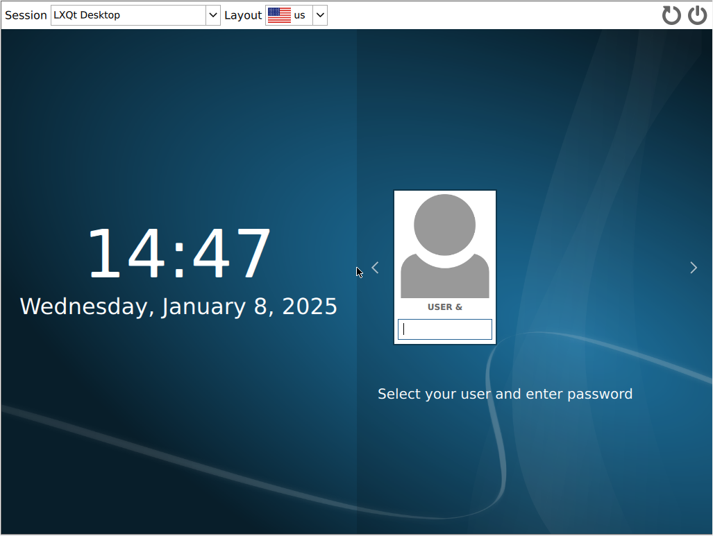
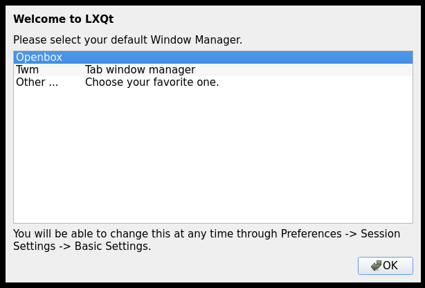
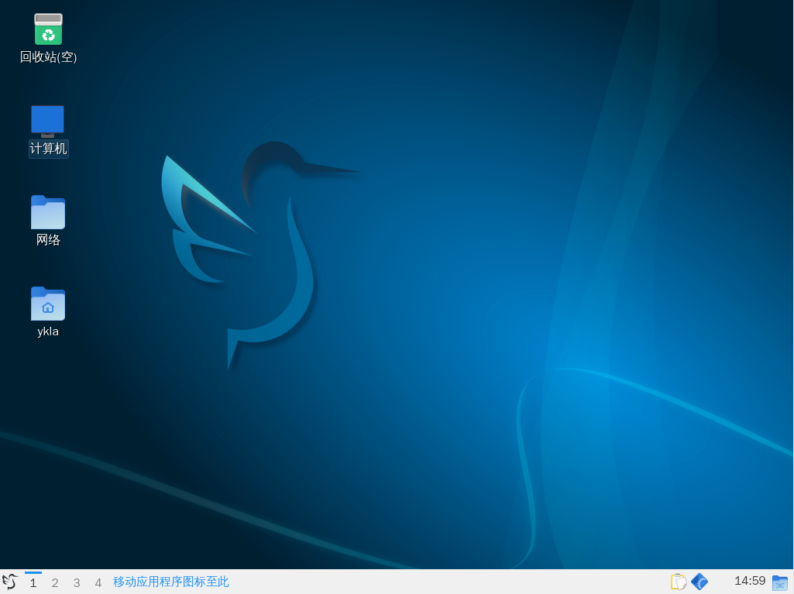

# 第 5.9 节 LXQt

## 安装 LXQt

- 通过 pkg 安装

```sh
# pkg install xorg sddm lxqt gvfs wqy-fonts xdg-user-dirs
```

- 或者使用 Ports 安装：

```sh
# cd /usr/ports/x11/xorg/ && make install clean
# cd /usr/ports/x11-wm/lxqt/ && make install clean
# cd /usr/ports/x11-fonts/wqy/ && make install clean
# cd /usr/ports/x11/sddm/ && make install clean
# cd /usr/ports/devel/gvfs/ && make install clean
# cd /usr/ports/devel/xdg-user-dirs/ && make install clean 
```

解释：

| 包名               | 作用说明                                                                 |
|:--------------------|:--------------------------------------------------------------------------|
| `xorg`             |  X Window 系统 |
| `sddm`             | 登录管理器 |
| `lxqt`             | LXQt 首选的显示管理器 |
| `gvfs`             | GNOME 虚拟文件系统，LXQt 依赖此打开 Computer 和 Network，否则会提示 `Operation not supported`|
| `wqy-fonts`        | 文泉驿中文字体|
| `xdg-user-dirs`    | 管理用户目录，如“桌面”、“下载”等，并处理目录名称的本地化|


## 服务管理


```sh
# service dbus enable
# service sddm enable
```

## `fstab`

编辑 `/etc/fstab`，加入：

```sh
proc	/proc	procfs	rw	0	0
```

## 通过 startx 启动 LXQt

```sh
$ echo "exec ck-launch-session startlxqt" > ~/.xinitrc
```

用谁登录就用哪个账户写。

## 设置中文显示

### 中文化 SDDM

```sh
# sysrc sddm_lang="zh_CN"
```






### 中文化桌面

进入 LXQt 后 菜单 -> "Preferences" -> "LXQt Settings" -> "Locale" -> "Region" 下拉菜单选择中文




## 故障排除与未竟事宜

- 桌面图标不显示

请事先安装自己喜欢的其他图标。然后：菜单 -> "Preferences" -> "LXQt Settings" -> "Appearance" -> "Icons Theme" 选择你安装的图标 -> "Apply" 之后重新登录。

