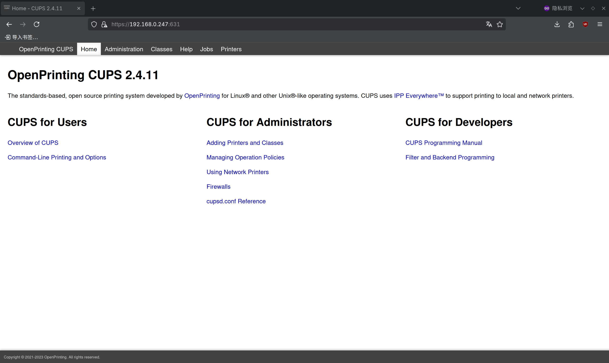
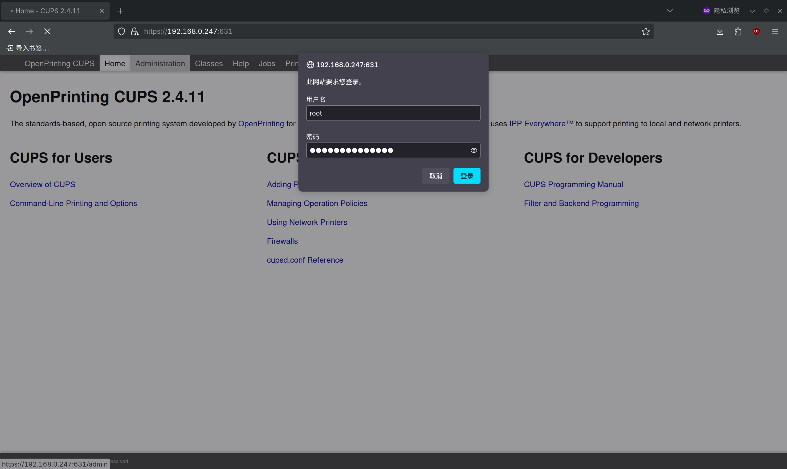
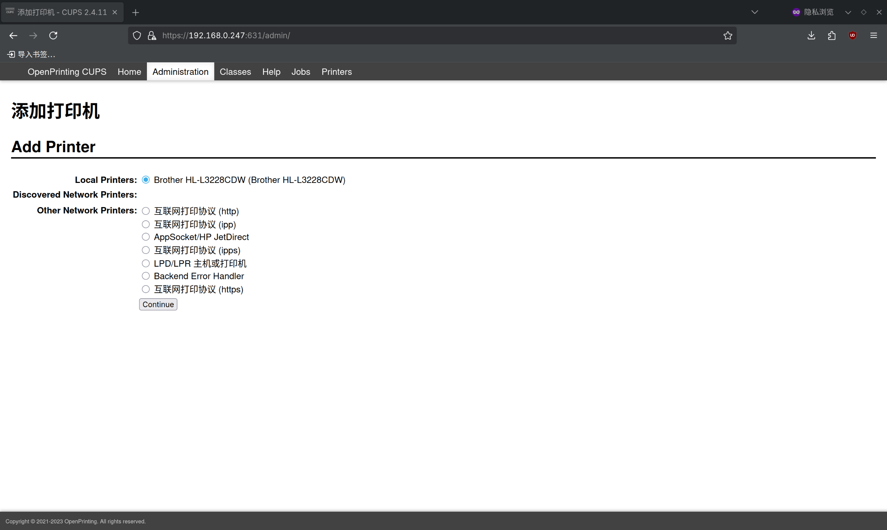
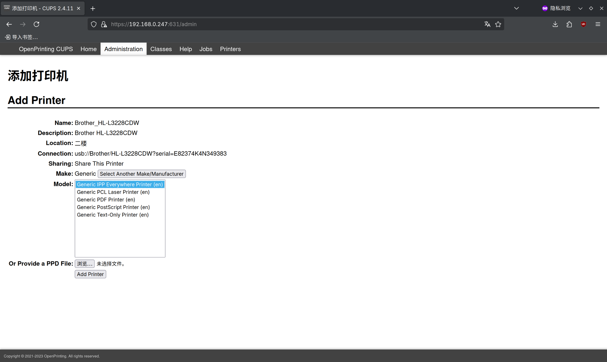
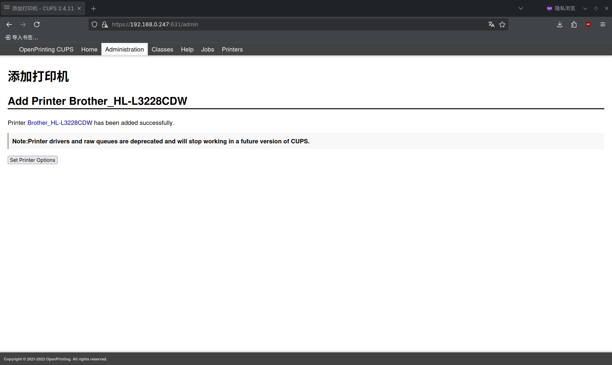

# 第 6.3 节 打印机

CUPS 全称 Common Unix Printing System（通用 Unix 打印系统），支持各种打印协议与打印机设备，并且能将打印机以 IPP 或 SMB 协议共享到网络上。

打印机通过 USB 链接到打印服务器上（即 FreeBSD）。打印服务器将打印机共享到内网里，供内网里的其他电脑使用。内网里面的其他电脑发送广播包，可自动地查询内网里有哪些打印机。无需任何额外操作，需要打印的设备一般可自动发现该打印服务器，并自动将其加入打印机列表，在打印文件的时候即可选择。

本文于 Android、苹果、Debian 测试通过，均可正常发现这台打印服务器


## 安装 CUPS（通用 Unix 打印系统）

- 使用 pkg 安装：

```sh
# pkg install cups cups-filters avahi-app dbus
```

- 或者使用 Ports 安装：

```sh
# cd /usr/ports/print/cups/ && make install clean
# cd /usr/ports/print/cups-filters/ && make install clean
# cd /usr/ports/net/avahi-app/ && make install clean
# cd /usr/ports/devel/dbus/ && make install clean
```

>**技巧**
>
>若使用 KDE，请在 Ports 选项界面中选中 `x11`，可在 KDE 桌面系统中生成添加和配置打印机的应用。

解释：

| 软件包         | 作用描述                                 |
|:----------------|:------------------------------------------|
| `avahi-app`    | Avahi 守护进程，用于内网中的打印机自动发现 |
| `cups`         | 用于提供 CUPS 服务                        |
| `cups-filters` | 用于支持免驱动打印机（即 IPP Everywhere 协议） |
|`dbus`|Avahi 需要|

需要我继续补充其他相关组件吗？

>**技巧**
>
>本文将 FreeBSD 变成了打印服务器。若 FreeBSD 只是想作为打印客户端、用 USB 连接打印机进行打印，而不需要共享，那么 avahi-app 和 dbus 就不是必需的

>**注意**
>
>若打印机不支持免驱动打印，则需要安装对应的驱动

## 添加服务

```sh
# service dbus enable
# service avahi-daemon enable
# service cupsd enable
```

启动服务后，此时，其他设备应该能够自动发现内网中的共享打印机了。尝试打印测试页，测试能否正常打印。

## 向局域网共享打印服务

若不设置该允许局域网访问，则除了 `localhost` 外的机器无法使用。

---

编辑 `/usr/local/etc/cups/cupsd.conf`：

- 在现有的

```ini
Listen localhost:631
Listen /var/run/cups/cups.sock
```

后面添加（IP 为你 FreeBSD 的 IP 地址）：

```ini
Listen IP:631
```

- 再把

```ini
# Restrict access to the server...
<Location />
  Order allow,deny
</Location>

# Restrict access to the admin pages...
<Location /admin>
  AuthType Default
  Require user @SYSTEM
  Order allow,deny
</Location>
```

改为

```ini
# Restrict access to the server...
<Location />
  Allow from 192.168.0.0/24 # 要访问的 IP 所在网段
  Order allow,deny
</Location>

# Restrict access to the admin pages...
<Location /admin>
  Allow from 192.168.0.0/24 # 要访问的 IP 所在网段
  AuthType Default
  Require user @SYSTEM
  Order allow,deny
</Location>
```

如此 CUPS 管理页面即可从局域网内远程访问。

## 添加打印机

在浏览器中输入 `http://IP:631`，该地址为该打印机的管理页面。



点击 `Administration-Add Printer`，根据提示创建打印机。

中途会提示输入账号密码，使用 `root` 或者 `wheel` 组内的用户登录（输入他们在 FreeBSD 系统中的账户密码）即可。



点击 `Add Printer`，添加打印机。


本文中使用的打印机是 Brother HL L3228CDW。



在创建时，请务必勾选 `Share This Printer`。


选择型号。


如果打印机免驱，`Model` 请选择 `Generic IPP Everywhere Printer (en)`；否则需要安装相关驱动，并选择对应型号。



成功添加打印机！



## KDE 桌面添加打印机


## 打印测试页

从内网的 Debian 机器打印测试页：


## 故障排除与未竟事项

- 打印机免驱问题

要确认打印机是否免驱，可以在 <https://openprinting.github.io/printers/> 查询。以本文使用打印机为例：


惠普 Hp 打印机安装 Port `print/hplip` 即可。

