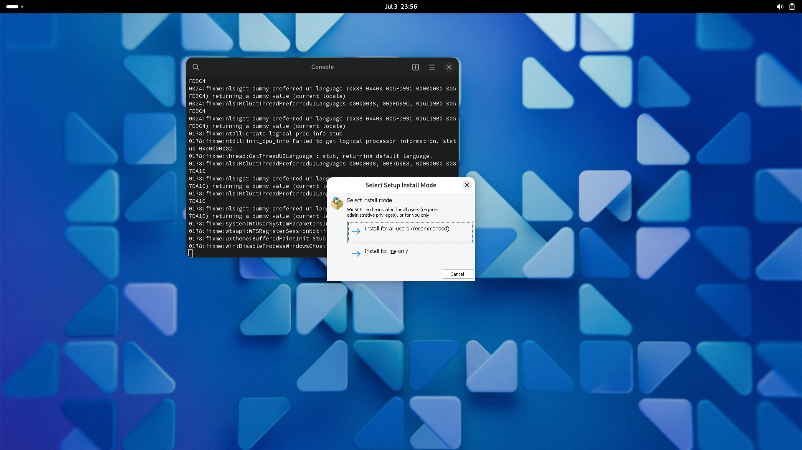
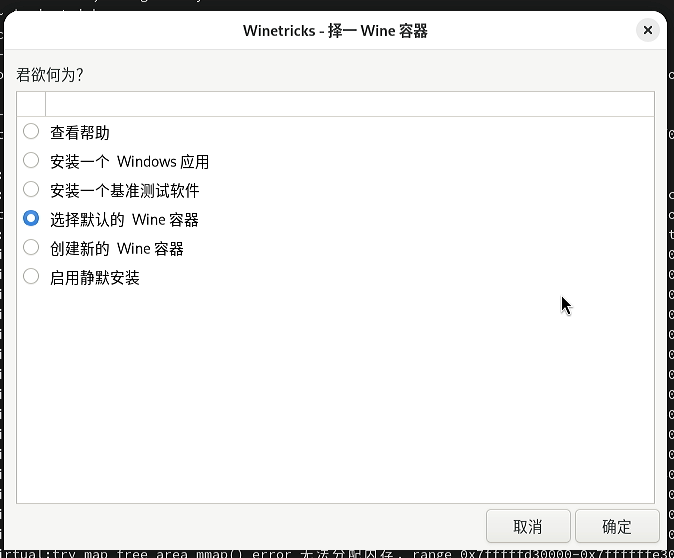

# 6.11 Wine

Wine 是一款能在 Unix 上运行 Microsoft Windows 程序的软件。

>**警告**
>
>以下内容仅在物理机测试通过。因为需要 drm 驱动，故虚拟机无法正常通过（会报错不支持 3D，无法运行）。虚拟机还会报错处理器不支持特定指令集。

## 安装 Wine


```sh
# pkg ins wine wine-gecko wine-mono
```

解释：

|程序|说明|
|:---|:---|
|wine|Wine 主程序|
|wine-gecko|Wine 项目基于火狐的 Gecko 浏览器内核实现的 IE |
|wine-mono|mono 提供了对 .NET 4.8 及更低版本框架的支持|

>**注意**
>
>必须安装 wine-gecko，否则 `winecfg` 会报错找不到 IE。

>**技巧**
>
>不要使用 Ports 安装，因为那样不会自动构建对应版本的 32 位程序。

切换到普通用户，继续安装 wine：

```sh
$ /usr/local/share/wine/pkg32.sh install wine mesa-dri
```

>**注意**
>
>这一步不做，不支持 32 位 Windows 程序。其中 mesa-dri 提供了显卡硬解。

## 配置显卡硬解

参照显卡相关章节配置显卡硬解。

## 配置 Wine

以下均在普通用户下操作：

```sh
$ WINEPREFIX=$HOME/test wine winecfg
```

>**技巧**
>
>WINEPREFIX 是一组目录集合，存放了 Wine 的相关配置文件，以及模拟的 Windows 系统文件。通过修改 WINEPREFIX 可以实现多个配置共存。


如果报错，或者没反应，则：

```sh
$ rm -rf ~/.wine
```

然后

```sh
$ wine winecfg
```

或者

```sh
$ rm -rf $HOME/test
$ WINEPREFIX=$HOME/test wine winecfg
```

## 测试运行 WinSCP（32 位 Windows 程序）

>**技巧**
>
>不需要为 32 位程序单独创建 WINEPREFIX。目前 32 位、64 位程序可以存在于同个 WINEPREFIX 中。

因为大多数用户需要运行 32 位的 Windows 程序，我们检查一下我们的例子是否满足需求：

```sh
ykla@ykla:~ $ file winscp.exe
winscp.exe: PE32 executable for MS Windows 6.01 (GUI), Intel i386, 11 sections
```

使用 Wine 安装并运行 WinSCP：

```sh
$ wine /home/ykla/winscp.exe
```




>**技巧**
>
>安装成功后，会在系统生成对应的图标，经过测试，双击即可正常运行。

## Winetricks

Winetricks 是个脚本（近两万行的脚本），封装了许多有关 Wine 的实用功能。比如安装卸载软件，安装字体等。可以规避许多常见的 Wine 问题。

### 安装 Winetricks

- 使用 pkg 安装：

```sh
# pkg install winetricks
```

- 还可以使用 Ports 安装：

```sh
# cd /usr/ports/emulators/winetricks/
# make install clean
```

### 使用 Winetricks 安装中文字体

>**注意**
>
>下载字体可能需要链接到 Github，你需要保障你的网络正常。


运行 Winetricks：

```sh
$ winetricks
```

即可。

>**技巧**
>
>不用理会他在终端输出的有关 64 位和 32 位 Wine 的警告信息：
>
>`warning: You are using a 64-bit WINEPREFIX. Note that many verbs only install 32-bit versions of packages. If you encounter problems, please retest in a clean 32-bit WINEPREFIX before reporting a bug.`





我们安装最后两个中文字体试一下。安装后大多数程序都能正常显示中文了。

## 故障排除与未竟事宜

### Wine 界面设置中文

待解决

