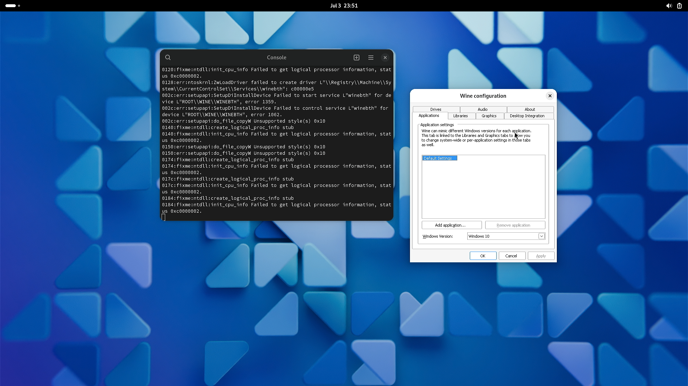
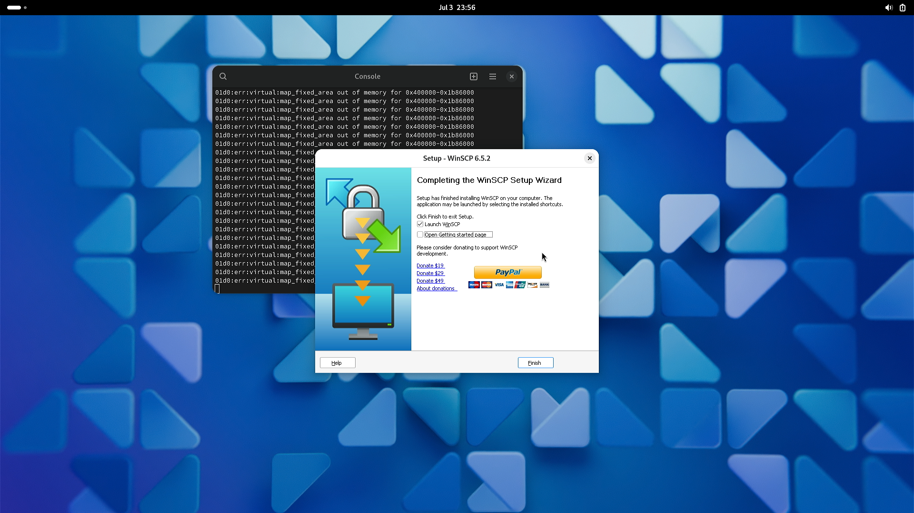

# 6.11 Wine

>**警告**
>
>以下内容在物理机测试通过。因为需要 drm 驱动，故虚拟机无法正常通过（会报错不支持 3D，无法运行）。

## 安装 Wine 及其相关工具


```sh
# pkg ins wine wine-gecko wine-mono
```

>**注意**
>
>必须安装 wine-gecko，否则 `wine cfg` 会报错找不到 IE。

>**技巧**
>
>不要使用 Ports 安装，因为那样不会自动构建对应版本的 32 位程序。

切换到普通用户，继续安装 wine：

```sh
$ /usr/local/share/wine/pkg32.sh install wine mesa-dri
```

>**注意**
>
>这一步不做，不支持 32 位 Windows 程序。

## 配置显卡硬解

参照显卡相关章节配置显卡硬解。

## 配置 Wine

以下均在普通用户下操作：

```sh
$ WINEPREFIX=$HOME/test wine winecfg
```



如果报错，或者没反应，则：

```sh
$ rm -rf ~/.wine
```

然后

```sh
$ wine winecfg
```

或者

```sh
$ rm -rf $HOME/test
$ WINEPREFIX=$HOME/test wine winecfg

## 测试运行 WinSCP（32 位 Windows 程序）

因为大多数用户需要运行 32 位的 Windows 程序，我们检查一下我们的例子是否满足需求：

```sh
ykla@ykla:~ $ file winscp.exe
winscp.exe: PE32 executable for MS Windows 6.01 (GUI), Intel i386, 11 sections
```

使用 Wine 安装并运行 WinSCP：

```sh
$ wine /home/ykla/winscp.exe
```





>**技巧**
>
>安装成功后，会在系统生成对应的图标，经过测试，双击即可正常运行。

## 故障排除与未竟事宜

### Wine 界面设置中文

待解决

### Wine 导入中文字体

待解决

