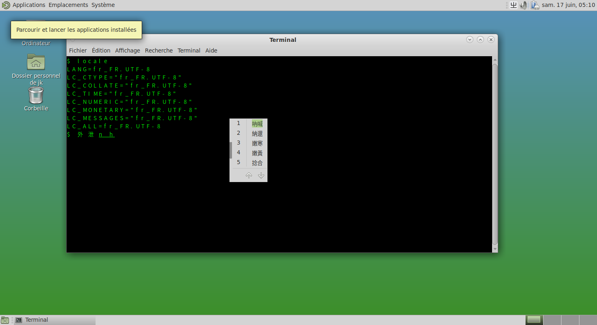

# 第 5.3 节 IBus 输入法框架

IBus 即“Intelligent Input Bus”（智能输入总线）。

## IBus

- 使用 pkg 安装：

```sh
# pkg install ibus zh-ibus-pinyin
```

- 或者使用 Ports 安装：

```
# cd /usr/ports/textproc/ibus/ && make install clean
# cd /usr/ports/chinese/ibus-libpinyin/ && make install clean
```

其中 `zh-ibus-pinyin` 为拼音输入法

可选的还有

- `chinese/ibus-cangjie` 仓颉输入法
- `chinese/ibus-chewing` 酷音输入法
- `chinese/ibus-rime` rime 输入法引擎（另述）
- `chinese/ibus-table-chinese` 包含五笔、仓颉等多种输入法

## 配置环境变量

1. sddm lightdm gdm 都可以在 `~/.xprofile` 中写入 A 组配置
2. lightdm gdm 可以在 `~/.profile` 中写入 A 组配置
3. sddm 可以在用户登录 shell 配置文件中写入配置

---

- sh: `~/.profile` 写入 A 组配置
- bash: `~/.bash_profile` 或 `~/.profile` 写入 A 组配置
- zsh: `~/.zprofile` 写入 A 组配置
- csh: `~/.cshrc` 写入 B 组配置

注销后登录，直接点击 ibus 图标加入自己的输入法后，即可使用，无需包括中文化设置（测试环境 sddm/xfce/freebsd 13.2/sh）在内的任何配置。但 IBus 提示应当在相应的 shell 文件中加入以下内容：

- A 组（在 sh、bash、zsh 中）：

```sh
export XIM=ibus
export GTK_IM_MODULE=ibus
export QT_IM_MODULE=ibus
export XMODIFIERS=@im=ibus
export XIM_PROGRAM="ibus-daemon"
export XIM_ARGS="--daemonize --xim"
```

- B 组（在 csh 中）：

```sh
setenv XIM ibus
setenv GTK_IM_MODULE ibus
setenv QT_IM_MODULE ibus
setenv XMODIFIERS @im=ibus
setenv XIM_PROGRAM ibus-daemon
setenv XIM_ARGS "--daemonize --xim"
```

## IBus 设置

```sh
$ ibus-setup
```

---

IBus 对编码（须 `UTF-8`）有要求，但对区域（如 `C.UTF-8` 还是 `zh_CN.UTF-8`）并无要求。



