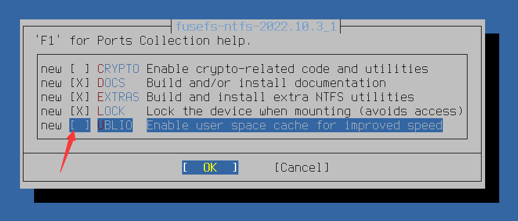

# 第 6.4 节 NTFS

安裝 ntfs-3g 软件:

>**警告**
>
>由于 [Bug 206978 - sysutils/fusefs-ntfs: Disable UBLIO as it breaks mkntfs](https://bugs.freebsd.org/bugzilla/show_bug.cgi?id=206978) 和 [Bug 194526 - sysutils/fusefs-ntfs: ntfs-3g with libublio lost files](https://bugs.freebsd.org/bugzilla/show_bug.cgi?id=194526)。请勿使用 pkg 安装，请使用 Ports：

```sh
# cd /usr/ports/filesystems/fusefs-ntfs/
# make config
```




取消勾选 `UBLIO`，再编译安装：


```sh
# make BATCH=yes install clean
```


把你的 ntfs 格式的硬盘/U 盘插入计算机。这时候你会看到它的设备名，例如 `da0`（见 `/dev/da0`）。

修改 `rc.conf`：

```sh
# sysrc kld_list+="fusefs"
```

## 创建 nfts 分区

1. MBR 分区表

```
# gpart create -s mbr da0    #  使用 mbr 分区，如果已经是，则不需要
# gpart add -t ntfs da0
```

2. GPT 分区表

```
# gpart create -s gpt da0    #  使用 gpt 分区，如果已经是，则不需要
# gpart add -t ms-basic-data da0
```

## 格式化 ntfs 分区


```sh
# mkntfs -vf /dev/da0s1
```

- `-f` 表示快速格式化。`-v` 表示详细输出。


### 参考文献

[ntfs on freebsdn](https://www.gridbugs.org/ntfs-on-freebsd/)


## 修改 fstab 自动挂载

为了开机自动挂载，修改添加

```sh
# ee /etc/fstab
```

加入：

```sh
/dev/da0s1  /media/NTFS ntfs  rw,mount_prog=/usr/local/bin/ntfs-3g,late  0  0
```

## 手动挂载

```sh
# ntfs-3g  /dev/da0s1  /media/NTFS   -o  rw,uid=1000,gid=1000,umask=0
```

如果不知道哪个磁盘分区是 NTFS，可以用命令来查看

```sh
# fstyp /dev/da0s1
```

**注意：如果报错，尝试删除休眠文件：**

```sh
# ntfs-3g  /dev/da0s1 /mnt/NTFS -o remove_hiberfile
```

如果还是有问题：

```sh
# ntfsfix /dev/da0s1
```

然后重新挂载。

详细参数见 [ntfs-3g manpage](https://www.freebsd.org/cgi/man.cgi?query=ntfs-3g&format=html)。如果无法挂载请先关闭 windows 的休眠，然后重启几次。
