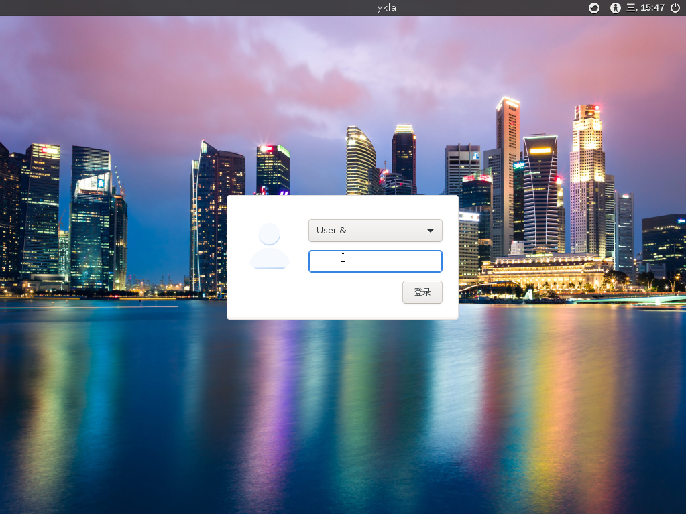
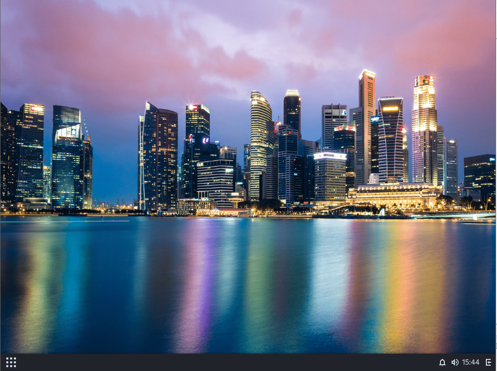
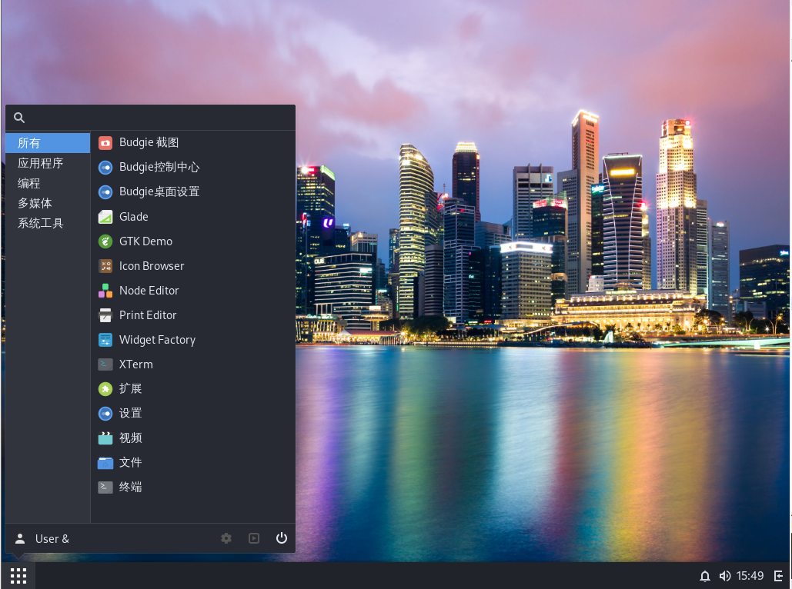

# 6.10 Budgie（拟删除）

>目前 Budgie 无法正常登录桌面。[Bug 289898 x11/budgie: After logging in with LightDM, it crashes and then shows a black screen](https://bugs.freebsd.org/bugzilla/show_bug.cgi?id=289898)。若在六个月内（2025-04-01 日前）未得到解决将删除“6.10 Budgie”。

Budgie 是 [Solus Linux](https://getsol.us/) 的默认桌面环境。

## 安装

- 使用 pkg 安装：

```sh
# pkg install budgie wqy-fonts xorg
```

- 或者使用 Ports 安装：

```sh
# cd /usr/ports/x11/xorg && make install clean
# cd /usr/ports/x11/budgie && make install clean
# cd /usr/ports/x11-fonts/wqy/ && make install clean
```

>**技巧**
>
>作为依赖，会自动安装 LightDM。

- 软件包说明：

| 包名             | 功能说明        |
|:------------------|:--------------------------|
| `budgie`         | 桌面环境 |
| `wqy-fonts`      | 文泉驿中文字体       |
|`xorg`|X11 系统 |

## 查看安装提示

```sh
In order to launch your session. Copy 'xprofile' into your home directory:
# 为了启动你的会话，请将 'xprofile' 文件复制到你的主目录：

  cp /usr/local/share/examples/budgie/xprofile ~/.xprofile
# 执行以上命令，将示例配置文件复制到主目录下的 .xprofile

Create or edit /var/db/AccountsService/users/YOURLOGIN file:
# 创建或编辑 /var/db/AccountsService/users/YOURLOGIN 文件：

  [User]
  # 用户配置部分

  Language=fr_FR.UTF-8 # e.g. for French users
  # 语言设置，例如这里是法语用户

  Session=budgie-desktop
  # 会话设置为 budgie-desktop

  SystemAccount=false
  # 设置为 false，表示这是普通用户而不是系统账户

Replace YOURLOGIN by your login.
# 将 YOURLOGIN 替换为你的实际用户名。
```

## 配置 `startx`

将 Budgie 桌面示例 xprofile 文件复制到用户主目录：

```sh
$ cp /usr/local/share/examples/budgie/xprofile ~/.xprofile
```

## 创建 AccountsService 用户配置

- 创建所需路径

```sh
# mkdir -p /var/db/AccountsService/users/
```

- 创建 `/var/db/AccountsService/users/ykla` 并写入文件：

```ini
[User]
Language=zh_CN.UTF-8  # 设置用户界面语言为中文
Session=budgie-desktop  # 指定使用 Budgie 桌面会话
SystemAccount=false  # 标记该用户不是系统账户
```

>**注意**
>
>根据安装后提示，`ykla` 应改为你自己的用户名。

## 服务管理

```sh
# service dbus enable  # 设置 D-Bus 服务开机自启
# service lightdm enable  # 设置 LightDM 显示管理器开机自启
```

## 中文语言环境


编辑 `/etc/login.conf`：找到 `default:\` 这一段，将 `:lang=C.UTF-8` 修改为 `:lang=zh_CN.UTF-8`。


根据 `/etc/login.conf` 生成能力数据库：

```sh
# cap_mkdb /etc/login.conf
```

## 桌面欣赏





图中壁纸为默认壁纸。拍摄地为新加坡滨海湾区。



## 参考文献

- [Installation](https://codeberg.org/olivierd/freebsd-ports-budgie/wiki/Installation)，本文主要补充自此处，但经测试无需配置 `05-suspend.rules` 也可以实现关机和重启。

