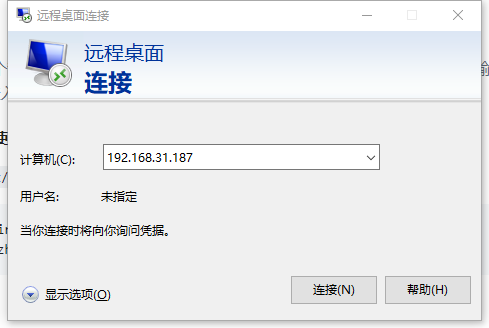
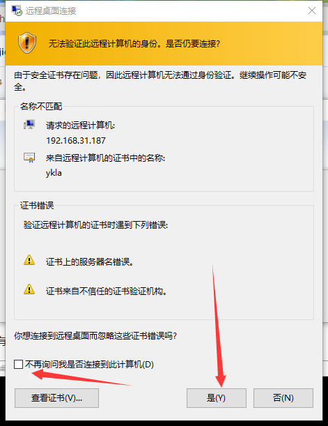
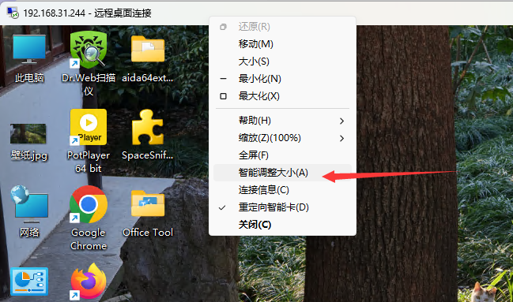
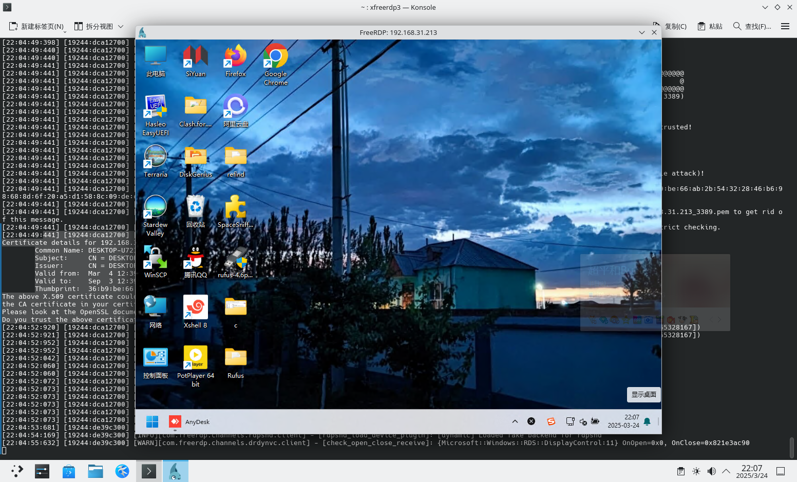
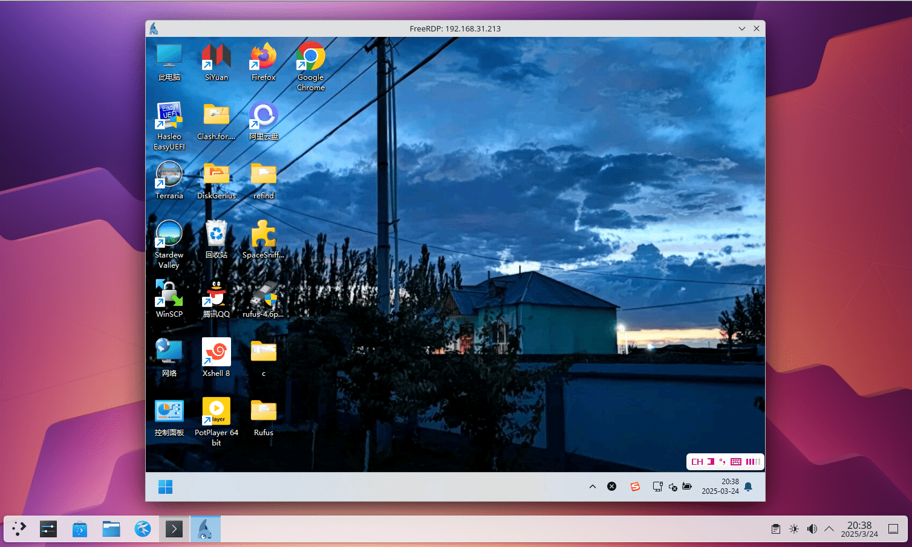
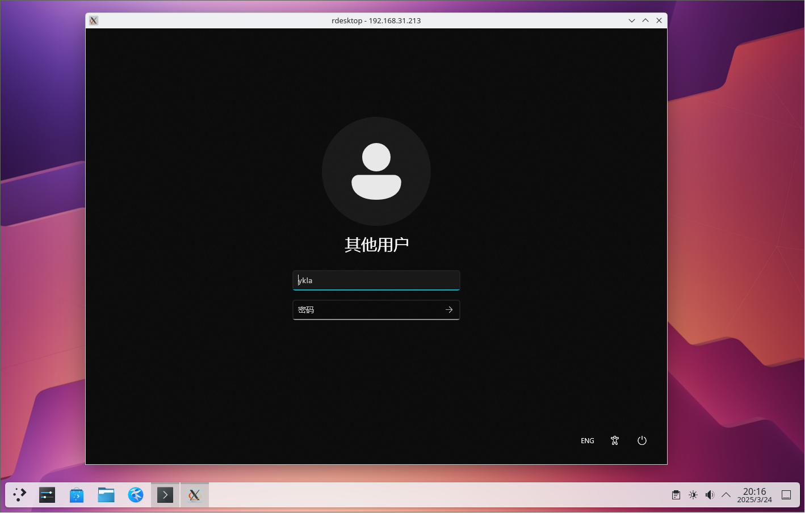
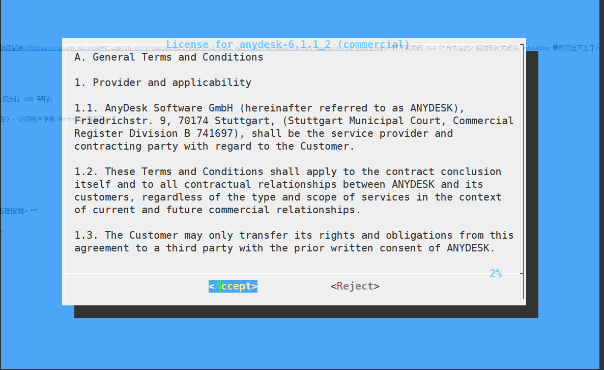
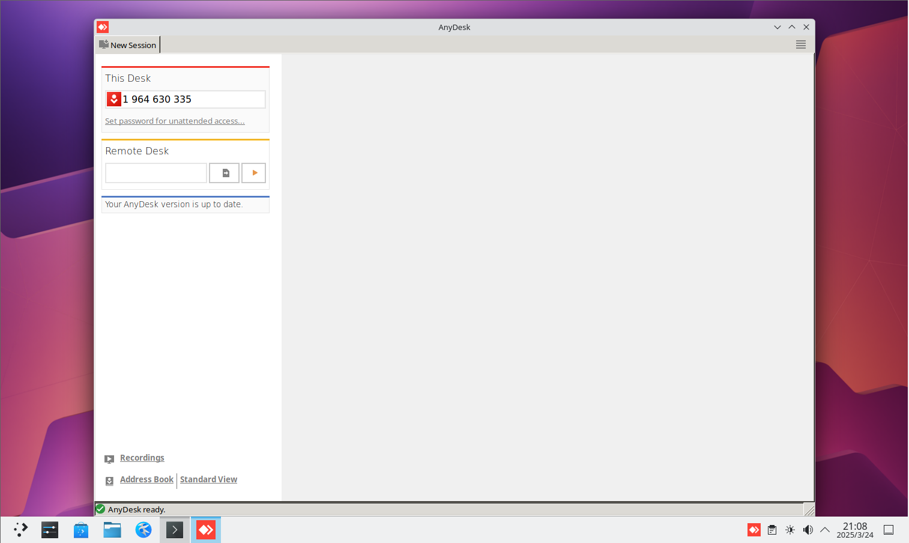
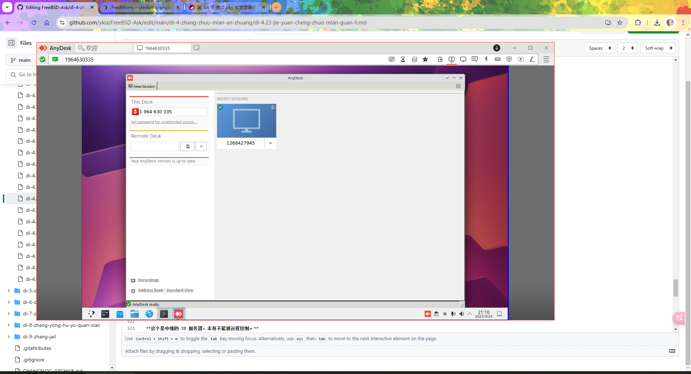
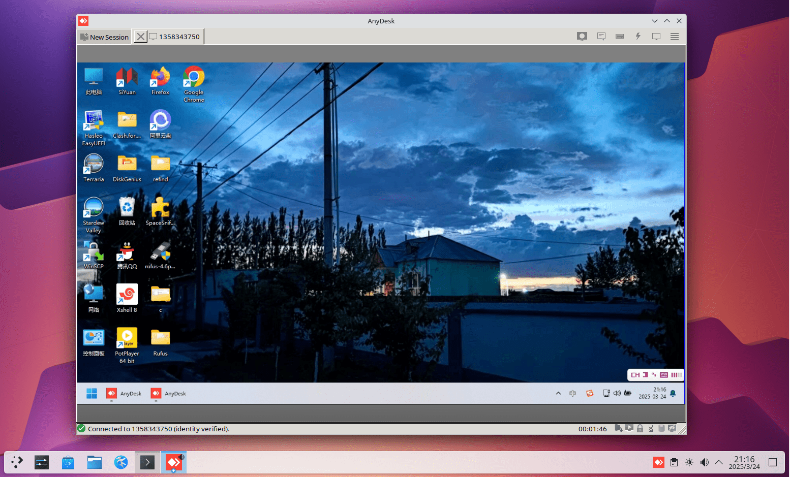

# 6.14 远程桌面

## x11vnc（FreeBSD 为被控端，镜像屏幕）

x11vnc 会和远程软件 todesk 一样直接镜像屏幕，简言之，你的所有操作都会同步到显示器上，反过来在显示器上的操作你在 VNC 上也可以看到。

如果没有显示器则无法使用 x11vnc（可考虑使用 HDMI 显卡欺骗器）。

### 安装 x11vnc

- 使用 pkg 安装：

```
# pkg install x11vnc
```

- 或使用 Ports 安装：

```sh
# cd /usr/ports/net/x11vnc/
# make install clean
```

### 创建密码

设置 x11vnc 的访问密码：

```sh
$ x11vnc -storepasswd
Enter VNC password: 
Verify password:    
Write password to /root/.vnc/passwd?  [y]/n y #此处键入 y 回车
Password written to: /root/.vnc/passwd
```

### 启动服务器（KDE 6 SDDM）

- 使用指定密码文件和 SDDM 授权文件启动 x11vnc：

```sh
$ x11vnc -display :0 -rfbauth ~/.vnc/passwd -auth $(find /var/run/sddm/ -type f)
```

>**警告**
>
> SDDM 左下角选择 `Wayland` 无法进入，因为 x11vnc 尚不支持 Wayland。


- 使用指定密码文件和 LightDM 授权文件启动 x11vnc：

```sh
$ x11vnc -display :0 -rfbauth ~/.vnc/passwd -auth /var/run/lightdm/root/\:0
```

- 使用指定密码文件和 GDM 授权文件启动 x11vnc：

```sh
$ x11vnc -display :0 -rfbauth ~/.vnc/passwd -auth /var/lib/gdm/:0.Xauth # 或 /run/user/120/gdm/Xauthority，取决于你的 gdm 版本，可自行 ls 查看
```


### 参考文献

- [x11vnc -allow VNC connections to real X11 displays](https://man.freebsd.org/cgi/man.cgi?query=x11vnc&sektion=&manpath=freebsd-release-ports)
- [X11vnc](https://wiki.archlinux.org/title/X11vnc)
  
## TigerVNC（FreeBSD 为被控端）

启用 VNC 服务（目前 Ports 中仅剩此 [TigerVNC](https://www.freshports.org/net/tigervnc-server/)）

### 安装 TigerVNC Server

```sh
# pkg install tigervnc-server
```

或者：

```sh
# cd /usr/ports/net/tigervnc-server/ 
# make install clean
```

### 做一些设置

创建 `~/.vnc/` 路径：

```sh
$ mkdir -p ~/.vnc/
```

编辑 `~/.vnc/xstartup` 文件，新增以下行：

```sh
#!/bin/sh
unset SESSION_MANAGER        # 清除 SESSION_MANAGER 环境变量
unset DBUS_SESSION_BUS_ADDRESS  # 清除 DBUS_SESSION_BUS_ADDRESS 环境变量
[ -x /etc/X11/xinit/xinitrc ] && exec /etc/X11/xinit/xinitrc  # 如果 xinitrc 可执行则运行
[ -f /etc/X11/xinit/xinitrc ] && exec sh /etc/X11/xinit/xinitrc  # 否则以 sh 运行 xinitrc 文件
xsetroot -solid grey        # 设置 X 根窗口背景为灰色
#exec startplasma-x11 &      # 启动 KDE Plasma（注释示例）
#exec mate-session &         # 启动 MATE 桌面（注释示例）
#exec xfce4-session &        # 启动 XFCE4 桌面（注释示例）
#exec gnome-session &        # 启动 GNOME 桌面（注释示例）
```

读者使用哪个桌面，就删除该桌目前面的注释 `#` 即可。


>**警告**
>
>请注意保留 `&`。

设置 xstartup 脚本为可执行权限：

```sh
$ chmod 755 ~/.vnc/xstartup
```

- 接下来在终端执行命令启动 VNC 服务器：

```sh
$ vncserver
```

或在显示 `:1` 上启动 VNC 服务器：

```sh
$ vncserver :1

You will require a password to access your desktops.

Password: # 注意，密码最少六位数！
Verify:
Would you like to enter a view-only password (y/n)? n
A view-only password is not used

New 'ykla:1 (ykla)' desktop is ykla:1

Creating default config /home/ykla/.vnc/config
Starting applications specified in /home/ykla/.vnc/xstartup
Log file is /home/ykla/.vnc/ykla:1.log
```

其中 `:1` 表示 `DISPLAY=:1`，即指定桌面显示的通信端口为 `1`，对应 VNC 服务端口为 `5901`。桌面显示通信端口从 0 开始，但该端口已被当前桌面占用（除非是镜像 VNC），因此 VNC 服务默认端口为 5900，但实际执行时从 `5901` 开始。故连接时必须指定端口为 `5901`。

>测试：
>
>```sh
>$ vncserver :0
>
>
>Warning: ykla:0 is taken because of /tmp/.X11-unix/X0
>Remove this file if there is no X server ykla:0
>A VNC server is already running as :0
>```

如果启动服务时未指定通信端口，则系统将根据情况自动分配。

显示当前用户的进程列表：

```sh
$ ps
 PID TT  STAT    TIME COMMAND
……省略无用内容……
4769  0  S    0:02.72 /usr/local/bin/Xvnc :1 -auth /home/ykla/.Xauthority -desktop ykla:1 (ykla)
```

关闭服务请使用命令 `vncserver -kill :1`，必须指定通信端口。


- 如果启用了防火墙，以 ipfw 为例，可在终端输入命令：

```sh
# ipfw add allow tcp from any to me 5900-5910 in keep-state
```

上述命令表示放通端口 5900-5910，即 DISPLAY 0-10。

### 参考文献

- [Xfce4 is not displayed correctly when I connect vncviewer (in Linux) to tightvnc-server (on FreeBSD)](https://forums.freebsd.org/threads/xfce4-is-not-displayed-correctly-when-i-connect-vncviewer-in-linux-to-tightvnc-server-on-freebsd.85709/)

## XRDP（FreeBSD 为被控端）

### 安装 XRDP（基于 KDE6）

```sh
# pkg install xorg kde xrdp wqy-fonts xdg-user-dirs pulseaudio-module-xrdp
```

或者：

```sh
# cd /usr/ports/x11/xorg/ && make install clean
# cd /usr/ports/x11/kde/ && make install clean
# cd /usr/ports/net/xrdp/ && make install clean
# cd /usr/ports/x11-fonts/wqy/ && make install clean
# cd /usr/ports/devel/xdg-user-dirs/ && make install clean
# cd /usr/ports/audio/pulseaudio-module-xrdp && make install clean
```

查看配置文件：

```sh
# pkg info -D xrdp
xrdp-0.10.2_2,1:
On install:
xrdp has been installed.
# xrdp 已成功安装。

There is an rc.d script, so the service can be enabled by adding this line
in /etc/rc.conf:

xrdp_enable="YES"
xrdp_sesman_enable="YES"
# 提供了 rc.d 启动脚本，可通过在 /etc/rc.conf 中添加以上两行启用服务。
# 第一个启动 xrdp 主服务，第二个启动会话管理器（sesman）。

Do not forget to edit the configuration files in "/usr/local/etc/xrdp"
and the "/usr/local/etc/xrdp/startwm.sh" script.
# 别忘了编辑 /usr/local/etc/xrdp 下的配置文件，
# 以及修改 /usr/local/etc/xrdp/startwm.sh 来设置登录后启动的桌面环境。

To enable audio redirection, install the following ports/packages to meet
your environment.
# 如需启用音频重定向（远程桌面声音传输），请根据你的系统环境安装以下软件包：

- audio/pipewire-module-xrdp
- audio/pulseaudio-module-xrdp
# 上述为支持 xrdp 音频的模块，可根据你使用的音频系统选择安装。
```

### 配置 XRDP

- 配置守护进程

```sh
# service xrdp enable          # 设置 xrdp 服务开机自启
# service xrdp-sesman enable   # 设置 xrdp-sesman 服务开机自启
# service dbus enable          # 设置 dbus 服务开机自启
```

编辑 `/usr/local/etc/xrdp/startwm.sh`，找到 `#### start desktop environment`，修改如下：

```ini
#### start desktop environment
# exec gnome-session              # 启动 GNOME 桌面，需删除开头的 #
# exec mate-session               # 启动 MATE 桌面，需删除开头的 #
# exec start-lumina-desktop       # 启动 Lumina 桌面，需删除开头的 #
# exec ck-launch-session startplasma-x11  # 启动 KDE6 桌面，需删除开头的 #
# exec startxfce4                 # 启动 XFCE 桌面，需删除开头的 #
# exec xterm                      # 启动 XTerm，需删除开头的 #
```

然后重启系统即可。

### 中文化 (用户使用默认的 sh）


编辑 `/usr/local/etc/xrdp/startwm.sh`，添加或修改以下内容以设置环境变量：

```sh
#### set environment variables here if you want
export LANG=zh_CN.UTF-8
```

设置系统语言为中文。

### 故障排除与未竟事宜

#### XRDP 没声音

请读者试试火狐浏览器。

## 通过 Windows 使用 TigerVNC 远程访问 FreeBSD

下载 TigerVNC 查看器：

下载地址：<https://sourceforge.net/projects/tigervnc/files/stable/>

查看 FreeBSD 的 VNC 端口：

```sh
# sockstat -4l
USER     COMMAND    PID   FD  PROTO  LOCAL ADDRESS         FOREIGN ADDRESS      
root     Xvnc        2585 4   tcp4   127.0.0.1:5910        *:*  #VNC 占用
root     xrdp        2580 13  tcp46  *:3389                *:*  #XRDP 占用
root     Xvnc        2016 5   tcp4   *:5901                *:*  #VNC 占用
root     sshd        1164 4   tcp4   *:22                  *:*  #SSH 占用
ntpd     ntpd        1127 21  udp4   *:123                 *:* 
ntpd     ntpd        1127 24  udp4   127.0.0.1:123         *:*
ntpd     ntpd        1127 26  udp4   192.168.31.187:123    *:*
root     syslogd     1021 7   udp4   *:514                 *:*
```

### 故障排除与未竟事宜

#### 由于目标服务器积极拒绝，无法连接

非镜像 VNC 在连接时必须指定端口，否则按默认端口 5900 进行连接。因为你使用的不是镜像屏幕（非 x11vnc），所以无法连接。


示例：

```sh
192.168.31.187:5901
```


#### 通过 VNC 远程 FreeBSD 没声音

不知道怎么配置。

## 通过 Windows 自带的桌面远程连接（RDP）远程访问 FreeBSD



首次登录设备会有安全提示，输入 `yes`，回车后就会弹出远程桌面窗口。




### 故障排除与未竟事宜

#### 如果 Windows 的远程桌面窗口既不在左上角也未全屏显示，则会模糊

请 **取消** 勾选“智能调整大小”。



## 使用 Android 通过 XRDP 远程访问 FreeBSD

首先需要下载所需软件：

由微软官方开发的手机 RDP 软件：Remote Desktop

- [Remote Desktop](https://play.google.com/store/apps/details?id=com.microsoft.rdc.androidx&hl=zh_CN)

该软件操作便捷。

请注意，须将左上 🖱️ 改为 👆。默认的鼠标操作很不方便：或者读者也可以选择手机 OTG 一个鼠标和键盘。


连接示意图（后台正在编译 Chromium，故占用会很高）：


## 通过 FreeBSD 以 XRDP 远程访问 Windows

### freerdp3（新稳定版，支持 NLA）

使用 pkg 安装：

```
# pkg ins freerdp3
```

或者用 Ports：

```sh
# cd /usr/ports/net/freerdp3/ 
# make install clean
```

使用 FreeBSD 通过 freerdp3 远程连接到 Windows 11 24H2：

```sh
$ xfreerdp3 /u:ykla /p:z  /v:192.168.31.213

……省略一部分……
441] [19244:dca12700] [ERROR][com.freerdp.crypto] - [tls_print_new_certificate_warn]: Host key verification failed.
Certificate details for 192.168.31.213:3389 (RDP-Server):
        Common Name: DESKTOP-U72I6SS
        Subject:     CN = DESKTOP-U72I6SS
        Issuer:      CN = DESKTOP-U72I6SS
        Valid from:  Mar  4 12:39:28 2025 GMT
        Valid to:    Sep  3 12:39:28 2025 GMT
        Thumbprint:  36:b9:be:66:ab:2b:54:32:28:46:b6:98:68:8d:6f:20:a5:d1:58:8c:09:de:cc:3d:30:e1:06:6f:4f:62:54:de
The above X.509 certificate could not be verified, possibly because you do not have
the CA certificate in your certificate store, or the certificate has expired.
Please look at the OpenSSL documentation on how to add a private CA to the store.
Do you trust the above certificate? (Y/T/N) y # 输入 y 按回车键以确认连接
```

解释：`xfreerdp3 /u:ykla /p:z  /v:192.168.31.213` 参数：

- `xfreerdp3`，注意前面有个 `x`。
- `/u:ykla`，`/u:` 即 Username 用户名。`ykla` 是笔者 Windows 的登录名
- `/p`，即 Password 密码。`z` 是笔者 Windows 用户 `ykla` 的登录密码
- `/v:`，即 Server 服务器。



#### 参考文献

- [FreeRDP User Manual](https://github.com/awakecoding/FreeRDP-Manuals/blob/master/User/FreeRDP-User-Manual.markdown)，里面命令说明和一些用法示例


### freerdp2（旧稳定版，支持 NLA）

使用 pkg 安装：

```sh
# pkg ins freerdp
```

或者用 Ports：

```sh
# cd /usr/ports/net/freerdp/ 
# make install clean
```

使用 FreeBSD 远程链接到 Windows 11 24H2：

```sh
$ xfreerdp 192.168.31.213 # 注意是 xfreerdp。
[20:35:20:041] [1105:7c412000] [WARN][com.freerdp.client.common.cmdline] - ----------------------------------------
……省略一部分……
Certificate details for 192.168.31.213:3389 (RDP-Server):
        Common Name: DESKTOP-U72I6SS
        Subject:     CN = DESKTOP-U72I6SS
        Issuer:      CN = DESKTOP-U72I6SS
        Thumbprint:  36:b9:be:66:ab:2b:54:32:28:46:b6:98:68:8d:6f:20:a5:d1:58:8c:09:de:cc:3d:30:e1:06:6f:4f:62:54:de
The above X.509 certificate could not be verified, possibly because you do not have
the CA certificate in your certificate store, or the certificate has expired.
Please look at the OpenSSL documentation on how to add a private CA to the store.
Do you trust the above certificate? (Y/T/N) y # 输入 y 回车
Domain:   # 留空
Password: # 输入密码，密码不会显示出来 ***。
……省略一部分……
```



#### 故障排除与未竟事宜

- 但是笔者没有输入用户名就连上了？

不知道。难道是因为笔者的 FreeBSD 用户名和 Windows 是一样的？

### rdesktop（不支持 NLA）

`net/xrdesktop2` 是 rdesktop 的图形化前端，但笔者打开里面的键盘设置就卡死了。

---

使用 pkg 安装 rdesktop：

```sh
# pkg install rdesktop
```

或者用 Ports：

```sh
# cd /usr/ports/net/rdesktop/
# make install clean
```

rdesktop 无前端 GUI，故要在终端输入命令：

```sh
# rdesktop ip:端口 # 比如 192.168.31.155:3389
```

如果没有特意更改 Windows 配置，无须加 `:端口`。

对于笔者测试的 Windows 11 24H2 会报错：

```sh
$ rdesktop 192.168.31.213
Failed to connect, CredSSP required by server (check if server has disabled old TLS versions, if yes use -V option).
```

根据 [CredSSP does not work](https://github.com/rdesktop/rdesktop/issues/71)，是个老问题了。

影响安全的解决方案是禁用网络级身份验证（NLA），在要远程连接的 Windows 上操作：

```powershell
PS C:\Users\ykla> reg add "HKEY_LOCAL_MACHINE\SYSTEM\CurrentControlSet\Control\Terminal Server\WinStations\RDP-Tcp" /v UserAuthentication /t REG_DWORD /d 0 /f  # 导入相关注册表
操作成功完成。
PS C:\Users\ykla> gpupdate /force  # 强制刷新组策略
正在更新策略...

计算机策略更新成功完成。
用户策略更新成功完成。
```

再测试连接：

```sh
$ rdesktop 192.168.31.213

ATTENTION! The server uses and invalid security certificate which can not be trusted for
the following identified reasons(s);

 1. Certificate issuer is not trusted by this system.

     Issuer: CN=DESKTOP-U72I6SS


Review the following certificate info before you trust it to be added as an exception.
If you do not trust the certificate the connection atempt will be aborted:

    Subject: CN=DESKTOP-U72I6SS
     Issuer: CN=DESKTOP-U72I6SS
 Valid From: Tue Mar  4 20:39:28 2025
         To: Wed Sep  3 20:39:28 2025

  Certificate fingerprints:

       sha1: 599c0e8bbc57c5ee8de8993d5241fb0f0d70e98d
     sha256: 36b9be66ab2b54322846b698688d6f20a5d1588c09decc3d30e1066f4f6254de


Do you trust this certificate (yes/no)? # 输入 yes，按回车键
```




#### 故障排除与未竟事宜

##### 看视频没声音

待解决

#### 参考文献

- [使用 RDP 连接到 Azure VM 时排查身份验证错误](https://learn.microsoft.com/zh-cn/troubleshoot/azure/virtual-machines/windows/cannot-connect-rdp-azure-vm)，打开和关闭 NLA 的方法在此。经过测试关闭后 rdesktop 果然又连不上了。


## AnyDesk

使用 AnyDesk 可进行远程访问，FreeBSD 上仅支持 x86 架构：

由于版权原因（私有软件未经许可禁止分发），必须用户使用 Ports 自行编译：

```sh
# cd /usr/ports/deskutils/anydesk/
# make install clean
```

不可使用 `BATCH=yes` 参数，因为需要接受许可协议才能使用：



查看 AnyDesk 安装后说明：

```sh
# pkg info -D anydesk
anydesk-6.1.1_2:
On install:
1. Minimum OS version.
======================
Anydesk is a binary package for FreeBSD.
Minimal recommended is 1 GiB system memory
installed but performance will be reduced.
For good performance is recommended and 2 GiB
system memory.
# Anydesk 是适用于 FreeBSD 的二进制软件包。
# 最低推荐内存为 1 GiB，但这将导致性能下降。
# 若要获得良好性能，建议至少配备 2 GiB 系统内存。

2. Important settings
=====================
Since Version 2.9.1 the following prerequisites have to be met:
# 从 2.9.1 版本起，必须满足以下前提条件：

You need a mounted /proc directory. Either mount it manually or add it to your /etc/fstab file:
# 需要挂载 /proc 目录，可手动挂载，或将其写入 /etc/fstab 以便开机自动挂载：

 fstab: proc /proc procfs rw 0 0
# 在 /etc/fstab 中添加此行以启用 procfs。

 manually: # mount -t procfs proc /proc
# 或者手动执行此命令来挂载 proc 文件系统。
```

提示挂载 proc 文件系统，经过测试没有的话的执行程序确没反应。

```sh
# mount -t procfs proc /proc # 临时用一下。持久化可以参照上面的说明做
```

root 用户无法运行 AnyDesk。需要普通用户：

```sh
$ anydesk

(<unknown>:18311): Gtk-WARNING **: 21:07:13.540: 无法在模块路径中找到主题引擎：“adwaita”，

……省略一部分……
```

执行命令后弹出来这个界面：



注意，被连接方必须“接受”（Accept）才能继续连接。

### Windows 通过 AnyDesk 远程访问 FreeBSD



### FreeBSD 通过 AnyDesk 远程访问 Windows



### 故障排除与未竟事宜

#### FreeBSD 通过 AnyDesk 远程 Windows，似乎无法在 Windows 中移动鼠标

待解决。

## RustDesk 中继服务器

>**注意**
>
>这是中继 ID 服务器，本身不能被远程控制。

换言之，你没法用 RustDesk 控制 FreeBSD。

安装：

```sh
# pkg install rustdesk-server
```

或者：

```sh
# cd /usr/ports/net/rustdesk-server/ 
# make install clean
```

配置：

- 启动 hbbs：

```sh
# /usr/local/bin/hbbs
[2024-08-10 23:02:13.782550 +08:00] INFO [src/common.rs:122] Private key comes from id_ed25519
[2024-08-10 23:02:13.782587 +08:00] INFO [src/rendezvous_server.rs:1191] Key: mgRwOWJy9Vnz3LqQYjtNHwZQYg73uhdj9iCTMmIyoP4=  #	此处是 Key
[2024-08-10 23:02:13.782655 +08:00] INFO [src/peer.rs:84] DB_URL=./db_v2.sqlite3
[2024-08-10 23:02:13.786349 +08:00] INFO [src/rendezvous_server.rs:99] serial=0
[2024-08-10 23:02:13.786381 +08:00] INFO [src/common.rs:46] rendezvous-servers=[]
[2024-08-10 23:02:13.786388 +08:00] INFO [src/rendezvous_server.rs:101] Listening on tcp/udp :21116
[2024-08-10 23:02:13.786391 +08:00] INFO [src/rendezvous_server.rs:102] Listening on tcp :21115, extra port for NAT test
[2024-08-10 23:02:13.786395 +08:00] INFO [src/rendezvous_server.rs:103] Listening on websocket :21118
[2024-08-10 23:02:13.786430 +08:00] INFO [libs/hbb_common/src/udp.rs:35] Receive buf size of udp [::]:21116: Ok(42080)
[2024-08-10 23:02:13.786581 +08:00] INFO [src/rendezvous_server.rs:138] mask: None
[2024-08-10 23:02:13.786594 +08:00] INFO [src/rendezvous_server.rs:139] local-ip: ""
[2024-08-10 23:02:13.786603 +08:00] INFO [src/common.rs:46] relay-servers=[]
[2024-08-10 23:02:13.786703 +08:00] INFO [src/rendezvous_server.rs:153] ALWAYS_USE_RELAY=N
[2024-08-10 23:02:13.786734 +08:00] INFO [src/rendezvous_server.rs:185] Start
[2024-08-10 23:02:13.786793 +08:00] INFO [libs/hbb_common/src/udp.rs:35] Receive buf size of udp [::]:0: Ok(42080)
[2024-08-10 23:09:11.043094 +08:00] INFO [src/peer.rs:102] update_pk 1101115918 [::ffff:192.168.31.90]:37057 b"\x06\xef\x81\xb4\xe2\x9e\xff(\xcb\xd7\x985S\x95)~1O\xe2\xfcu\xeeE\x91\xf1\xf2\xa1\xbe\rk\xcd\xc1" b"\x06\xef\x81\xb4\xe2\x9e\xff(\xcb\xd7\x985S\x95)~1O\xe2\xfcu\xeeE\x91\xf1\xf2\xa1\xbe\rk\xcd\xc1" #	代表设备接入
^C[2024-08-10 23:10:06.746255 +08:00] INFO [src/common.rs:176] signal interrupt
```

- 再启动 hbbr：

```sh
# /usr/local/bin/hbbr
[2024-08-10 22:58:26.593397 +08:00] INFO [src/relay_server.rs:61] #blacklist(blacklist.txt): 0
[2024-08-10 22:58:26.593439 +08:00] INFO [src/relay_server.rs:76] #blocklist(blocklist.txt): 0
[2024-08-10 22:58:26.593445 +08:00] INFO [src/relay_server.rs:82] Listening on tcp :21117
[2024-08-10 22:58:26.593449 +08:00] INFO [src/relay_server.rs:84] Listening on websocket :21119
[2024-08-10 22:58:26.593452 +08:00] INFO [src/relay_server.rs:87] Start
[2024-08-10 22:58:26.593546 +08:00] INFO [src/relay_server.rs:105] DOWNGRADE_THRESHOLD: 0.66
[2024-08-10 22:58:26.593556 +08:00] INFO [src/relay_server.rs:115] DOWNGRADE_START_CHECK: 1800s
[2024-08-10 22:58:26.593559 +08:00] INFO [src/relay_server.rs:125] LIMIT_SPEED: 4Mb/s
[2024-08-10 22:58:26.593564 +08:00] INFO [src/relay_server.rs:136] TOTAL_BANDWIDTH: 1024Mb/s
[2024-08-10 22:58:26.593567 +08:00] INFO [src/relay_server.rs:146] SINGLE_BANDWIDTH: 16Mb/s
^C[2024-08-10 23:10:04.393365 +08:00] INFO [src/common.rs:176] signal interrupt
```

在其他设备上打开 RustDesk 客户端，双方都需填写相同的“ID 服务器（FreeBSD 的 IP 地址或域名）”和“Key”，其余项留空，在控制端输入被控端显示的 ID 即可连接。

### 参考文献

- [rustdesk-server Self hosted RustDesk server](https://www.freshports.org/net/rustdesk-server/)
- [远程控制软件 RustDesk 自建服务器全平台部署及使用教程](https://www.cnblogs.com/safe-rabbit/p/18020812)

