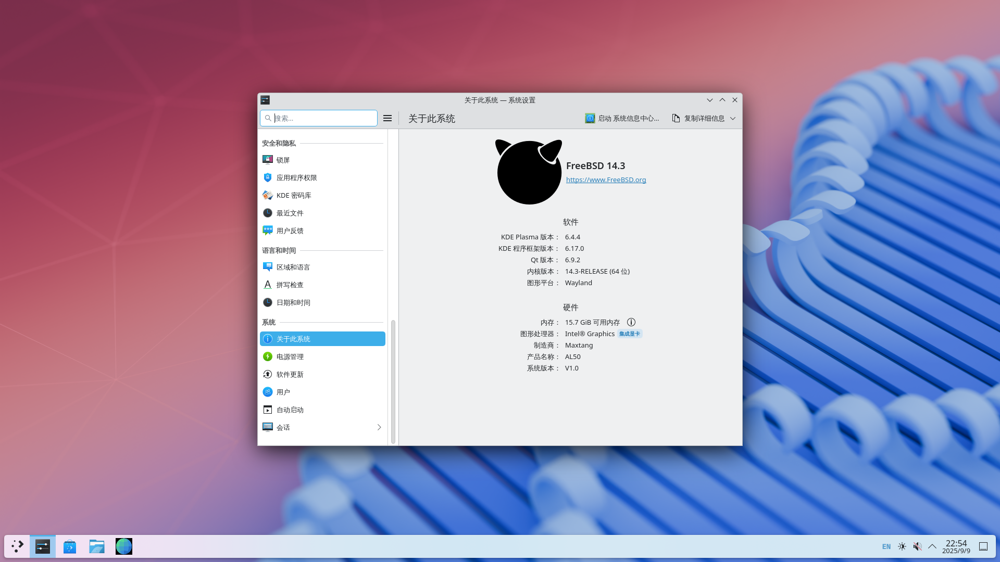
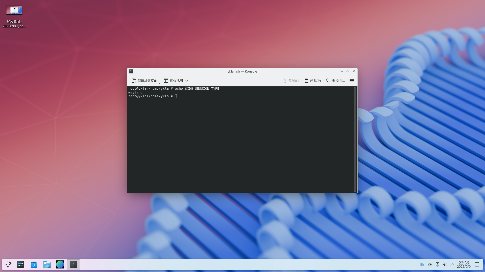
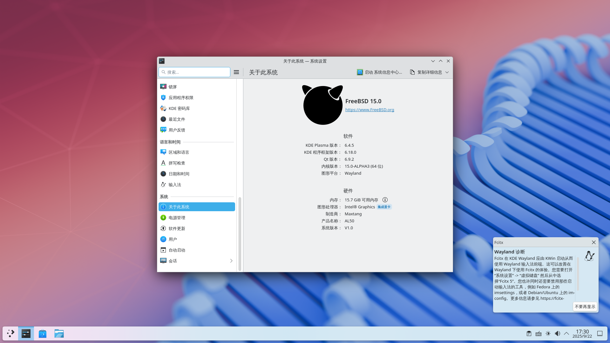
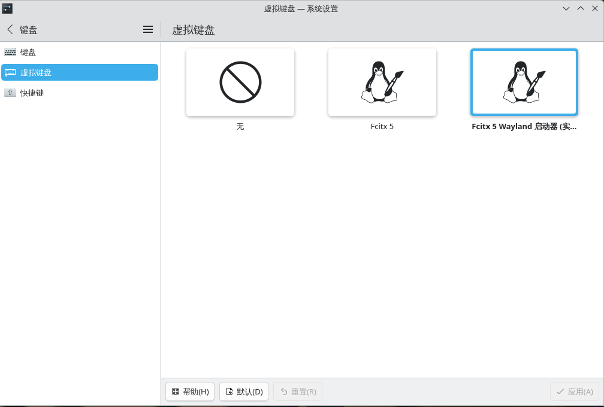
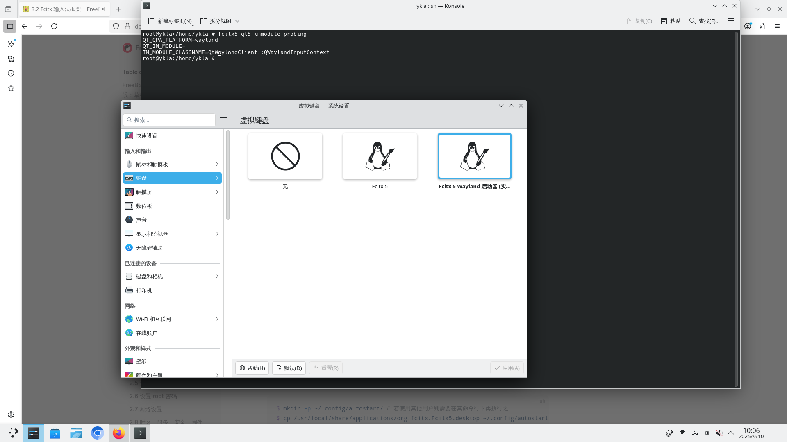
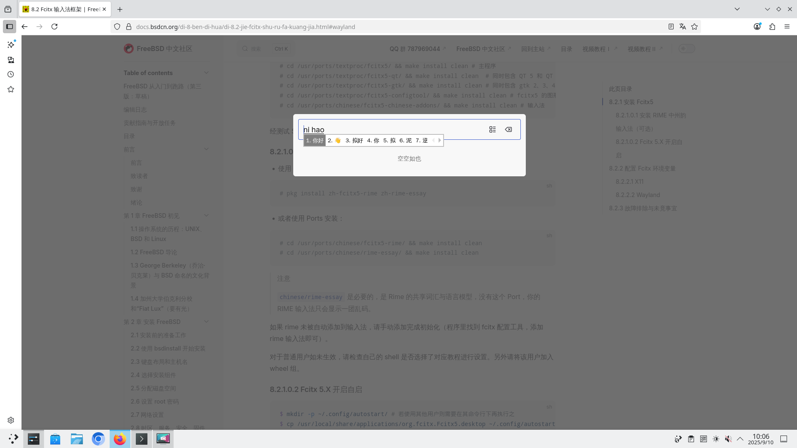
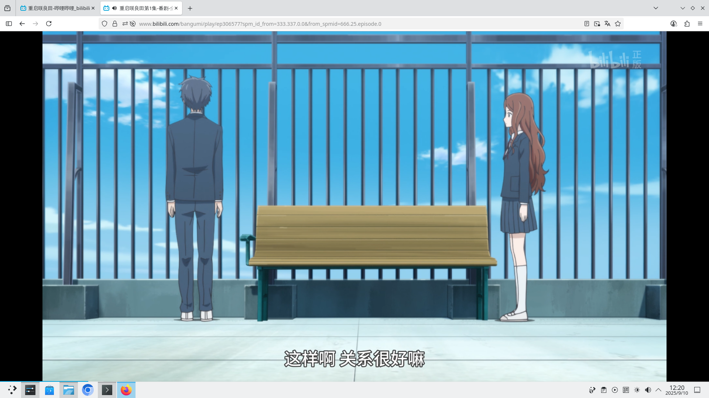

# 6.16 KDE 6（Wayland 会话）

## 环境准备

由于 issue [Request to restore support for vboxvideo and vmwgfx DRM drivers #356](https://github.com/freebsd/drm-kmod/issues/356) 始终未能得到解决（FreeBSD drm 驱动的移植只覆盖了 Intel、AMD 和 NVIDIA 等 GPU），故在 VMware、VirtualBox 或任何基于 Virtio 的虚拟机上均无法复现此教程。你需要在真实的物理机上进行参照。

NVIDIA 卡未经测试。本文使用 Intel 12 代处理器（i7-1260P）的核显进行测试。

请参照其他章节内容自行 **安装** drm、KDE 6、Fcitx 5、火狐浏览器等软件包。**并配置 drm 显卡驱动。** 其余软件包暂且 **不要** 进行任何配置，**仅安装** 即可。请加入 video 组。

## 加入 video 组

将指定用户加入 video 组以拥有权限调用显卡。

```sh
# pw groupmod video -m 你的用户名
```

## seatd 相关

### 安装 seatd

seatd 是一个 seat 管理守护进程，用于在非 systemd 环境下管理 Wayland 会话和设备访问。

- 使用 pkg 安装：
  
```sh
# pkg ins seatd
```

- 通过 Ports：

```sh
# cd /usr/ports/sysutils/seatd/ 
# make install clean
```

### 配置 seatd 服务

添加并启用服务：

```sh
# service dbus enable # 设置 D-Bus 服务开机自启
# service seatd enable # 设置 Seatd 服务开机自启
```

## 启动 KDE 6

### 方法 ① SDDM

```sh
# service sddm enable
```

通过启用 SDDM 登录管理器启动 KDE，在登录界面选择“Wayland”会话。

### 方法 ②：通过脚本启动

- 在 `~/` 下新建一个脚本 `kde.sh`：

```sh
#! /bin/sh
export LANG=zh_CN.UTF-8 # 设置中文，Fcitx 需要
export LANGUAGE=zh_CN.UTF-8 # 设置中文，Fcitx 需要
export LC_ALL=zh_CN.UTF-8 # 设置中文，Fcitx 需要
export XMODIFIERS='@im=fcitx' # Fcitx 需要
/usr/local/bin/ck-launch-session /usr/local/lib/libexec/plasma-dbus-run-session-if-needed /usr/local/bin/startplasma-wayland # 启动桌面的命令
```

- 授予 `~/kde.sh` 可执行权限：

```sh
$ chmod 755 ~/kde.sh
```

>**注意**
>
>你必须停止 SDDM 服务才能使用该脚本。请现在就检查 `/etc/rc.conf` 是否有 `sddm_enable="YES"` 字样，如有请删除。并按快捷键 ctrl + alt + f2 进入 TTY，登录 root 后输入 `service sddm stop` 停止 SDDM 服务。

- 进入 KDE

此时你应在 TTY 界面以普通用户身份登录，并且没有任何 X11 会话正在运行（如存在，请禁用相关服务并重启再试）。

```sh
$ sh ~/kde.sh
```

## 图示



>**技巧**
>
>上图显示为“Intel UHD Graphics”而非“Iris Xe Graphics”，这是因为系统未启用某些硬件加速特性（与内存配置有关）~~笔者无力购买第二根 DDR5 内存条~~。参见 [Intel® Iris® Xe Graphics Shows As Intel® UHD Graphics in the Intel® Graphics Command Center and Device Manager](https://www.intel.com/content/www/us/en/support/articles/000059744/graphics.html)（网站对应页面的中文翻译不正确）。

- 显示当前会话类型（如 x11 或 wayland）

```sh
# echo $XDG_SESSION_TYPE
```



## 配置 Fcitx 5

>**技巧**
>
>经测试 IBus 亦可用，且无需配置。

配置 Fcitx 5 自动启动：

```sh
$ mkdir -p ~/.config/autostart/ # 创建自启动目录
$ cp /usr/local/share/applications/org.fcitx.Fcitx5.desktop ~/.config/autostart/ # 系统启动时自动启动 Fcitx 5
```

当你初次进入 KDE Wayland 桌面时，KDE 会在右下角提示你要在设置的虚拟键盘中进行配置才能启用输入法。请留意该提示。若未进行此设置，将无法切换输入法或输入中文。



打开 KDE 系统设置：找到“键盘”——>虚拟键盘



请选择“Fcitx 5 Wayland 启动器（实验性）”



经测试，在 Konsole 终端、Firefox 和 Chromium（使用 `chrome --no-sandbox` 启动）中均可输入中文。



## 视频播放测试



## 故障排除与未竟事宜

### 切换到 PipeWire

待解决。

### 在 root 下无声音

表现为右下角声音控件提示“未连接到音频服务”：可以设置 PulseAudio 自启动，方法是在 KDE 设置中添加该服务并赋予可执行权限。

## 参考文献

- [KDE Plasma 6 Wayland on FreeBSD](https://euroquis.nl/kde/2025/09/07/wayland.html)，此处提示需要 `seatd`。
