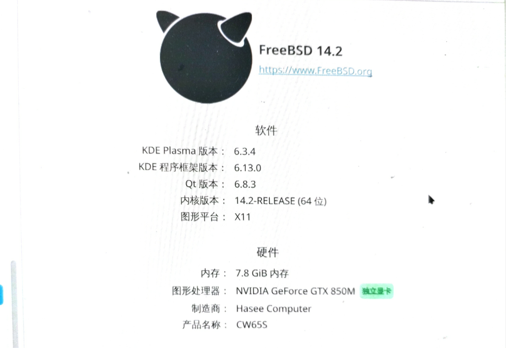

# 6.2 NVIDIA 显卡驱动

>**警告**
>
>对于没有显卡直通能力的笔记本，必须安装英特尔核显驱动（相关 DRM）！

## 加入 video 组

将指定用户添加到 video 组，以便访问显卡设备：

```sh
# pw groupmod video -m 你的用户名
```

## 安装显卡驱动

使用 pkg 安装：

```sh
# pkg install nvidia-drm-kmod nvidia-settings
```

或者使用 Ports 安装：

```sh
# cd /usr/ports/graphics/nvidia-drm-kmod/ && make install clean
# cd /usr/ports/x11/nvidia-settings/ && make install clean
```


## 配置 NVIDIA 显卡

- 启动 NVIDIA 相关内核模块

```sh
# echo 'hw.nvidiadrm.modeset="1"' >> /boot/loader.conf  # 启用 NVIDIA DRM 模式设置
# sysrc -f /etc/rc.conf kld_list+=nvidia-modeset       # 添加 nvidia-modeset 内核模块以便启动时加载
```

>**警告**
>
>不要试图加载 `nvidia-drm.ko`，会导致系统宕机。

- 生成 X11 配置文件。注意，若可正常显示，则无需执行此步及下一步！

```sh
# Xorg -configure                     # 自动生成 Xorg 配置文件
# cp /root/xorg.conf.new /etc/X11/xorg.conf  # 将生成的配置文件复制到 /etc/X11/xorg.conf
```

>**警告**
>
>不要试图安装和使用 Port `x11/nvidia-xconfig`。没有用且会卡死。


## 硬件加速和解码器

安装 VDPAU 驱动及相关库以支持视频硬件加速。

- 使用 pkg 安装：

```sh
pkg install libva-vdpau-driver libvdpau libvdpau-va-gl
```

- 或者使用 Ports 安装：

```sh
# cd /usr/ports/multimedia/libva-vdpau-driver/ && make install clean
# cd /usr/ports/multimedia/libvdpau/ && make install clean
# cd /usr/ports/multimedia/libvdpau-va-gl/ && make install clean
```

然后重新启动后即可正常使用 NVIDIA 驱动。

## 查看 Nvidia 驱动状态

- 列出所有 NVIDIA GPU 及其详细信息，并以每秒一次的频率刷新显示

```sh
$ nvidia-smi -L -l 1 
```

参数说明：

- `-L`：查看 GPU 列表及其 UUID；
- `-l 1` 每秒刷新一次。

- 查看 KDE 系统信息：



- 用 MPV 打开一部电影，可以看到显存使用量明显上升（我是从 3 MB 上升到了数百兆），也可以用 SMPlayer 观看。


