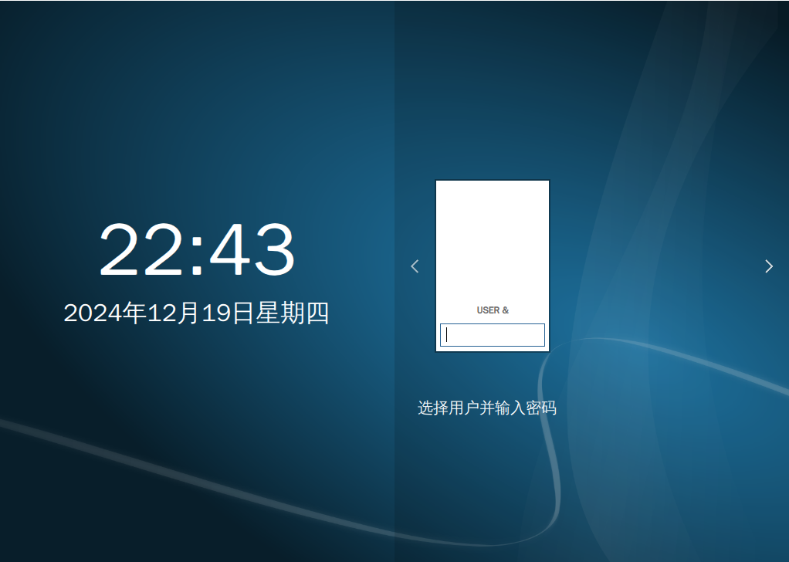
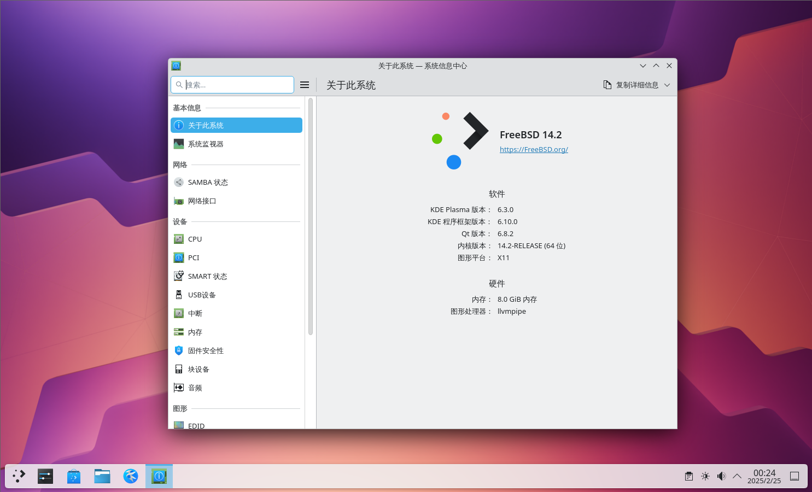
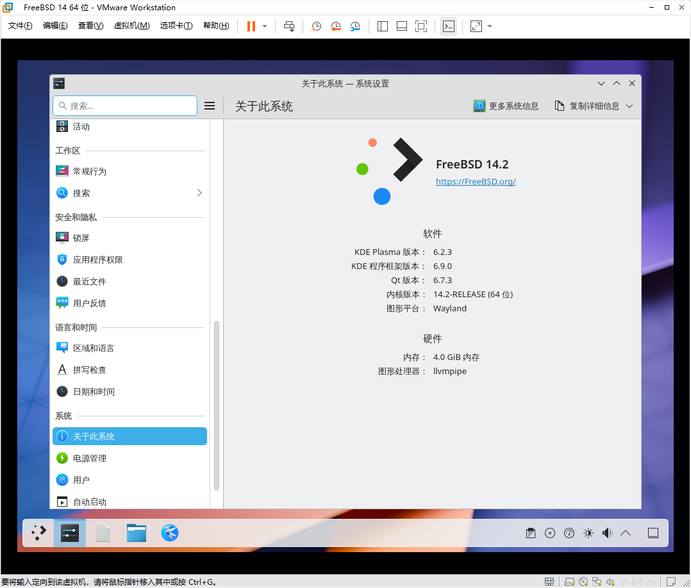
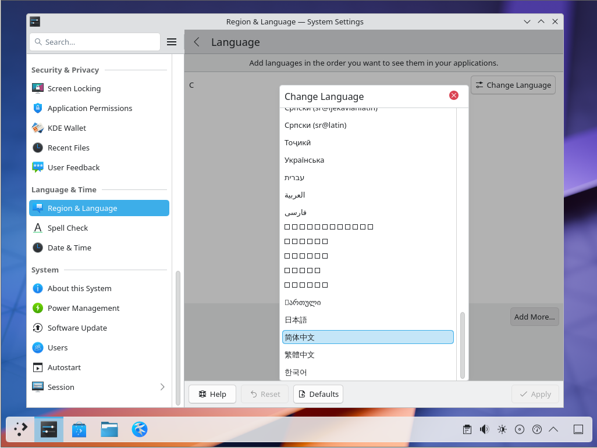
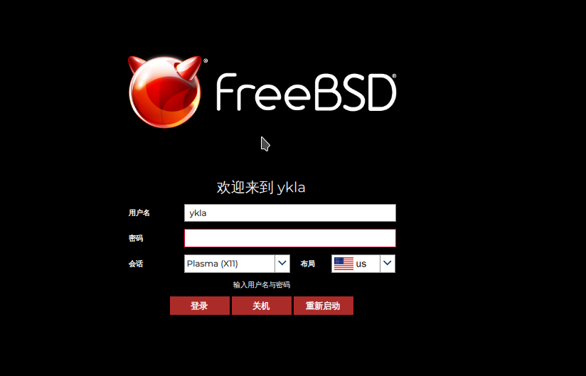
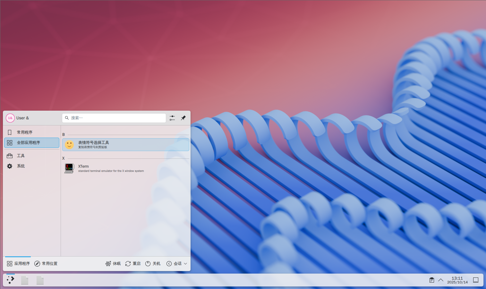
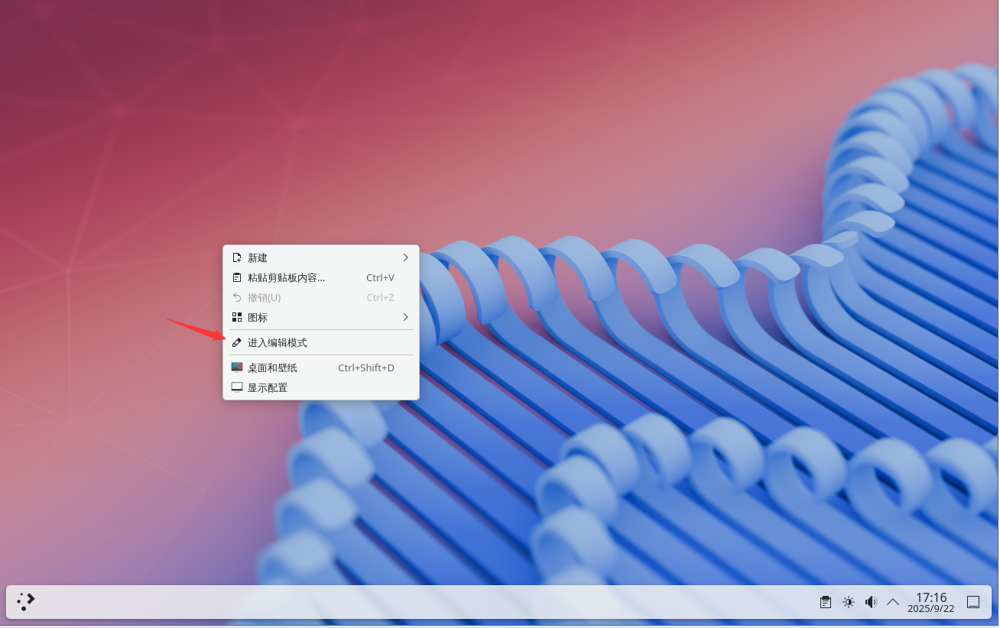
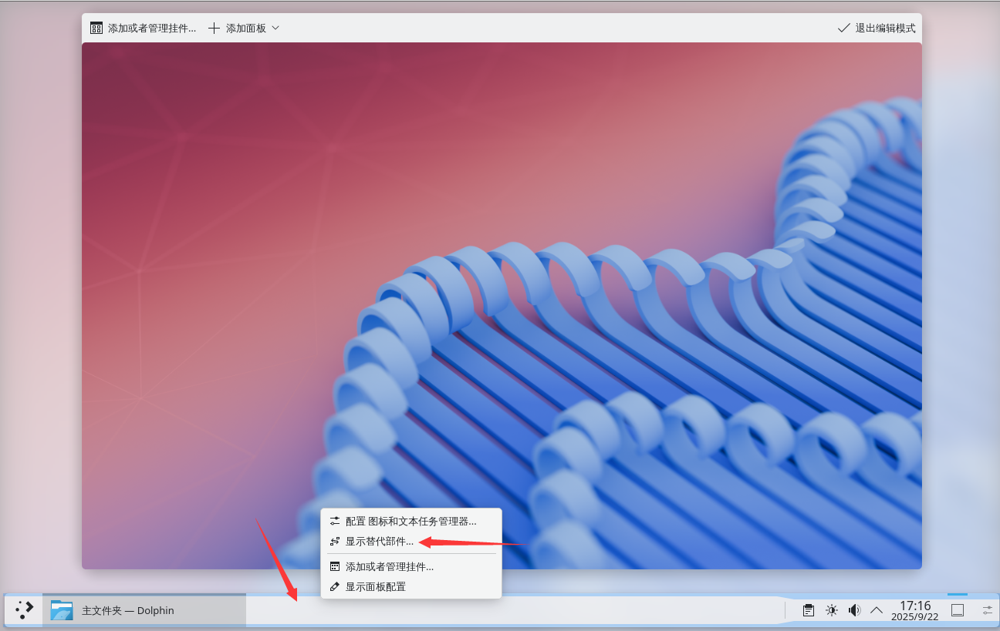
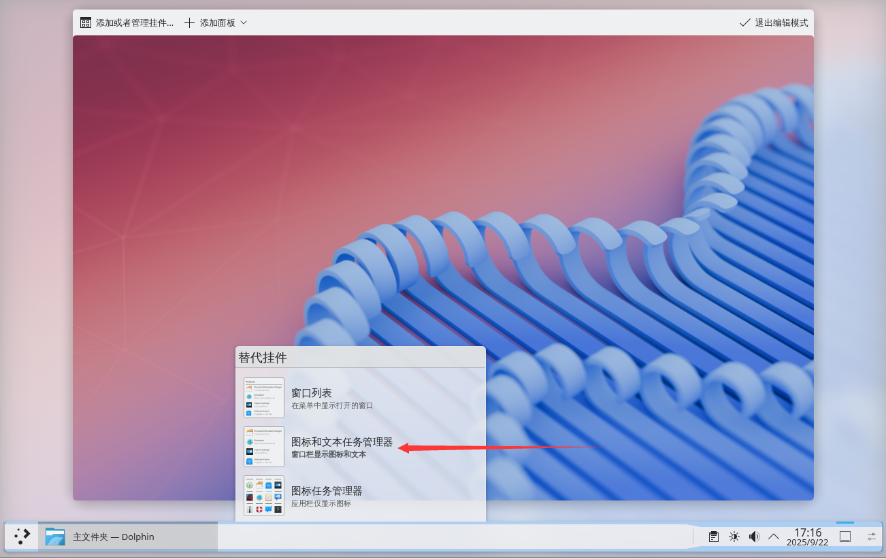
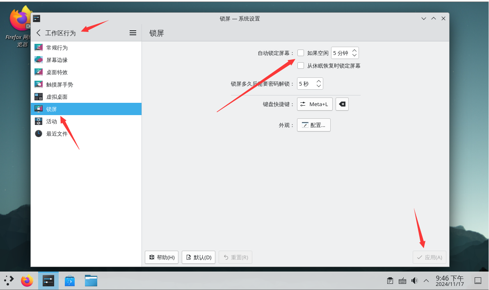

# 6.3 KDE 6（X11 会话）

KDE 致力于开发一套现代桌面环境，如果你觉得 KDE 界面很像 Windows，那么从时间线上看可以说是“Windows 很像 KDE”。

>**技巧**
>
>视频教程参见 [003-FreeBSD14.2 安装 KDE6](https://www.bilibili.com/video/BV12zAYeKEej)


## 安装完整的 KDE 桌面体验

>**技巧**
>
>​**那些不希望捆绑安装大量附加工具和软件的用户可以使用附录的最小化安装方案**​，不需要自定义的用户可继续使用上述完整安装方案。

- 使用 pkg 安装：

```sh
# pkg install xorg sddm kde wqy-fonts
```

> **技巧**
>
> 如果有时提示 `pkg` 找不到或未提供 kde，请访问 [x11/kde](https://www.freshports.org/x11/kde) 查看是否二进制包尚未构建出来。有时需要切换到 quarterly 或 latest 软件源，待上游构建完成后再运行 `pkg upgrade` 更新。类似方法适用于所有软件，故后边不再赘述。如果没有，需要自己使用上述的 Port 进行编译。


- 或者使用 Ports 安装：

```sh
# cd /usr/ports/x11/xorg/ && make install clean 
# cd /usr/ports/x11/kde/ && make install clean 
# cd /usr/ports/x11/sddm/ && make install clean 
# cd /usr/ports/x11-fonts/wqy/ && make install clean 
```

- 软件包说明

| 包名                   | 作用                     |
|:----------------------:|:------------------------:|
| `xorg`               | 图形界面基础，提供 X Window 系统              |
| `sddm`               | 登录管理器                |
| `kde`    | KDE 桌面环境              |
| `wqy-fonts`          |  文泉驿中文字体              |


## 启动项设置

```sh
# service dbus enable # 用于桌面环境的进程间通信，作为依赖自动安装的
# service sddm enable # SDDM 登录管理器
```



## startx

```sh
# echo "exec ck-launch-session startplasma-x11" > ~/.xinitrc
```

> **注意**
>
>如果你在 root 下已经执行过了，那么新用户仍要再执行一次才能正常使用（无需 root 权限或 sudo 等）`startx`。

## 权限设置

普通用户还需将用户加入 `wheel` 组和 `video` 组，否则某些设置无法显示，图形界面功能可能受限：

```sh
# pw groupmod wheel -m 用户名
# pw groupmod video -m 用户名
```

## 中文化

### 设置 SDDM 登录管理器的语言为简体中文

```sh
# sysrc sddm_lang="zh_CN"
```

### 系统中文化方法 ① 用户分级

编辑 `/etc/login.conf`：找到 `default:\` 部分，将 `:lang=C.UTF-8` 修改为 `:lang=zh_CN.UTF-8`。

根据 `/etc/login.conf` 更新能力数据库：

```sh
# cap_mkdb /etc/login.conf
```




### 系统中文化方法 ② 系统设置

点击开始 -> System Settings -> Language & Time，在 Region & Language 的 Language 栏点击 Modify，找到并选择“简体中文”。如果显示为 `□□□□`，请检查中文字体是否已安装。然后单击 Apply 按钮；注销后重新登录，此时系统语言将变为中文。





#### 参考文献

- [SDDM login screen with KDE: change language?](https://forums.freebsd.org/threads/sddm-login-screen-with-kde-change-language.80535/)

## 附录：登录界面主题

- 使用 pkg 安装：

```sh
# pkg install sddm-freebsd-black-theme
```

- 或使用 Ports 安装：

```sh
# cd /usr/ports/x11-themes/sddm-freebsd-black-theme/ 
# make install clean
```


- 查看安装后配置：

```sh
# pkg info -D sddm-freebsd-black-theme
sddm-freebsd-black-theme-1.3:
On install:
To enable this theme edit:

 /usr/local/etc/sddm.conf
# 若要启用此主题，请编辑 /usr/local/etc/sddm.conf 文件。

 This theme use the x11-fonts/montserrat font by default. However, it
 can be changed to any desired font editing:

 /usr/local/share/sddm/themes/sddm-freebsd-black-theme/theme.conf
# 此主题默认使用 montserrat 字体（需安装 x11-fonts/montserrat），
# 你可以通过编辑 theme.conf 文件更改为任意你想要的字体。

Always:
===>   NOTICE:
# 注意事项：

The sddm-freebsd-black-theme port currently does not have a maintainer. As a result, it is
more likely to have unresolved issues, not be up-to-date, or even be removed in
the future. To volunteer to maintain this port, please create an issue at:

https://bugs.freebsd.org/bugzilla
# 此 port 目前没有维护者，因此可能存在未解决的问题、不够及时的更新，甚至未来可能被移除。
# 若你愿意接手维护，请到上述链接创建一个问题（issue）。

More information about port maintainership is available at:

https://docs.freebsd.org/en/articles/contributing/#ports-contributing
# 有关 port 维护的更多信息，请参考 FreeBSD 官方文档中关于贡献 port 的章节。
```

- 编辑 `/usr/local/etc/sddm.conf` 文件。

写入下行，设置当前 SDDM 主题为“sddm-freebsd-black-theme”：

```ini
[Theme]
Current=sddm-freebsd-black-theme
```

重启，设置完成：

 

### 参考文献

- [デスクトップ 環境 の 構築 - 4-7. LXQT のインストールと 設定 (LXQT 2.0.0)](http://silversack.my.coocan.jp/bsd/fbsd11x_bde-4-7_lxqt.htm)

## 附录：最小化 KDE 桌面安装方案

直接安装 `x11/kde` 会作为依赖安装 `x11/plasma6-plasma` 和 `x11/kde-baseapps`，其中捆绑了大量的工具软件，在某些情况下可能不方便部署与使用。

### 使用 pkg 安装

基础桌面

```sh
# pkg ins xorg sddm plasma6-plasma-desktop wqy-fonts plasma6-kactivitymanagerd plasma6-kscreen plasma6-systemsettings
```

| 软件包                           |作用 |
| :---------------------------------------: | :-------: |
| **plasma6-kactivitymanagerd**   |用于管理用户活动、跟踪使用模式等的系统服务。**没有该软件 KDE 将会黑屏且只有一个鼠标** |
| **plasma6-kscreen**                             | KDE 屏幕管理器。**没有该软件将无法调整分辨率**   |
|**plasma6-systemsettings**|系统设置|


与上文重复的软件包在此不再列出。

可选软件包：

```sh
# pkg ins konsole dolphin kate plasma6-plasma-systemmonitor plasma6-plasma-pa plasma6-discover kdeconnect-kde plasma6-plasma-workspace-wallpapers plasma6-plasma-disks ark
```

| 软件包                           |作用 |
| :---------------------------------------: | :-------: |
| **konsole**                             | 终端命令行工具 |
| **dolphin**                             | 文件管理器   |
| **kate**                                | 文本编辑器 |
| **plasma6-plasma-systemmonitor**        | 系统监视器  |
| **plasma6-plasma-pa**                   | 音频管理 |
| **plasma6-discover**                    | 软件管理  |
| **kdeconnect-kde**                      | 手机电脑互联  |
| **plasma6-plasma-workspace-wallpapers** | 桌面壁纸  |
| **plasma6-plasma-disks**                | 磁盘健康（S.M.A.R.T.）监测  |
|**ark**|解压缩软件|


### 使用 Ports 安装

基础桌面：

```sh
# cd /usr/ports/x11/xorg/ && make install clean 
# cd /usr/ports/x11/plasma6-plasma-desktop/ && make install clean
# cd /usr/ports/deskutils/plasma6-sddm-kcm/ && make install clean 
# cd /usr/ports/x11/sddm/ && make install clean
# cd /usr/ports/x11-fonts/wqy/ && make install clean
# cd /usr/ports/x11/plasma6-kscreen/ && make install clean
# cd /usr/ports/x11/plasma6-kactivitymanagerd/ && make install clean
# cd /usr/ports/sysutils/plasma6-systemsettings/ && make install clean
```

可选 Ports：

```
# cd /usr/ports/x11/konsole/ && make install clean # 终端 
# cd /usr/ports/x11-fm/dolphin/ && make install clean # 文件管理器
# cd /usr/ports/editors/kate/ && make install clean # 文本编辑器
# cd /usr/ports/sysutils/plasma6-plasma-systemmonitor/ && make install clean # 系统监视器
# cd /usr/ports/audio/plasma6-plasma-pa/ && make install clean # 音频管理器
# cd /usr/ports/sysutils/plasma6-discover/ && make install clean # 软件管理器
# cd /usr/ports/deskutils/kdeconnect-kde/ && make install clean # 手机电脑互联
# cd /usr/ports/x11-themes/plasma6-plasma-workspace-wallpapers/ && make install clean # 桌面壁纸
# cd /usr/ports/sysutils/plasma6-plasma-disks/ && make install clean # 磁盘健康（S.M.A.R.T.）监测 
# cd /usr/ports/archivers/ark/ && make install clean # 解压缩软件 
```

### xinitrc

>**注意**
>
>若采用最小化安装 KDE 方案，必须配置 `.xinitrc`。

### 最小化安装 KDE 图示

>**技巧**
>
>使用此方案安装的 KDE 桌面缺少了很多功能，可以参照 [x11/plasma6-plasma](https://www.freshports.org/x11/plasma6-plasma/) 的“Runtime dependencies”（运行时依赖）和“Library dependencies”（库依赖）进行功能补全。

未安装可选包：



## 附录：展开任务栏图标

右键单击桌面空白部分，点击“进入编辑模式”。



点击任务栏中间的空白部分，然后点击“显示替代部件”。



在弹出窗口中选择“图标和文本任务管理器”。



## 附录：解决开机时总是自动打开特定程序

打开设置，选择“会话”——>“桌面会话”，在右侧的“会话恢复”，修改为“启动为空会话”。最后点击右下角的“应用”保存即可。


## 故障排除与未竟事宜

### sddm 登录闪退

如果在 VMware 虚拟机中看不到 SDDM 底部选项，请按照虚拟机配置章节的教程设置屏幕自动缩放。

### 启动 sddm 提醒 `/usr/bin/xauth: (stdin):1: bad display name`，但是可以正常 `startx`

你需要在 `/etc/rc.conf` 中检查是否已设置 `hostname="XXX"`（理论上应当存在该条目，也不应为 `hostname=""`）：


按需设置 `hostname` 即可。

### 菜单缺失关机、重启等四个选项

如果无效，请检查是否在 SDDM 界面选择了“用户会话”（读取 `.xinitrc`），应选择 `plasma-x11`。

修改 `/etc/sysctl.conf` 将其中 `security.bsd.see_other_uid` 的值改为 `1`（`1` 为开启）。重启后即可。

#### 参考文献

- [Missing power buttons when logged in from SDDM](https://forums.freebsd.org/threads/missing-power-buttons-when-logged-in-from-sddm.88231/)

### 解除自动锁屏

单击“设置”——>“安全和隐私”——>“锁屏”——>“自动锁定屏幕”选择“不自动锁屏”，然后点击“应用”。（休眠唤醒后锁定屏幕可按需设置）

注销后重新登录即可。



### 状态栏不显示时钟和时间

打开时区设置，选择“Asia/Shanghai”时区即可。如果仍无效，请先更新相关软件包。
