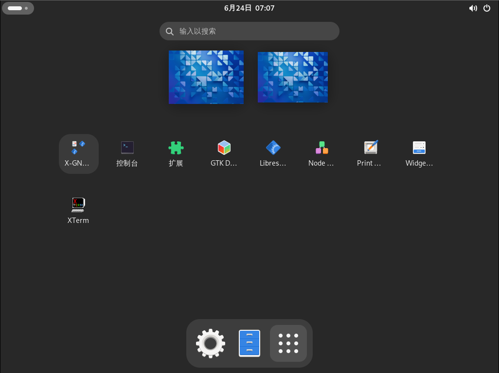
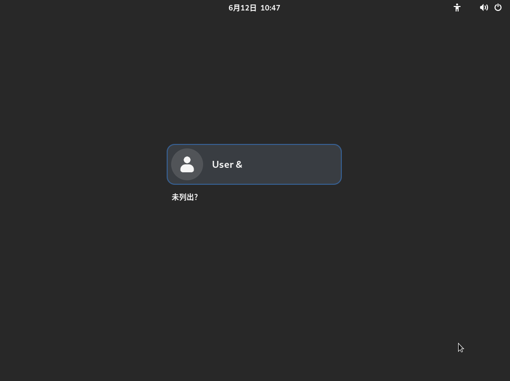
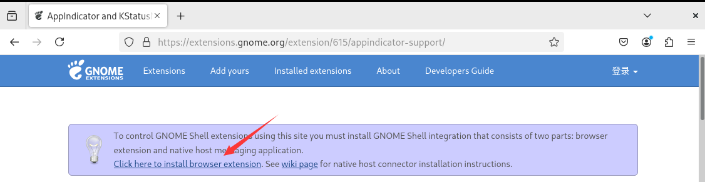

# 6.4 GNOME

>**警告**
>
>目前因为 [Bug 287955 - x11/gdm: The user cannot log in; the system hangs at the login screen in gdm 47](https://bugs.freebsd.org/bugzilla/show_bug.cgi?id=287955)，gdm 无法正常使用，会卡在登录界面，`startx` 正常。
>
>虚拟机正常。

GNOME 过去曾是 GNU 项目，旨在开发一套功能齐全的桌面环境，目前主要由红帽公司主导。值得注意的是，在英语单词中，GNOME 中的 `G` 并不发音（/ˈnoʊm/）。

## 安装

- 使用 pkg 安装：

```sh
# pkg install xorg gnome noto-sc
```

- 或者使用 Ports 安装：

```sh
# cd /usr/ports/x11/xorg/ && make install clean
# cd /usr/ports/x11/gnome/ && make install clean
# cd /usr/ports/x11-fonts/noto-serif-sc/ && make install clean
```

- 软件包说明：

|     软件      |            用途            |
| :-----------: | :------------------------: |
|     xorg      |            X11             |
|     gnome     |        GNOME 主程序       |
|    noto-sc    |  思源黑体（简体中文）   |


### 附录：精简安装

- 使用 pkg 安装：

```sh
# pkg install xorg-minimal gnome-lite wqy-fonts xdg-user-dirs
```

- 或者使用 Ports 安装：

```sh
# cd /usr/ports/x11/xorg-minimal/ && make install clean
# cd /usr/ports/x11/gnome/ && make install clean
# cd /usr/ports/x11-fonts/wqy/ && make install clean
# cd /usr/ports/devel/xdg-user-dirs/ && make install clean
```

- 软件包解释


| 包名             | 作用             |
|:------------------|:------------------|
| `xorg-minimal`   | 精简版 X 图形环境 |
| `gnome-lite`     | 精简版 GNOME 桌面 |

#### 附录：对 GNOME 完整版本的精简

如果安装了完整版本，也可以使用 pkg 包管理器卸载自带的游戏软件：

```sh
# pkg delete gnome-2048 gnome-klotski gnome-tetravex gnome-mines gnome-taquin gnome-sudoku gnome-robots gnome-nibbles lightsoff tali quadrapassel swell-foop gnome-mahjongg five-or-more iagno aisleriot four-in-a-row
```



## 配置

使用文本编辑器打开 `/etc/fstab` 文件以编辑文件系统挂载信息。

添加内容如下挂载 proc 文件系统：

```ini
proc /proc procfs rw 0 0
```

配置启动项：

```sh
# service dbus enable   # 设置 D-Bus 服务开机自启
# service gdm enable    # 设置 GDM 显示管理器开机自启
```

输入以下命令，将 GNOME 会话命令写入 `~/.xinitrc`，以便 `startx` 启动 GNOME：

```sh
$ echo "/usr/local/bin/gnome-session" > ~/.xinitrc
```



默认情况下禁止 root 登录。


默认壁纸就是这样。


## 中文化

### GNOME 界面

本小节配置参数与用户 shell 无关，即使是 csh 也该如此配置。

使用文本编辑器打开 GDM 本地化配置文件 `/usr/local/etc/gdm/locale.conf` 以修改语言设置。

将原有内容替换如下：

```sh
LANG="zh_CN.UTF-8"         # 设置系统默认语言为简体中文 UTF-8
LC_CTYPE="zh_CN.UTF-8"     # 设置字符类型和编码为简体中文 UTF-8
LC_MESSAGES="zh_CN.UTF-8"  # 设置系统消息显示语言为简体中文 UTF-8
```

### 中文输入法

以下 `ibus`、`fcitx5` 二选一即可使用。

#### ibus

GNOME 捆绑的输入法框架是 `ibus`。

```sh
# pkg install zh-ibus-libpinyin
```

或者

```sh
# cd /usr/ports/chinese/ibus-libpinyin/
# make install clean
```

安装后运行初始化命令 `ibus-setup`。

然后：设置 → 键盘 → 输入源，点击“添加输入源”，选择“汉语（中国）”，加入“中文（智能拼音）”。

#### fcitx 5

参见输入法相关章节。

>**警告**
>
>IBus 是 GNOME 的依赖，不能卸载。也就是说可以不使用 IBus，但不能将其卸载，否则将卸载 GNOME 本体。


## 优化系统

```sh
# pkg install gnome-tweaks
```

或者：

```sh
# cd /usr/ports/deskutils/gnome-tweaks/ 
# make install clean
```

## 一些不符合常规使用习惯的设置调整

GNOME 一直以不符合部分用户使用习惯著称，例如桌面不允许放置图标、右上角没有托盘等。~~是不是和垃圾桶不能有垃圾、人不能在床上、门不能关、桌子上不能放东西有异曲同工之妙~~

### 恢复 GNOME 顶栏的托盘图标

需要安装 Firefox 浏览器 `www/firefox` 及 Port `x11-chrome-gnome-shell`。

由于 [TopIcons Plus](https://extensions.gnome.org/extension/1031/topicons/) 已长期未更新，因此只能使用 [AppIndicator and KStatusNotifierItem Support](https://extensions.gnome.org/extension/615/appindicator-support/) 了。




#### 参考文献

- [恢复 GNOME 顶栏的托盘图标](https://linuxstory.org/restore-tray-icon-for-gnome-top-bar/)

### 在桌面放图标

扩展 [gnome-shell-extension-desktop-icons](https://extensions.gnome.org/extension/1465/desktop-icons/) 已经长期未更新，项目地址为：[Desktop Icons](https://gitlab.gnome.org/World/ShellExtensions/desktop-icons)。

可以使用 [Desktop Icons NG (DING)](https://extensions.gnome.org/extension/2087/desktop-icons-ng-ding/) 解决。安装方式同上。


壁纸是我自己设置的。其他是默认的。
