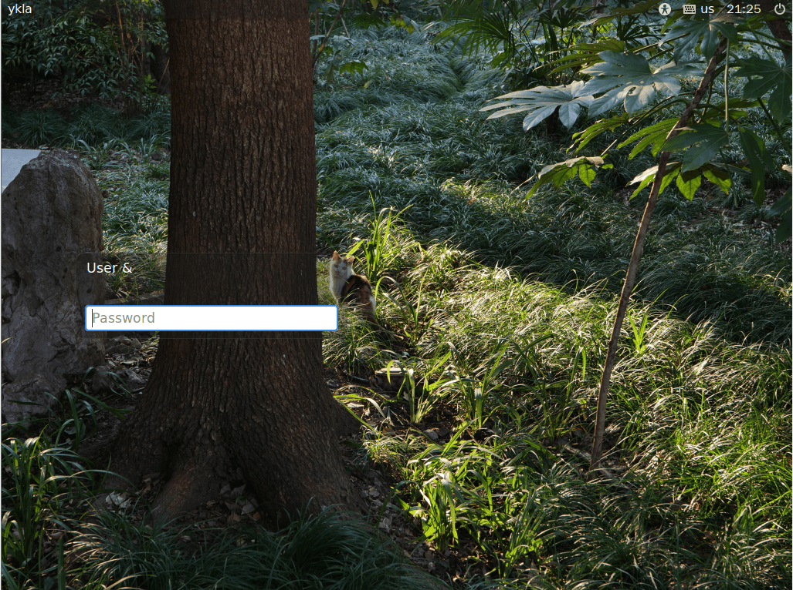

# 6.5 Mate

MATE 是从 GNOME 2 复刻（fork）发展而来的桌面环境。

你也许不认识 mate，即巴拉圭冬青（Ilex paraguariensis），但你可能听说“马黛茶”。许多南美球员（如梅西）非常热衷于这种植物制成的茶饮。

## 安装

- 使用 pkg 安装：

```sh
# pkg install mate xorg wqy-fonts lightdm slick-greeter xdg-user-dirs
```

- 或者使用 Ports 安装：

```sh
# cd /usr/ports/x11/mate/ && make install clean
# cd /usr/ports/x11/xorg/ && make install clean
# cd /usr/ports/x11-fonts/wqy/ && make install clean
# cd /usr/ports/x11/lightdm/ && make install clean 
# cd /usr/ports/x11/slick-greeter/ && make install clean 
# cd /usr/ports/devel/xdg-user-dirs/ && make install clean 
```

- 软件包说明


| 包名               | 功能说明                          |
|:--------------------|:--------------------------------------|
| `mate`             | MATE 桌面环境|
| `xorg`             | X Window 系统        |
| `wqy-fonts`        | 文泉驿中文字体             |
| `lightdm`          | 显示管理器，提供图形登录界面               |
| `slick-greeter`    |LightDM 的美观登录界面插件，若未安装将无法正常启动 LightDM|
| `xdg-user-dirs`    | 可自动管理家目录子目录（可选安装）         |

## 安装后启用服务

```sh
# service dbus enable     # 设置 D-Bus 服务开机自启
# service lightdm enable  # 设置 LightDM 显示管理器开机自启
```

## 配置 LightDM

编辑 `/usr/local/etc/lightdm/lightdm.conf`，找到 `greeter-session=lightdm-gtk-greeter` 改成 `greeter-session=slick-greeter`。

## `startx` 配置文件

在 `~/.xinitrc` 文件内加入下面一行，方便 `startx` 启动 MATE 桌面会话：

```sh
exec mate-session
```

## 配置中文桌面环境


编辑 `/etc/login.conf`：找到 `default:\` 这一段，将 `:lang=C.UTF-8` 修改为 `:lang=zh_CN.UTF-8`。

根据 `/etc/login.conf` 更新系统能力数据库：

```sh
# cap_mkdb /etc/login.conf
```

## 输入法


ibus 测试成功，请参见输入法相关章节。

## 桌面欣赏


## 故障排除与未竟事宜

### 配置 slick-greeter

创建 `/usr/local/etc/lightdm/slick-greeter.conf`，写入以下配置。

```ini
[Greeter]
# 设置登录界面的背景图片路径
background=/home/ykla/cat.png

# 是否绘制用户自定义的背景图片
draw-user-backgrounds=false

# 设置 GTK+ 主题名称
theme-name=Dracula

# 设置图标主题名称
icon-theme-name=Adwaita

# 是否显示主机名
show-hostname=true

# 设置字体名称和大小
font-name=Sans 12

# 是否显示虚拟键盘选项
show-keyboard=true

# 是否显示电源管理选项（如关机、重启）
show-power=true

# 是否显示时钟
show-clock=true

# 是否显示退出选项
show-quit=true
```



#### 参考文献

- [lightdm not reading slick-greeter.conf](https://forums.freebsd.org/threads/lightdm-not-reading-slick-greeter-conf.92256/)
