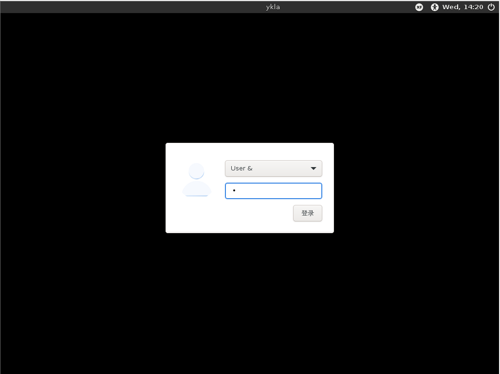
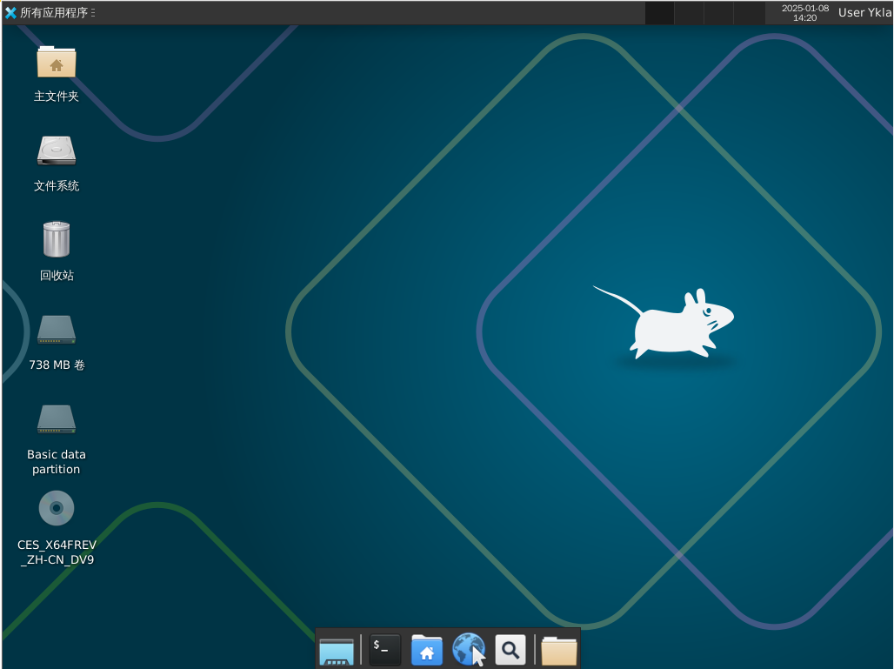
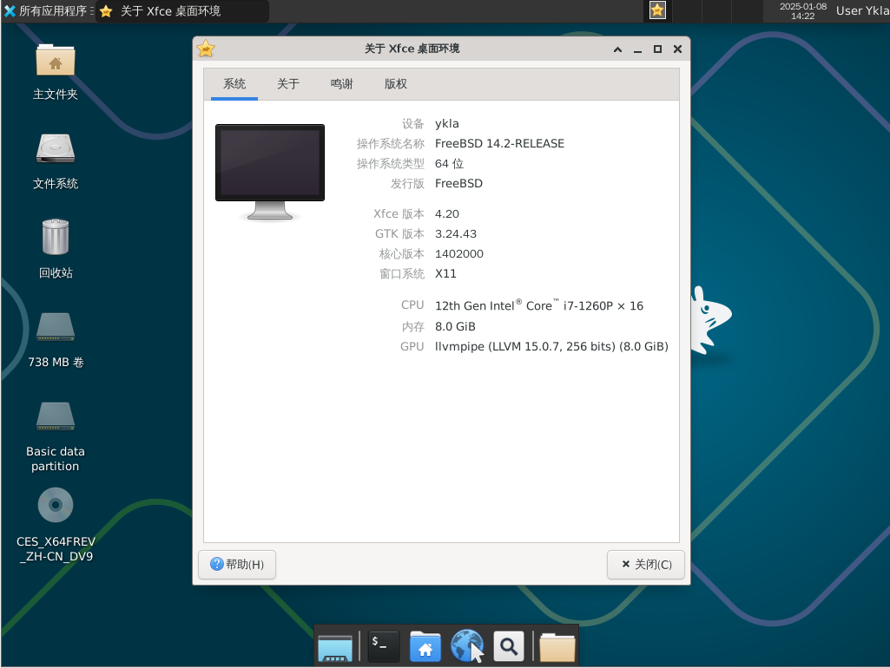

# 6.6 Xfce

Xfce 旨在开发一款轻量级但功能齐全的桌面环境。

Xfce 的 Logo 是只 [老鼠 🐀](https://docs.xfce.org/faq#what_does_it_mean)，曾有人反馈 Bug，称因 Xfce 的默认壁纸是一只老鼠 🐀，导致自己的电脑屏幕被猫 🐈 抓坏了（[\[joke\] The default desktop startup screen causes damage to monitor!](https://bugzilla.xfce.org/show_bug.cgi?id=12117)）。

## 安装 xfce4

- 通过 pkg 安装

```sh
# pkg install xorg lightdm lightdm-gtk-greeter xfce wqy-fonts xdg-user-dirs xfce4-goodies lightdm-gtk-greeter-settings
```

- 或通过 ports 安装

```sh
# cd /usr/ports/x11/xorg/ && make install clean
# cd /usr/ports/x11-wm/xfce4 && make install clean # 注意有个 4
# cd /usr/ports/x11/xfce4-goodies/ && make install clean
# cd /usr/ports/x11-fonts/wqy/ && make install clean
# cd /usr/ports/x11/lightdm/ && make install clean
# cd /usr/ports/x11/lightdm-gtk-greeter/ && make install clean
# cd /usr/ports/x11/lightdm-gtk-greeter-settings/ && make install clean
# cd /usr/ports/devel/xdg-user-dirs/ && make install clean 
```

- 软件包说明：

| 包名                          | 作用说明                               |
|:-------------------------------|:------------------------------------|
| `xorg`                        |  X Window System|
| `lightdm`                     | 轻量级显示管理器 LightDM |
| `lightdm-gtk-greeter`         | LightDM 的 GTK+ 登录界面插件|
| `xfce`                        | Xfce 桌面环境 |
| `wqy-fonts`                   | 文泉驿中文字体|
| `xdg-user-dirs`               | 管理用户主目录 |
| `xfce4-goodies`               | Xfce 的附加组件和插件集合 |
| `lightdm-gtk-greeter-settings`| 配置 LightDM GTK+ 登录界面的图形工具，缺少该组件将无法启动|


## `startx`

将 Xfce 启动脚本写入 `~/.xinitrc`，以便使用 `startx` 命令启动 Xfce：

```sh
$ echo "/usr/local/etc/xdg/xfce4/xinitrc" > ~/.xinitrc
```

将 Xfce 启动脚本写入 `~/.xsession`，以便图形登录管理器启动 Xfce

```sh
$ echo "/usr/local/etc/xdg/xfce4/xinitrc" > ~/.xsession
```

## 启动服务

```sh
# service dbus enable     # 设置 D-Bus 服务开机自启
# service lightdm enable  # 设置 LightDM 显示管理器开机自启
```

## 设置中文界面

编辑 `/etc/login.conf`：找到 `default:\` 这一段，将 `:lang=C.UTF-8` 修改为 `:lang=zh_CN.UTF-8`。

根据 `/etc/login.conf` 更新系统能力数据库：

```sh
# cap_mkdb /etc/login.conf
```

## 图片欣赏







## 全局菜单（可选）

安装：

```sh
# pkg install xfce4-appmenu-plugin appmenu-gtk-module appmenu-registrar
```

或：

```sh
# cd /usr/ports/x11/xfce4-appmenu-plugin/ && make install clean
# cd /usr/ports/x11/gtk-app-menu/ && make install clean
# cd /usr/ports/x11/appmenu-registrar/ && make install clean
```

查看安装后说明，并按说明进行配置：

```sh
$ xfconf-query -c xsettings -p /Gtk/ShellShowsMenubar -n -t bool -s true  # 启用 GTK 菜单栏显示
$ xfconf-query -c xsettings -p /Gtk/ShellShowsAppmenu -n -t bool -s true  # 启用 GTK 应用菜单显示
$ xfconf-query -c xsettings -p /Gtk/Modules -n -t string -s "appmenu-gtk-module"  # 设置 GTK 模块为 appmenu-gtk-module
```

## 软件推荐

FreeBSD 的 Xfce 邮箱客户端推荐使用 `mail/evolution`，可搭配 `xfce4-mailwatch-plugin`、`security/gnome-keyring` 一并使用。

还有一款桌面插件，名为 `x11/xfce4-verve-plugin`。配合设置智能书签，可以查询网页内容。可通过配置 FreeBSD 的 man 手册，实现对所需内容的搜索。

## XTerm 终端动态标题

### sh

编辑 `~/.shrc`，写入：

```sh
if [ -t 1 ]; then       
  while :; do
    printf '\033]0;%s\007' "$PWD"   
    printf '\n$ '
    if ! IFS= read -r cmd; then
      break
    fi
    printf '\033]0;%s\007' "$cmd"
    eval "$cmd"
  done
  exit
fi
```

### csh

编辑 `~/.cshrc`，写入：

```sh
if ( $?TERM && $TERM =~ xterm* ) then
    set host = `hostname`      
    alias postcmd 'rehash; printf -- "\033]2;%s\007" "${user}@${host}: ${cwd}"
endif
```

### tcsh

编辑 `~/.tcshrc`，写入：

```sh
switch ($TERM)
case xterm*:
    set prompt="%{\033]0;%n@%m: %~\007%}%# "
    breaksw
default:
    set prompt="%# "
    breaksw
endsw 
```

### bash

编辑 `~/.bashrc`，写入：

```sh
case $TERM in
         xterm*)
             PS1="\[\033]0;\u@\h: \w\007\]bash\\$ "
             ;;
         *)
             PS1="bash\\$ "
             ;;
     esac
```

### zsh

编辑 `~/.zshrc`，写入：

```sh
autoload -Uz add-zsh-hook

function xterm_title_precmd () {
	print -Pn -- '\e]2;%n@%m %~\a'
	[[ "$TERM" == 'screen'* ]] && print -Pn -- '\e_\005{2}%n\005{-}@\005{5}%m\005{-} \005{+b 4}%~\005{-}\e\\'
}

function xterm_title_preexec () {
	print -Pn -- '\e]2;%n@%m %~ %# ' && print -n -- "${(q)1}\a"
	[[ "$TERM" == 'screen'* ]] && { print -Pn -- '\e_\005{2}%n\005{-}@\005{5}%m\005{-} \005{+b 4}%~\005{-} %# ' && print -n -- "${(q)1}\e\\"; }
}

if [[ "$TERM" == (Eterm*|alacritty*|aterm*|foot*|gnome*|konsole*|kterm*|putty*|rxvt*|screen*|wezterm*|tmux*|xterm*) ]]; then
	add-zsh-hook -Uz precmd xterm_title_precmd
	add-zsh-hook -Uz preexec xterm_title_preexec
fi
```

### 参考文献

- [6.1 动态设置标题不起作用](https://docs.oracle.com/cd/E19683-01/817-1951/6mhl8aiii/index.html)，bash 配置来自此处
- [Wamphyre/BSD-XFCE](https://github.com/Wamphyre/BSD-XFCE)，配置参考集合
- [Zsh - Arch Linux 中文维基](https://wiki.archlinuxcn.org/wiki/Zsh)，Zsh 配置来自此处

## 故障排除与未竟事宜

若需进一步动态显示当前进程，目前似乎只有 sh 能做到。

