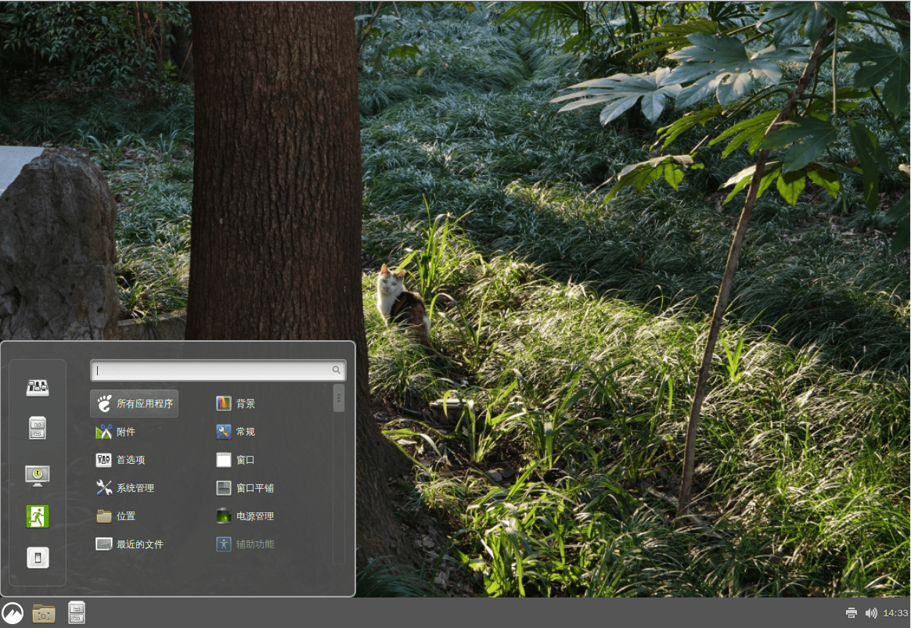

# 6.7 Cinnamon

## Cinnamon 桌面环境概述

Cinnamon 桌面环境基于 GNOME Shell 技术栈，源自 Linux Mint 项目。作为 Linux Mint 项目的核心组件之一，Cinnamon 旨在提供符合传统桌面交互范式且易于使用的桌面体验。


## 安装 Cinnamon 桌面环境

- 使用 pkg 安装：

```sh
# pkg install xorg lightdm slick-greeter cinnamon wqy-fonts xdg-user-dirs
```

- 或使用 Ports 安装：

```sh
# cd /usr/ports/x11/xorg/ && make install clean
# cd /usr/ports/x11/cinnamon/ && make install clean 
# cd /usr/ports/x11-fonts/wqy/ && make install clean 
# cd /usr/ports/x11/lightdm/ && make install clean 
# cd /usr/ports/x11/slick-greeter/ && make install clean 
# cd /usr/ports/devel/xdg-user-dirs/ && make install clean 
```

### 软件包说明：

| 包名 | 功能说明 |
| ---- | -------- |
| `xorg` | X Window 系统 |
| `lightdm` | 轻量级显示管理器 LightDM |
| `slick-greeter` | LightDM 的美观登录界面插件，缺少将无法启动 LightDM |
| `cinnamon` | 基于 GNOME 3 的现代桌面环境 |
| `wqy-fonts` | 文泉驿中文字体 |
| `xdg-user-dirs` | 管理用户目录，如“桌面”、“下载”等 |

## 配置 `startx`

编辑 `~/.xinitrc` 文件，添加：

```sh
exec cinnamon-session
```

可以通过 `startx` 命令启动 Cinnamon 桌面。

## 配置 LightDM

编辑 `/usr/local/etc/lightdm/lightdm.conf` 文件，找到 `greeter-session=lightdm-gtk-greeter` 一行或 `#greeter-session=example-gtk-gnome` 等配置项，修改为 `greeter-session=slick-greeter`。

## 挂载 proc 文件系统

编辑 `/etc/fstab` 文件，添加：

```ini
proc /proc procfs rw 0 0
```

将挂载 `procfs` 文件系统到 `/proc`，读写模式。

## 服务管理

设置 D-Bus 服务开机自启：

```sh
# service dbus enable
```

设置 LightDM 显示管理器开机自启：

```sh
# service lightdm enable
```

## 配置中文环境

编辑 `/etc/login.conf` 文件：找到 `default:\` 这一段（写作时为第 24 行），将 `:lang=C.UTF-8` 修改为 `:lang=zh_CN.UTF-8`。

还需要根据 `/etc/login.conf` 文件更新系统能力数据库才能生效：

```sh
# cap_mkdb /etc/login.conf
```

## 桌面欣赏


默认壁纸为黑色，此为正常现象。



自定义壁纸。

## 附录：Cinnamon：肉桂、桂皮、桂枝、烟桂概念辨析

Cinnamon 指肉桂（锡兰肉桂/斯里兰卡肉桂），与日常烹饪用的桂皮不同（二者虽均为肉桂树的树皮，但所属树种不同），是一种常用于制作冰红茶或西式糕点、咖啡的香料。

锡兰肉桂主要产地是斯里兰卡，具有柑橘香甜的复合气味。桂皮（烟桂为去掉青皮的优质桂皮）主要产地是中国南方及越南，气味呈辛辣刺激的中药味。

《中国药典·一部·药材和饮片》（2025 年版）对肉桂的定义为：“本品为樟科植物肉桂 Cinnamomum cassia Presl 的干燥树皮。多于秋季剥取，阴干。”此处所指并非锡兰肉桂，而是桂皮。这些树的细嫩幼枝则为桂枝。锡兰肉桂实为“樟科植物锡兰肉桂 Cinnamomum zeylanicum Bl. 的树皮。”在植物分类中，锡兰肉桂和桂皮同属肉桂组（Cinnamomum sect. Cinnamomum）。

锡兰肉桂一般被磨成粉出售，价格通常是桂皮的数倍至数百倍不等。

## 课后习题

1. 购买锡兰肉桂和桂皮，闻一闻或进行烹饪感受区别。
2. 选取 Cinnamon 的 procfs 挂载机制，分析 procfs 在 FreeBSD 是否真正拥有意义和作用。

