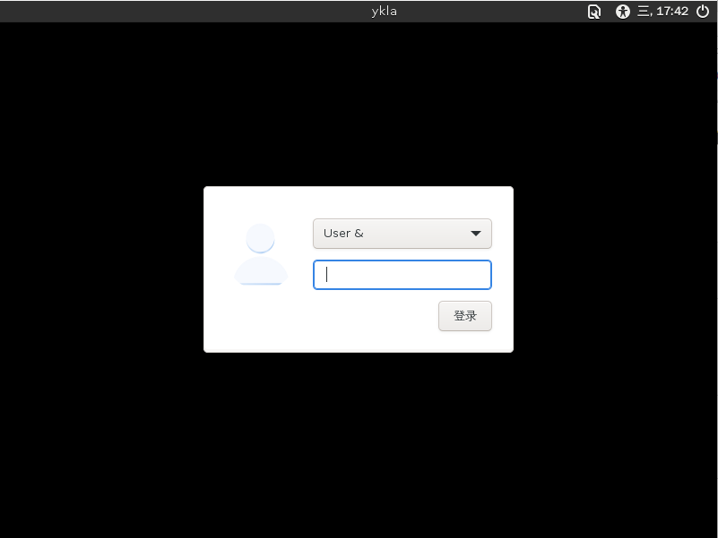
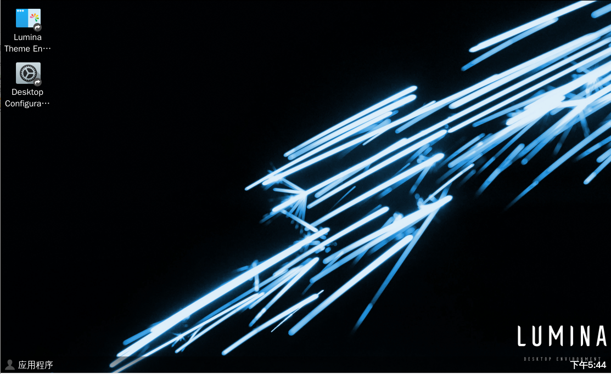

# 6.8 Lumina

Lumina 使用 BSD 许可证。Lumina 技术栈为 Qt 5，不使用任何基于 Linux 的桌面框架，主张轻量化。

2025 年 01 月 08 日，测试显示在 VMware 中无法进入桌面，或进入后闪退。参见 [Some problem Under FreeBSD 13.2 with Xorg and Lumina Desktop...How to solve?](https://forums.freebsd.org/threads/some-problem-under-freebsd-13-2-with-xorg-and-lumina-desktop-how-to-solve.88882/)。但是在 VirtualBox 中显示正常。


>**注意**
>
>[Lumina](https://github.com/lumina-desktop/lumina) 在更换主维护者后，开发长期处于停滞状态，我向其提交的 pull request 长期无人处理，并且没有新的提交记录。

## 安装

- 使用 pkg 安装：

```sh
# pkg install lumina xorg lightdm lightdm-gtk-greeter wqy-fonts xdg-user-dirs
```

- 或者使用 Ports 安装：

```sh
# cd /usr/ports/x11/xorg/ && make install clean
# cd /usr/ports/x11/lumina/ && make install clean
# cd /usr/ports/x11-fonts/wqy/ && make install clean
# cd /usr/ports/x11/lightdm/ && make install clean
# cd /usr/ports/x11/lightdm-gtk-greeter/ && make install clean
# cd /usr/ports/devel/xdg-user-dirs/ && make install clean 
```

- 软件包说明：

| 包名                   | 功能说明                                                                 |
|:------------------------|:--------------------------------------------------------------------------|
| `lumina`               | Lumina 桌面环境 |
| `xorg`                 |X Window System（X11）|
| `lightdm`              | 轻量级显示管理器 LightDM|
| `lightdm-gtk-greeter`  |LightDM 的 GTK+ 登录界面插件，缺少该组件将无法启动 LightDM|
| `wqy-fonts`            | 文泉驿中文字体|
| `xdg-user-dirs`        | 管理用户目录，如“桌面”、“下载”等 |


## 配置服务


```sh
# service dbus enable  # 设置 D-Bus 服务开机自启
# service lightdm enable  # 设置 LightDM 显示管理器开机自启
```

## 配置 `startx`

编辑 `~/.xinitrc`，添加：

```ini
exec lumina-desktop
```

方便使用 `startx` 命令启动 Lumina 桌面环境。

## 中文化

在 `/etc/rc.conf` 中加入：

```ini
lightdm_env="LC_MESSAGES=zh_CN.UTF-8" 
```

设置 LightDM 的环境变量，使消息显示为中文。

---

编辑 `/etc/login.conf`：找到 `default:\` 这一段，将 `:lang=C.UTF-8` 修改为 `:lang=zh_CN.UTF-8`。

根据 `/etc/login.conf` 更新系统能力数据库：

```sh
# cap_mkdb /etc/login.conf
```

## 桌面欣赏






