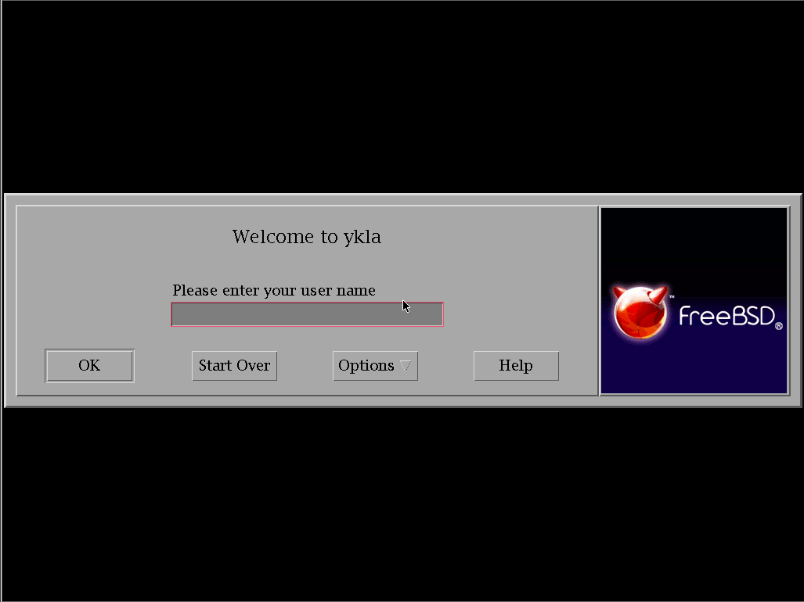
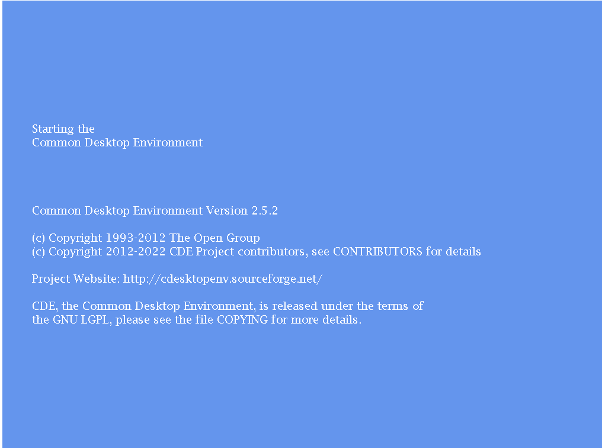
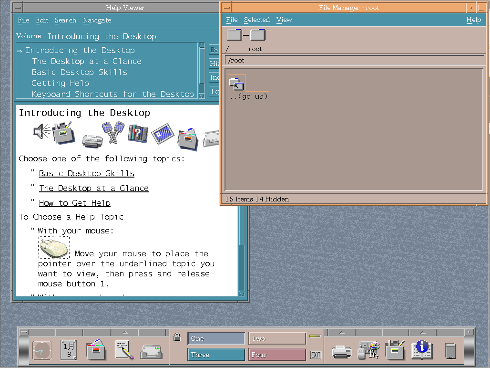

# 6.10 CDE

## CDE 桌面环境概述

CDE 是通用桌面环境（Common Desktop Environment，CDE）的缩写，是一款具有悠久历史的桌面环境，曾被广泛应用于 UNIX 商业发行版。

作为 20 世纪 90 年代商业 Unix 系统的标准桌面环境，CDE 在 Unix 发展历史上具有重要地位。

## 安装 CDE 桌面环境

- 使用 pkg 安装：

```sh
# pkg install xorg cde wqy-fonts xdg-user-dirs
```

- 或使用 Ports 安装：

```sh
# cd /usr/ports/x11/xorg/ && make install clean
# cd /usr/ports/x11/cde/ && make install clean
# cd /usr/ports/x11-fonts/wqy/ && make install clean
# cd /usr/ports/devel/xdg-user-dirs/ && make install clean 
```

### 软件包说明

| 包名 | 作用说明 |
| ---- | -------- |
| `xorg` | X 窗口系统 |
| `cde` | 提供传统的 CDE 桌面环境 |
| `wqy-fonts` | 文泉驿中文字体 |
| `xdg-user-dirs` | 管理用户目录，如“桌面”“下载”等 |

## 查看安装后的信息

```sh
# pkg info -D cde
cde-2.5.2_4:
On install:
CDE - The Common Desktop Environment is an X Windows desktop environment
that was commonly used on commercial UNIX variants such as Sun Solaris,
HP-UX, and IBM AIX. Developed between 1993 and 1999, it has now been
released under an Open source license by The Open Group.
# CDE（通用桌面环境）是早期 X Windows 的桌面环境，曾广泛用于商用 UNIX 系统如 Solaris、HP-UX 和 AIX。
# 开发时间大致为 1993–1999 年，现由 The Open Group 以开源协议发布。

Common Desktop Environment requires the Subprocess Control Service,
dtcms, and the inetd super server to fully function.
# 要完整运行 CDE，需启用子进程控制服务（dtspc）、日历管理服务（dtcms）以及 inetd 超级服务器进程。

First, add the following line to /etc/inetd.conf:

dtspc	stream	tcp	nowait	root	 /usr/local/dt/bin/dtspcd	/usr/local/dt/bin/dtspcd
# 第一步，在 /etc/inetd.conf 中添加 dtspcd 服务行。

Second, add the following line to /etc/services:

dtspc		6112/tcp # CDE Subprocess Control Service
# 第二步，在 /etc/services 中注册 dtspc 服务端口。

# sysrc rpcbind_enable=YES
# sysrc dtcms_enable=YES
# sysrc inetd_enable=YES
# service rpcbind start && service dtcms start && service inetd start
# 启用并启动 rpcbind、dtcms 和 inetd 服务，这是 CDE 所依赖的组件。

Finally, make sure to add /usr/local/dt/bin to your path.
# 最后，请将 /usr/local/dt/bin 添加到当前 PATH 环境变量中。

To start the Common Desktop Environment:
% env LANG=C startx /usr/local/dt/bin/Xsession
# 使用上述命令启动 CDE 桌面环境，设置环境变量 LANG=C 以避免本地化问题。

Alternatively, if you want to use the Login Manager as well, create
/usr/local/etc/X11/Xwrapper.config and add this line:

allowed_users=anybody
# 如果你想启用图形显示管理器（Login Manager），请创建 Xwrapper.config 并添加 allowed_users=anybody。

To start the Common Desktop Enviroment Login Manager:

% /usr/local/dt/bin/dtlogin -daemon

# 使用 dtlogin -daemon 命令启动 CDE 显示管理器（守护进程模式）。
```

## 配置服务与文件

- 配置服务

```sh
# service rpcbind enable  # 设置 RPC 绑定服务开机自启
# service dtcms enable  # 设置 DTCMS 服务开机自启
# service inetd enable  # 设置 inetd 守护进程开机自启
# service dtlogin enable  # 设置 DTLogin 显示管理器开机自启
```

- 配置 X 服务器让任意用户启动：

```sh
# echo "allowed_users=anybody" > /usr/local/etc/X11/Xwrapper.config
```

- 为当前用户创建 Xsession 的符号链接，用于启动桌面会话：

```sh
# ln -s /usr/local/dt/bin/Xsession ~/.xinitrc
```

- 配置 dtspcd 服务通过 TCP 启动，将以下内容添加到 `/etc/inetd.conf` 文件：

```ini
dtspc	stream	tcp	nowait	root	 /usr/local/dt/bin/dtspcd	/usr/local/dt/bin/dtspcd
```

- 为 dtspc 服务指定 TCP 端口 6112，将以下内容添加到 `/etc/services` 文件：

```ini
dtspc		6112/tcp
```

### 中文配置

编辑 `/etc/login.conf` 文件：找到 `default:\` 这一段，将 `:lang=C.UTF-8` 修改为 `:lang=zh_CN.UTF-8`。

还需要根据 `/etc/login.conf` 文件生成能力数据库方可生效：

```sh
# cap_mkdb /etc/login.conf
```

## 桌面欣赏





每次启动时都会在此处停顿数分钟。




## 故障排除与未竟事宜

### 无法设置中文环境

日历是中文。

根据源码 <https://sourceforge.net/p/cdesktopenv/code/ci/master/tree/cde/imports/motif/localized/>，未存在简体中文支持。但是根据 [简体中文 Solaris 用户指南](https://docs.oracle.com/cd/E19683-01/816-0668/6m7500nqp/index.html)，其明显存在简体中文支持，疑似在开源过程中丢失，或 Solaris 为未合并的分支。已经反馈至 [Missing Simplified Chinese locale support under cde/imports/motif/localized](https://sourceforge.net/p/cdesktopenv/discussion/general/thread/c51abcd846/)。

## 参考文献

- FreshPorts. cde Common Desktop Environment[EB/OL]. [2026-03-25]. <https://www.freshports.org/x11/cde>. FreshPorts 提供的 CDE 桌面环境 Port 详情与安装指南。
- FreeBSD Forums. Setting up Common Desktop Environment for modern use[EB/OL]. FreeBSD Forums, [2026-03-25]. <https://forums.freebsd.org/threads/setting-up-common-desktop-environment-for-modern-use.69475/>. 详细配置可参考此处
- CDE Project. CDE - Common Desktop Environment Wiki[EB/OL]. SourceForge, [2026-03-25]. <https://sourceforge.net/p/cdesktopenv/wiki/FreeBSDBuild/>. CDE 项目官方 Wiki 提供的 FreeBSD 平台构建与配置指南。

## 课后习题

1. 查找 CDE 桌面环境的源码仓库，分析其与 20 世纪 90 年代商业 UNIX 系统的历史关联。
2. 为 CDE 补充 i18n 支持。
