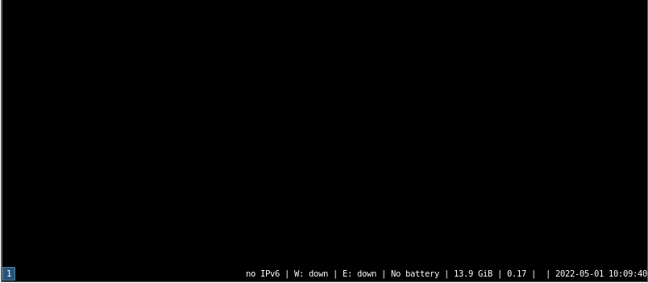

# 6.14 i3wm

## 概述

i3wm 是一款轻量级平铺式窗口管理器，注重操作效率与键盘驱动的交互方式。作为流行的平铺式窗口管理器之一，i3wm 以其高度可配置性和键盘优先的操作范式著称。

## 安装 i3wm 窗口管理器

- 使用 pkg 包管理器安装：

```sh
# pkg install xorg i3 i3status dmenu i3lock
```

- 或者使用 Ports 安装：

```sh
# cd /usr/ports/x11/xorg/ && make install clean
# cd /usr/ports/x11-wm/i3/ && make install clean
# cd /usr/ports/x11/i3status/ && make install clean
# cd /usr/ports/x11/dmenu/ && make install clean
# cd /usr/ports/deskutils/i3lock/ && make install clean
```

### 软件包说明

| 包名 | 作用说明 |
| ---- | -------- |
| `xorg` | X 窗口系统 |
| `i3` | 轻量级平铺（tiling）窗口管理器 |
| `i3status` | 状态栏 |
| `dmenu` | 动态菜单生成器 |
| `i3lock` | 锁屏工具 |

## 配置 startx

在 `.xinitrc` 文件中添加启动 i3 窗口管理器的命令：

```sh
$ echo "/usr/local/bin/i3" > ~/.xinitrc
```

编辑时应使用登录 GUI 的同一用户账号。

## 启动 i3 窗口管理器

可以使用 `startx` 命令启动 i3。

下图显示为纯 i3 界面，未添加任何插件。



## 虚拟机扩展

如果使用 VirtualBox，在 i3 配置中添加启动 VirtualBox 客户端服务的命令：

```sh
$ echo 'exec VBoxClient-all' >> ~/.config/i3/config
```

## 参考文献

- FreeBSD Project. i3(1)[EB/OL]. [2026-03-25]. <https://man.freebsd.org/cgi/man.cgi?query=i3>. FreeBSD 官方提供的 i3 窗口管理器使用手册，包含完整的命令与配置说明。
- Bottlenix. Installing i3wm on FreeBSD[EB/OL]. [2026-03-25]. <http://bottlenix.wikidot.com/installing-i3wm>. 在 FreeBSD 上安装 i3wm 的详细指南。
- UNIXSHEIKH. How to setup FreeBSD with a riced desktop - part 3 - i3[EB/OL]. [2026-03-25]. <https://unixsheikh.com/tutorials/how-to-setup-freebsd-with-a-riced-desktop-part-3-i3.html#xterm>. Unix Digest 提供的 FreeBSD i3 桌面美化与配置完整教程。
- FreeBSD Project. How to install i3?[EB/OL]. [2026-03-25]. <https://forums.freebsd.org/threads/how-to-install-i3.62305/>. FreeBSD 官方论坛讨论，解答 i3 窗口管理器的安装与配置问题。

## 课后习题

1. 重写本节进行全面增补。
2. 修改 i3wm 的默认快捷键绑定配置，验证其操作行为变化。
3. 测试中文输入法。
