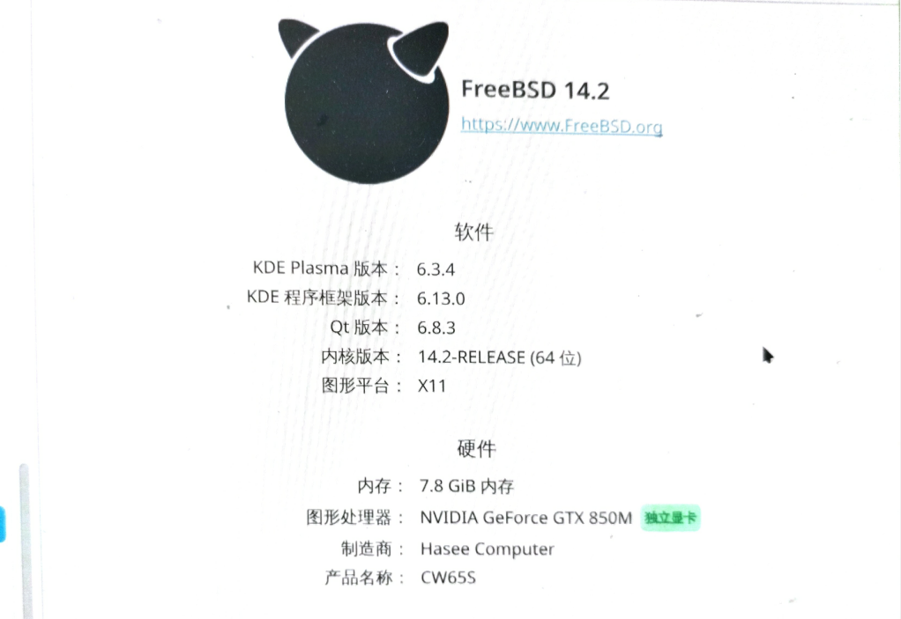

# 6.2 NVIDIA 显卡驱动配置

## NVIDIA 显卡驱动概述

对于台式机，若 CPU 是英特尔处理器，且型号以 F（如 [i5-9400F](https://www.intel.cn/content/www/cn/zh/products/sku/190883/intel-core-i59400f-processor-9m-cache-up-to-4-10-ghz/specifications.html)）或 KF（如 [i5-12600KF](https://www.intel.cn/content/www/cn/zh/products/sku/134590/intel-core-i512600kf-processor-20m-cache-up-to-4-90-ghz/specifications.html)）结尾，则该型号没有核芯显卡，无需处理核芯显卡相关配置。

若已拥有独立显卡，且视频输出接口（DP 或 HDMI）直接连接至独立显卡，则通常无需对核芯显卡进行任何配置，仅需处理独立显卡本身的驱动即可。

对于不具备显卡直通能力的笔记本设备，必须先按照其他章节内容安装配置英特尔核芯显卡驱动（相关 DRM 模块），再参照下文进行配置。

## 加入 video 组

将指定用户添加到 video 组，以便访问显卡设备：

```sh
# pw groupmod video -m 实际用户名
```

## 安装显卡驱动

使用 pkg 安装：

```sh
# pkg install nvidia-drm-kmod nvidia-settings
```

或使用 Ports 安装：

```sh
# cd /usr/ports/graphics/nvidia-drm-kmod/ && make install clean
# cd /usr/ports/x11/nvidia-settings/ && make install clean
```

列出已安装的 NVIDIA 相关软件：

```sh
# pkg info -q | grep -i nvidia
```

## 配置 NVIDIA 显卡驱动

### 启动 NVIDIA 相关内核模块

执行以下命令加载 NVIDIA 相关内核模块：

```sh
# echo 'hw.nvidiadrm.modeset="1"' >> /boot/loader.conf  # 启用 NVIDIA DRM 模式设置
# sysrc -f /etc/rc.conf kld_list+=nvidia-modeset       # 添加 nvidia-modeset 内核模块以便启动时加载
```

> **警告**
>
> 请勿尝试加载 `nvidia-drm.ko` 内核模块，该操作可能导致系统崩溃。

### 生成 X11 配置文件

需注意，若系统可正常显示，则无需执行本节内容。

```sh
# Xorg -configure                     # 自动生成 Xorg 配置文件
# cp /root/xorg.conf.new /etc/X11/xorg.conf  # 将生成的配置文件复制到 /etc/X11/xorg.conf
```

> **警告**
>
> 不要试图安装和使用 Port `x11/nvidia-xconfig`。该工具当前不适用，可能导致系统无响应。

## 硬件加速和解码器

安装 VDPAU 驱动及相关库以支持视频硬件加速。

- 使用 pkg 安装：

```sh
# pkg install libva-vdpau-driver libvdpau libvdpau-va-gl
```

- 或使用 Ports 安装：

```sh
# cd /usr/ports/multimedia/libva-vdpau-driver/ && make install clean
# cd /usr/ports/multimedia/libvdpau/ && make install clean
# cd /usr/ports/multimedia/libvdpau-va-gl/ && make install clean
```

重新启动后即可正常使用 NVIDIA 驱动。

## 查看 NVIDIA 驱动状态

列出所有 NVIDIA GPU 及其详细信息：

```sh
$ nvidia-smi
```

`nvidia-smi` 命令示例输出：

```sh
# nvidia-smi
Mon Jan 19 19:06:59 2026
+-----------------------------------------------------------------------------------------+
| NVIDIA-SMI 580.126.09             Driver Version: 580.126.09     CUDA Version: N/A      |
+-----------------------------------------+------------------------+----------------------+
| GPU  Name                 Persistence-M | Bus-Id          Disp.A | Volatile Uncorr. ECC |
| Fan  Temp   Perf          Pwr:Usage/Cap |           Memory-Usage | GPU-Util  Compute M. |
|                                         |                        |               MIG M. |
|=========================================+========================+======================|
|   0  NVIDIA GeForce RTX 3060 Ti     Off |   00000000:01:00.0  On |                  N/A |
|  0%   39C    P8             12W /  225W |     409MiB /   8192MiB |      0%      Default |
|                                         |                        |               N/A |
+-----------------------------------------+------------------------+----------------------+

+-----------------------------------------------------------------------------------------+
| Processes:                                                                              |
|  GPU   GI   CI              PID   Type   Process name                        GPU Memory |
|        ID   ID                                                               Usage      |
|=========================================================================================|
|  No running processes found                                                             |
+-----------------------------------------------------------------------------------------+
```

- 查看 KDE 系统信息：



- 使用 MPV 打开电影，可见显存使用量明显上升（从 3 MB 上升至数百兆），也可使用 SMPlayer 观看。


## 故障排除

### nvidia-smi 命令报错“mismatch”


执行 nvidia-smi 命令时出现错误提示“API mismatch”等字样。该错误表示 API 不匹配，问题通常源于版本兼容性问题，可能存在以下几种情况：NVIDIA 驱动组件本身版本不匹配、NVIDIA 驱动与其他 NVIDIA 软件包版本不匹配、NVIDIA 驱动与当前 FreeBSD 基本系统版本不匹配。

建议先卸载所有 NVIDIA 软件包，随后将 FreeBSD 基本系统更新到最新版本，再重新执行驱动安装流程。

### 如何卸载现有的 NVIDIA 相关软件包

若提示版本不符，需先卸载所有已安装的 NVIDIA 相关软件包，然后按本节进行配置：

```sh
# pkg delete *nvidia*
```

### 如何阻止驱动更新

将 `pkg info -q | grep -i nvidia` 输出的相关软件包逐个使用 `pkg lock` 命令锁定即可。

例如：

```sh
# pkg lock nvidia-drm-kmod
# pkg lock nvidia-settings
```

但若运行 `freebsd-update` 命令，或执行 pkgbase 对系统打补丁或更新补丁，也可能影响驱动。

因此需要自行平衡安全需求与日常使用。

## 参考文献

- Intel Corporation. 关于我们的最新处理器和命名更新的简要指南[EB/OL]. Intel 中国, [2026-03-25]. <https://www.intel.cn/content/www/cn/zh/processors/processor-numbers.html>. 英特尔官方关于 CPU 命名规则与型号标识的权威说明文档。
- NVIDIA Corporation. NVIDIA Driver Documentation[EB/OL]. NVIDIA, [2026-03-25]. <https://www.nvidia.com/Download/index.aspx>. NVIDIA 官方驱动程序下载与技术文档。

## 课后习题

1. 在显卡直连的笔记本上进行实际测试，提交 PR。
2. 在 Linux 兼容层下调用 NVIDIA CUDA 进行测试。
