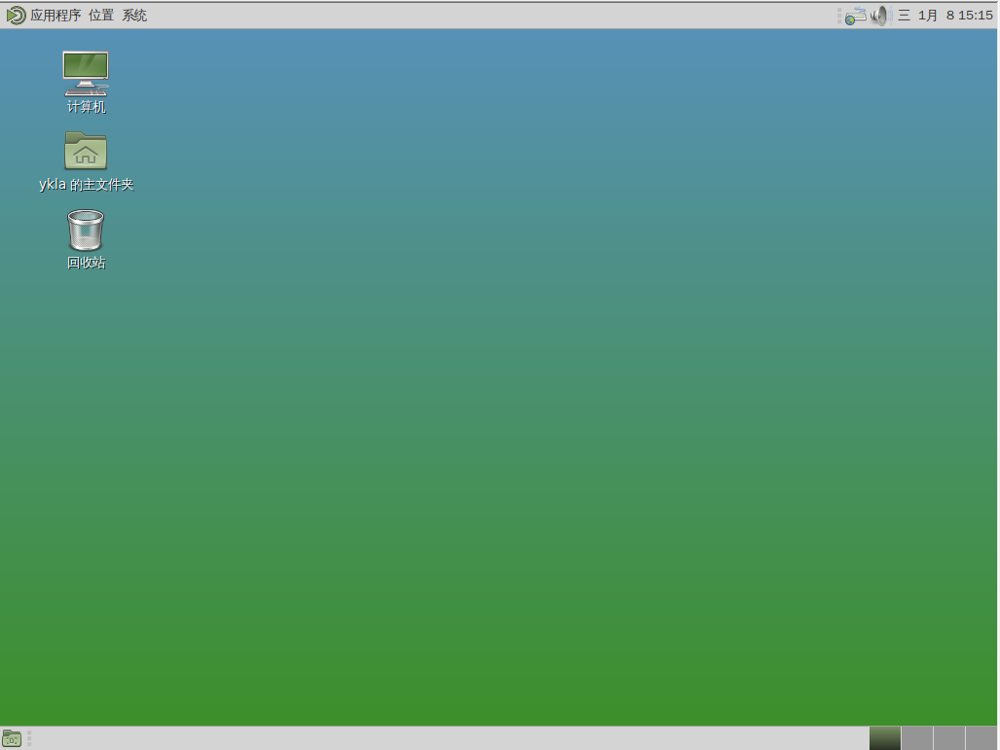
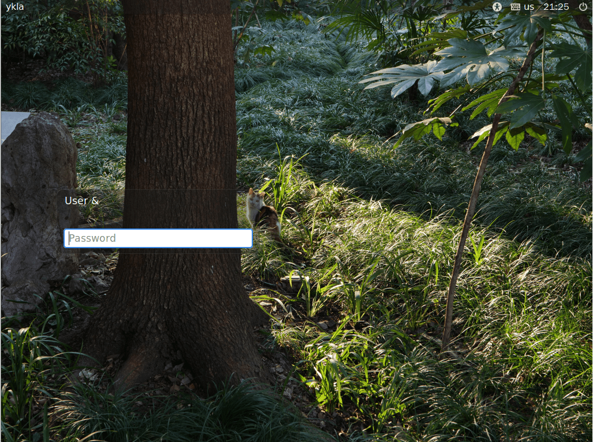

# 6.5 MATE

## MATE 桌面环境概述

MATE 是从 GNOME 2 复刻（fork）发展而来的桌面环境，其设计理念保持了 GNOME 2 的传统交互风格。

Mate 亦指巴拉圭冬青（Ilex paraguariensis），其制成的茶饮“马黛茶”在南美地区广受欢迎，许多南美球员（如梅西）亦热衷于此。

## 安装 MATE 桌面环境

- 使用 pkg 安装：

```sh
# pkg install mate xorg wqy-fonts lightdm slick-greeter xdg-user-dirs
```

- 或使用 Ports 安装：

```sh
# cd /usr/ports/x11/mate/ && make install clean
# cd /usr/ports/x11/xorg/ && make install clean
# cd /usr/ports/x11-fonts/wqy/ && make install clean
# cd /usr/ports/x11/lightdm/ && make install clean
# cd /usr/ports/x11/slick-greeter/ && make install clean
# cd /usr/ports/devel/xdg-user-dirs/ && make install clean
```

### 软件包说明

| 包名 | 功能说明 |
| ---- | -------- |
| `mate` | MATE 桌面环境 |
| `xorg` | X Window 系统 |
| `wqy-fonts` | 文泉驿中文字体 |
| `lightdm` | 显示管理器，提供图形登录界面 |
| `slick-greeter` | LightDM 的美观登录界面插件，LightDM 需要至少一个 greeter 才能正常工作 |
| `xdg-user-dirs` | 可自动管理家目录子目录（可选安装） |

## 安装后启用服务

设置 D-Bus 服务开机自启：

```sh
# service dbus enable
```

设置 LightDM 显示管理器开机自启：

```sh
# service lightdm enable
```

## 配置 LightDM

编辑 `/usr/local/etc/lightdm/lightdm.conf` 文件，找到 `greeter-session=lightdm-gtk-greeter` 一行，修改为 `greeter-session=slick-greeter`。

## `startx` 配置文件

在 `~/.xinitrc` 文件内加入下面一行，便于使用命令 `startx` 启动 MATE 桌面会话：

```sh
exec mate-session
```

## 配置中文桌面环境

编辑 `/etc/login.conf` 文件：找到 `default:\` 这一段，将 `:lang=C.UTF-8` 修改为 `:lang=zh_CN.UTF-8`。

还需要根据 `/etc/login.conf` 文件更新系统能力数据库：

```sh
# cap_mkdb /etc/login.conf
```

## 输入法


IBus 输入法框架测试可用，请参见输入法相关章节进行具体配置。

## 桌面欣赏





## 故障排除与未竟事宜

### 配置 slick-greeter

创建 `/usr/local/etc/lightdm/slick-greeter.conf` 文件，写入以下配置。

```ini
[Greeter]
# 设置登录界面的背景图片路径
background=/home/ykla/cat.png

# 是否绘制用户自定义的背景图片
draw-user-backgrounds=false

# 设置 GTK+ 主题名称
theme-name=Dracula

# 设置图标主题名称
icon-theme-name=Adwaita

# 是否显示主机名
show-hostname=true

# 设置字体名称和大小
font-name=Sans 12

# 是否显示虚拟键盘选项
show-keyboard=true

# 是否显示电源管理选项（如关机、重启）
show-power=true

# 是否显示时钟
show-clock=true

# 是否显示退出选项
show-quit=true
```



#### 参考文献

- FreeBSD Forums. lightdm not reading slick-greeter.conf[EB/OL]. [2026-03-25]. <https://forums.freebsd.org/threads/lightdm-not-reading-slick-greeter-conf.92256/>. 解决了 LightDM 无法正确读取 slick-greeter 配置文件的技术问题。

## 课后习题

1. 测试 Wayland 环境。
2. 测试更多的显示管理器。
3. 修改 MATE 桌面的默认文件管理器权限设置，验证其文件操作行为变化。
