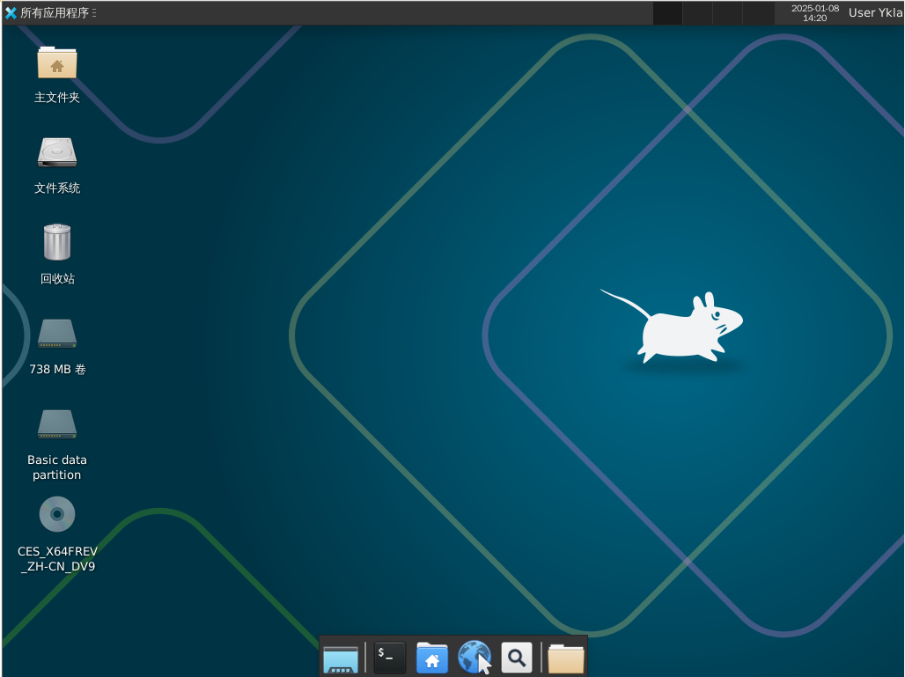
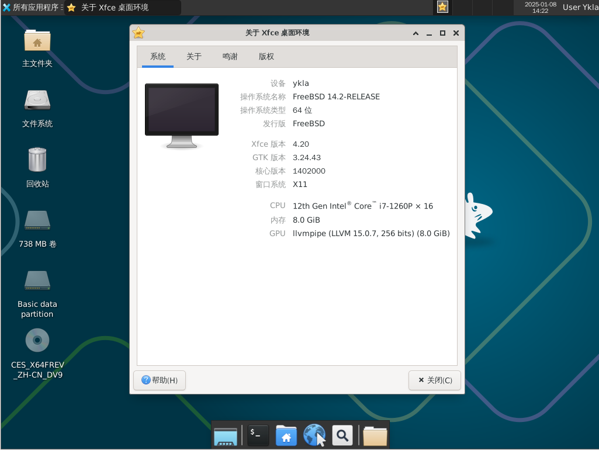

# 6.6 Xfce

## Xfce 桌面环境概述

Xfce 项目旨在开发一款轻量级但功能完备的桌面环境。作为类 Unix 系统中广受欢迎的轻量级桌面环境之一，Xfce 以其资源占用率低、响应速度快而著称。

Xfce 的 Logo 是一只 [老鼠 🐀](https://docs.xfce.org/faq#what_does_it_mean)。曾有用户反馈趣事，称因 Xfce 的默认壁纸是一只老鼠 🐀，导致自己的电脑屏幕被猫 🐈 抓坏（SanjaytheToilet. [joke] The default desktop startup screen causes damage to monitor![EB/OL]. (2015-08-04)[2026-04-04]. <https://bugzilla.xfce.org/show_bug.cgi?id=12117>.）。

## 安装 Xfce 桌面环境

- 通过 pkg 安装

```sh
# pkg install xorg lightdm lightdm-gtk-greeter xfce wqy-fonts xdg-user-dirs xfce4-goodies lightdm-gtk-greeter-settings
```

- 或通过 ports 安装：

```sh
# cd /usr/ports/x11/xorg/ && make install clean
# cd /usr/ports/x11-wm/xfce4 && make install clean # 注意有个 4
# cd /usr/ports/x11/xfce4-goodies/ && make install clean
# cd /usr/ports/x11-fonts/wqy/ && make install clean
# cd /usr/ports/x11/lightdm/ && make install clean
# cd /usr/ports/x11/lightdm-gtk-greeter/ && make install clean
# cd /usr/ports/x11/lightdm-gtk-greeter-settings/ && make install clean
# cd /usr/ports/devel/xdg-user-dirs/ && make install clean 
```

### 软件包说明

| 包名 | 作用说明 |
| ---- | -------- |
| `xorg` | X 窗口系统 |
| `lightdm` | 轻量级显示管理器 LightDM |
| `lightdm-gtk-greeter` | LightDM 的 GTK+ 显示界面插件 |
| `xfce` | Xfce 桌面环境 |
| `wqy-fonts` | 文泉驿中文字体 |
| `xdg-user-dirs` | 管理用户主目录 |
| `xfce4-goodies` | Xfce 的附加组件和插件集合 |
| `lightdm-gtk-greeter-settings` | 配置 LightDM GTK+ 登录界面的图形工具，缺少该组件将无法启动 |

## startx 命令

将 Xfce 启动脚本写入 `~/.xinitrc` 文件，以便使用 `startx` 命令启动 Xfce：

```sh
$ echo "/usr/local/etc/xdg/xfce4/xinitrc" > ~/.xinitrc
```

将 Xfce 启动脚本写入 `~/.xsession` 文件，以便通过登录管理器启动 Xfce

```sh
$ echo "/usr/local/etc/xdg/xfce4/xinitrc" > ~/.xsession
```

## 启动服务

设置 D-Bus 服务开机自启：

```sh
# service dbus enable
```

设置 LightDM 显示管理器开机自启：

```sh
# service lightdm enable
```

## 设置中文环境

编辑 `/etc/login.conf` 文件：找到 `default:\` 这一段，将 `:lang=C.UTF-8` 修改为 `:lang=zh_CN.UTF-8`。

还需要根据 `/etc/login.conf` 文件更新系统能力数据库：

```sh
# cap_mkdb /etc/login.conf
```

## 图片欣赏


图 6.6-1 展示了 FreeBSD 上安装的 Xfce 桌面环境。



图 6.6-2 展示了 Xfce 桌面环境的应用菜单。



图 6.6-3 展示了 Xfce 桌面环境的系统设置。

## 全局菜单（可选）

使用 pkg 安装：

```sh
# pkg install xfce4-appmenu-plugin appmenu-gtk-module appmenu-registrar
```

或使用 Ports 安装：

```sh
# cd /usr/ports/x11/xfce4-appmenu-plugin/ && make install clean
# cd /usr/ports/x11/gtk-app-menu/ && make install clean
# cd /usr/ports/x11/appmenu-registrar/ && make install clean
```

查看安装后的说明，并根据说明进行配置。

```sh
$ xfconf-query -c xsettings -p /Gtk/ShellShowsMenubar -n -t bool -s true  # 启用 GTK 菜单栏显示
$ xfconf-query -c xsettings -p /Gtk/ShellShowsAppmenu -n -t bool -s true  # 启用 GTK 应用菜单显示
$ xfconf-query -c xsettings -p /Gtk/Modules -n -t string -s "appmenu-gtk-module"  # 设置 GTK 模块为 appmenu-gtk-module
```

## 软件推荐

FreeBSD 的 Xfce 邮箱客户端推荐使用 `mail/evolution` 文件，可搭配 `xfce4-mailwatch-plugin`、`security/gnome-keyring` 一并使用。

还有一款桌面插件，名为 `x11/xfce4-verve-plugin`。配合设置智能书签，可以查询网页内容。可通过配置 FreeBSD 的 man 手册，实现对所需内容的搜索。

## XTerm 终端动态标题

### sh

编辑 `~/.shrc` 文件，写入：

```sh
if [ -t 1 ]; then       
  while :; do
    printf '\033]0;%s\007' "$PWD"   
    printf '\n$ '
    if ! IFS= read -r cmd; then
      break
    fi
    printf '\033]0;%s\007' "$cmd"
    eval "$cmd"
  done
  exit
fi
```

### csh

编辑 `~/.cshrc` 文件，写入：

```sh
if ( $?TERM && $TERM =~ xterm* ) then
    set host = `hostname`      
    alias postcmd 'rehash; printf -- "\033]2;%s\007" "${user}@${host}: ${cwd}"
endif
```

### tcsh

编辑 `~/.tcshrc` 文件，写入：

```sh
switch ($TERM)
case xterm*:
    set prompt="%{\033]0;%n@%m: %~\007%}%# "
    breaksw
default:
    set prompt="%# "
    breaksw
endsw 
```

### bash

编辑 `~/.bashrc` 文件，写入：

```sh
case $TERM in
         xterm*)
             PS1="\[\033]0;\u@\h: \w\007\]bash\\$ "
             ;;
         *)
             PS1="bash\\$ "
             ;;
     esac
```

### zsh

编辑 `~/.zshrc` 文件，写入：

```sh
autoload -Uz add-zsh-hook

function xterm_title_precmd () {
	print -Pn -- '\e]2;%n@%m %~\a'
	[[ "$TERM" == 'screen'* ]] && print -Pn -- '\e_\005{2}%n\005{-}@\005{5}%m\005{-} \005{+b 4}%~\005{-}\e\\'
}

function xterm_title_preexec () {
	print -Pn -- '\e]2;%n@%m %~ %# ' && print -n -- "${(q)1}\a"
	[[ "$TERM" == 'screen'* ]] && { print -Pn -- '\e_\005{2}%n\005{-}@\005{5}%m\005{-} \005{+b 4}%~\005{-} %# ' && print -n -- "${(q)1}\e\\"; }
}

if [[ "$TERM" == (Eterm*|alacritty*|aterm*|foot*|gnome*|konsole*|kterm*|putty*|rxvt*|screen*|wezterm*|tmux*|xterm*) ]]; then
	add-zsh-hook -Uz precmd xterm_title_precmd
	add-zsh-hook -Uz preexec xterm_title_preexec
fi
```

### 参考文献

- Oracle Corporation. 6.1 动态设置标题不起作用[EB/OL]. Oracle Documentation, [2026-03-25]. <https://docs.oracle.com/cd/E19683-01/817-1951/6mhl8aiii/index.html>. bash 配置来自此处
- Wamphyre. BSD-XFCE[EB/OL]. GitHub, [2026-03-25]. <https://web.archive.org/web/20260121072214/https://github.com/Wamphyre/BSD-XFCE>. 配置参考集合
- Arch Linux 中文维基. Zsh[EB/OL]. [2026-03-25]. <https://wiki.archlinuxcn.org/wiki/Zsh>. Arch Linux 中文维基提供的 Zsh 配置详细教程，本文 Zsh 配置源自此。

## 故障排除与未竟事宜

若需进一步动态显示当前进程，目前似乎只有 sh 能做到。

## 课后习题

1. 查找 xfce4-goodies 集合的 Port 依赖关系，构建最小化 Xfce 附加组件集。
2. 找一只猫，测试其对 Xfce 桌面环境的反应。
