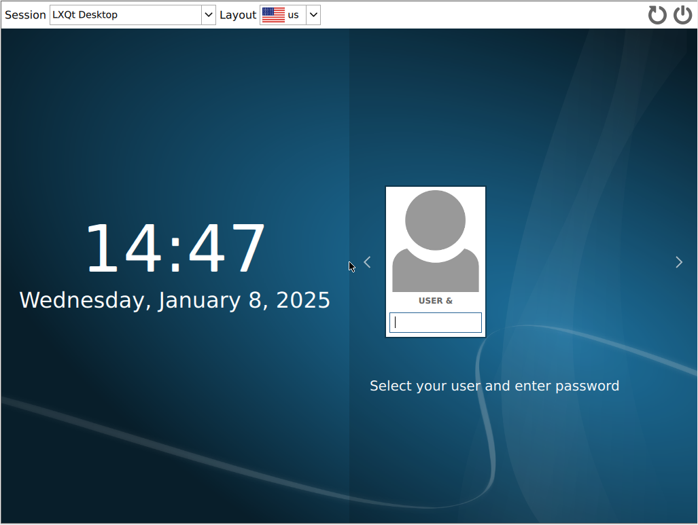
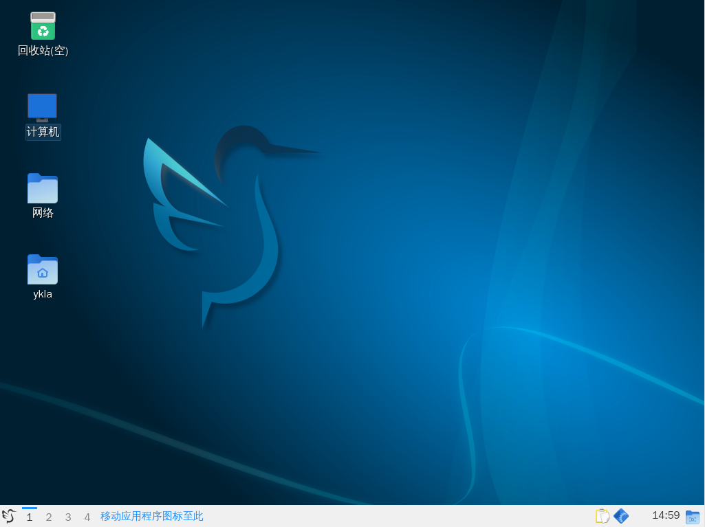

# 6.8 LXQt

## LXQt 桌面环境概述

LXQt 是一款轻量级桌面环境，基于 Qt 应用框架开发。

本节介绍如何在 FreeBSD 上安装和配置 LXQt。

## 安装 LXQt 桌面环境

- 通过 pkg 安装：

```sh
# pkg install xorg sddm lxqt gvfs wqy-fonts xdg-user-dirs
```

- 或使用 Ports 安装：

```sh
# cd /usr/ports/x11/xorg/ && make install clean
# cd /usr/ports/x11-wm/lxqt/ && make install clean
# cd /usr/ports/x11-fonts/wqy/ && make install clean
# cd /usr/ports/x11/sddm/ && make install clean
# cd /usr/ports/devel/gvfs/ && make install clean
# cd /usr/ports/devel/xdg-user-dirs/ && make install clean
```

### 软件包说明

| 包名 | 功能说明 |
| ---- | -------- |
| `xorg` | X 窗口系统 |
| `sddm` | 显示管理器 |
| `lxqt` | LXQt 桌面环境 |
| `gvfs` | GNOME 虚拟文件系统，LXQt 依赖此组件以打开 Computer 和 Network，否则会提示 `Operation not supported` |
| `wqy-fonts` | 文泉驿中文字体 |
| `xdg-user-dirs` | 管理用户目录，如“桌面”、“下载”等，并处理目录名称的本地化 |

## 服务管理

设置 D-Bus 服务开机自启：

```sh
# service dbus enable
```

设置 SDDM 显示管理器开机自启：

```sh
# service sddm enable
```

## 挂载 proc 文件系统

编辑 `/etc/fstab` 文件，加入下行：

```sh
proc	/proc	procfs	rw	0	0
```

将 `procfs` 文件系统以读写模式挂载到 `/proc`。

## 通过 startx 启动 LXQt

将启动命令写入 `~/.xinitrc` 文件，以启动 LXQt 桌面环境：

```sh
$ echo "exec ck-launch-session startlxqt" > ~/.xinitrc
```

读者使用哪个账户登录，就使用该账户写入。

## 设置中文环境

### 为 SDDM 显示管理器设置中文环境

```sh
# sysrc sddm_lang="zh_CN"
```




### 为 LXQt 桌面环境设置中文环境

进入 LXQt 后，点击菜单 -> “Preferences” -> “LXQt Settings” -> “Locale” -> “Region”，在下拉菜单中选择中文。




## 故障排除与未竟事宜

### 桌面图标不显示

请事先安装喜欢的其他图标主题。然后：菜单 -> “Preferences” -> “LXQt Settings” -> “Appearance” -> “Icons Theme”，选择已安装的图标主题，点击 “Apply” 后重新登录。

## 课后习题

1. 验证 LXQt 的 gvfs 依赖机制是否真正有效。
2. 安装中文输入法进行体验。
3. 修改 LXQt 桌面的默认图标主题加载机制，验证其界面显示行为变化，并记录到本节。
