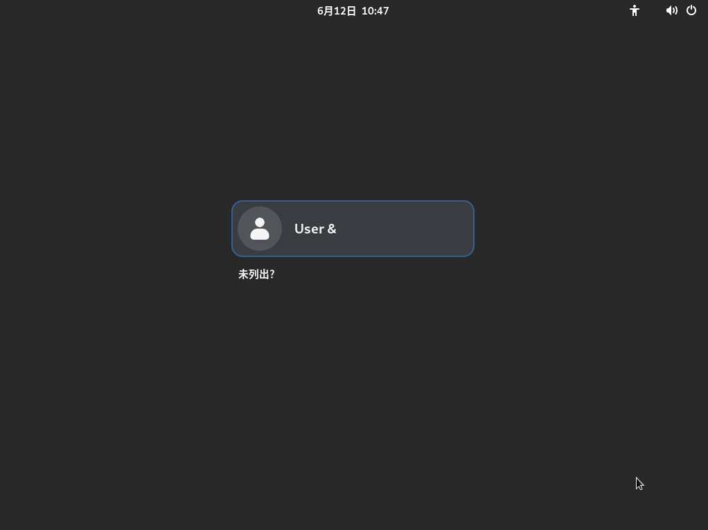
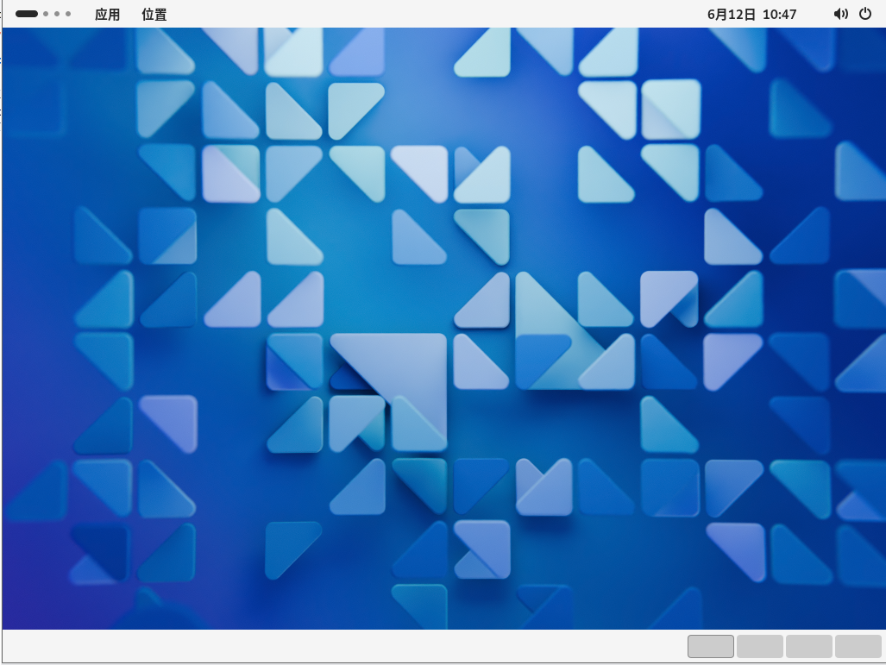
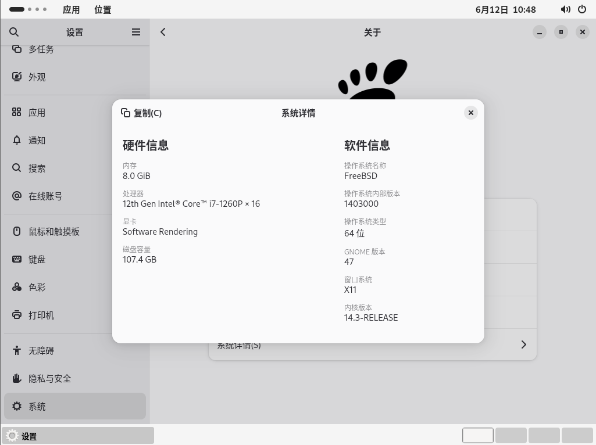
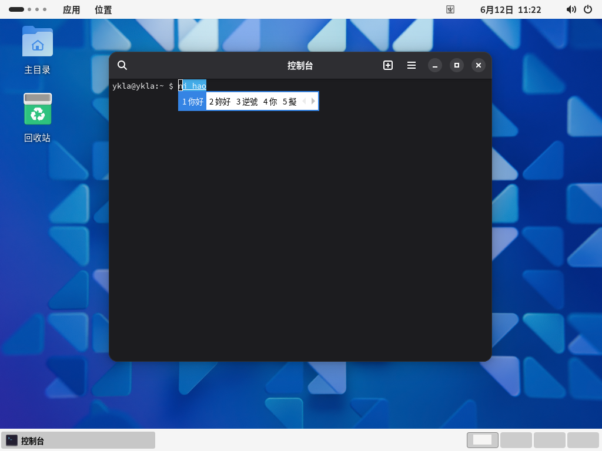
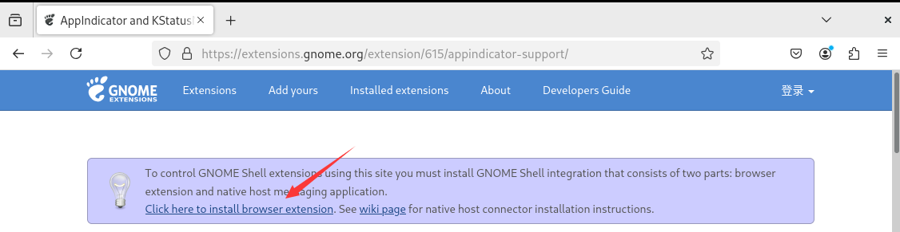
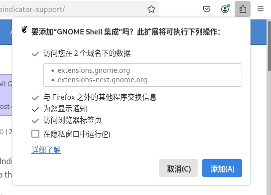

# 6.9 GNOME

## GNOME 桌面环境概述

> **警告**
>
> 目前因 FreeBSD Bugzilla. Bug 287955 - x11/gdm: The user cannot log in; the system hangs at the login screen in gdm 47[EB/OL]. [2026-04-04]. <https://bugs.freebsd.org/bugzilla/show_bug.cgi?id=287955>. GDM 无法正常使用，会卡在登录界面，`startx` 正常。
>
> 虚拟机正常。

GNOME 过去曾是 GNU 项目的组成部分，旨在开发一套功能完备的桌面环境，目前主要由 Red Hat 主导开发与维护。作为 Linux 与类 Unix 系统中广泛采用的主流桌面环境之一，GNOME 以其简洁现代的设计理念著称。需注意的是，在英语发音中，GNOME 的首字母 `G` 不发音（音标为 /ˈnoʊm/）。

## 安装完整的 GNOME 桌面环境

- 使用 pkg 安装：

```sh
# pkg install xorg gnome noto-sc
```

- 或使用 Ports 安装：

```sh
# cd /usr/ports/x11/xorg/ && make install clean
# cd /usr/ports/x11/gnome/ && make install clean
# cd /usr/ports/x11-fonts/noto-serif-sc/ && make install clean
```

### 软件包说明

| 软件 | 用途 |
| ---- | ---- |
| xorg | X11 |
| gnome | GNOME 主程序 |
| noto-sc | 思源黑体（简体中文） |

## 配置

还需要编辑文件系统挂载信息。

挂载 proc 文件系统，在 `/etc/fstab` 文件中添加内容如下：

```ini
proc /proc procfs rw 0 0
```

设置 D-Bus 服务开机自启：

```sh
# service dbus enable
```

设置 GDM 显示管理器开机自启：

```sh
# service gdm enable
```

输入以下命令，将 GNOME 会话命令写入 `~/.xinitrc` 文件，以便使用命令 `startx` 启动 GNOME：

```sh
$ echo "/usr/local/bin/gnome-session" > ~/.xinitrc
```



默认情况下禁止 root 登录。



默认壁纸就是这样。



## 为 GNOME 桌面环境配置中文环境

本小节的配置参数与用户 shell 无关，即使使用 csh 也应如此配置。

使用文本编辑器打开 GDM 本地化配置文件 `/usr/local/etc/gdm/locale.conf` 以修改语言设置。将原有内容替换如下：

```sh
LANG="zh_CN.UTF-8"         # 设置系统默认语言为简体中文 UTF-8
LC_CTYPE="zh_CN.UTF-8"     # 设置字符类型和编码为简体中文 UTF-8
LC_MESSAGES="zh_CN.UTF-8"  # 设置系统消息显示语言为简体中文 UTF-8
```

## 中文输入法

IBus、Fcitx 5 二选一即可。

### IBus

GNOME 捆绑的输入法框架是 IBus。

使用 pkg 安装：

```sh
# pkg install zh-ibus-libpinyin
```

或者使用 Ports 安装：

```sh
# cd /usr/ports/chinese/ibus-libpinyin/
# make install clean
```

安装后运行初始化命令 `ibus-setup`。然后：设置 → 键盘 → 输入源，点击“添加输入源”，选择“汉语（中国）”，加入“中文（智能拼音）”。

### Fcitx 5

参见输入法相关章节。

> **警告**
>
> IBus 是 GNOME 的依赖项，不能卸载。即使不使用 IBus，也不能将其卸载，否则将一并卸载 GNOME 本体。



## 不符合常规的设置调整

GNOME 一直以不符合部分用户使用习惯著称，例如桌面不允许放置图标、右上角没有托盘等。~~是不是和垃圾桶不能有垃圾、人不能在床上、门不能关、桌子上不能放东西有异曲同工之妙？~~

### 系统优化工具

使用 pkg 安装：

```sh
# pkg install gnome-tweaks
```

或者使用 Ports 安装：

```sh
# cd /usr/ports/deskutils/gnome-tweaks/ 
# make install clean
```

### 恢复 GNOME 顶栏的托盘图标

需要安装 Firefox 浏览器 `www/firefox` 及 Port `x11-chrome-gnome-shell`。

由于 [TopIcons Plus](https://extensions.gnome.org/extension/1031/topicons/) 已长期未更新，因此只能使用 [AppIndicator and KStatusNotifierItem Support](https://extensions.gnome.org/extension/615/appindicator-support/) 了。







#### 参考文献

- Abhishek Prakash. Getting the Top Indicator Panel Back in GNOME[EB/OL]. [2026-03-25]. <https://itsfoss.com/enable-applet-indicator-gnome>. 提供了恢复 GNOME 顶栏托盘图标显示的详细步骤与扩展安装指南。

### 在桌面上放置图标

扩展 [gnome-shell-extension-desktop-icons](https://extensions.gnome.org/extension/1465/desktop-icons/) 已经长期未更新，项目地址为：[Desktop Icons](https://gitlab.gnome.org/World/ShellExtensions/desktop-icons)。

可以使用 [Desktop Icons NG (DING)](https://extensions.gnome.org/extension/2087/desktop-icons-ng-ding/) 解决。安装方式同上。


壁纸是自定义的，其他都是默认的。

## 附录：GNOME 桌面环境精简安装

- 使用 pkg 安装：

```sh
# pkg install xorg-minimal gnome-lite wqy-fonts xdg-user-dirs
```

- 或者使用 Ports 安装：

```sh
# cd /usr/ports/x11/xorg-minimal/ && make install clean
# cd /usr/ports/x11/gnome/ && make install clean
# cd /usr/ports/x11-fonts/wqy/ && make install clean
# cd /usr/ports/devel/xdg-user-dirs/ && make install clean
```

### 软件包说明

| 包名 | 作用 |
| ---- | ---- |
| `xorg-minimal` | 精简版 X 图形环境 |
| `gnome-lite` | 精简版 GNOME 桌面 |

### 对现有的 GNOME 完整版本进行精简

如果安装了完整版本，也可以使用 pkg 包管理器卸载自带的游戏软件：

```sh
# pkg delete gnome-2048 gnome-klotski gnome-tetravex gnome-mines gnome-taquin gnome-sudoku gnome-robots gnome-nibbles lightsoff tali quadrapassel swell-foop gnome-mahjongg five-or-more iagno aisleriot four-in-a-row
```


## 课后习题

1. 查找 GNOME 桌面环境的 Port 构建过程，分析其与 systemd 环境的历史关联，在 QEMU 中验证其在 FreeBSD 非 systemd 环境下的适配实现。
2. 分析 GNOME 的 IBus 输入法框架集成机制，去除该默认的强制依赖项。
