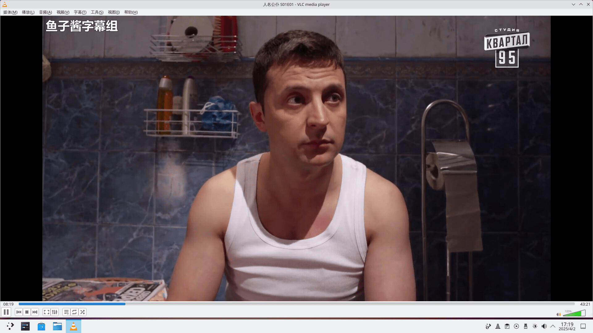
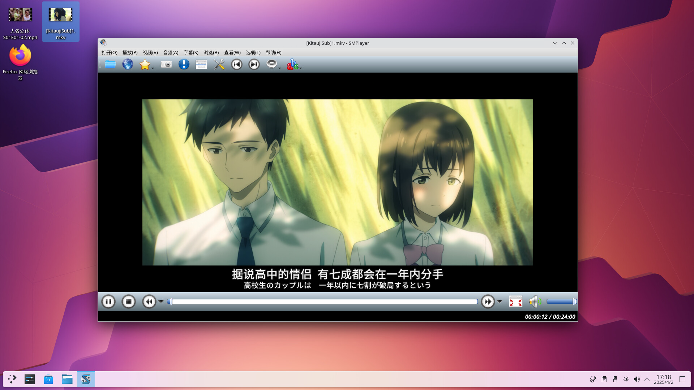
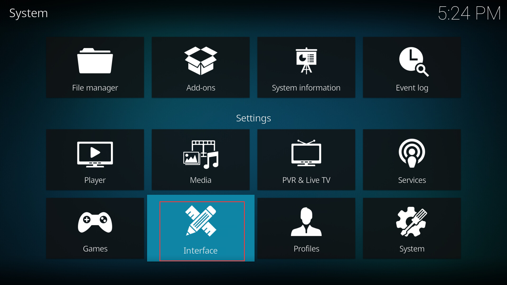
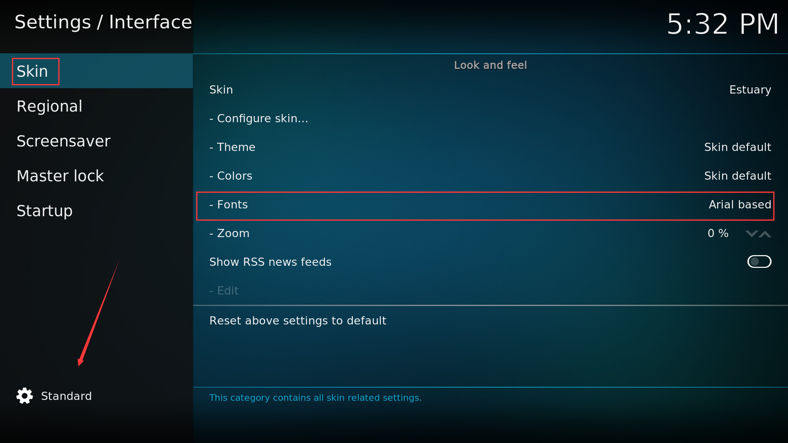
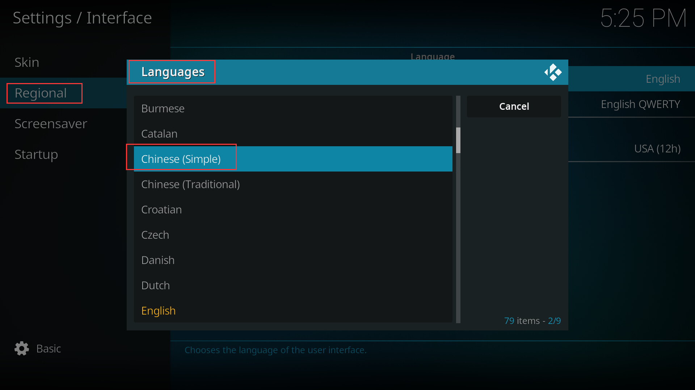
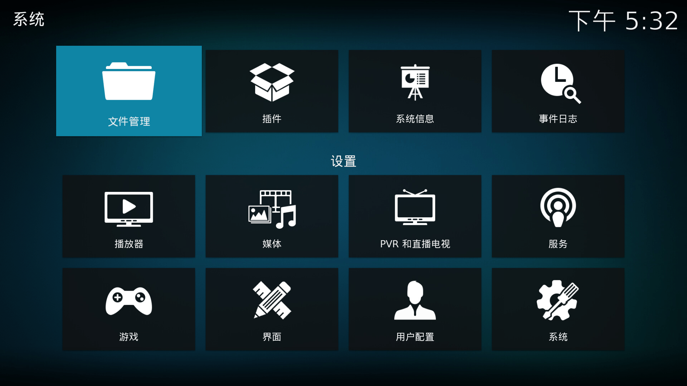

# 第 7.6 节 视频播放器

## VLC

### 安装 VLC

- 使用 pkg 安装：
  
```sh
# pkg install vlc
```

- 或者使用 Ports：

```sh
# cd /usr/ports/multimedia/vlc/ 
# make install clean
```

### VLC 视频播放测试

视频 A、B 均正常




## SMPlayer

SMPlayer 是 MPlayer（纯命令行）的 QT 前端。推荐使用。

### 安装 SMPlayer

- 使用 pkg 安装：

```sh
# pkg install smplayer
```

- 或者使用 Ports：

```sh
# cd /usr/ports/multimedia/smplayer/ 
# make install clean
```

### SMPlayer 视频播放测试

视频 A、B 均正常





## Kodi

Kodi 曾用名为 XBMC。

### 安装 Kodi

- 使用 pkg 安装：
  
```
# pkg install kodi
```

- 或者使用 Ports：
  
```sh
# cd /usr/ports/multimedia/kodi/ 
# make install clean
```

### Kodi 设置中文

打开 `interface`（界面）



点击 `Skin`（皮肤）。再点击左下角，把 `basic`（简单）改为 `expert`（专家）或 `Standard`（标准），否则你看不到 `fonts` 等选项！然后将 `fonts`（字体）改为 `Arial based`，否则中文会乱码！



返回，选择 `Regional`（区域）——> `Language`（语言）——> `Chinese (Simple)`（简体中文）。



中文设置完毕：



### Kodi 播放视频测试

视频 A、B 均正常


## 附录：直接在 TTY 播放视频（mpv）

可以直接在 TTY 使用 mpv 命令播放视频。

- 使用 pkg 安装：

```sh
# pkg ins mpv
```

- 还可以通过 Ports 安装

```sh
# cd /usr/ports/multimedia/mpv/ 
# make install clean
```

切换到 TTY，然后使用以下命令播放视频：

```sh
$ mpv 1.mp4
```

请你自己试一试。

>**注意**
>
>此功能依赖 drm，虚拟机可能并不能正常操作。

>**技巧**
>
>可以使用命令行命令 `mixer` 调整音量。如下列命令将把音量调高 5%。
>
>```sh
>$ mixer vol=+5%
>```


