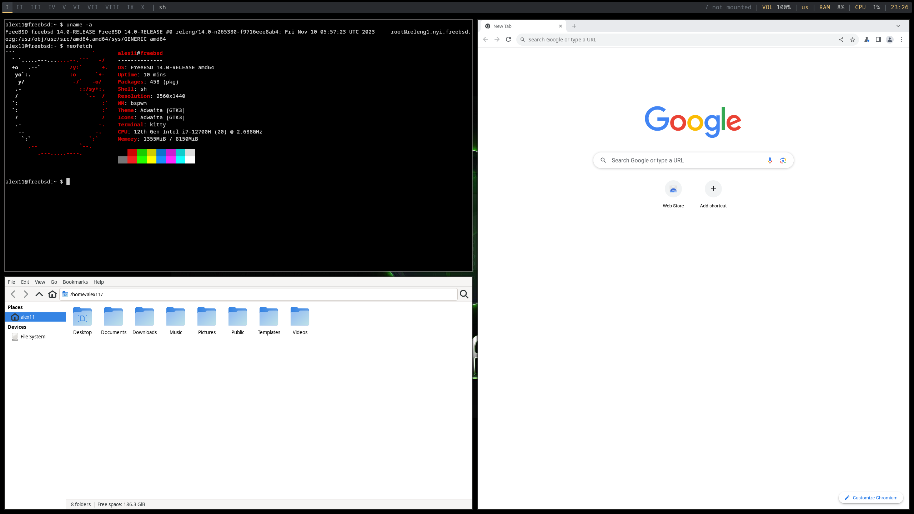

# 7.1 bspwm

bspwm，据说更符合 UNIX 哲学（参见 [bspwm 入门](https://zerovip.vercel.app/zh/63233/)，7.2 Unix 哲学）。

## 安装 bspwm

- 通过 pkg 安装

```sh
# pkg install xorg bspwm sxhkd rofi kitty feh picom polybar dunst lightdm lightdm-gtk-greeter wqy-fonts xdg-user-dirs
```

- 使用 Ports 安装：


```sh
# cd /usr/ports/x11/xorg/ && make install clean
# cd /usr/ports/x11-wm/bspwm/ && make install clean
# cd /usr/ports/x11/sxhkd/ && make install clean
# cd /usr/ports/x11/rofi/ && make install clean
# cd /usr/ports/x11/kitty/ && make install clean
# cd /usr/ports/graphics/feh/ && make install clean
# cd /usr/ports/x11-wm/picom/ && make install clean
# cd /usr/ports/x11/polybar/ && make install clean
# cd /usr/ports/sysutils/dunst/ && make install clean
# cd /usr/ports/x11-fonts/wqy/ && make install clean
# cd /usr/ports/x11/lightdm/ && make install clean
# cd /usr/ports/x11/lightdm-gtk-greeter/ && make install clean
# cd /usr/ports/devel/xdg-user-dirs/ && make install clean
```

- 软件包说明：


| 包名                  | 作用说明                                                                 |
|:---------------------|:--------------------------------------------------------------------------|
| `xorg`              | X Window 系统（X Window System）          |
| `bspwm`             | 轻量级平铺窗口管理器（Binary Space Partitioning Window Manager）                            |
| `sxhkd`             | 快捷键绑定工具（Simple X Hotkey Daemon）                                    |
| `rofi`              | 程序启动器（Rofi），支持应用启动、窗口切换等功能                                     |
| `kitty`             |终端模拟器（Kitty）                         |
| `feh`               | 桌面背景设置工具（Feh）             |
| `picom`             |窗口合成器（Picom），提供透明、阴影和动画效果   |
| `polybar`           | 面板工具（Polybar），显示系统信息和应用图标等            |
| `dunst`             | 通知管理器（Dunst）  |
| `lightdm`           | LightDM 显示管理器（Light Display Manager），提供图形登录界面             |
| `lightdm-gtk-greeter`| LightDM 的 GTK+ 登录界面插件（LightDM GTK+ Greeter），缺失时将无法启动 LightDM  |
| `wqy-fonts`         | 文泉驿字体（WenQuanYi Fonts）                               |
| `xdg-user-dirs`     | 用户目录管理工具（XDG User Dirs），管理如“桌面”、“下载”等目录          |


>**提示**
>
>由于 Polybar 在 FreeBSD 上功能不完整，建议替换为 `x11/tint`（pkg 包名为 `tint2`），可显示系统托盘图标。


## 启用服务

设置 D-Bus 服务开机自启动：

```sh
# service dbus enable
```

## 创建配置文件

```sh
$ mkdir -p ~/.config                  # 创建用户配置目录
$ mkdir -p ~/.config/bspwm            # 创建 bspwm 配置目录
$ mkdir -p ~/.config/sxhkd            # 创建 sxhkd 配置目录
$ cp /usr/local/share/examples/bspwm/bspwmrc ~/.config/bspwm   # 复制 bspwm 示例配置文件到用户目录
$ cp /usr/local/share/examples/bspwm/sxhkdrc ~/.config/sxhkd   # 复制 sxhkd 示例配置文件到用户目录
$ chmod +x ~/.config/bspwm/bspwmrc    # 设置 bspwm 配置文件为可执行权限
```

编辑 `~/.config/sxhkd/sxhkdrc` 文件，修改如下：

```sh
super + Return
    kitty   # 使用超级键 + 回车启动 Kitty 终端

super + @space
    rofi -show drun   # 使用超级键 + 空格启动 Rofi 应用启动器
```

>**思考题**
>
>回顾基础入门章节的内容，“超级键”是什么？更多快捷键设置可参考 `~/.config/sxhkd/sxhkdrc` 文件。

## 设置 polybar 启动脚本和配置文件

```sh
$ mkdir ~/.config/polybar                    # 创建 Polybar 配置目录
$ cp /usr/local/etc/polybar/config.ini ~/.config/polybar   # 复制 Polybar 示例配置文件到用户目录
```

创建 `~/.config/polybar/launch.sh`，写入：

```sh
#!/bin/sh
killall -q polybar                        # 安静地终止所有正在运行的 Polybar 实例
polybar example 2>&1 | tee -a /tmp/polybar.log   # 启动 Polybar 并将输出追加到日志文件
```

然后执行以下命令为 Polybar 启动脚本设置可执行权限：

```sh
$ chmod +x ~/.config/polybar/launch.sh
```

## 设置 picom、polybar、dunst 自启动

```sh
$ echo "picom &" >> ~/.config/bspwm/bspwmrc                    # 在 bspwm 配置中启动 picom
$ echo "\$HOME/.config/polybar/launch.sh" >> ~/.config/bspwm/bspwmrc   # 在 bspwm 配置中启动 Polybar
$ echo "dunst &" >> ~/.config/bspwm/bspwmrc                    # 在 bspwm 配置中启动 Dunst 通知守护进程
```


## 通过 startx 启动 bspwm

在 `.xinitrc` 中添加启动 bspwm 的命令：

```sh
$ echo "exec bspwm" >> ~/.xinitrc
```

## 通过 lightdm 启动 bspwm

- 创建 `/usr/local/share/xsessions/bspwm.desktop`

```sh
# mkdir -p /usr/local/share/xsessions
```

- 编辑 `/usr/local/share/xsessions/bspwm.desktop` 文件，写入以下内容：

```ini
[Desktop Entry]
Name=bspwm                  # 桌面环境名称
Comment=Log in with bspwm   # 登录时显示的描述
Exec=/usr/local/bin/bspwm   # 启动 bspwm 的命令路径
Type=Application            # 条目类型为应用程序
```

- 设置 LightDM 显示管理器开机自启动

```sh
# service lightdm enable
```

## 一些操作和设置

### 设置桌面背景

- 初次设置预览。使用 feh 设置壁纸并居中显示：

```sh
$ feh --bg-center "$HOME/.local/share/wallpapers/wallpaper.jpg"
```

- 预览后如满意则设置为永久性设置（开机在后台执行 feh 保存的壁纸设置脚本）：

在 `~/.config/bspwm/bspwmrc` 中的 polybar 启动脚本 **前** 添加

```ini
$HOME/.fehbg &
```

## 展示图片



图片中显示的 Chrome 浏览器和 Thunar 文件管理器均需用户自行安装

## 参考文献

- [从零开始的 Bspwm 安装与配置教程](https://zhuanlan.zhihu.com/p/568211941)
