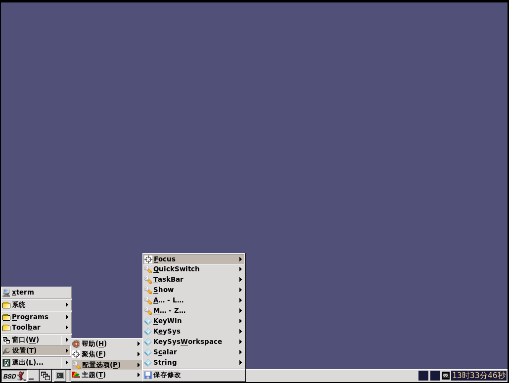

# 7.2 IceWM

IceWM 是基于 X Window 系统（X Window System）的窗口管理器。其设计目标是速度快、结构简洁，并且不干扰用户操作。它自带分页任务栏、全局及每个窗口的快捷键，并提供动态菜单系统。可通过键盘和鼠标来管理窗口。用户可以将窗口图标化到任务栏、系统托盘或桌面，或者将其隐藏。用户可以通过快速切换窗口（Alt+Tab）或使用窗口列表来管理窗口。多种可配置的窗口焦点模式均可通过菜单进行选择。多显示器环境由 RandR 和 Xinerama 扩展支持。IceWM 高度可配置，支持自定义主题，并提供完善的文档。IceWM 提供可选的外部壁纸管理器（支持透明效果）、简易会话管理器和系统托盘。IceWM 可在主流 Linux 发行版以及大多数 *BSD 系统上使用。——引自 [IceWM Window Manager](https://ice-wm.org/)

## 安装

### 使用 pkg 安装

```sh
# pkg install xorg icewm slim wqy-fonts xdg-user-dirs
```

### 使用 Ports 安装

```sh
# cd /usr/ports/x11-wm/icewm/ && make install clean
# cd /usr/ports/x11-themes/icewm-extra-themes/ && make install clean 
# cd /usr/ports/x11/xorg/ && make install clean 
# cd /usr/ports/x11/slim/ && make install clean
# cd /usr/ports/x11-fonts/wqy/ && make install clean
# cd /usr/ports/devel/xdg-user-dirs/ && make install clean
```

### 软件包解释
  
| 包名               | 作用说明                                                                 |
|:------------------|:-----------------------------------------------------------------------|
| `xorg`           |X Window 系统                                           |
| `icewm`          | 轻量级窗口管理器                    |
| `slim`           | 轻量级图形登录管理器                            |
| `wqy-fonts`      | 文泉驿中文字体                                              |
| `xdg-user-dirs`  | 管理用户目录，如“桌面”、“下载”……                                          |


## `startx`

编辑 `~/.xinitrc` 文件，并加入以下内容（请使用当前登录用户的账户进行修改）：

```ini
exec icewm-session
```

这样做，就可以在 TTY 使用 `startx` 命令启动 IceWM 会话。

## 启动项

```sh
# service dbus enable   # 设置 D-Bus 服务开机自启动（作为依赖自动安装）
# service slim enable   # 设置 SLiM 显示管理器开机自启动
```

## 挂载 proc 文件系统

编辑 `/etc/fstab`，加入下行：

```ini
proc           /proc       procfs  rw  0   0
```

挂载 procfs 文件系统到 `/proc`，读写模式。

## 中文环境

编辑 `/etc/login.conf` 文件，找到 `default:\` 段，将 `:lang=C.UTF-8` 修改为 `:lang=zh_CN.UTF-8`。

重新生成 `login.conf` 的能力数据库：

```sh
# cap_mkdb /etc/login.conf
```

## 桌面欣赏



安装后的默认界面如上，可以选择更换主题：


## 故障排除与未竟事宜

### 中文环境不完整

此问题已反馈至 [Many UI Strings Are Missing from .po Files](https://github.com/bbidulock/icewm/issues/821)。

## 参考文献

- [icewm-preferences(5)](https://man.freebsd.org/cgi/man.cgi?query=icewm-preferences)，手册页
