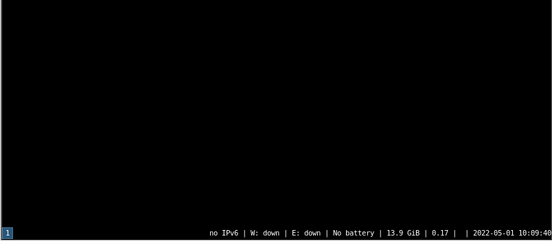

# 7.3 i3wm

## 安装 i3wm

- 使用 pkg 包管理器安装：

```sh
# pkg install xorg i3 i3status dmenu i3lock
```

- 或者使用 Ports 安装：

```
# cd /usr/ports/x11/xorg/
# make install clean
```

- 软件包解释：

| 包名       | 作用说明                                                  |
|:------------|:--------------------------------------------------|
| `xorg`     | X Window 系统                              |
| `i3`       | 轻量级平铺（tiling）窗口管理器          |
| `i3status` | 状态栏 |
| `dmenu`    | 动态菜单生成器|
| `i3lock`   | 锁屏工具 |


## 配置 `startx`

在 `.xinitrc` 中添加启动 i3 窗口管理器的命令：

```sh
$ echo "/usr/local/bin/i3" > ~/.xinitrc
```

编辑时应使用登录 GUI 的同一用户账号。

## 启动 i3

可以使用 `startx` 命令启动 i3。

下图显示为纯 i3 界面，未添加任何插件。




## 虚拟机扩展

如果使用 VirtualBox，在 i3 配置中添加启动 VirtualBox 客户端服务的命令：

```sh
$ echo 'exec VBoxClient-all' >> ~/.config/i3/config
```

## 参考文献

- [i3 使用手册](https://www.freebsd.org/cgi/man.cgi?query=i3&apropos=0&sektion=1&manpath=freebsd-ports&format=html)
- [Installing i3wm on FreeBSD](http://bottlenix.wikidot.com/installing-i3wm)
- [How to setup FreeBSD with a riced desktop - part 3 - i3](https://unixsheikh.com/tutorials/how-to-setup-freebsd-with-a-riced-desktop-part-3-i3.html#xterm)
- [How to install i3?](https://forums.freebsd.org/threads/how-to-install-i3.62305/)
- [i3 - an improved dynamic, tiling window manager](https://www.freebsd.org/cgi/man.cgi?query=i3&apropos=0&sektion=1&manpath=freebsd-ports&format=html)
